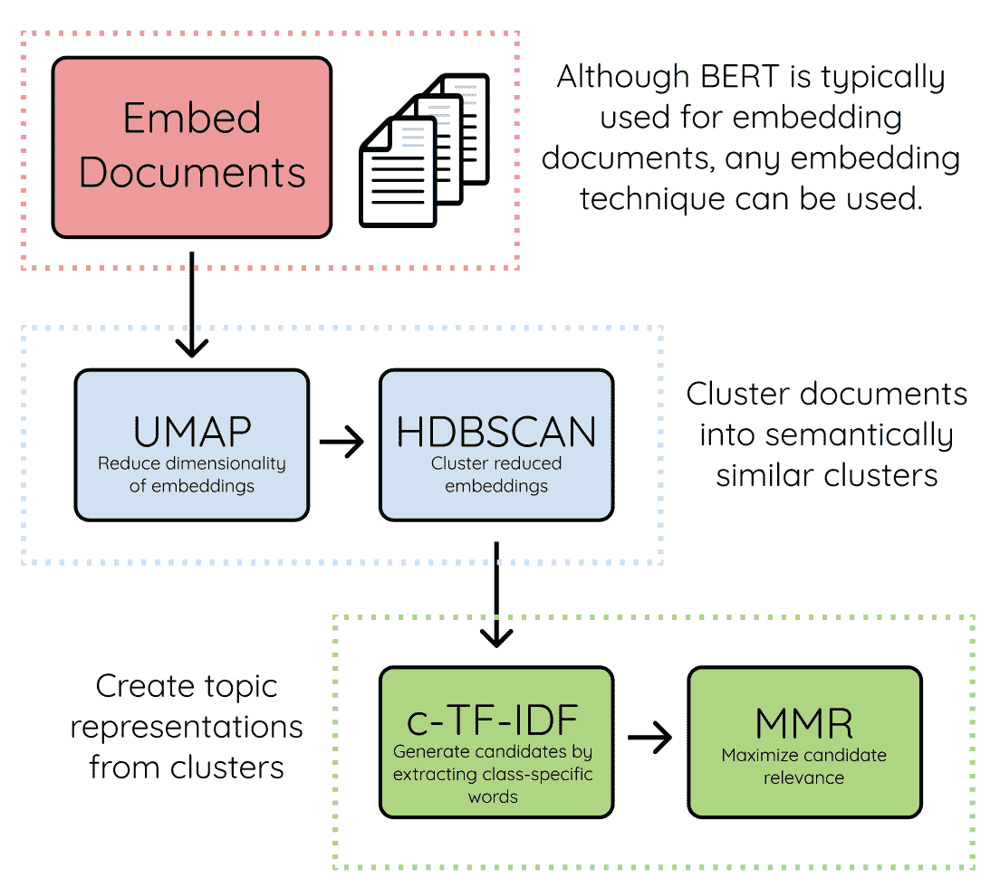
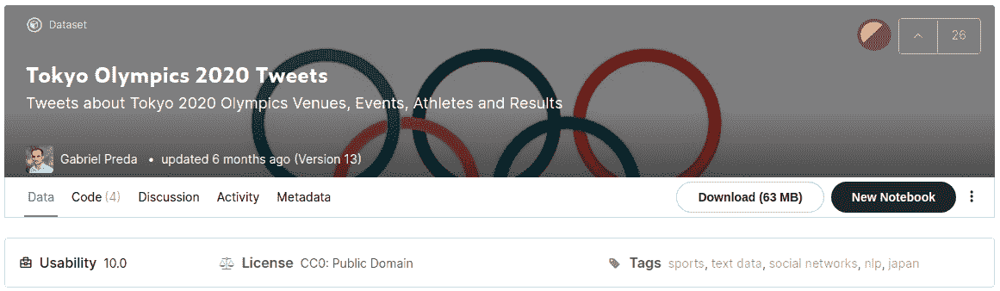
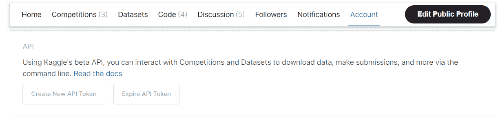

# 使用 BERTopic 库实现您的主题建模

> 原文：<https://towardsdatascience.com/implement-your-topic-modeling-using-the-bertopic-library-d6708baa78fe>

# 使用 BERTopic 库实现您的主题建模

## Python 中使用 BERT 的主题建模

马丁·范·登·霍维尔在 [Unsplash](https://unsplash.com/s/photos/documents?utm_source=unsplash&utm_medium=referral&utm_content=creditCopyText) 上的照片

# 介绍

文本可以包含大量信息，无论是隐式的还是显式的。像其他数据一样，这些文本可能包含隐藏信息。

这些信息是我们肉眼看不到的。我们需要数据科学来帮助我们解决这个问题。在本文中，我将向您展示如何使用 BERTopic 库实现主题建模。没有进一步，让我们开始吧！

# 该机制

在我们深入建模过程之前，让我向您展示库背后的机制。总之，该算法将做三个步骤。这些嵌入在文本中，对它们进行聚类，最后是主题建模。步骤如下所示:

*   首先，BERT 模型为每个文档生成一个表示向量。
*   然后，UMAP 算法降低了每个向量的维数。
*   接下来，HDBSCAN 算法用于聚类过程。因此，每个组都包含具有相似含义的文本。
*   之后，c-TF-IDF 算法检索每个主题最相关的单词。
*   最后，为了最大化多样性，使用最大化候选相关性算法。

来源:[BERTopic 文档](https://maartengr.github.io/BERTopic/algorithm/algorithm.html)。

# 履行

## 获取并加载数据

我们将使用 Kaggle 的一个数据集，名为 Gabriel Preda 的 2020 年东京奥运会推文。

该数据集汇编了关于 2020 年东京夏季奥运会的推文。使用 Twitter API 通过查看标签为#Tokyo2020 的 tweets 来检索数据集。您可以在这里 查看关于数据集 [**的详细信息。**](https://www.kaggle.com/gpreda/tokyo-olympics-2020-tweets)

截图为作者截图。

为了下载数据，我们可以使用 Kaggle API 来简化这个过程。确保获得一个包含用于访问 Kaggle 的 API 密钥的 JSON 文件。

要创建该文件，请在 Kaggle 的您的个人资料页面上打开“帐户”选项卡。然后，单击创建新的 API 令牌。在我的例子中，它看起来像这样:

截图为作者截图。

获得 JSON 文件后，下一步是将文件复制到。kaggle 文件夹。您可以使用下面的代码来复制该文件:

如果没有问题，您可以使用下面的脚本下载数据集，不会出现任何错误:

让我们使用下面的脚本解包数据集:

完成之后，现在我们可以加载数据了。代码如下所示:

> 注意:
> 数据集最初包含大约 10 万条推文。为了使我们的过程高效，我们对 2 万个数据进行采样。
> 
> 我以前在主题建模过程中使用过完整的数据集。最后因为回忆之类的资源不够，过程做不下去。
> 
> 如果您有足够的计算资源，可以使用完整的数据集尝试建模过程。

## 清理数据

文本数据不干净。在我们进入建模过程之前，我们必须首先清理数据。这是最佳实践。因此，我们可以从中获得高质量的信息。

为了清理文本，我们可以使用 NLTK 和 re 这样的库。这个库将过滤单词、提及、标签、链接等等。

现在让我们清理数据。这样做的代码如下所示:

## 使用 BERT 对数据建模

在我们有了干净的数据之后，我们现在可以进行主题建模过程了。对于建模过程，我们将使用 BERTopic 库。

在我们可以使用这个库之前，让我们先使用 pip 安装这个库。下面是实现这一点的代码:

现在我们可以使用图书馆了。让我们使用下面的代码导入库:

在我们导入库之后，下一步是准备两个数据。第一个是推文本身。第二个是时间戳，描述了 tweet 发布的时间。下面是实现这一点的代码:

做完这些后，现在让我们做主题建模。主题建模的过程很简单。

您所需要的就是初始化 BERTopic 对象。然后，该模型将拟合和转换推文，以基于推文生成主题。

如果您以前已经使用过 scikit-learn 库，您会发现它很容易使用。下面是实现这一点的代码:

从这段代码中，现在我们可以检索数据集上存在的主题。要显示包含主题和 tweets 数量的表格，可以运行下面的代码:

从上面可以看出，数据集内有 357 个主题。-1 主题不包括，因为这些推文没有重要的意义。

从数据集中，我们可以看到 304 条推文谈论了他们观看奥运会的活动。然后，接下来的话题是人们对为国家赢得奖牌的运动员的赞赏，以及巴西排球运动员坦达拉和菲娜达·加雷的故事。

但是这些信息不够有趣。让我们看看能否用图表把它形象化。幸运的是，BERTopic 有内置的函数来做这件事。

## 想象结果

我们可以创建的第一个可视化是主题之间的距离图。为了形象化，您可以运行下面的代码:

您可以做的第二个可视化是每个主题中最常出现的单词的条形图。您可以运行下面的代码来可视化:

尽管这个图表有很好的视觉效果，但是它不能显示前八个主题之外的其他主题。

您可以做的第三个可视化是可视化热图。如果您想要查看哪个主题与另一个主题高度相关，热图非常有用。为了形象化，您可以运行下面的代码:

## 一段时间内出现的主题

如你所知，我们把时间戳作为一个变量。我们可以使用该变量来可视化一个主题随时间变化的趋势。为了在时间戳旁边建模主题，您可以运行下面的代码:

从那里，您可以可视化时间序列的集合，每个集合代表一个主题的趋势。您可以运行下面的代码来可视化:

# 结论

干得好！您已经学习了如何使用 BERT 和 BERTopic 库进行主题建模。我希望你能在这里学到新的东西。同时，我希望它能帮助你从文本中获取有意义的信息。

如果你有任何问题，你可以通过我的电子邮件联系我。还有，你可以在 [**LinkedIn**](https://www.linkedin.com/in/alghaniirfan/) 上和我联系。

谢谢你看我的文章！

## 参考

[1]【https://maartengr.github.io/BERTopic/index.html
【2】[https://maartengr . github . io/ber topic/algorithm/algorithm . html](https://maartengr.github.io/BERTopic/algorithm/algorithm.html)