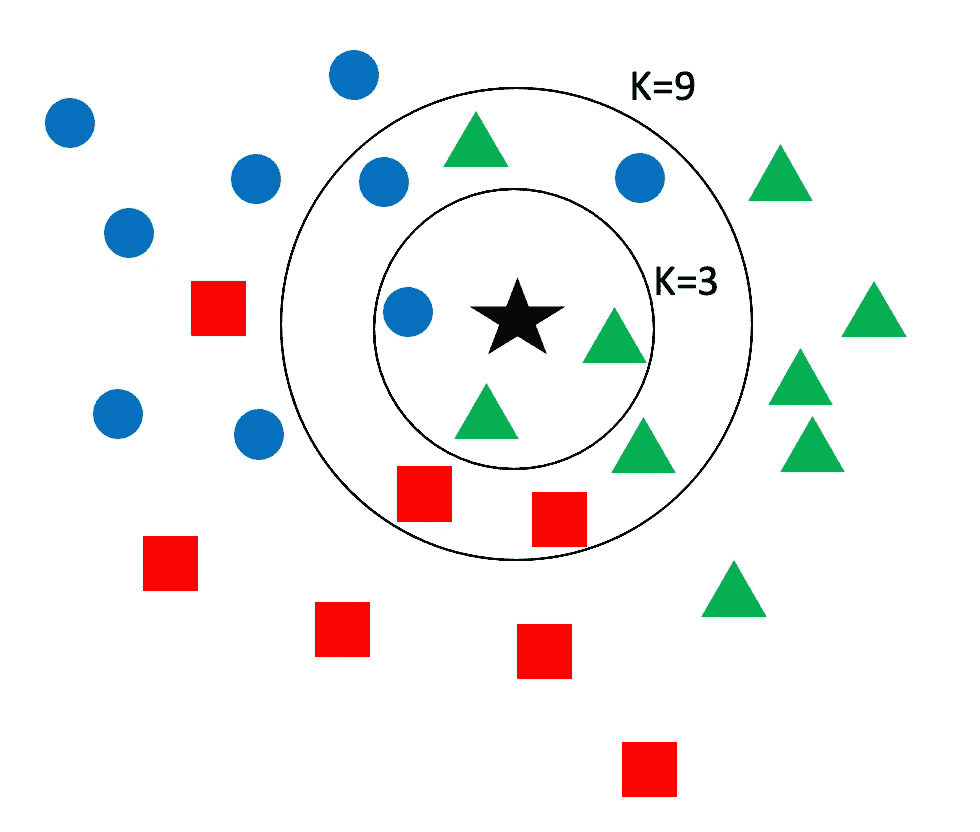
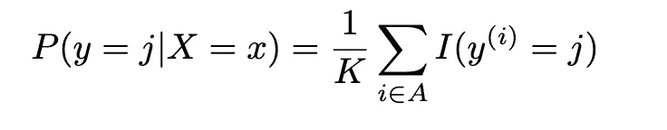
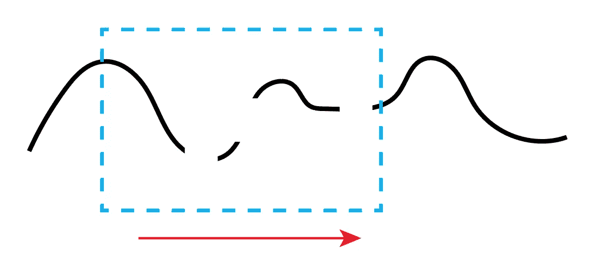
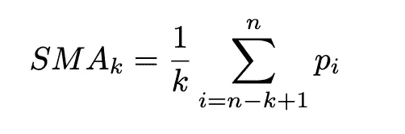
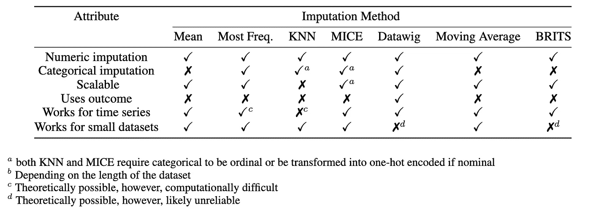

# 插补方法的实施和局限性

> 原文：<https://towardsdatascience.com/implementation-and-limitations-of-imputation-methods-b6576bf31a6c>


作者图片

不幸的是，对于多少是人为的，多少是适当的，并没有硬性规定。这在很大程度上取决于用户偏好。研究文章常常甚至忽略了对其插补方法的详细解释，甚至忽略了需要插补的数据比例。缺乏对这些方法的解释，尤其是在涉及到所需的插补种类和数量时，应该是一种失礼。对于进行假设、插值等的医疗保健数据来说尤其如此。关于病人身份。

您必须将丢失的数据(在结构化数据的情况下)视为 2D 矩阵，在该矩阵中，您可以考虑行和列的连续性。例如，如果某个变量(列)系统地丢失，会给模型带来更多的干扰，而不是帮助，那么您可能要考虑将它从模型中全部删除。或者，如果患者或观察缺少大部分数据，您可能希望对观察执行按行删除。

许多模型无法处理输入数据中的缺失值。支持向量机、glmnet 和神经网络不能容忍任何数量的缺失值。能够容忍缺失值的少数模型是朴素贝叶斯和 CART 方法下的一些基于树的模型[1]。

在本文中，我们将讨论最流行/最普遍的插补方法的数学、实现和局限性。

# KNN



KNN 可视化，作者图片

k-最近邻(KNN)插补的工作方式非常类似于分类算法。我们基于 n 维空间中最近的点来近似该值。需要定义 KNN 算法的超参数，包括:邻居数量和权重。

选择**数量的邻居** ( **n_neighbors** )将是噪声和因此的概化和计算复杂性之间的折衷。**小 K** =更多噪声/更快，**大 K** =稳健我们的结果将会面对噪声/计算复杂。在二进制[0，1]插补的情况下，通常建议选择 K 的奇数**值作为平局决胜值。**

在 KNN 插补之前，我们需要**标准化**我们的数据。像逻辑回归一样，如果不进行标准化，KNN 也受到大值的影响。

**权重**:**统一**表示每个邻域中的所有点将被同等加权。相反，'**距离**'意味着每个点的权重将是邻域内距离的倒数



## 优势:

*   易于实施
*   小型数据集和数值数据类型的最佳选择

## 局限性:

*   随着预测变量和实例的增多，计算会变得更加困难(扩展性不好)
*   可以用于分类变量，但在名义分类数据的情况下需要转换为虚拟变量，在顺序数据的情况下需要进行数值转换。

```
from sklearn.impute import KNNImputer# Instantiate KNN imputer from sklearn
knn_imputer = KNNImputer(n_neighbors=5, weights='uniform')# imputing the missing value with knn imputer
array_imputed = knn_imputer.fit_transform(df)#convert to dataframe:
df_imputed = pd.DataFrame(array_imputed, index = DF_INDX, columns=column_names).reset_index()
```

# 平均

使用平均值的插补计算简单、快速[2]。由于这个特性，它可以很好地适应大型数据集。计算复杂度随着这种插补方法线性增加——O(n)。但是，如果您的数据存在异常值，您可能希望选择'**中值** ' **策略**，而不是使用平均值。:)


## 优势:

*   简单/容易实施
*   计算速度快
*   适用于大型数据集

**缺点:**

*   易受偏态分布/异常值的影响
*   **不应**用于名义分类数据
*   理论上可以处理有序分类数据(需要数字转换和舍入)
*   可能导致结果的偏差，因为它改变了潜在的分布(峰度)

```
from sklearn.impute import SimpleImputer# calling the Simple Imputer 'mean' class
imp = SimpleImputer(missing_values=np.nan, strategy='mean')#imput dataframe (will return an array)
array_imputed = imp.fit_transform(df)#convert from array to dataframe:
df_imputed = pd.DataFrame(array_imputed, index = DF_INDX, columns=column_names).reset_index(‘id’)
```

# 最频繁

非常类似于上面描述的“均值”选项。我们简单地用参数中的**策略**替换掉“**最频繁**”。

## 优势:

*   适用于分类数据
*   相当于对数值数据类型使用“mode ”!
*   计算简单且计算快速。由于这个特性，它可以很好地适应大型数据集

## 缺点:

*   可能会导致结果偏差，因为它会像“均值”(峰度)一样改变分布
*   因为如果只有几个实例丢失，则偏置是最好的

```
from sklearn.impute import SimpleImputer# calling the most frequent class
imp = SimpleImputer(missing_values=np.nan, strategy='most_frequent')#impute the dataframe
array_imputed = imp.fit_transform(df)#convert from array to dataframe:
df_imputed = pd.DataFrame(array_imputed, index = DF_INDX, columns=column_names).reset_index(‘ID’) 
```

# 移动平均数



移动平均线需要一个确定的数据窗口。等式如下所示，其中“I”表示总值减去窗口大小加 1，“k”是窗口大小，“n”是观察值的总数，“p”是单个观察值。我们可以使用**在 Python 中实现一个简单的移动平均。**卷()【熊猫法】。



## 优势:

*   适用于时间序列数据
*   也可以使用简单移动平均的其他变体，如加权移动平均
*   保持时间序列的总体趋势

## 不足之处

*   如果窗口案例中有太多的缺失值会给插补带来问题。例如，如果窗口大小为 10，并且一行中有 12 个缺失值
*   如果时间序列有很大的方差，可能会极大地影响计算的平均值

```
# window size = 50df['SMA50'] = df['col1'].rolling(50).mean()
```

# 多重输入链式方程(小鼠)

MICE 是目前最流行的插补方法之一。MICE 也称为序列回归插补、完全条件规范或吉布斯抽样，是由 Rubin 等人开发的。铝[3]。在 MICE 算法中，使用一系列(链)回归方程来获得插补。这意味着我们实际上使用简单的插补方法，如平均值，但在数据的不同部分重复该过程几次，并对这些变量进行回归，选择一个最终与我们的分布最相似的方法。

步骤是:

*   1.计算数据集中每个缺失值的平均值。这些插补的值可以被认为是占位符
*   2.根据插补模型中的其他变量对未缺失变量的观察值进行回归
*   3.然后用回归模型的预测值(插补值)替换变量的缺失值
*   4.对每个丢失数据的变量重复这个过程。单次迭代被视为每个变量的循环。在每个周期结束时，缺失值已被预测值(来自回归)所取代，反映了观察到的(未受影响的)数据之间的关系。这最终保持了原始分布的形状。这一过程循环重复，每次都更新插补值，然后汇集估计值，得出最终结果

## 优势:

*   在插补前后保持相对分布相似
*   适用于有序分类数据
*   用于名义分类数据需要转换成虚拟变量

## 不足之处

*   用于有序分类数据将需要**。round()** 方法，因为结果将是一个浮点

```
# import fancyimpute library
from fancyimpute import IterativeImputer# calling the  MICE class
mice_imputer = IterativeImputer()# imputing the missing value with mice imputer
array_imputed = mice_imputer.fit_transform(df)#convert to dataframe:
df_imputed = pd.DataFrame(array_imputed, index = DF_INDX, columns=column_names).reset_index('ID')

imputed_final['col1'] = imputed_final['col1'].round().astype(int)
```

# **数据假发**

Datawig 是一种深度学习插补方法，采用长短期记忆(LSTM)网络进行插补。它可以执行分类插补和数字插补。与大多数深度学习方法一样，Datawig 经常利用您在数据中感兴趣的任何结果(目标)列。

它需要一个特定版本的 **mxnet** ，目前只有 Python 3.7 支持，后续版本不支持。它是一种非常强大的插补方法，但是您需要创建一个单独的环境，以便将其作为插补方法使用。描述该方法的论文可以在[这里](https://jmlr.org/papers/v20/18-753.html)找到，文档[这里](https://datawig.readthedocs.io/en/latest/)找到。使用**simple inputr**类将自动检测必要的**列编码器** (SequentialEncoder、BowEncoder、CategoricalEncoder、NumericalEncoder)和**特征器**(lstmfeaturezer、BowFeaturizer、EmbedingFeaturizer、NumericalFeaturizer)。

## 优势:

*   适用于数字数据
*   适用于分类序数/名义插补
*   使用 SimpleImputer 类自动检测列中的数据类型，并对它们进行正确编码

## 缺点:

*   需要大量数据才能准确
*   可能需要目标(结果)变量
*   需要将插补数据分为训练和测试(这可能很困难，取决于您缺失数据的数量和结构)
*   在执行有序分类数据时，仍需要执行舍入

```
# importing datawig library
import datawig# calling the datawig class
imputer = datawig.simple_imputer.SimpleImputer(
        input_columns=['col1','col2','col3','col4'], output_column='col5', output_path = 'imputer_model2')

#split data without any nans and use as trainging dataimputer.fit(train_df = df_nona_train)imputed = imputer.predict(df_na_test)    

df_imputed_copy['col5'].round().astype(int)
```

# 时间序列的双向递归插补


顾名思义，时间序列双向递归插补(BRITS)是针对时间序列数据的数值插补。特别是多个相关时间序列。它采用双向递归神经网络(RNN)进行插补。它的代码/GitHub repo 可以在[这里](https://github.com/NIPS-BRITS/BRITS)找到。还有这里的学术论文【4】。该算法有两个后续部分，一个递归部分(RNN)和一个回归部分(全连接神经网络)。

## 优势:

*   适用于数字时间序列数据
*   不是为分类插补设计的

## 缺点:

*   仅适用于时间序列数据
*   不适用于分类(序数或名义)时间序列数据

# 插补方法汇总表



汇总表，按作者分类的图像

# 评估插补的标准

如果你有原始数据(稀有)，但如果你正在开发一种新的插补方法，那么你会想要完整的数据集，并以 MCAR 和马尔的方式在数据中制造“缺失”。那么，我们希望用什么指标来衡量我们的估算是否充分呢？

在连续(区间数据)的情况下，我们通常使用均方根误差(RMSE)来评估拟合优度，以确定估算值与原始值的距离。

在分类数据的情况下，我们通常使用 F1 来评估拟合优度，以确定估算值与原始值的距离。

*   **连续数据= RMSE**
*   **分类数据= F1**

下面是在 scikit learn [5]中执行 RMSE 错误的代码片段:

```
# import necessary library for MSE
from sklearn.metrics import mean_squared_errorMSE = mean_squared_error(df_orginal['col1'], df_imputed['col1'])RMSE = math.sqrt(MSE)
```

和 F1 错误:

```
# import necessary library for F1 score
from sklearn.metrics import f1_scoreF1 = f1_score(df_original['col1'], df_imputed['col1], average='micro')
```

请注意，F1**{ '微观'，'宏观'，'加权'，'二进制' }[T5[6]]有不同的指标:**

*   微观指标是针对真阳性、真阴性、假阳性和假阴性进行系统计数的(跨整个列)
*   宏-计算每个标签的指标。注意标签的不平衡是很重要的，因为它们的存在没有被考虑在内
*   加权-与宏非常相似，只是现在考虑了标签不平衡
*   二元-仅报告单一类别的结果，此选项仅适用于二元变量的插补。

如果你喜欢读这篇文章，并且想支持像我一样的作家和其他人，考虑注册 Medium。这是 5 美元一个月，如果你使用我的链接，我赚一小笔佣金，这反过来有助于燃料更多的内容！:)[https://medium.com/@askline1/membership](https://medium.com/@askline1/membership)

# 参考

[1]布莱曼、弗里德曼、奥尔申和斯通。1984.*分类和回归树*。纽约:查普曼；halls
【2】sci kit Learn，[https://sci kit-Learn . org/stable/modules/generated/sk Learn . impute . simple imputr . html](https://scikit-learn.org/stable/modules/generated/sklearn.impute.SimpleImputer.html)，访问时间:2022 年 5 月 3 日
【3】Rubin DB(1987)。调查中无应答的多重插补。纽约约翰·威利父子公司。
[4]曹等。al， *BRITS:时间序列的双向递归插补*，第 32 届神经信息处理系统会议(NeurIPS 2018)，蒙特利尔，加拿大。2018
【5】Scikit Learn，[https://Scikit-Learn . org/stable/modules/generated/sk Learn . metrics . mean _ squared _ error . html](https://scikit-learn.org/stable/modules/generated/sklearn.metrics.mean_squared_error.html)，访问时间:2022 年 5 月 3 日
【6】Scikit Learn，[https://Scikit-Learn . org/stable/modules/generated/sk Learn . metrics . f1 _ score . html](https://scikit-learn.org/stable/modules/generated/sklearn.metrics.f1_score.html)，访问时间:2022 年 5 月 3 日