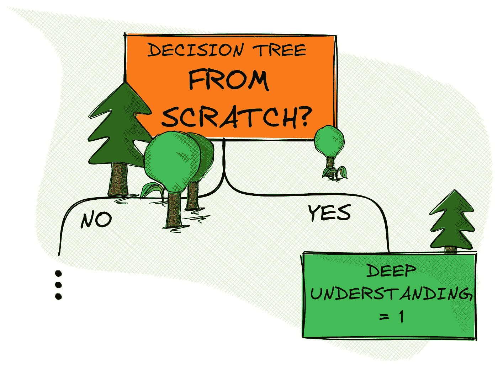
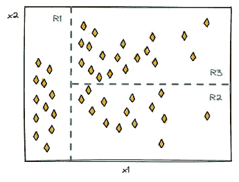
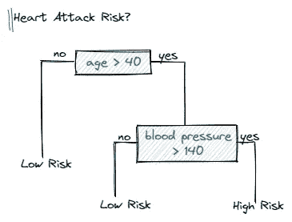
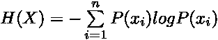
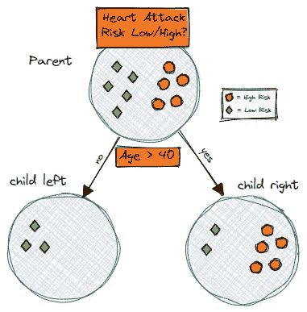
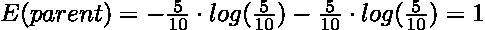
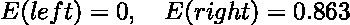
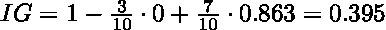

# 从头开始实现决策树

> 原文：<https://towardsdatascience.com/implementing-a-decision-tree-from-scratch-f5358ff9c4bb>

## 从头做起

## 通过仅使用 Python 和 NumPy 实现决策树，递归地完善您的理解

从头开始的决策树[图片由作者提供]

决策树简单且易于解释。它们可以很容易地用图形显示，因此可以进行更简单的解释。在机器学习竞赛中，它们也是一种非常受欢迎和成功的选择武器*(例如*[*ka ggle*](https://www.kaggle.com/)*)*。

然而，表面上的简单并不意味着算法和底层机制是乏味甚至琐碎的。

在接下来的小节中，我们将使用 Python 和 NumPy 一步步实现一个分类决策树。我们还将学习熵和信息增益的概念，它们为我们提供了评估可能的分裂的方法，从而允许我们以合理的方式生长决策树。

但是在直接进入实现细节之前，让我们建立一些关于决策树的基本直觉。

# 决策树 101:树木学

基于树的方法对于解释来说是简单而有用的，因为其潜在的机制被认为与人类的决策非常相似。

这些方法包括将预测空间分层或分割成多个更简单的区域。当进行预测时，我们简单地使用新观测值所属区域的平均值或模式作为响应值。

分段预测空间的示例[图片由作者提供]

由于分割预测器空间的分割规则可以通过基于树的结构来最好地描述，因此监督学习算法被称为*决策树*。

决策树可用于回归和分类任务。

决策树的简化示例[图片由作者提供]

现在，我们知道了什么是决策树，以及它为什么有用，我们需要知道如何建立一个决策树？

## 种下一颗种子:如何种出一棵决策树

粗略地说，构建决策树的过程主要包括两个步骤:

1.  将预测器空间分成几个不同的、不重叠的区域
2.  预测任何新观测值所属区域的最常见类别标签

听起来很简单，但一个基本问题出现了——我们如何分割预测空间？

为了将预测器空间分割成不同的区域，我们使用二进制递归分割，这将增长我们的决策树，直到我们达到停止标准。因为我们需要一个合理的方法来决定哪些拆分是有用的，哪些是无用的，所以我们还需要一个度量标准来进行评估。

在信息论中， [**熵**](https://en.wikipedia.org/wiki/Entropy_(information_theory)) 描述了信息或不确定性的平均水平，可定义如下:

我们可以利用熵的概念来计算由可能的分裂产生的 [**信息增益**](https://en.wikipedia.org/wiki/Information_gain_in_decision_trees) 。

假设我们有一个包含不同患者数据的数据集。现在，我们想把每一个病人分为患心脏病的高风险或低风险。想象一个可能的决策树，如下所示:

计算信息增益的示例决策树[图片由作者提供]

为了计算分裂的信息增益 *(IG)* ，我们简单地计算子节点的加权熵之和，并将其从父节点的熵中减去。

让我们通过我们的例子来进一步阐明事情:

信息增益为 1 可能是最好的结果。然而，在我们的例子中，分裂产生大约 0.395 的信息增益，因此包含更多的不确定性，或者换句话说，更高的熵值。

有了熵和信息增益的概念，我们只需要在树的当前生长阶段评估所有可能的分裂*(贪婪方法)*，选择最好的一个，并继续递归生长，直到我们达到停止标准。

# 介绍算法

现在，我们已经涵盖了所有的基础知识，我们可以开始实施学习算法。

但是在直接进入实现细节之前，我们将快速浏览一下该算法的主要计算步骤，以提供一个高层次的概述以及一些基本结构。

主要算法基本上可以分为三个步骤:

1.  参数初始化*(例如，最大深度、每次分割的最小样本)*和帮助类的创建
2.  构建决策树，包括二叉递归分裂，在当前阶段评估每个可能的分裂，并继续增长该树，直到满足停止标准
3.  进行预测，这可以描述为递归遍历树并返回最常见的类标签作为响应值

由于构建树包含多个步骤，为了保持代码尽可能的干净，我们将非常依赖助手函数的使用。

该算法将在两个类中实现，主类包含算法本身，辅助类定义一个节点。下面，我们可以看一下*骨架类*，它们可以被解释为某种蓝图，指导我们完成下一节的实现。

# 从头开始实施

**基本设置和节点**

让我们从一些基本的日常工作开始我们的实现。首先，我们为我们的主类定义一些基本参数，即停止标准`max_depth`、`min_samples_split`和`root node`。

接下来，我们定义一个小的助手类，它将我们的拆分存储在一个节点中。该节点包含关于`feature`、`threshold`值以及连接的`left`和`right`子节点的信息，当我们递归遍历树以进行预测时，这些信息将非常有用。

**构建树**

现在，事情变得有点复杂了。因此，在接下来的内容中，我们将非常依赖于使用几个辅助方法来保持有组织性。

我们通过调用`fit()`方法开始我们的构建过程，该方法简单地调用我们的核心方法`_build_tree()`。

在核心方法中，我们简单地收集关于数据集*(样本、特征和唯一类标签的数量)*的一些信息，这些信息是确定是否满足停止标准所必需的。

我们的助手方法`_is_finished()`用于评估停止标准。例如，如果剩余的样本少于每个分割所需的最小样本，我们的方法返回`True`，构建过程将在当前分支停止。

如果我们的构建过程已经完成，我们将计算最常见的类标签，并将该值保存在一个`leaf node`中。

> **注**:停止准则是一种退出策略，用于停止递归增长。如果没有适当的停止机制，我们将会创建一个死循环。

我们继续通过计算当前阶段的最佳分割来增长我们的树。为了获得最佳分割，我们循环通过所有特征索引和唯一阈值来计算信息增益。在前面的章节中，我们已经学习了如何计算信息增益，它基本上告诉我们提议的拆分可以消除多少不确定性。

一旦我们获得了特定特征-阈值组合的信息增益，我们就将结果与我们先前的迭代进行比较。如果我们找到更好的分割，我们将相关的参数存储在字典中。

在遍历所有组合后，我们将最佳特征和阈值作为元组返回。

现在，我们可以通过递归增长子节点来完成我们的核心方法。因此，我们通过利用最佳特征和阈值将数据分成左和右分支。

接下来，我们从自身调用我们的核心方法*(这是这里的递归部分)*，以便为孩子开始构建过程。

一旦我们满足停止标准，该方法将递归返回所有节点，允许我们建立一个完整的决策树。

**做预测——或者遍历树**

到目前为止，我们已经完成了大部分艰巨的工作——我们只需要再创建一个 helper 方法，就大功告成了。

可以通过递归遍历树来实现预测。也就是说，对于数据集中的每个样本，我们将结点要素和阈值与当前样本的值进行比较，并决定是左转还是右转。

一旦我们到达一个叶节点，我们简单地返回最常见的类标签作为我们的预测。

这就是了！我们完成了决策树的实现。

# 测试分类器

完成实现后，我们仍然需要测试我们的分类器。

出于测试目的，我们将使用经典的二元分类乳腺癌威斯康星数据集[1]。该数据集总共包含 30 个维度和 569 个样本。

导入数据集后，我们可以将其分别拆分为训练样本和测试样本。

我们实例化我们的分类器，使其适合训练数据，并做出我们的预测。利用我们的辅助函数，我们获得了大约 95.6 %的准确度，这允许我们确认我们的算法是有效的。

# 结论

在本文中，我们仅使用 Python 和 NumPy 实现了一个用于分类的决策树。我们还学习了潜在的机制和概念，如熵和信息增益。

理解决策树的基础知识在处理更高级的扩展时会很有用，比如*装袋、随机森林和 boosting* 。当试图优化基于决策树的学习算法的超参数时，对算法的更深入理解也将是有帮助的。

你可以在我的 GitHub 上的这里找到完整的代码。

[马文·兰亨克](https://medium.com/@marvinlanhenke?source=post_page-----f5358ff9c4bb--------------------------------)

## 从零开始的 ML 算法

[View list](https://medium.com/@marvinlanhenke/list/ml-algorithms-from-scratch-7621d01922ad?source=post_page-----f5358ff9c4bb--------------------------------)6 stories

*喜欢这篇文章吗？成为* [*中级会员*](https://medium.com/@marvinlanhenke/membership) *继续无限学习。如果你使用下面的链接，我会收到你的一部分会员费，你没有额外的费用*

 [## 通过我的推荐链接加入 Medium-Marvin Lanhenke

### 作为一个媒体会员，你的会员费的一部分会给你阅读的作家，你可以完全接触到每一个故事…

medium.com](https://medium.com/@marvinlanhenke/membership) 

**参考资料/更多资料:**

*   [1]使用的数据集:[https://archive . ics . UCI . edu/ml/datasets/breast+cancer+Wisconsin+(诊断)](https://archive.ics.uci.edu/ml/datasets/breast+cancer+wisconsin+(diagnostic))许可:CC BY 4.0，Dua，D. and Graff，C. (2019)。UCI 机器学习知识库[http://archive . ics . UCI . edu/ml]。加州欧文:加州大学信息与计算机科学学院。
*   加雷斯·詹姆斯，丹妮拉·威滕，特雷弗·哈斯蒂，罗伯特·蒂布拉尼。《统计学习导论:在 r .纽约的应用》: Springer，2013 年。