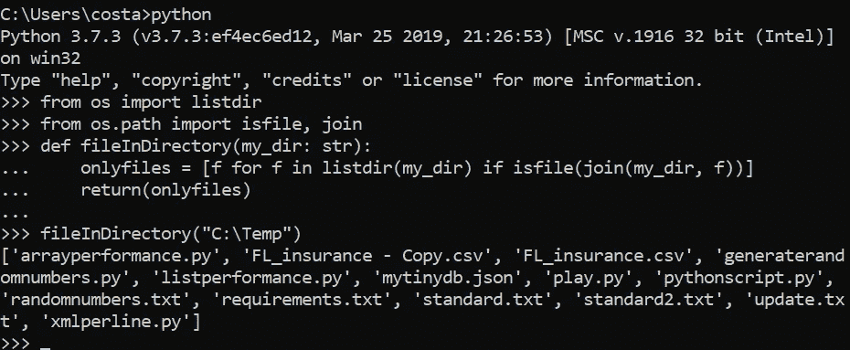
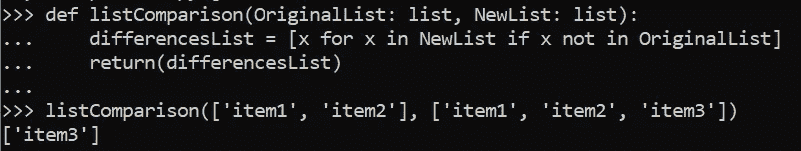

# 用 Python 实现文件监视器

> 原文：<https://towardsdatascience.com/implementing-a-file-watcher-in-python-73f8356a425d>

## 通过文件到达进行基于事件的处理

照片由[西格蒙德](https://unsplash.com/@sigmund?utm_source=medium&utm_medium=referral)在 [Unsplash](https://unsplash.com?utm_source=medium&utm_medium=referral) 上拍摄

在这篇博客中，我们将从头开始构建一个所谓的“文件监视器”。文件监视器是一个进程，它监视特定目录中任何文件的到达。文件监视器在任何文件到达时，将触发后续过程。

例如，想象一下，一个日常流程需要来自另一个部门的文件到达。除非有文件监视器，否则在手动开始相关的日常进程之前，需要有人手动监视所述文件的到达。

通常，文件监视器提供文件的创建、修改、删除、存在和重命名的功能。他们也经常通过[本地操作系统事件](https://docs.microsoft.com/en-us/dotnet/api/system.io.filesystemwatcher?view=net-6.0)这样做。然而，这些通常不能支持共享驱动器。

出于我们的目的，我们将构建一个非常简单的东西，它适用于所有情况，只包括新的文件到达用例。

# 基本面

最终，构建一个简单的文件监视器是一个非常简单的过程。我们将轮询一个目录的更改，而不是注册到本机操作系统事件。整个事情可以用三个简单的函数来解决:

1.  返回在目录中找到的文件列表的函数
2.  突出显示两个列表之间差异的函数
3.  持续轮询的功能

事不宜迟，让我们来介绍一下这三个函数。

## 目录中的文件:

首先要做的是构建一个返回目录中所有文件的函数。

运行这个函数，会返回一个文件列表，如下所示:

返回在预先指定的目录中找到的文件列表

## 两个列表之间的差异:

接下来，我们希望能够比较两个列表并返回差异。这样，我们可以比较两次轮询之间的列表，从而确定是否出现了新文件。

以下是它的外观示例:

比较两个列表并返回差异

## 定期检查差异:

最后，我们需要一个轮询功能来将整个事情联系在一起。带有睡眠计时器的无限循环可以解决这个问题。

因此，我们创建了一个无限循环(*而 True* )，在每个循环中，我们获取当前文件的快照，并将它们与前一个循环进行比较，以确定是否出现了任何新文件。

该函数接受两个输入:

1.  my_dir:要监控的目录
2.  pollTime:检查更改之间的时间(秒)

利用我们之前的 listComparison 函数，我们可以跟踪新文件出现的时间，此时我们可以调用一个新函数 doThingsWithNewFiles，传递新文件的列表来做一些事情。

好了，伙计们，在不到 50 行的代码中，我们编写了自己的可读的 FileWatcher 代码。

# Jupyter 笔记本

下面我把所有的东西放在一个 Jupyter 笔记本里，你可以在你自己的项目中使用

# 最后的想法

我希望您会发现这很有用，并且对一些简单的用例有所帮助。你对如何扩展和构建它有什么想法或主意吗？让我知道！