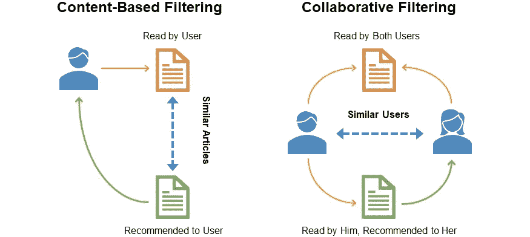
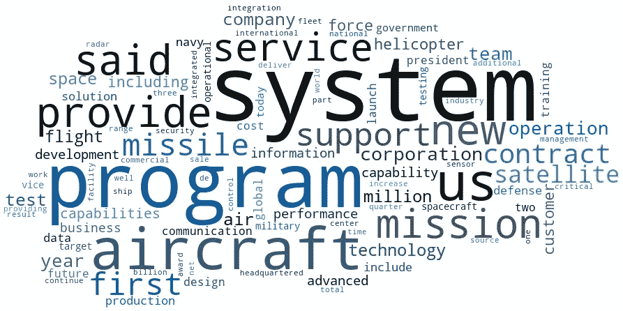
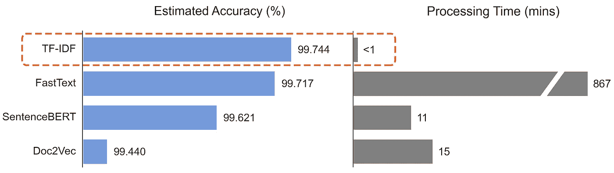
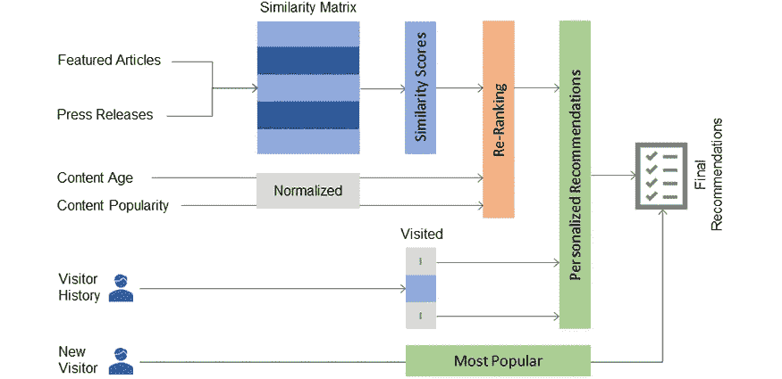
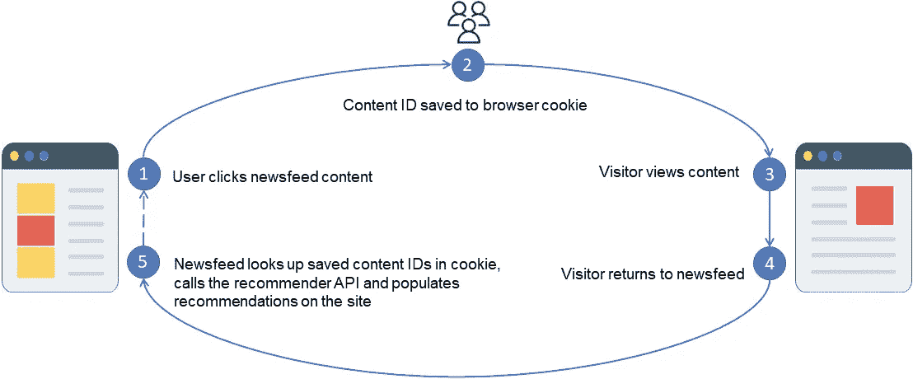
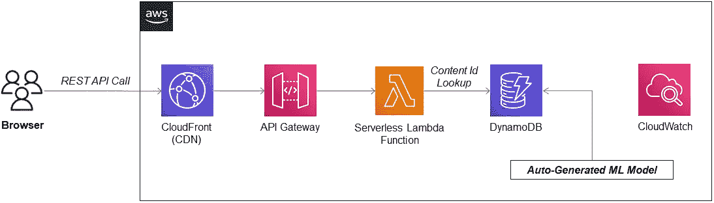
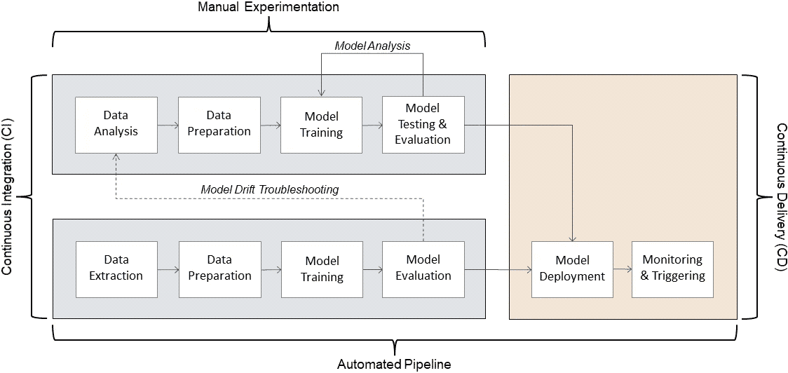
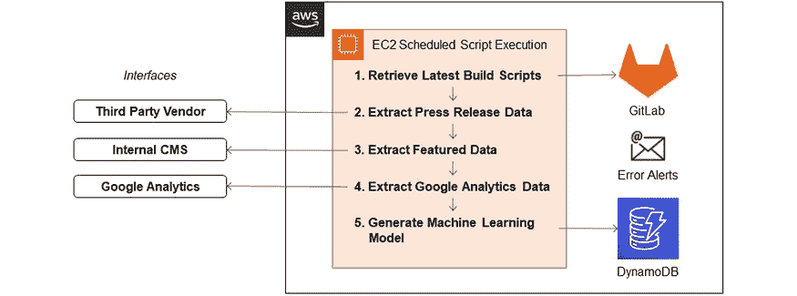
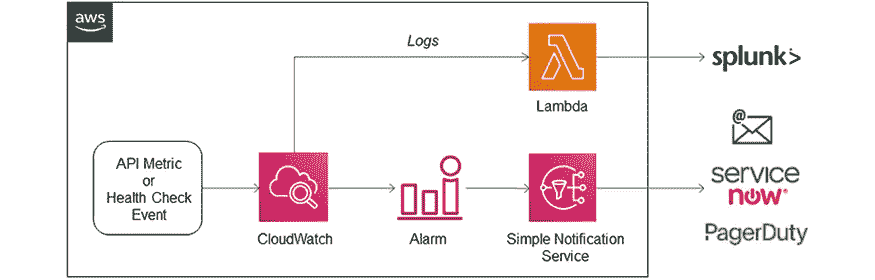
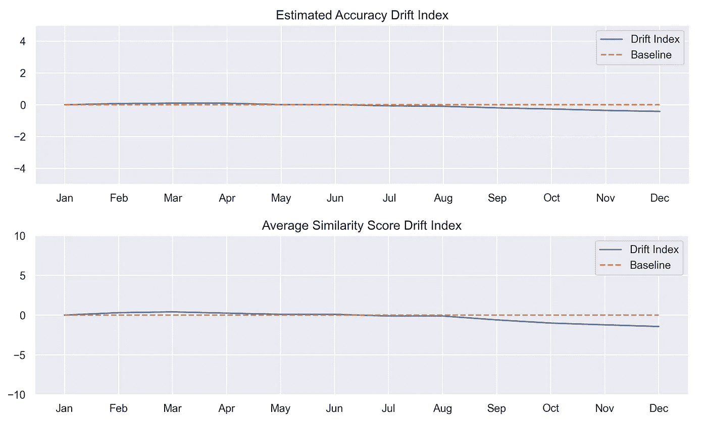

# 实施企业推荐系统

> 原文：<https://towardsdatascience.com/implementing-an-enterprise-recommendation-system-89dd439db444>

## *实现“真实世界”基于内容的推荐系统的端到端研究*

由[梦想时间](https://www.dreamstime.com/)的[安门特鲁普](https://www.dreamstime.com/ammentorp_info)拍摄的照片

我最近完成了一个推荐系统，它将作为一个高流量全球网站的新闻提要的一部分发布。由于必须具备亚秒级的建议响应时间，这些要求带来了巨大的设计挑战。

与将部署到生产环境中的任何应用程序一样，需要对以下主题做出重要决策

*   性能，
*   可用性，
*   数据准备就绪，以及
*   总成本，

每一个都需要适当的考虑。

在我最初的项目评估期间，我发现很少有公开可用的企业级机器学习(ML)资源，这些资源旨在为现实世界项目的端到端决策提供信息。这篇文章旨在帮助从业者在企业推荐系统项目的各种决策点中跋涉。

# 项目要求

需求需要一个带有 RESTful API 的推荐系统来集成网站的新闻提要。通过让访问者访问个性化内容，推荐系统可以成为洞察和参与的重要驱动力，这是新闻订阅源的主要目标。

其他关键要求:

*   可衡量的模型性能和商业价值
*   低于 500 毫秒的亚秒延迟。
*   高可用性和可扩展性，服务级别协议(SLA)级别为 99.9%，相当于每天最多 1.44 分钟的停机时间。
*   使用自动化进行数据提取和模型构建-部署-监控生命周期。
*   用于持续改进的全面模型和 API 监控。
*   总拥有成本(TCO)也是一个因素，尤其是经常性的托管成本。

# 步骤 1:探索性数据分析

在任何机器学习项目中，最重要的第一步是获得最佳质量的可用数据。项目通常没有容易访问的数据，这些数据被标记并准备好用于培训。在这种情况下，开发定制接口是为了从多个来源、供应商托管的 API、内部内容管理系统和 Google Analytics 报告 API 提取数据集。

数据提取后，探索性数据分析显示，语料库的规模有限，约有 6800 篇新闻稿和 700 篇专题文章。这些数据还缺乏一致的跨数据集元数据或标签来帮助生成候选数据。更重要的是，进一步的分析发现没有用户数据或明确/隐含的访问者反馈历史来作为推荐的基础。

根据现有数据，有必要建立一个无人监管的基于内容的推荐系统，以及一种以支持个性化推荐的方式跟踪访问者的方法。

基于内容的过滤与协同过滤(图片由作者提供)

# 步骤 2:开发推荐模型

对于推荐，每篇新闻稿和专题文章都需要语料库中最相似的内容来响应 API 请求。为了选择最佳的无监督自然语言处理(NLP)技术，有必要评估几种可以将文本转换为特征向量的算法。选择 SentenceBERT、Doc2Vec、FastText 和 TF-IDF 来评估哪种算法对用例及语料库最有效。

一旦为每个算法生成了语料库中文档的向量表示，就必须确定 7500 个文档之间的相似性。余弦相似性是计算向量之间相似性的优选度量，只要向量不太大，其中性能可能是一个问题。余弦相似性提供了一种基于文档的矢量化得分或嵌入来衡量文档与另一个文档相似程度的方法。

预处理的 TF-IDF 生成特征的词云(图片由作者提供)

在没有可依赖的标记数据和标准评估度量的情况下，计算在余弦相似性矩阵中自己作为最高得分文档的文档的百分比的准确性度量被用作估计模型的一般准确性的方式。该指标还用于执行随机交叉验证，以在产生最终比较之前调整超参数和预处理步骤。总体结果对于一般的推荐系统来说是好的，但是 TF-IDF 与其他模型相比具有稍微更好的推荐。

T2 的算法比较。Xlarge 实例(图片由作者提供)

为了确认最初的发现，每个模型都通过比较大量的建议样本和观察结果进行了验证，确认 TF-IDF 提供了良好的准确性，是项目的最佳选择。

与计算单词和句子嵌入的其他 NLP 技术不同，TF-IDF 通过重视不太频繁的术语来提供直接的特征提取。TF-IDF 还提供了更快、资源更少的模型生成，并且实现非常简单，可以很容易地向涉众解释。

## 重新排列建议

为了进一步改进推荐，通过包括流行度和新鲜度特征来重新排列相似性分数。使用流行度是一种促进推荐的好方法，在这种情况下，流行度分数基于从 Google Analytics 提取的页面视图指标，而新鲜度基于文档年龄。两个分数都被标准化，然后在合并成最终分数之前对重要性进行加权平均。

为了确保只提供最高质量的建议，每个文件的 API 建议被限制在三个最高分。推荐也限于访问者最近没有查看的内容。没有与新闻订阅源内容交互的新访问者将获得新闻订阅源中最受欢迎内容的混合。

推荐系统概述(图片由作者提供)

## 未来状态

一旦收集了足够的访问者历史数据，就可以试验更有效的技术，包括结合协作和基于内容的过滤的混合方法。

# 步骤 3:个性化推荐

拥有新闻订阅源访问者历史对于 API 能够提供个性化网站推荐至关重要。由于网站的性质，在这种情况下，访问者没有通过身份验证或跟踪。谷歌分析用于跟踪一般网站活动，但不允许提取未采样的用户级数据。为了避免不必要的复杂性，选择了一种依赖浏览器 cookies 的方法来跟踪新闻提要中最近的访问者选择。

网站推荐生命周期(作者图片)

每当访问者点击新闻内容时，访问者的浏览器中就会更新一个 cookie，反映最近浏览的页面。这些 id 随后被传递给 API 以提供个性化的推荐。

# 步骤 4:设计部署架构

现在是设计整体 API 部署架构的时候了，同时保持亚秒级响应时间和 TCO 需求。该架构还需要驻留在私有云环境的范围内，并且必须满足其他专有的安全限制，这里不做介绍。

考虑了各种 AWS 部署选项，包括 SageMaker 端点和 Elastic Beanstalk。SageMaker 端点可以使部署模型变得相对简单，但是根据我的经验，不是在 SageMaker 中创建的模型部署起来可能会很麻烦，并且文档可能会缺乏，有时甚至会过时。从成本角度来看，SageMaker 部署通常使用 EC2 虚拟服务器实例，即使在需求较低的时候也是按小时计费的。对于新闻订阅来说并不理想，因为预计在工作日晚上和周末的需求会更低。

另一种选择是使用 Elastic Beanstalk 来部署带有负载平衡和自动伸缩 EC2 实例的 API，以实现高可用性。每个实例将运行 Flask、Django 或 FastAPI 来处理传入的 API 请求。尽管 Elastic Beanstalk 是部署应用程序的有效方法，但它也有类似的成本问题；这项服务是免费的，但是任何启动的 EC2 实例都要 24x7 付费，不管它们是否被充分利用。

## 无服务器 Lambda

无服务器架构很快成为部署推荐 API 的最佳选择。有了预先生成的相似性矩阵，就不需要实时推理，并且只要针对新内容更新模型，就可以使用查找表。一个查找表提供了使用 DynamoDB 进行模型存储的灵活性，并与 Lambda 相结合，最大化了性能、成本和可用性。Lambda 函数仅在被使用时计费，并且可以提供显著的成本节约。

高级 API 架构(图片由作者提供)

除了节省成本，Lambda 还支持可伸缩性和可用性。Lambda 函数可自动扩展，以处理每个区域 1，000 多个并发执行，并在多个可用性区域中运行，满足 99.9%的 SLA 要求。

## DynamoDB

对于模型存储，选择了使用 dynamo db(AWS 的 NoSQL 数据库)的非传统模式。数据库中的每一项都是一个 JSON 文档，主要包含一个惟一的内容 ID 和三个得分最高的内容 ID。这使得 API 查找速度非常快，互联网响应时间平均为 250 毫秒。

在可伸缩性和高可用性方面，DynamoDB 会随着表大小的增长自动扩展容量和重新分区数据。数据还在 AWS 区域的三个设施之间复制，提供 99.99%的 SLA。

尽管 DynamoDB 非常有效，但用它来存储 ML 模型在许多情况下可能并不可行。为了存储和加载用于推理目的的大型模型，无服务器 Lambda 可以与 AWS 弹性文件系统(EFS)一起用于各种用例。关于 Lambda/EFS 模式的更多信息可以在参考资料部分找到。

## AWS Lambda 注意事项

与标准的负载平衡 EC2 架构相比，无服务器架构提供了许多优势，但它们也有一个固有的冷启动问题。根据部署包的大小和函数的初始化时间，通常可以在 1%的调用中看到执行延迟。保持部署包的轻量级很重要，但是如果这不是一个选项，那么可以启用供应并发来保持请求数量的执行环境被初始化并准备好响应传入的请求。

对于新闻订阅源，将在高峰时段启用供应的并发性，以确保 API 可以扩展以满足具有低延迟建议的流量。

## 全局考虑

对于全球使用案例，评估内容交付网络(CDN)的使用是至关重要的。根据通过 API 发送的数据量和缓存的情况，CDNs 可以显著缩短全球响应时间。对于 newsfeed，推荐缓存得很好，AWS CloudFront 的边缘位置将在调用 API 时为全球各地的访问者提供快速和一致的性能。

# 步骤 5: MLOps 和最终确定部署策略

机器学习操作，或 MLOps，简化了将 ML 模型投入生产，然后维护和监控它们的过程。虽然基本的 MLOps 自动化管道有许多选项，但我们强烈推荐其中一些，而其他的则取决于数据敏感度、团队规模和 API 可用性需求。下面，我总结了我对每个关键部署主题的策略，以及一些一般考虑事项。

基本 MLOps 自动化管道(图片由作者提供)

## 自动化模型构建

新创建的内容将由计划的模型构建每小时自动处理一次。可以实现接近实时的处理，但这不是必需的，因为新闻订阅源内容不是以高频率发布的。托管在 EC2 实例上的 Python 脚本使得从多个来源收集数据、生成模型并将结果推送到 DynamoDB 成为可能。大量使用带有错误警报的日志记录可以确保快速检查和解决任何故障。

自动化模型构建架构(图片由作者提供)

## 安全性

安全性是整体设计的重要组成部分，需要遵循组织策略。除了 AWS 服务之间的默认资源策略保护之外，到 API 的流量需要通过内部网络安全基础设施进行 TLS 加密和过滤。根据项目需要，可以使用各种各样的安全措施，包括 IP 过滤、自定义承载令牌身份验证和 AWS Cognito，用于单点登录或社交登录的(联合)身份验证。

## API 监控

持续的应用程序监控是部署 API 的另一个重要方面。AWS CloudWatch 默认捕获 Lambda 执行指标，但也将用于详细的日志记录以及流量指标和健康检查触发的警报。

AWS CloudWatch 日志和警报(图片由作者提供)

对于要求高连续性的情况，CloudWatch 警报可以集成到组织的现有服务台基础架构中，用于优先生成票证。日志还可以整合到 Splunk 等工具中，以获得它们提供的额外好处。

## 模型漂移监控

一旦进入生产环境，模型需要持续的监控来重新验证它们的健康和业务价值。随着时间的推移，更改和转移数据是所部署模型的准确性降低的主要原因。对于新闻订阅源，在没有可依赖的标记数据或“基本事实”标签的情况下，通过计算所有文档的最高(非父)相似性得分的平均值来设计相似性分布得分指数。然后，总分数被索引到基线。

此外，用于超参数调整的精度度量是监控模型持续精度的另一种方式。在每个模型建立后计算，这两个漂移分数将随着时间的推移被跟踪，并被用作领先指标和故障排除工具。

模型漂移仪表板示例(图片由作者提供)

## CI/CD 和版本控制

根据项目的规模，可以实现持续集成/持续交付管道，以加强构建、测试和部署的自动化。有多种 CI/CD 选项可用，包括 AWS 的 CodeDeploy 和 SAM 管道。对于这个项目，PyCharm 和 AWS Toolkit 以及 GitLab 插件允许管理对 Lambda 的版本控制和部署，而生产就绪的模型构建脚本会在每次计划运行之前自动下载到 EC2 实例。

# 第六步:A/B 测试

推荐是估计的预测，并不保证网站的观众会对推荐策略做出什么反应。一旦推荐系统部署到生产中，将进行 A/B 测试，通过比较网站指标，如有推荐和无推荐的*点击率(CTR)* 、*每次会话的页面数、*和*平均会话持续时间*，来衡量其有效性。实验期间收集的度量数据将有助于验证(或否定)策略。最终，A/B 测试也将用于比较当前和未来的推荐策略。

# 结论

我希望这篇文章能为开发和部署推荐系统提供一些思路。从整体上看一个项目，将生产放在心上，将有助于交付真正的商业价值，并对组织内部和外部如何看待项目产生积极的影响。

我在这里介绍的是一个更大的主题。例如，像混合模型这样的实现可能需要多种部署方法，并且会给所讨论的每个方面带来额外的挑战。欢迎来到企业推荐系统的世界！

# 资源

[1] AWS， [AWS Lambda 开发者指南(2022)](https://docs.aws.amazon.com/lambda/latest/dg/index.html) ，亚马逊网络服务

[2] AWS， [AWS DynamoDB 开发者指南(2022)](https://docs.aws.amazon.com/amazondynamodb/latest/developerguide/index.html) ，亚马逊网络服务

[3] AW， [AWS API 网关开发者指南(2022)](https://docs.aws.amazon.com/apigateway/latest/developerguide/welcome.html) ，亚马逊网络服务

[4] AWS， [AWS CloudFront 开发者指南(2022)](https://docs.aws.amazon.com/AmazonCloudFront/latest/DeveloperGuide/Introduction.html) ，亚马逊网络服务

[5] AWS， [AWS CloudWatch 开发者指南(2022)](https://docs.aws.amazon.com/AmazonCloudWatch/latest/monitoring/WhatIsCloudWatch.html) ，亚马逊网络服务

[6] N. Jain，A. Vaidyanathan，S. Debnath 和 V. Krishnamoorthy，[在 AWS Lambda 和亚马逊 EFS 上部署多个机器学习模型进行推理(2021)](https://aws.amazon.com/blogs/machine-learning/deploy-multiple-machine-learning-models-for-inference-on-aws-lambda-and-amazon-efs/) ，预测黑客

[7] I. Njanji，[了解如何利用亚马逊 CloudWatch 警报在亚马逊网络服务 ServiceNow (2018)](https://aws.amazon.com/blogs/mt/how-to-automatically-create-an-incident-in-servicenow-from-an-amazon-cloudwatch-alarm/) 中创建事件

[8] Splunk，[如何将 AWS CloudWatch 日志流式传输到 Splunk (2017)](https://www.splunk.com/en_us/blog/tips-and-tricks/how-to-easily-stream-aws-cloudwatch-logs-to-splunk.html) ，Splunk

[9] M. Mantosh，[使用 AWS 工具包开发和部署无服务器 API(2021)](https://www.jetbrains.com/pycharm/guide/tutorials/intro-aws/background/)，JetBrains