# 实现人工蜂群算法解决商业问题

> 原文：<https://towardsdatascience.com/implementing-artificial-bee-colony-algorithm-to-solve-business-problems-cb754f3b9255>


图片由 [Silv3rXArt](https://www.instagram.com/silv3rxart/) 提供。经许可使用。

## 完整的，可重复使用的代码 ABC 算法与 Github 链接。

人工蜂群算法是一种基于蜜蜂群体智能觅食行为的优化算法。

我们将通过 ABC 算法的目的、实现和功能来详细了解它。然后，我们将解决一些优化基准函数的问题，如 Sphere、Himmelblau 和下面显示的跨托盘函数。我们还将研究 ABC 算法在现实世界商业问题中的应用。在 [Github](https://github.com/aaxis-nram/abc-algorithm-php) 上可以获得完整的、可重用的实现代码。

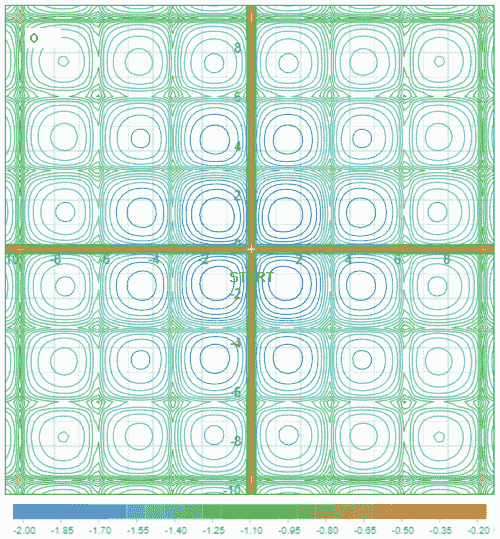

蜜蜂活动，同时解决跨托盘功能。图片由作者提供。

# 目的

在 [AAXIS Digital](http://www.aaxisdigital.com) ，我们经常会遇到棘手的业务优化问题，这些问题需要打破常规的思考。为了对这些通过计算来解决的业务问题进行建模，我们需要将它建模为一个代表候选解决方案的决策变量列表，并且能够计算一个“良好的度量”，称为目标函数。该算法的目的是找到具有最大优度的候选解。

让我们用一个例子来探讨这个想法。在下面显示的球函数的情况下，最低点(最小值)在我们想要找到的(x，y) = (0，0)处。一个候选解可能是(1，1)，另一个可能是(2，2)。定义球函数的函数 f(x，y) =(x + y)表明 f(1，1)=1 是比 f(2，2)=4 更理想的解，因为它低 3。

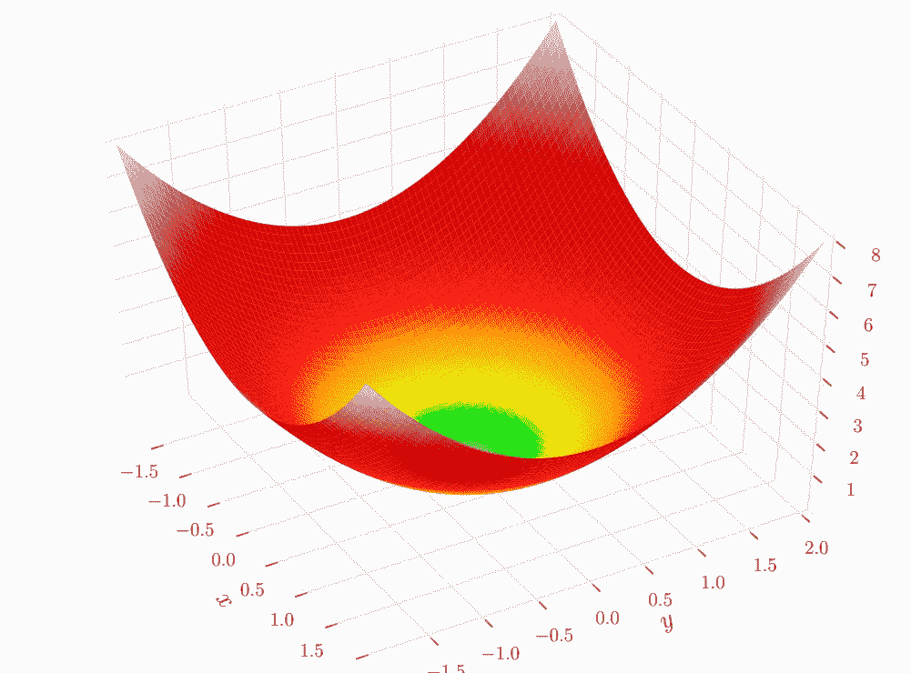

球形函数。图片由 [Gaortizg](https://commons.wikimedia.org/wiki/File:Sphere_function_in_3D.pdf) ， [CC BY-SA 3.0](https://creativecommons.org/licenses/by-sa/3.0) ，通过维基共享

另一个示例模型可以用于采购决策。我们有一个产品，它有一个预测的需求曲线和每个制造商的成本清单以及采购时间。决策变量或候选解决方案将是每个制造商在月初的订单数量数组。给定这个数量的候选解决方案，我们可以计算出它的成本以及我们能够满足需求的部分。然后我们可以计算这个月的利润并优化它。

由于这些业务问题通常没有连续的优化函数，通常可以使用直接、随机或群体算法来解决。举个具体的例子:蛮力、[蒙特卡洛法](https://en.wikipedia.org/wiki/Monte_Carlo_method)和进化算法。进化算法特别令人感兴趣，因为当问题不能用一个等式来表达，但良好性仍然可以像上面的采购案例一样进行测量时，它们擅长生成“好”和“足够好”的解决方案。

大体上，进化算法和相关技术使用受生物进化或自然界觅食行为启发的人工智能机制来解决问题，在[维基百科](https://en.wikipedia.org/wiki/Evolutionary_algorithm)上有更详细的描述。这些算法从随机的初始群体(候选解)中构建，这些群体在每一个连续的世代中变异并变得更好，朝着一个解努力。遗传算法、蜂群算法、蚁群算法、粒子群算法，以及[人工蜂群算法](https://en.wikipedia.org/wiki/Artificial_bee_colony_algorithm)都属于这一类。

[人工蜂群算法](https://en.wikipedia.org/wiki/Artificial_bee_colony_algorithm)受蜂群觅食行为启发，在多个点随机探索解空间，收敛到解。

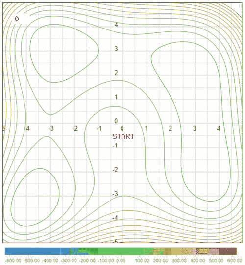

蜜蜂活动解胡默布劳函数。图片由作者提供。

上图显示了使用这种技术的 Himmelblau 函数的解的收敛，也就是说，你可以看到小点(蜜蜂)在解(食物源)周围收敛。

# 人工蜂群算法

现在我们已经了解了 ABC 算法的目的，我们可以深入了解它的实现。

人工蜂群(ABC) [算法](http://www.scholarpedia.org/article/Algorithm) [1]由 Karaboga 于 2005 年提出，是一种基于群体的元启发式算法，用于优化数值问题，其灵感来自蜜蜂的智能觅食行为。

该模型由四个基本组件组成:

**食物来源**代表正在解决的问题的解决方案。每种食物来源产生的花蜜与问题的解决方案成比例。

**雇佣蜜蜂**在先前食物源附近寻找比先前食物源有更多花蜜的新食物源。这种搜索是随机的，但是利用了来自其他食物来源的已知信息。

**看客蜜蜂**观看受雇蜜蜂的摇摆舞蹈，了解食物来源位置。在实践中，这是通过使用轮盘赌选择算法来实现的，这导致以更大的概率选择具有更高花蜜的食物位置。

**侦察蜂**随机选择它们的食物来源，以取代那些在预定数量的试验中无法进一步改善的废弃食物来源。

因此，PHP 中的人工蜂群算法如下:

初始化食物源后，运行主循环。在循环中，我们执行三个阶段:雇佣蜂阶段、旁观者蜂阶段和侦察蜂阶段。

## 初始阶段

在初始化阶段，我们为每只被雇佣的蜜蜂生成足够的食物源。

实际的食物来源的产生取决于我们正在解决的问题的类型。AbstractFoodSource 类实现了一个随机生成器，它在配置文件中定义的下限和上限之间生成一个随机数。

在业务问题的情况下，会生成一个介于 0 和 1 之间的随机整数。然后，在计算均方根之前，可以将这个数乘以最大值。

下面显示的是在求解 Rastrigin 函数的循环 1 中生成的随机蜜蜂。

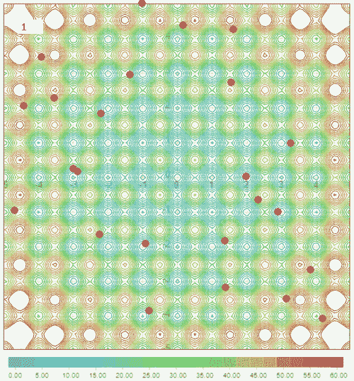

初始化阶段后随机分配蜜蜂。

蜜蜂分布在解空间中，是随机生成的。一些研究人员还将它们均匀地分布在空间中；这对于某些解空间来说可能会更好。

## 就业蜂阶段

雇佣蜜蜂阶段包括每只蜜蜂外出寻找食物来源。在这个过程中，蜜蜂探索附近地区，如果它们发现有更多花蜜的食物源，它们的食物源就会被更新更好的食物源取代。

“getNewBasedOn”函数根据给定的食物源和另一个不是蜜蜂食物源的相邻食物源获得一个新的解。

## 旁观者蜜蜂阶段

受雇的蜜蜂然后回家，开始它们的摇摆舞。每只旁观的蜜蜂都能感知到每只蜜蜂从食物源中获得的花蜜量，但会有一些误差。所以，每只旁观者蜜蜂，根据它们对食物源产生的花蜜的感知，会选择食物源。花蜜越高，旁观的蜜蜂就越有可能采到它。

旁观者蜜蜂可以被认为是在最有希望的食物来源周围提供额外的探索。本质上，它们和受雇的蜜蜂做同样的事情，但是更集中在有希望的食物来源周围。因此，当被雇佣的蜜蜂确保我们不会太快放弃解决方案时，旁观者阶段促进了最佳食物来源的快速发展。这样，我们可以更快地融合，并保持我们的渠道畅通。

## 侦察蜂阶段

当食物来源的邻近地区被充分探索后，它就被抛弃了。每探索一个食物源，我们就增加尝试计数器。当试验计数超过最大配置值时，我们将其从食物源数组中删除，如下图所示，并找到一个新的随机食物源。

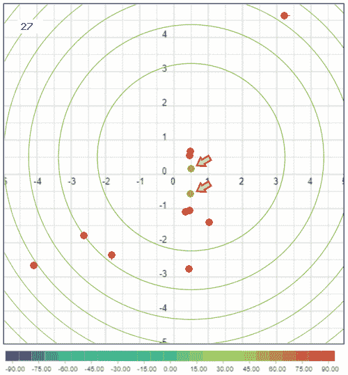

侦察蜂阶段的食物源删除

侦察蜂阶段的实现如下所示。

侦察兵不需要确保随机食物源比旧食物源更好，或者它在旧食物源的附近；它们只是像在初始阶段一样，随便找一个食物来源。把侦察阶段想象成增加新的探索领域，这样我们就不会陷入局部最小值。

其余的实现在 [Github](https://github.com/aaxis-nram/abc-algorithm-php/blob/main/src/ABCAlgorithm/BeeColony.php) 源代码中，您可以自由探索。我留下了有用的评论来引导你前进。

# 使用标准测试功能进行验证

现在，让我们用一些标准测试函数和已知的解决方案来测试我们的实现，如下所示:

**球函数**由下式给出

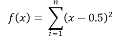

给定上述函数，函数值可以表示如下。

球形食物源

给定这个函数值，花蜜值可以计算为

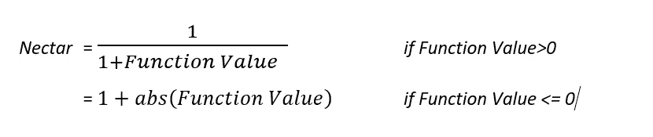

下面是 nectar 的价值实现:

花蜜价值计算

解是⨍(x1，x2，x3，… xn) =⨍(0.5,0.5,0.5,…0.5) = 0

绘制时，该图看起来像下图所示的球体。


球形函数。图片由 [Gaortizg](https://commons.wikimedia.org/wiki/File:Sphere_function_in_3D.pdf) ， [CC BY-SA 3.0](https://creativecommons.org/licenses/by-sa/3.0) ，通过维基共享

当运行 4 维时，ABC 算法的输出如下

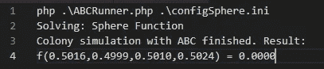

我还实现了二维的解决方案来帮助可视化，如下所示。所有可视化的基本等高线图都是在[acedemo.org](https://academo.org/demos/contour-plot/)使用计数器绘图仪生成的。

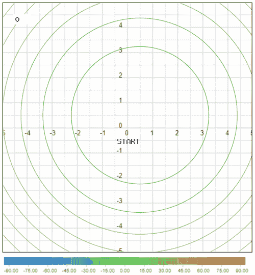

球函数解可视化。图片由作者提供。

到第 5 周期时，您已经可以看到良好的收敛(左下角)。我相信你注意到了，在每次迭代中，蜜蜂倾向于东西向(沿 X 轴)或南北向(沿 Y 轴)移动；这是故意的。ABC 算法每次迭代只修改食物源的一个维度。根据问题的不同，人们可以独立地考虑每个维度，并让它们在同一次迭代中发展。

**Himmelblau 的功能**定义为:

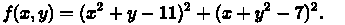

为了更好地理解这个函数，让我们看一下 3D 图，

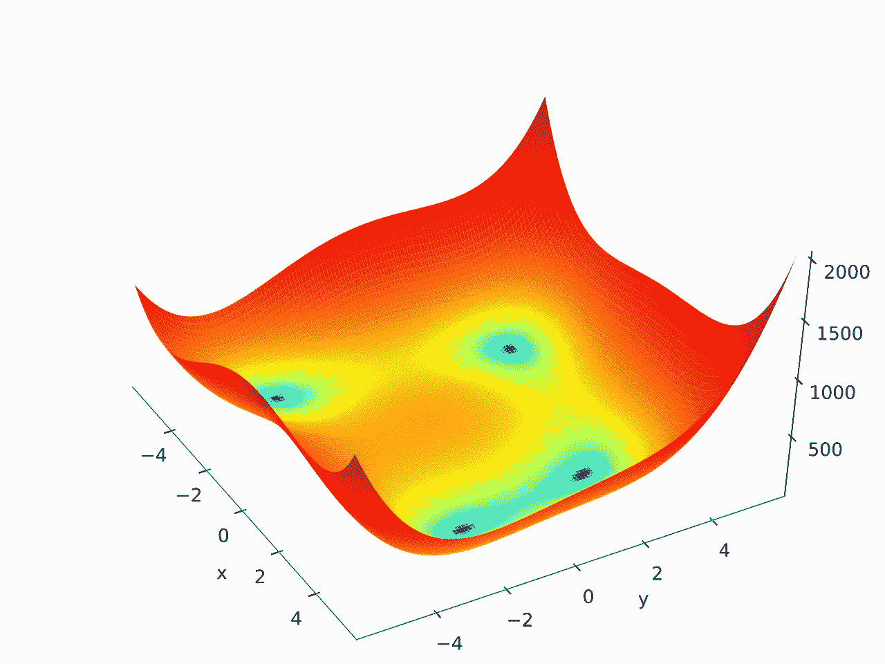

Himmelblau 在 3D 中的作用。图片来自 [Morn the Gorn](https://commons.wikimedia.org/wiki/File:Himmelblau_function.svg) ，公共领域，通过维基共享

如你所见，Himmelblau 的函数有四个极小值。运行时，ABC 算法正确识别了四个最小值，如下所示。

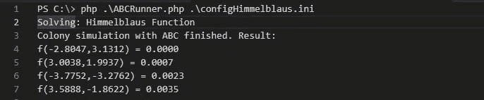

现在，为了更好地理解 ABC 算法是如何工作的，让我们形象化地描述解决方案的演变。


Himmelblaus 函数解可视化。图片由作者提供。

我们看到在第 15 个周期有良好的趋同，在第 30 个周期完全趋同。我注意到一些食物来源的随机配置确实倾向于只找到 4 个全局最小值中的 3 个。也许，人们可以考虑使用均匀分布的食物来源。就我而言，增加食物来源的数量给了我一致的结果。

**交叉托盘函数**也有四个最小值，定义为:

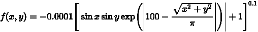

函数的曲线是这样的，

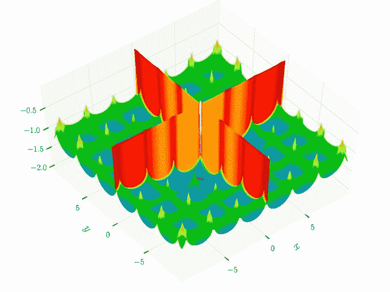

交叉托盘功能。图片由 [Gaortizg](https://commons.wikimedia.org/wiki/File:Cross-in-tray_function.pdf) ， [CC BY-SA 3.0](https://creativecommons.org/licenses/by-sa/3.0) ，通过维基共享

虽然这个函数有几个局部极小值，但只有 4 个全局极小值。当运行时，ABC 算法准确地识别 4 个解决方案，成功地避免了局部最小值。


跨托盘功能解决方案可视化。图片由作者提供。

查看该函数的解的演变，我们可以看到到第 12 周期时的良好收敛和到第 20 周期时的完全收敛。一些散兵游勇的蜜蜂坚持在局部最小值，直到第 20 个周期，这种行为是意料之中的。记住，每只蜜蜂在放弃食物来源之前，都会探索食物来源，探索的次数是可以设定的。

[**Rastrigin 函数**](https://en.wikipedia.org/wiki/Rastrigin_function) ，也很流行，在 n 维域上，定义为，

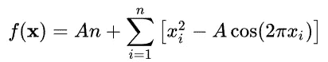

其中 A=10，x 为(-5.12，+5.12)。它有一个全局最小值 X = 0。

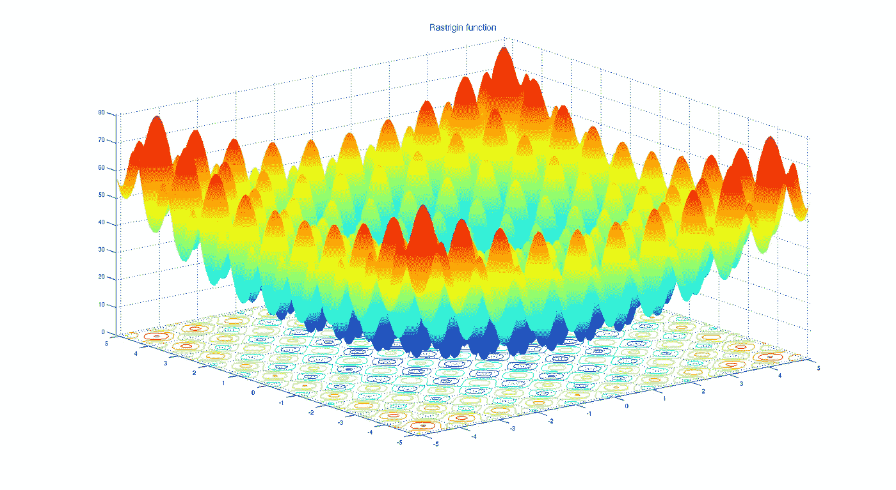

拉斯特里金函数。 [Diegotorquemada](https://commons.wikimedia.org/wiki/File:Rastrigin_function.png) ，公共领域，通过维基共享

Rastrigin 食物源的实现如下所示。

运行 ABC 算法时，会产生以下主要结果

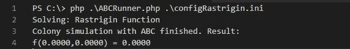

这是等值线图的可视化结果(来自维基百科的基本图像)

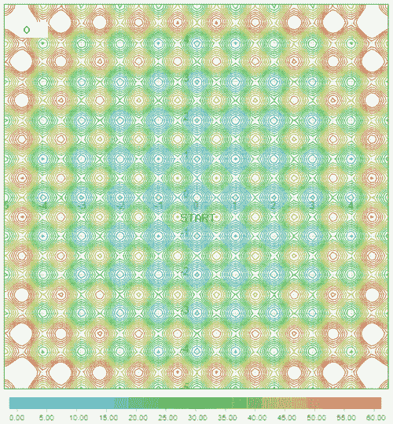

Rastrigin 函数解可视化。图片由作者提供。

注意，在二维中，Rastrigin 函数在 x=0 和 y=0 处只有一个全局最小值。蜜蜂在第 12 个周期左右找到了答案。然而，对大量局部极小值的探索甚至持续到第 100 周期。这是因为局部最小值，特别是靠近中心的那些，在值上非常接近全局最小值。

# 商业问题的应用

既然我们已经用测试函数验证了我们的实现，那么是时候看看我们如何将它应用于现实世界的业务问题了。

Joe 为 ACME Chemicals 工作，ACME Chemicals 是一家虚构的不合格企业对企业(B2B)化学品分销商，每天向客户销售几车化学品。他们销售的七种产品，从 A 到 G，每一种都来自六个制造商的轨道车，从 1 到 6。每节轨道车只包含一个制造商生产的一种化学品。他需要将这些轨道车从托运设施的 15 个不同轨道上取走。一条轨道包含必须占有的几节轨道车，从轨道上的第一节到最后一节(无跳跃)。此外，所有被占用的轨道车必须从设施中移除(不返回轨道选项)。

在一天开始时，他有如下所示的每条轨道上的轨道车序列。例如，在磁道 1 上，需要先删除 D1，然后才能删除 C1 或 E1。

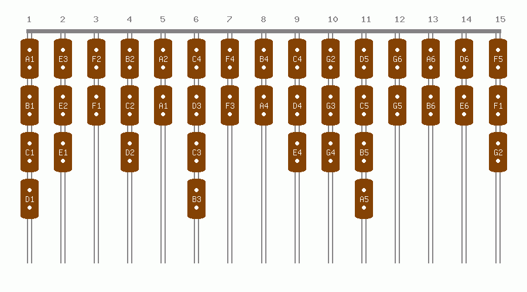

轨道上的轨道车

他还有一份需要交付给客户的产品清单，以及当天他对每个制造商的承诺。

```
╔════════════════╦═══╦═══╦═══╦═══╦═══╦═══╦═══╗
║ Product        ║ A ║ B ║ C ║ D ║ E ║ F ║ G ║
╠════════════════╬═══╬═══╬═══╬═══╬═══╬═══╬═══╣
║ Orders         ║ 2 ║ 3 ║ 4 ║ 3 ║ 5 ║ 3 ║ 2 ║
╚════════════════╩═══╩═══╩═══╩═══╩═══╩═══╩═══╝
╔════════════════╦═══╦═══╦═══╦═══╦═══╦═══╗
║ Manufacturer   ║ 1 ║ 2 ║ 3 ║ 4 ║ 5 ║ 6 ║
╠════════════════╬═══╬═══╬═══╬═══╬═══╬═══╣
║ Commitment     ║ 3 ║ 5 ║ 5 ║ 2 ║ 4 ║ 3 ║
╚════════════════╩═══╩═══╩═══╩═══╩═══╩═══╝
```

为了简单起见，让我们假设制造商不重要，而销售产品和产品对制造商的承诺不重要。例如，在上表中，Joe 需要从任何制造商(A1、A2 等)为化学品 A 收集 2 辆轨道车。).同样，任何产品都可以提货，以满足制造商的承诺(A1、B1 等)。

## 解决方案模型

建模可能是解决过程中最重要的部分，因为模型可能决定你解决问题的成败。

每节轨道车就像是堆栈中的一个元素。每辆车应从最后一辆到第一辆卸载(后进先出)。一个解决方案可以用从每条轨道卸载的轨道车的数量来表示。

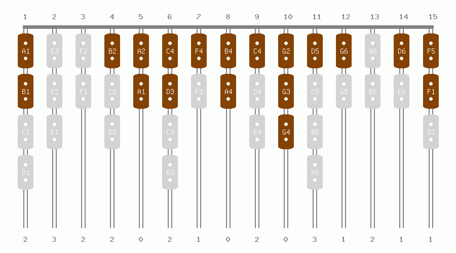

轨道车问题的候选解决方案

所示的候选解可以用数学方法表示为:

```
[2,3,2,2,0,2,1,0,2,0,3,1,2,1,1,2]
```

也就是说，轨道 1 移除了 2 辆车，轨道 2 移除了 3 辆车，轨道 3 移除了 2 辆车，依此类推。对于 ABC 算法，这将是我们的 15 维**食物来源**。

## 目标函数

现在我们有了食物来源，我们需要计算目标函数。

因为我们知道哪些汽车被移走了，我们可以计算出每个产品和制造商的汽车数量。下表显示了从跟踪中删除的每个产品和每个制造商的数量。

```
╔════════════════╦═══╦═══╦═══╦═══╦═══╦═══╦═══╗
║ Product        ║ A ║ B ║ C ║ D ║ E ║ F ║ G ║
╠════════════════╬═══╬═══╬═══╬═══╬═══╬═══╬═══╣
║ Orders         ║ 2 ║ 3 ║ 4 ║ 3 ║ 5 ║ 3 ║ 2 ║
╠════════════════╬═══╬═══╬═══╬═══╬═══╬═══╬═══╣
║ Actual         ║ 2 ║ 3 ║ 4 ║ 3 ║ 5 ║ 3 ║ 2 ║
╠════════════════╬═══╬═══╬═══╬═══╬═══╬═══╬═══╣
║ Error          ║ 0 ║ 0 ║ 0 ║ 0 ║ 0 ║ 0 ║ 0 ║
╚════════════════╩═══╩═══╩═══╩═══╩═══╩═══╩═══╝╔════════════════╦═══╦═══╦═══╦═══╦═══╦═══╗
║ Manufacturer   ║ 1 ║ 2 ║ 3 ║ 4 ║ 5 ║ 6 ║
╠════════════════╬═══╬═══╬═══╬═══╬═══╬═══╣
║ Commitment     ║ 3 ║ 5 ║ 5 ║ 2 ║ 4 ║ 3 ║
╠════════════════╬═══╬═══╬═══╬═══╬═══╬═══╣
║ Actual         ║ 4 ║ 5 ║ 4 ║ 2 ║ 4 ║ 3 ║
╠════════════════╬═══╬═══╬═══╬═══╬═══╬═══╣
║ Error          ║-1 ║ 0 ║ 1 ║ 0 ║ 0 ║ 0 ║
╚════════════════╩═══╩═══╩═══╩═══╩═══╩═══╝
```

有了这些信息，我们可以将目标函数计算为均方根误差，如下所示:

目标函数= ∑(产品数量-产品订单)+ ∑(制造商数量-制造商承诺)

对于建议的候选解决方案，目标函数是 2。

这是轨道车问题的目标函数的实现。

如果这是一个真正的问题，我们可以做得更好。我们可以计算交付产品的利润率，如果交付不足，考虑销售的美元金额和失去客户信任的粗略美元金额。然后，我们可以减去未售出火车车厢的存储成本，或者，如果仓库允许，减去重新进货的成本。使用这种方法可以捕捉更复杂的条件。目标将是利润最大化。

## 解决方案

该配置在 [GitHub](https://github.com/aaxis-nram/abc-algorithm-php/blob/main/configRailCars-1.ini) 上的轨道车-2.ini 中给出。我们将配置输入到 ABC 算法中。

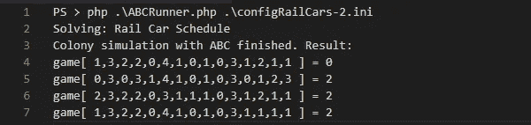

运用 ABC 算法解决有轨车问题

如上所述，上面的解决方案数组表示从每条轨道上移除的轨道车数量。最佳解决方案如下所示:

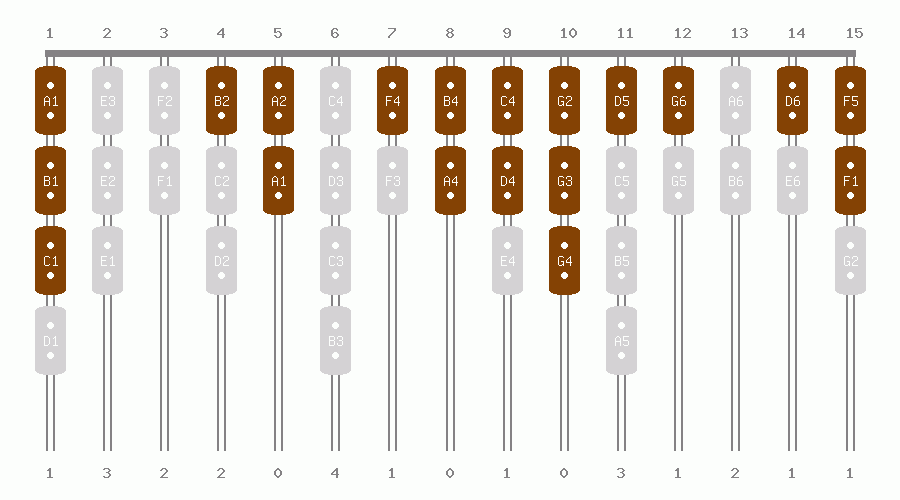

轨道车问题的解决方案

下面是订单和承诺的数量、计算的解决方案和错误。

```
╔════════════════╦═══╦═══╦═══╦═══╦═══╦═══╦═══╗
║ Product        ║ A ║ B ║ C ║ D ║ E ║ F ║ G ║
╠════════════════╬═══╬═══╬═══╬═══╬═══╬═══╬═══╣
║ Orders         ║ 2 ║ 3 ║ 4 ║ 3 ║ 5 ║ 3 ║ 2 ║
╠════════════════╬═══╬═══╬═══╬═══╬═══╬═══╬═══╣
║ Actual         ║ 2 ║ 3 ║ 4 ║ 3 ║ 5 ║ 3 ║ 2 ║
╠════════════════╬═══╬═══╬═══╬═══╬═══╬═══╬═══╣
║ Error          ║ 0 ║ 0 ║ 0 ║ 0 ║ 0 ║ 0 ║ 0 ║
╚════════════════╩═══╩═══╩═══╩═══╩═══╩═══╩═══╝╔════════════════╦═══╦═══╦═══╦═══╦═══╦═══╗
║ Manufacturer   ║ 1 ║ 2 ║ 3 ║ 4 ║ 5 ║ 6 ║
╠════════════════╬═══╬═══╬═══╬═══╬═══╬═══╣
║ Commitment     ║ 3 ║ 5 ║ 5 ║ 2 ║ 4 ║ 3 ║
╠════════════════╬═══╬═══╬═══╬═══╬═══╬═══╣
║ Actual         ║ 3 ║ 5 ║ 5 ║ 2 ║ 4 ║ 3 ║
╠════════════════╬═══╬═══╬═══╬═══╬═══╬═══╣
║ Error          ║ 0 ║ 0 ║ 0 ║ 0 ║ 0 ║ 0 ║
╚════════════════╩═══╩═══╩═══╩═══╩═══╩═══╝
```

订单和承诺是我们想要的(理想的解决方案)。我将实际值显示为算法计算出的值，将误差显示为与理想值的差值。

这是乔世界里的另一天。

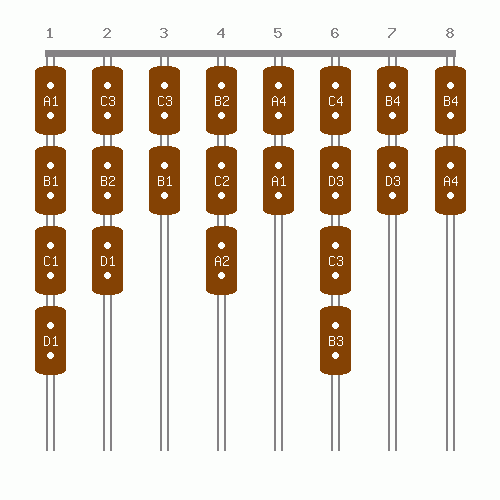

轨道上的轨道车

产品订单和与制造商的合同如下:

```
╔════════════════╦═══╦═══╦═══╦═══╗
║ Product        ║ A ║ B ║ C ║ D ║
╠════════════════╬═══╬═══╬═══╬═══╣
║ Orders         ║ 2 ║ 3 ║ 4 ║ 5 ║
╚════════════════╩═══╩═══╩═══╩═══╝
╔════════════════╦═══╦═══╦═══╦═══╗
║ Manufacturer   ║ 1 ║ 2 ║ 3 ║ 4 ║
╠════════════════╬═══╬═══╬═══╬═══╣
║ Commitment     ║ 3 ║ 4 ║ 4 ║ 2 ║
╚════════════════╩═══╩═══╩═══╩═══╝
```

不存在精确的解决方案。赛道上根本没有 5 辆 D 产品的车。乔将不得不寻找其他地点来完成订单。

这里有四个解决问题的方法:

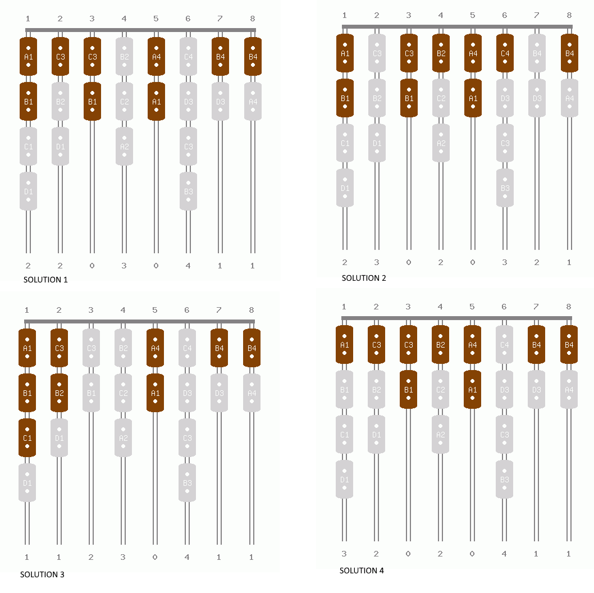

问题的四大解决方案

最佳解决方案的产品和制造商数量如下所示。不出所料，算法无法完成 d 的订单。

```
╔════════════════╦═══╦═══╦═══╦═══╗  
║ Product        ║ A ║ B ║ C ║ D ║
╠════════════════╬═══╬═══╬═══╬═══╣
║ Orders         ║ 2 ║ 3 ║ 4 ║ 5 ║
╠════════════════╬═══╬═══╬═══╬═══╣
║ Actual         ║ 2 ║ 3 ║ 4 ║ 4 ║
╠════════════════╬═══╬═══╬═══╬═══╣
║ Error          ║ 0 ║ 0 ║ 0 ║ 1 ║
╚════════════════╩═══╩═══╩═══╩═══╝╔════════════════╦═══╦═══╦═══╦═══╗
║ Manufacturer   ║ 1 ║ 2 ║ 3 ║ 4 ║
╠════════════════╬═══╬═══╬═══╬═══╣
║ Commitment     ║ 3 ║ 4 ║ 4 ║ 2 ║
╠════════════════╬═══╬═══╬═══╬═══╣
║ Actual         ║ 3 ║ 4 ║ 4 ║ 2 ║
╠════════════════╬═══╬═══╬═══╬═══╣
║ Error          ║ 0 ║ 0 ║ 0 ║ 0 ║
╚════════════════╩═══╩═══╩═══╩═══╝
```

现在，Joe 可以查看解决方案，并选择一个他认为最合适的解决方案，然后在一天的剩余时间里从事只有他能做并且他真正喜欢做的工作。

# ABC 算法的其他应用

一个更简单的例子是大学课程的安排。Vijini Mallawaarachchi 在她的[课程表编排使用遗传算法](https://vijini.medium.com/time-table-scheduling-2207ca593b4d)中描述了一种将遗传算法应用于大学课程表编排的方法【2】。她建议用学生的阶级冲突作为衡量标准。在这个例子中，所有学生的理想值是 0(无冲突)。因此，适应度函数可以是理想解的均方根误差。

在同行评审的科学期刊中也可以找到更多的例子，

*   [周凯·高等人](https://www.sciencedirect.com/science/article/am/pii/S0957417416303931)【3】，将其应用于作业车间调度。
*   R. Srinivasa Rao 等人对配电网络配置进行了优化，以降低损耗。[4]使用 ABC 算法。
*   [的埃桑·阿·阿马尔等人](https://www.sciencedirect.com/science/article/pii/S2090447920301040)解决了配电网中分布式电源的最优规模和位置的类似问题。[5]
*   [Garro et al[6]](https://www.sciencedirect.com/science/article/abs/pii/S1568494615006171) 将 ABC 算法应用于 DNA 微阵列的分类，以发现最佳基因集，从而正确地对癌症样本进行分类。

# 结论

在本文中，我们研究了人工蜂群算法的目的和实现，以及它是如何工作的。我们探索了蜜蜂的四个阶段；初始化、雇佣、旁观和侦察。然后，我们回顾了作为食物源实现的测试函数，并看到了在求解计算过程中蜜蜂活动的可视化。然后，我们讨论了如何建模和应用 ABC 算法来解决日常问题。

总的来说，ABC 算法在优化数学函数以及解决方案架构师经常遇到的实际业务问题方面非常灵活。

在这里找到代码。

如果您对 ABC 算法的业务解决方案方面更感兴趣，请阅读我即将发表的后续文章。

# **参考文献**

[1]卡拉博加，德尔维斯。“人工蜂群算法。”[*scholar pedia*](http://www.scholarpedia.org/article/Artificial_bee_colony_algorithm)5，第 3 期(2010): 6915。

[2]维吉尼·马拉瓦拉赫。《利用遗传算法进行课表编排》Medium，(2017)，[https://vijini . Medium . com/time-table-Scheduling-2207 ca 593 b4d](https://vijini.medium.com/time-table-scheduling-2207ca593b4d)

[3]高、、Ponnuthurai Nagaratnam Suganthan、全、蔡泰进、陈顺冲和田。"一种求解模糊加工时间柔性作业车间调度问题的改进人工蜂群算法." [*专家系统及应用*](https://www.sciencedirect.com/science/article/am/pii/S0957417416303931)65(2016):52–67。

[4] Rao，R. Srinivasa，S. V. L. Narasimham 和 M. Ramalingaraju。"基于人工蜂群算法的配电网降损结构优化." [*《国际电力与能源系统工程杂志》*](https://citeseerx.ist.psu.edu/viewdoc/download?doi=10.1.1.192.9170&rep=rep1&type=pdf) 1，第 2 期(2008):116–122。

[5]阿马尔、埃桑、基兰·法扎纳、阿萨德·瓦卡尔、穆罕默德·阿米尔、阿兹哈尔·哈克、穆罕默德·扎希德和梅穆纳·巴图尔。"基于 ABC 算法的配电网分布式电源多目标优化配置." [*Ain Shams 工程学报*](https://www.sciencedirect.com/science/article/pii/S2090447920301040) 12，第 1 期(2021):697–708。

[6]加罗、比阿特丽斯·a、卡蒂亚·罗德里格斯和罗伯托·a·巴斯克斯。"利用人工神经网络和 ABC 算法对 DNA 微阵列进行分类."应用软计算 38(2016):548–560。