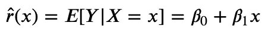
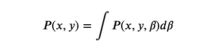
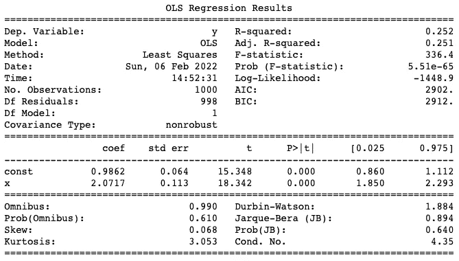
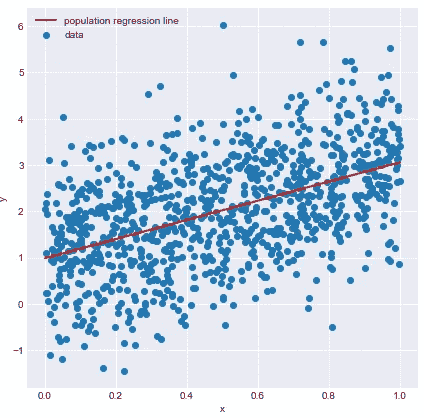
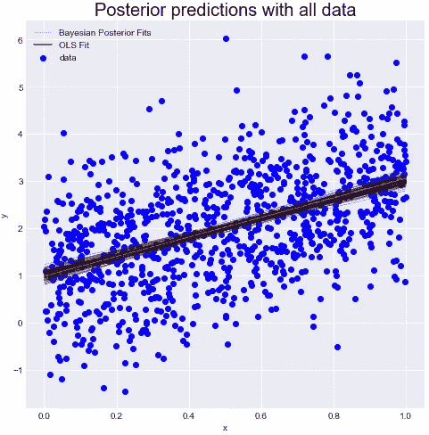
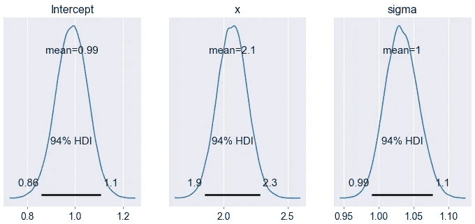
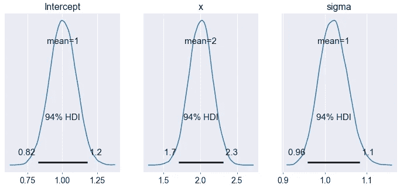
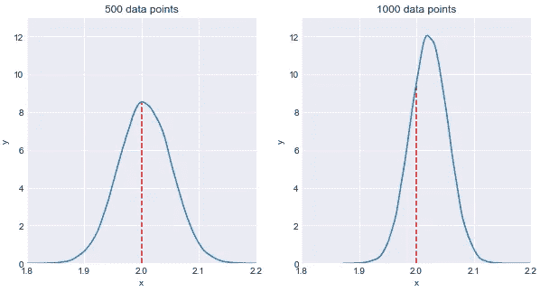
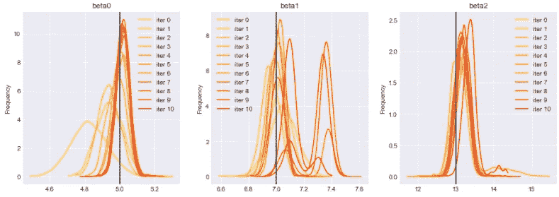

# 实施贝叶斯线性回归

> 原文：<https://towardsdatascience.com/implementing-bayesian-linear-regression-9375a9994f98>

## 本文介绍了贝叶斯线性回归的基础，包括一个供感兴趣的程序员使用的 Python 实践示例。


照片由[卢卡斯](https://www.pexels.com/@goumbik)在[像素](https://www.pexels.com/photo/chart-close-up-data-desk-590022/)上拍摄

线性回归试图通过将线性方程拟合到观察到的数据来模拟两个变量之间的关系。*人口简单线性回归*可表述如下:



其中:

*   y 是因变量，X 是自变量
*   β0 是总体截距，β1 是总体斜率。这些是我们要估计的回归参数。

然后，使用最小二乘回归原理，我们可以计算最小化均方误差成本函数的权重和偏差的值。如果你已经知道了这些概念，那么你就熟悉了 [*frequentist* 线性回归](https://javiferfer.medium.com/introduction-to-linear-regression-b9387e7e34b4)方法。

然而，除了*频率主义者*方法，还有另一个统计推断学派，叫做*贝叶斯*。一方面，*frequency ist*方法将概率理解为由重复实验确定的事件的可测量频率。另一方面，*贝叶斯*方法将概率描述为对事件可信度的测量，使用从观察数据中获得的先验知识。

本文重点关注*贝叶斯*线性回归，并通过以下方式进行介绍:(1)介绍一些基本概念，如贝叶斯定理，(2)描述贝叶斯线性回归背后的理论，以及(3)展示 Python 中的实际操作示例。

# 1.基本概念

贝叶斯定理在数学上表述为以下等式:


其中:

*   **P(A|B)** 被称为**后路**；这就是我们试图估计的。
*   **P(B|A)** 称为**可能性**；这是根据我们最初的假设，观察到新证据的概率。
*   **P(A)** 称为**先于**；这是我们假设的概率，没有任何额外的先验信息。
*   **P(B)** 称为**边际可能性**；这是观察到证据的总概率。

在机器学习中，变量 ***B*** 可以指示观察到的数据，这意味着利用生成模型 *𝑃* ( *𝐵* | *𝐴* )和一个可能的模型参数 P(A)的先验分布，我们可以得到给定观察到的数据的模型参数的后验。我们将在下一节描述*贝叶斯线性回归*时看到更多细节。

# 2.贝叶斯线性回归

在贝叶斯分析中，目标是通过结合来自观察数据的关于参数的信息来更新参数的概率分布。使用贝叶斯公式，这可以表述为:


其中:

*   **P(β|x，y)** 描述给定观测数据、目标和先验分布的参数的概率。
*   **P(y|x，β)** 描述给定数据和参数的目标值的概率
*   **P(β)** 描述了关于参数的初始知识。如果我们没有关于分布的任何估计，我们可以使用参数的非信息先验，如正态分布。
*   **P(x，y)** 描述了数据和目标的联合概率。

总之，为了计算后验概率，我们将可能性 **P(y|x，β)** 与先验概率 **P(β)** 相乘，前者表明我们认为数据是如何分布的，后者表明我们认为 **β** 是如何分布的。随着数据数量的增加，与先前的相比，可能性变得更加显著，并且解决方案越来越接近从最小二乘法获得的值。

然而，还有归一化项 **P(x，y)** ，其通过对所有可能的参数值进行积分来估计:



尽管这个公式看起来很简单，但即使是简单的模型，也很难用封闭形式来计算。这就是所谓的马尔可夫链蒙特卡罗(MCMC)方法发挥作用的时候了。简单地说，这种方法包括一类从概率分布中取样的算法。因为详细解释这种方法本身就需要一整篇文章，所以我在这里为感兴趣的人留下了一个很好的参考资料。

总结整个逻辑，要计算贝叶斯线性回归，必须遵循以下步骤:

1.  设定关于参数 P(β)分布的初始信念。
2.  收集一些数据。
3.  使用贝叶斯公式计算参数β的后验概率分布。
4.  对未知数据进行推断，计算输出的后验分布参数，而不是点估计。

# 3.编码

最后，这里有一个 Python 中的*贝叶斯线性回归*的实际例子。本节分为两部分。第一部分(*评估贝叶斯回归模型*)包括 frequentist 和贝叶斯回归模型之间的比较，以及用不同数量的数据进行训练时参数分布的分析。第二部分(*更新先验贝叶斯回归模型*)展示了在获得更多数据时如何重新训练模型，并展示了每次训练迭代的输出分布的演变。

## 评估贝叶斯回归模型

对于第一部分，我们创建了一个包含 1000 个数据点的数据集，其斜率为 2，截距为 1。然后，我们也给数据点添加了噪声以增加随机性。

然后，我们计算了普通最小二乘法，以查看使用 *frequentist 线性回归*时的输出。



```
Intercept: 0.986230345022046
Slope: 2.071679208492629
```



如上所述，斜率和截距近似于生成数据时设定的参数。

然后，让我们建立贝叶斯模型

*   截距~ N( μ=0，σ=20)
*   斜率~半柯西(β=10)
*   μ =截距+斜率* x
*   σ ~半柯西(β=10)
*   μ =截距+斜率* x
*   y ~ N(μ=μ，σ=σ)

现在，我们使用 Hamiltonian MC No U-Turn 采样器(NUTS)从 10000 个随机 MCMC 样本中创建模型。



类似于 *frequentist 线性回归*模型，我们可以看到模型得出了相同的结果:斜率在 2 左右，截距在 1 左右。然而，参数的分布表明模型仍然是不确定的，例如 94%的

例如，斜率的 94%的最高密度区间在 1.9 和 2.3 之间，这仍然是一个相当宽的区间。拦截也是如此。贝叶斯推理的伟大之处在于，我们提供的数据越多，模型就变得越确定。这可以在下一个示例中观察到，在该示例中，用 500 个数据点(总数据的一半)对模型进行了训练。



这里，与上述模型相比，斜率的区间在[1.7，2.3]之间，而不是[1.9，2.3]。

一旦回归模型被训练，就有可能进行预测。



这里，当增加数据数量时，也可以观察到模型的确定性，因为右边的分布(1000 个数据点)比左边的分布(500 个数据点)窄。

## *更新先验贝叶斯回归模型*

最后，这是一个如何用新数据重新训练模型的例子。为此，我们创建了一个包含两个独立变量的新数据集。

这是上面为前 100 个数据点创建的相同模型。

为了更新我们关于参数的信念，我们使用后验分布，它将在后验地用作下一个推断的先验分布。

用于每次推理迭代的数据必须独立于之前的迭代。否则，相同的(可能是错误的)信念会被一遍又一遍地注入系统，放大错误并误导推论。



该图显示了每次迭代的回归模型的分布。可以观察到，我们用新数据训练模型越多，参数就越接近设定值。

***如果你喜欢这个帖子，请考虑*** [***订阅***](https://javiferfer.medium.com/membership) ***。你将获得我所有的内容+所有其他来自牛逼创作者的文章！***

# 参考

[1] [贝叶斯线性回归](https://alpopkes.com/posts/machine_learning/bayesian_linear_regression/)

[2]中等，[贝叶斯线性回归中的 Python](/bayesian-linear-regression-in-python-using-machine-learning-to-predict-student-grades-part-2-b72059a8ac7e)

[3] PyMC3，[更新先验知识](https://docs.pymc.io/en/v3/pymc-examples/examples/pymc3_howto/updating_priors.html)

[4] Kaggle，[pymc 3 中的贝叶斯线性回归](https://www.kaggle.com/billbasener/bayesian-linear-regression-in-pymc3)

[5] GitHub，[贝叶斯线性回归](https://github.com/krasserm/bayesian-machine-learning/blob/dev/bayesian-linear-regression/bayesian_linear_regression.ipynb)

[6]中，[贝叶斯推理和马尔可夫链蒙特卡罗抽样中的 Python](/bayesian-inference-and-markov-chain-monte-carlo-sampling-in-python-bada1beabca7)