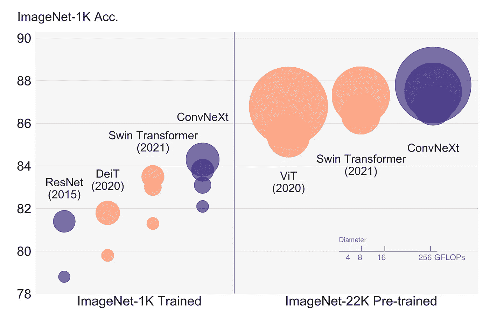
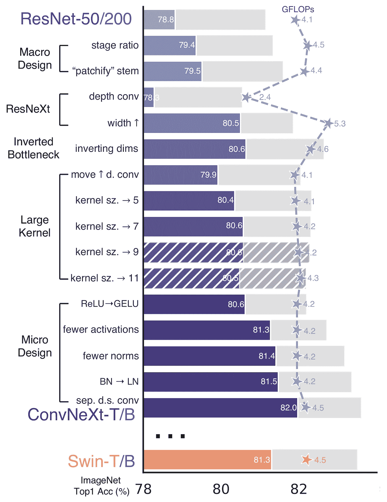

# 在 PyTorch 中实现 ConvNext

> 原文：<https://towardsdatascience.com/implementing-convnext-in-pytorch-7e37a67abba6>


作者图片

## *击败变形金刚的新康文网*

*嘿，我在*[*LinkedIn*](https://www.linkedin.com/in/francesco-saverio-zuppichini-94659a150/)*过来打个招呼👋*

你好。！今天，我们将在 PyTorch 中实现著名的 ConvNext，这是在 2020 年代的 ConvNet 中提出的。

这里的代码是[这里的](https://github.com/FrancescoSaverioZuppichini/ConvNext)，这篇文章的互动版本可以从[这里的](https://github.com/FrancescoSaverioZuppichini/ConvNext/blob/main/README.ipynb)下载。

我们开始吧！

本文提出了一种新的基于卷积的体系结构，它不仅优于基于变换器的模型(如 Swin ),而且可以随数据量的增加而扩展！下图显示了不同数据集/模型大小下的 ConvNext 精度。



图片来自[2020 年代的 conv net](https://arxiv.org/abs/2201.03545)

因此，作者开始采用众所周知的 ResNet 架构，并根据过去十年的新的最佳实践和发现对其进行迭代改进。作者关注 Swin-Transformer，并密切关注其设计选择。论文一流，强烈推荐阅读:)

下图显示了所有不同的改进以及每项改进后各自的性能。



图片来自[2020 年代的 conv net](https://arxiv.org/abs/2201.03545)

他们将路线图分为两部分:宏观设计和微观设计。宏观设计是我们从高层次的角度所做的所有改变，例如阶段的数量，而微观设计更多的是关于更小的事情，例如使用哪个激活。

我们现在将从一个经典的瓶颈块开始，一个接一个地应用每个更改。

# 起点:ResNet

如你所知(如果你没有我有一篇[关于在 PyTorch](https://medium.com/p/a7da63c7b278) 中实现 ResNet 的文章)ResNet 使用了一个残余瓶颈块，这将是我们的起点。

让我们检查它是否工作

```
torch.Size([1, 64, 7, 7])
```

我们再定义一个`Stage`，一个`blocks`的集合。每个阶段通常以因子`2`对输入进行下采样，这在第一个模块中完成。

```
torch.Size([1, 64, 4, 4])
```

酷，注意输入是如何从`7x7`减少到`4x4`的。

ResNet 也有所谓的`stem`，它是模型中的第一层，对输入图像进行大量的下采样。

很好，现在我们可以定义`ConvNextEncoder`来保存一个阶段列表，并将一个图像作为输入来产生最终的嵌入。

```
torch.Size([1, 2048, 7, 7])
```

这是你的普通`resnet50`编码器，如果你附加一个分类头，你会得到一个很好的旧 resnet50，准备好接受图像分类任务的训练。

# 宏观设计

# 更改阶段计算比率

在 ResNet 中，我们有 4 个阶段，Swin 变压器使用比率`1:1:3:1`(因此第一阶段有一个模块，第二阶段有一个模块，第三阶段有三个模块...).将 ResNet50 调整到这个比率(`(3, 4, 6, 3)`->-`(3, 3, 9, 3)`)会导致性能从`78.8%`增加到`79.4%`。

# 将词干改为“Patchify”

ResNet stem 使用非常激进的 7x7 conv 和 maxpool 对输入图像进行大幅缩减采样。然而，《变形金刚》使用了“patchify”词干，这意味着它们将输入图像嵌入到补丁中。Vision Transfomers 使用非常激进的补丁(16x16)，作者使用 conv 层实现的 4x4 补丁。精度从`79.4%`变为`79.5%`，表明修补工作正常。

# ResNeXt-ify

[ResNetXt](https://arxiv.org/abs/1512.03385) 对瓶颈中的 3x3 conv 层采用分组卷积来减少 FLOPS。在 ConvNext 中，它们使用深度卷积(就像在 MobileNet 和后来的 EfficientNet 中一样)。深度方向卷积是分组卷积，组数等于输入通道数。

作者注意到，这与自我关注中的加权和运算非常相似，后者只在空间维度上混合信息。使用深度方向的 convs 会降低精度(因为我们没有像 ResNetXt 那样增加宽度)，这是意料之中的。

所以我们在`BottleNeck`块中把我们的 3x3 conv 改为

# 倒置瓶颈

我们的瓶颈首先是通过 1x1 conv 减少功能，然后应用 3x3 conv，最后将功能扩展到原始大小。一个倒置的瓶颈块，做相反的事情。我有一整篇文章[对它们进行了很好的可视化。](https://medium.com/p/89d7b7e7c6bc)

所以我们从`wide -> narrow -> wide`到`narrow -> wide -> narrow`。

这类似于变形金刚，因为 MLP 层遵循`narrow -> wide -> narrow`设计，MLP 中的第二个密集层将输入的特征扩展了四倍。

# 大型内核

现代视觉转换器，如 Swin，使用更大的内核大小(7x7)。增加内核大小将使计算更昂贵，所以我们向上移动大的深度方向 conv，这样我们将有更少的通道。作者指出，这类似于变形金刚模型，其中多头自我关注(MSA)在 MLP 层之前完成。

这增加了从`79.9%`到`80.6%`的精确度

# 微观设计

# 用 GELU 替换 ReLU

既然最先进的变形金刚都用葛鲁，为什么不在我们的模型里用呢？作者报告说准确性保持不变。在`nn.GELU`的 PyTorch GELU。

# 更少的激活功能

我们的模块有三个激活功能。而在变压器模块中，只有一个激活功能，即 MLP 模块内部的激活功能。作者移除了除了中间 conv 层之后的激活之外的所有激活。这提高了`81.3%`匹配 Swin-T 的准确性！

# 更少的标准化图层

与激活类似，变形金刚块具有较少的规范化层。作者决定删除所有批次，只保留 conv 中部之前的批次。

# 用 LN 代替 BN

嗯，他们用图层替换了批次图层。他们注意到在最初的 ResNet 中这样做会影响性能，但是在我们做了所有的修改之后，性能提高到了`81.5%`

所以，让我们应用它们

# 分隔缩减像素采样图层。

在 ResNet 中，下采样由`stride=2` conv 完成。变压器(和其他 conv 网)有一个单独的下降采样块。作者移除了`stride=2`，并使用`2x2` `stride=2` conv 在三次转换之前添加了一个下采样模块。在下采样操作之前需要进行归一化，以保持训练期间的稳定性。我们可以将这个模块添加到我们的`ConvNexStage`中。最后，我们到达`82.0%`超越 Swin！

现在我们可以清洁我们的`BottleNeckBlock`

我们终于到达了最后一个街区！让我们测试一下

```
torch.Size([1, 62, 7, 7])
```

# 最后润色

他们还添加了随机深度，也称为下降路径，(我有一篇关于它的文章[和图层比例。](/implementing-stochastic-depth-drop-path-in-pytorch-291498c4a974)

好了🎉我们找到了！看看有没有效果！

```
torch.Size([1, 62, 7, 7])
```

超级！我们需要在编码器中创建丢弃路径概率

```
torch.Size([1, 2048, 3, 3])
```

为了得到用于图像分类的最终 ConvNext，我们需要在编码器上应用一个分类头。我们还在最后一个线性图层前添加了一个`LayerNorm`。

```
torch.Size([1, 1000])
```

现在你有了！

# 结论

在本文中，我们一步步地看到了作者为从 ResNet 创建 ConvNext 所做的所有更改。我希望这有用:)

感谢您的阅读！

弗朗西斯科