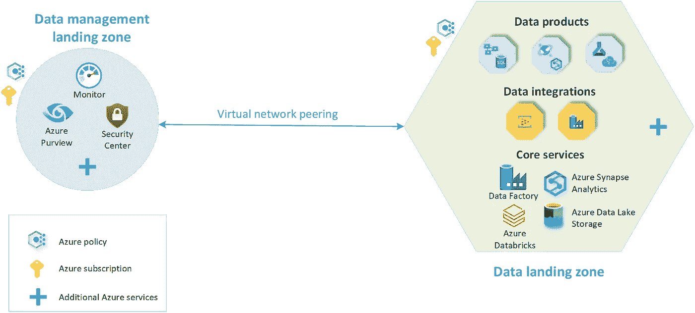
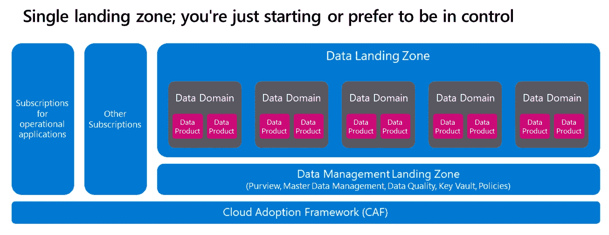
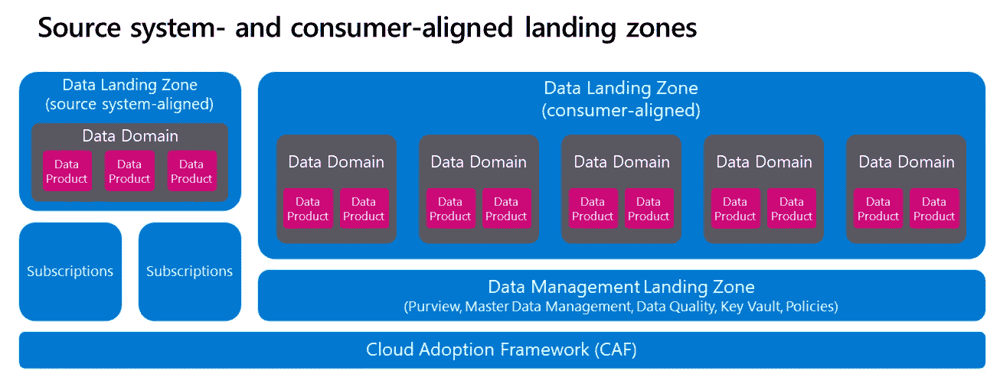
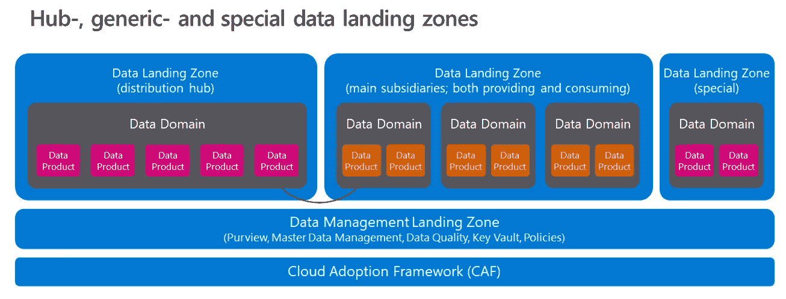
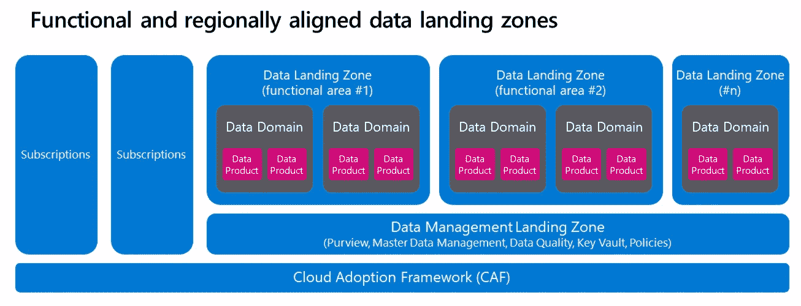
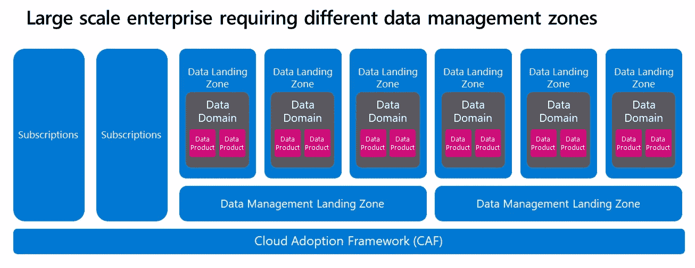

# 在 Azure 上实现数据网格

> 原文：<https://towardsdatascience.com/implementing-data-mesh-on-azure-c01ee94306cd>

**数据网格**是一种令人兴奋的设计和开发数据架构的新方法。在我的第一系列文章和更多关于[数据产品](/data-domains-and-data-products-64cc9d28283e)和[数据域](/data-domains-where-do-i-start-a6d52fef95d1)的最新资料之后，我收到了关于解释 Azure 上的实际实现可能是什么样子的询问。我将在这篇博文中尝试回答这个问题。

## Azure 数据管理和分析场景

为了在 Azure 上构建数据网格，我建议你密切关注 [Azure 数据管理和分析场景](https://docs.microsoft.com/en-us/azure/cloud-adoption-framework/scenarios/data-management/)。这个框架是一个可部署的参考架构，附带([开源](https://github.com/Azure/data-landing-zone))模板和最佳实践。该体系结构使用两个主要的构造块，它们是所有部署选择的基础:

*   [数据管理登陆区](https://docs.microsoft.com/en-us/azure/cloud-adoption-framework/scenarios/data-management/architectures/data-management-landing-zone):这是你的数据架构的基础。它包含数据管理的所有关键功能，如数据目录、数据沿袭、API 目录、主数据管理等等。
*   [数据登陆区](https://docs.microsoft.com/en-us/azure/cloud-adoption-framework/scenarios/data-management/architectures/data-landing-zone):这些是托管您的分析和人工智能解决方案的订阅。它们包括托管分析平台的关键功能。

下图显示了具有数据管理登录区和单个数据登录区的数据管理和分析场景平台的概述。图中并没有显示所有的 Azure 服务。它已经过简化，以突出在该体系结构中如何组织资源的核心概念。(来源:【Microsoft.com】T2)

该框架没有明确规定您必须提供的数据架构的确切类型。您可以将它用于许多常见的数据管理和分析解决方案，包括(企业)数据仓库、数据湖、数据湖库和数据网格。对于这篇博客文章——实际设计一个**数据网格——**，我们将放大到后者。

# Azure 上的数据网格

在展示任何解决方案之前，我想明确声明，每个架构都遵循所有数据网格原则:域所有权、数据即产品、自助式数据平台和联合计算治理。接下来，不同的路径将导致数据网格架构。没有对错之分。归根结底就是做出正确的权衡和自己的偏好。

## 单一数据着陆区

构建数据网格架构最简单的部署模式是使用一个*数据管理登陆区*和一个 [*单一数据登陆区*](https://docs.microsoft.com/en-us/azure/cloud-adoption-framework/scenarios/data-management/architectures/reference-architecture-adatum) 。在这种情况下，您的数据架构在概念上类似于下图:

单一数据登陆区，对小型公司或绿地项目有意义

在这种体系结构中，您的所有功能性数据域都将位于同一个数据着陆区。这意味着单个订阅包含一组标准的服务和资源组，用于隔离 data domains 和数据产品。标准服务将适用于所有领域，例如 Azure Data Lake Store、Azure Data Factory、Azure Logic Apps 和 Azure Synapse Analytics。

所有数据域都遵循数据网格的原则:数据遵循域所有权，数据被视为产品。此外，该平台允许自助服务，尽管由于单一着陆区配置，服务的变化预计是有限的。

此部署选项的一个考虑因素可能是，您希望所有域都严格遵守相同的数据管理原则。这种部署方式也适用于小型公司或新建项目。你想拥抱数据网格，但不要把事情搞得太复杂。最后，当您开始构建更复杂的东西时，这种部署也是一种选择。你计划在晚些时候扩展到多个着陆区。

## 源系统和消费者一致的着陆区

在之前的模型中，我们没有考虑其他订阅或内部应用。因此，我想对前面的模型提出一个微妙的变化，即添加一个与源系统一致的登录区来管理所有传入的数据。拥有两个*数据登陆区*是有意义的，因为数据登陆是一个困难的过程。在使用大量数据时，这仍然是最具挑战性的问题之一。它还经常需要额外的工具来解决集成挑战，这与数据消费的方式形成对比。因此，区分提供和消费数据是合乎逻辑的。

源系统和消费者一致的数据登陆区，用于优化数据上线和数据消费(作者:Piethein Strengholt)

对于左边架构中的*数据登陆区*，您通常会期望服务来促进数据的加入，比如 [CDC](https://en.wikipedia.org/wiki/Change_data_capture) ，拉 API 的服务，或者[数据湖服务](https://docs.microsoft.com/en-us/azure/cloud-adoption-framework/scenarios/data-management/best-practices/data-lake-services)，用于[动态构建](https://piethein.medium.com/modern-data-pipelines-with-azure-synapse-analytics-and-azure-purview-fe752d874c67)不可变数据集。来自该平台的服务可以从内部、云环境或 SaaS 供应商处获取数据。这种平台通常还会有更多的开销，因为与底层操作应用程序有更多的耦合。因此，您可能希望将其与任何数据使用区别对待。

对于与消费一致的数据着陆区，您可以优化数据使用，并期待旨在将数据转化为价值的服务:探索、可视化、机器学习、报告等等。这方面的领域将遵循数据网格的所有原则。它们拥有数据的所有权，并被允许直接将数据分发给其他域。

## 中枢、通用和特殊数据着陆区

下一个部署选项是前一个设计的另一个迭代。这种部署遵循一种[管理的网状拓扑](/data-mesh-topologies-85f4cad14bf2):数据通过一个中央集线器分发，在该集线器中，数据按域进行分区，在逻辑上是隔离的，因此不是集成的。该模型中的中心使用其自己的(与域无关的)数据登陆区，并且可以由一个中央数据治理团队拥有，该团队监督哪些数据被分发到哪些其他域。该中心通常还提供有助于数据上线的服务，这解释了与之前部署选项的重叠之处。

通过中央和管理中心进行数据分发的数据着陆区(作者:Piethein Strengholt)

对于需要标准服务来消费、使用、分析和创建新数据的域，将使用通用的*数据登陆区*。这种单一订阅将包含一组标准服务，在某种程度上类似于之前看到的单一登录区部署。在这种配置中，我鼓励您应用数据虚拟化，因为您的大多数数据产品已经存在于 hub 中。不需要额外的数据复制。

此外，这种部署允许“特殊”:当无法对域进行逻辑分组时，提供额外的*数据着陆区*。例如，当区域或法律边界适用时，或者当域具有独特且相反的要求时。或应用强有力的全球子公司治理的情况，海外活动除外。在这种隔离的情况下，您可以部署额外的数据着陆区。

对于迫切需要控制哪些数据由哪些其他域分发和使用的组织来说，hub 部署选项是一个考虑因素。在解决大型数据消费者的[时变和非易失](https://www.1keydata.com/datawarehousing/data-warehouse-definition.html)问题时，这也可能是一个有效的选择。如果是这样的话，你应该在数据产品的设计上严格标准化，允许你的域进行时间旅行和再传送。我经常看到金融机构或受监管机构使用这种模式。

## 功能和区域一致的数据着陆区

一种可伸缩性的方法是提供多个*数据登陆区*，用于根据工作和共享数据的方式的内聚性和效率对功能域进行分组。在这种情况下，您所有的*数据着陆区*都遵循相同的控制和审计，但是您允许不同团队使用的不同数据着陆区之间的灵活性和设计变化。

多个数据着陆区，用于可伸缩性和将域分组在一起(作者:Piethein Strengholt)

有许多方面决定了哪些功能数据域将被逻辑分组在一起，并成为共享数据着陆区的候选对象。例如，区域边界可能导致实施相同的蓝图。所有权、安全性或法律界限可能会迫使域被隔离。灵活性、变化速度或潜在的出售或分离能力也是重要的驱动因素。我就这个主题写了一篇很长的博文，为您提供了一些细微差别和注意事项:[https://towards data science . com/data-domains-where-do-I-start-a 6d 52 fef 95d 1](/data-domains-where-do-i-start-a6d52fef95d1)

不同的*数据着陆区*不自立。如果您有多个区域，这些区域可以连接到其他区域中托管的数据湖。这种方法允许域在整个企业中协作。您还可以应用多语言持久性来混合不同的数据存储技术，允许域直接从其他域读取数据，而不需要数据复制。这更好地允许域获得数据的完全所有权。

当部署多个*数据登录区时，*您应该意识到每个数据登录区都有一些管理开销:必须在所有数据登录区之间应用 VNET 对等，必须管理额外的私有端点，等等。数据登录区和域的过于细粒度的对齐可能会破坏您的可伸缩性目标，因此您应该找到分组功能域的正确平衡。

当您的数据架构较大时，部署多个*数据着陆区*是很好的考虑。您可以通过向架构添加更多的着陆区来扩展数据网格架构，以满足不同领域的共同需求。这些着陆区使用虚拟网络对等连接到*数据管理着陆区*和所有其他着陆区。这种模式允许您跨区域共享数据集和资源。通过划分成单独的区域，您可以将工作负载分散到 Azure 订阅和资源中。这种方法允许您有机地实现数据网格

## 需要不同数据管理区的大型企业

最后一个部署选项是面向在全球范围内运营的超大型企业。在这种情况下，组织的不同部门之间可能会有截然不同的数据管理需求。为了解决这个问题，您可以一起部署多个*数据管理着陆区*和*数据着陆区*。这种架构如下图所示:

用于对比数据管理需求的多个数据管理着陆区

需要强调的是，多个*数据管理着陆区*，应该证明额外开销和集成复杂性的合理性。例如，一个额外的*数据管理登陆区*对于不允许其他人看到组织的(元数据)数据的情况是有意义的。

## 包扎

向数据网格的过渡主要是一种文化转变，伴随着细微差别、权衡和考虑。这种转变可能相当困难和乏味，因此我建议在迁移和使数据域独立之前，通过合并数据网格原则慢慢开始。

对于技术部分，我推荐使用加速器。您可以利用 [Azure 数据管理和分析场景](https://docs.microsoft.com/en-us/azure/cloud-adoption-framework/scenarios/data-management/)来获得最佳实践和可执行资源。blogpost 中描述的参考架构可以作为启动实施的起点。