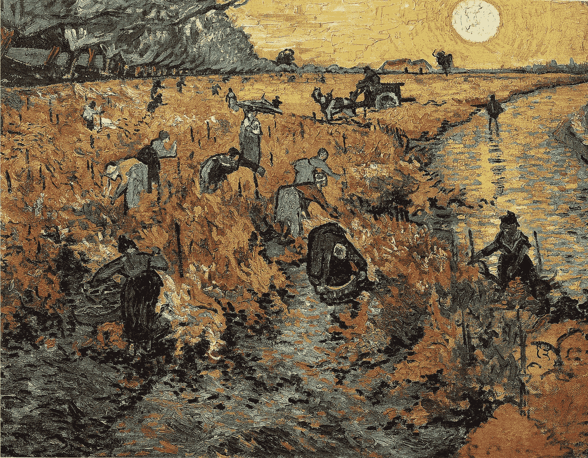
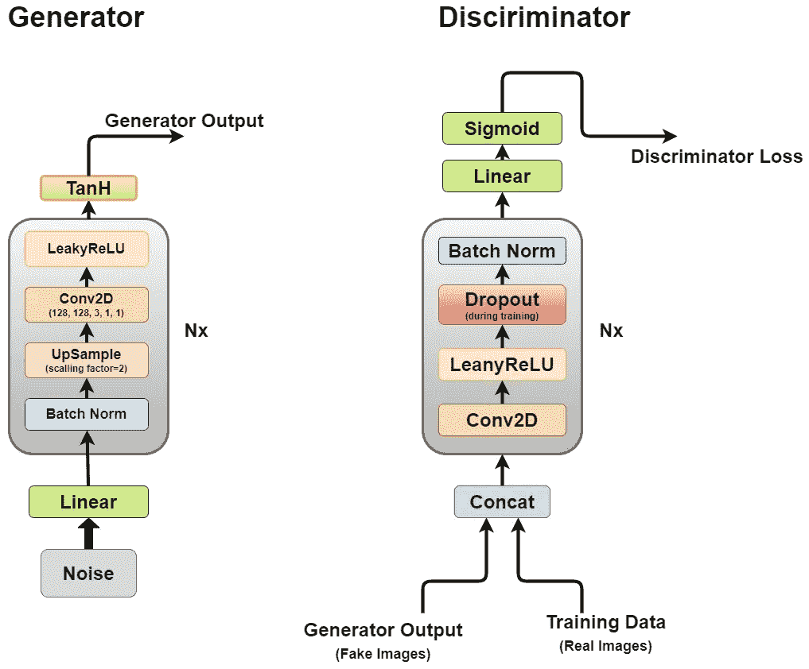
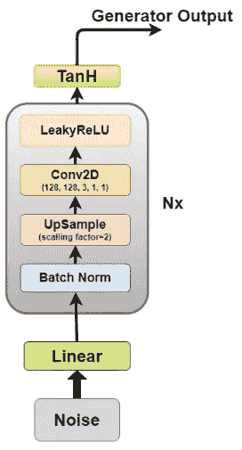
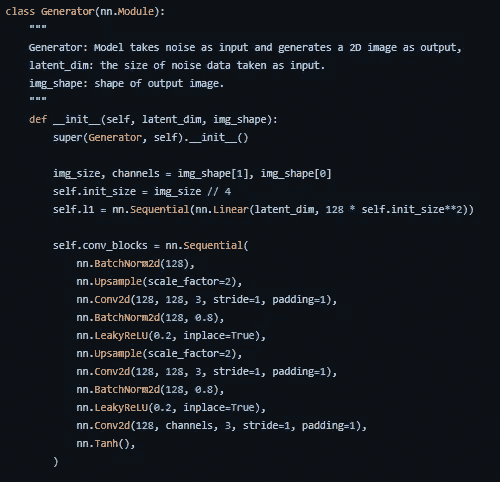
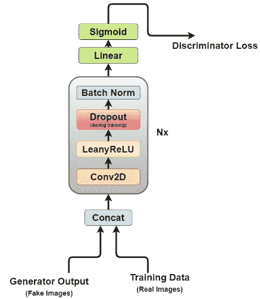
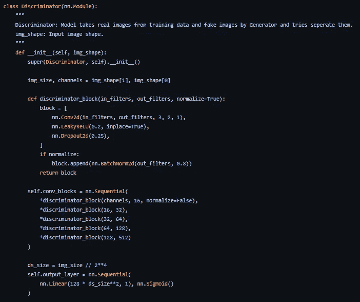
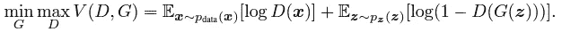
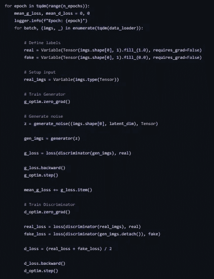

# 实施深度卷积 GAN

> 原文：<https://towardsdatascience.com/implementing-deep-convolutional-gan-f76e9b9af270>

文森特·梵高的《红色葡萄园》

据[纽约时报](https://www.nytimes.com/2012/09/23/technology/data-centers-waste-vast-amounts-of-energy-belying-industry-image.html)报道，数据中心使用的能源有 90%被浪费了，这是因为公司收集的大部分数据从来没有以任何形式被分析或使用，这更具体地被称为**黑暗数据。**

> 暗数据是通过各种计算机网络操作获取的数据，但不以任何方式用于获取见解或制定决策。一个组织收集数据的能力可能会超过其分析数据的能力。在某些情况下，组织可能甚至没有意识到数据正在被收集。IBM 估计，大约 90%由传感器和模数转换产生的数据从未被使用过。— **维基百科上的黑暗数据定义**

从机器学习的角度来看，这些数据对于获得任何见解都没有用的一个关键原因是缺乏标签。这使得无监督学习算法非常有吸引力，可以释放这些数据的潜力。

# 生成对抗网络

2014 年，Ian Goodfellow 等人提出了一种通过对抗过程来估计生成模型的新方法。它涉及同时训练两个独立的模型，一个生成器模型试图对数据分布进行建模，一个鉴别器试图通过生成器将输入分类为训练数据或虚假数据。

这篇论文在现代机器学习领域树立了一个非常重要的里程碑，为无监督学习开辟了新的途径。深度卷积 GAN [论文](https://arxiv.org/abs/1511.06434)(拉德福德等人 2015)通过应用卷积网络的原理成功产生 2D 图像，继续构建这一思想。

通过这篇文章，我试图解释本文中的关键组件，并使用 PyTorch 实现它们。

## 甘有什么了不起的地方？

为了理解 GAN 或 DCGAN 的重要性，让我们看看是什么让它们如此受欢迎。

1.  由于大部分真实世界的数据是未标记的，GANs 的无监督学习特性使它们成为这种用例的理想选择。
2.  生成器和鉴别器对于具有有限标记数据的用例来说是非常好的特征提取器，或者生成额外的数据来改善次级模型训练，因为它们可以生成假样本而不是使用增强。
3.  GANs 提供了最大似然技术的替代方案。它们的对抗性学习过程和非启发式成本函数使它们对强化学习非常有吸引力。
4.  围绕 GAN 的研究非常有吸引力，其结果也是关于 ML/DL 影响的广泛辩论的来源。例如，Deepfake 是 GAN 的应用之一，它可以将人的面部覆盖在目标人物上，这在本质上一直是非常有争议的，因为它有可能被用于邪恶的目的。
5.  最后但也是最重要的一点是，与它一起工作很酷，该领域的所有新研究都令人着迷。

# 体系结构

深度卷积 GAN 的架构(图片由作者提供)

正如我们之前所讨论的，我们将通过 DCGAN 来实现 GAN 的核心思想，用于能够生成逼真图像的卷积网络。

DCGAN 由两个独立的模型组成，一个是生成器(G ),它试图模拟随机噪声向量作为输入，并试图学习数据分布以生成伪样本，另一个是鉴别器(D ),它获取训练数据(真实样本)和生成的数据(伪样本),并试图对它们进行分类，这两个模型之间的斗争就是我们所说的对抗性训练过程，其中一个人的损失是另一个人的利益。

## 发电机

生成器图(图片由作者提供)

生成器是我们最感兴趣的一个，因为它是一个生成假图像来试图欺骗鉴别器的生成器。

现在让我们更详细地看看生成器架构。

1.  **线性层:**噪声向量被送入一个全连接层，其输出被整形为 4D 张量。
2.  **批量标准化层:**通过将输入标准化为零均值和单位方差来稳定学习，这避免了像消失或爆炸梯度这样的训练问题，并允许梯度在网络中流动。
3.  **上采样层:**根据我对这篇论文的理解，它提到了使用上采样，然后在其上应用一个简单的卷积层，而不是使用卷积转置层来上采样。但我见过有人用卷积转置，你自己决定吧。
4.  **2D 卷积层:**当我们对矩阵进行上采样时，我们让它通过一个步长为 1 且填充相同的卷积层，以允许它从上采样数据中学习
5.  **ReLU Layer:** 论文提到使用 ReLU 代替 LeakyReLU 用于生成器，因为它允许模型快速饱和并覆盖训练分布的颜色空间。
6.  **TanH 激活:**论文建议我们对发电机输出使用 TanH 激活函数，但没有详细说明原因，如果我们不得不猜测这是因为 TanH 的性质允许模型更快地收敛。

第 2 层至第 5 层构成核心生成器模块，可重复 N 次以获得所需的输出图像形状。

这里是我们如何在 PyTorch 中实现它。

用 PyTorch 实现的生成器。(作者代码)

## 鉴别器

鉴别器图(图片由作者提供)

现在，鉴别器更像是一个图像分类网络，只做了一些小的调整，例如，它不使用任何池层来进行下采样，而是使用步长卷积层来学习自己的下采样。

让我们更详细地看看鉴别器架构。

1.  **串联层:**该层将假图像和真实图像组合在一批中，以馈入鉴别器，但这也可以单独进行，仅用于获取发电机损耗。
2.  **卷积层:**我们在这里使用步幅卷积，它允许我们对图像进行下采样，并在一次通过中学习过滤器。
3.  **LeakyReLU:** 正如论文提到的，与原始 GAN 论文的 max-out 函数相比，它发现 LeakyReLU 对鉴别器有用，因为它允许更容易的训练。
4.  **退出:**仅用于训练，有助于避免过度适应。该模型具有记忆真实图像数据的趋势，并且训练可能在该点崩溃，因为鉴别器不能再被生成器愚弄
5.  **批量规范化:**文中提到在除第一个鉴别器块之外的每个鉴别器块的末尾应用批量规范化。文中提到的原因是在每一层上应用批量归一化会导致样本振荡和模型不稳定。
6.  **线性:**一个完全连接的图层，它从应用的 2D 批处理规范化图层中提取一个整形后的矢量。
7.  **Sigmoid 激活:**当我们处理鉴别器输出的二进制分类时，进行 Sigmoid 层逻辑选择。

第 2 层到第 5 层构成了核心鉴别器块，它可以重复 N 次，以使每个训练数据的模型更加复杂。

这里的是我们如何在 PyTorch 中实现它。

用 PyTorch 实现的鉴别器(代码由作者编写)

# 对抗训练

我们训练鉴别器(D)以最大化将正确标签分配给训练样本和来自生成器(G)的样本的概率，这可以通过最小化 log(D(x))来完成。我们同时训练 G 使 log(1D(G(z))最小，其中 z 是噪声矢量。换句话说，D 和 G 用价值函数 V (G，D)玩以下两人极大极小游戏:

对抗成本函数([来源](https://arxiv.org/pdf/1406.2661.pdf)

> 实际上，上述等式可能无法为 G 提供足够的梯度来学好。在学习早期，当 G 很差时，D 可以以很高的置信度拒绝样本，因为它们与训练数据明显不同。这种情况下，log(1D(G(z))会饱和。我们可以训练 G 使 logD(G(z))最大化，而不是训练 G 使 log D(G(z))最小化。这个目标函数导致 G 和 D 的动态的相同的固定点，但是在学习的早期提供更强的梯度。——[来源](https://arxiv.org/pdf/1406.2661.pdf)

由于我们同时训练两个模型，这可能会很棘手，而 GANs 是出了名的难以训练，我们稍后将讨论的一个已知问题称为模式崩溃。

论文建议使用学习率为 0.0002 的 Adam 优化器，如此低的学习率表明 GANs 往往很快发散。它还使用值为 0.5 和 0.999 的一阶和二阶动量来进一步加速训练。该模型初始化为具有零均值和 0.02 标准差的正态权重分布。

[这里](https://github.com/akash-agni/ReadThePaper/blob/main/DCGAN/dcgan.py)是我们如何为此实现一个训练循环。

DCGAN 的训练循环(由作者编写代码)

## 模式崩溃

理想情况下，我们希望我们的生成器生成各种各样的输出，例如，如果它生成一张脸，它应该为每个随机输入生成一个新的脸。但是，如果发生器产生一个看似合理的输出，足以骗过鉴别器，它可能会一次又一次地产生相同的输出。

最终，发生器对单个鉴别器过度优化，并在一小组输出之间旋转，这种情况称为模式崩溃。

以下方法可用于补救这种情况。

1.  **Wasserstein 损失:**wasser stein 损失通过让您将鉴别器训练到最佳状态来减轻模式崩溃，而不用担心消失梯度。如果鉴别器没有陷入局部最小值，它会学习拒绝发电机稳定的输出。所以，发电机必须尝试新的东西。
2.  **展开的 gan:**展开的 gan 使用生成器损耗函数，该函数不仅包含当前鉴别器的分类，还包含未来鉴别器版本的输出。因此，生成器不能对单个鉴别器进行过度优化。

# 应用

1.  **风格转移:**面部修饰应用程序现在都是炒作，面部衰老、哭脸和名人脸叠加只是社交媒体上已经广泛流行的一些应用程序。
2.  视频游戏:3D 物体的纹理生成和使用图像的场景生成只是帮助视频游戏行业更快开发更大游戏的一些应用。
3.  **电影行业:** CGI 已经成为模范电影院的一个重要组成部分，凭借甘带来的潜力，电影制作人现在可以比以往任何时候都有更大的梦想。
4.  **语音生成:**一些公司正在使用 GANs 来改进文本到语音的应用，通过使用它们来生成更真实的声音。
5.  **图像恢复:**利用 GANs 对被破坏的图像进行去噪和恢复，对历史图像进行着色，通过产生丢帧来改善旧视频，提高其帧率。

# 结论

GAN 和 DCGAN 是一篇里程碑式的论文，在无监督学习方面开辟了新的途径。对抗性训练方法提供了一种新的训练模型的方法，这种方法可以很好地模拟真实世界的学习过程。观察这一领域的发展将会非常有趣。

希望你喜欢这篇文章。

> *你可以在我的* [GitHub](https://github.com/akash-agni/ReadThePaper/tree/main/DCGAN) 上找到完整实现
> 
> *你可以在* [Linkedin](http://www.linkedin.com/in/agni25) 上关注我
> 
> *你可以阅读我在* [媒体](https://agniakash25.medium.com/)上的其他文章