# 用 Python 从头开始实现期望最大化算法

> 原文：<https://towardsdatascience.com/implementing-expectation-maximisation-algorithm-from-scratch-with-python-9ccb2c8521b3>

## 通过从头开始构建 EM 算法来揭开 EM 算法的神秘面纱

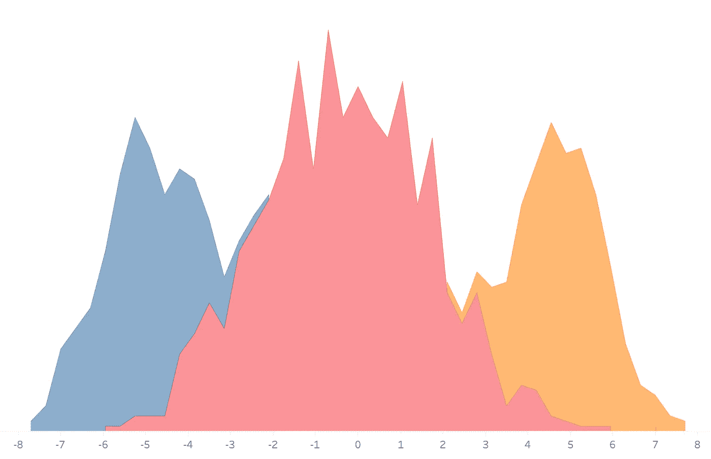

混合模型。使用 Tableau 创建。

期望最大化(EM)算法是一种统计机器学习方法，用于寻找具有未知潜在变量的模型的最大似然估计。我相信这句话对你们中的一些人来说是没有意义的。不要担心！本文旨在揭开 EM 算法的恐怖方程式和令人困惑的词汇的神秘面纱。不幸的是，没有适当的数学，人们就不能真正理解 EM 算法的本质。所以这就是我要做的。本文的每一部分都将包括一个**全数学**部分和一个**你需要知道的一切**部分。**完整数学**部分包括算法的完整推导，而**所有你需要知道的**部分总结了没有推导的基本细节。按照**全数学**部分，我会假设你熟悉概率论、统计理论和基础微积分。在**你需要知道的一切**部分仍会有一些数学知识，但不会那么复杂。

要理解算法，首先要理解我们要处理的数据。EM 算法处理来自多个聚类(即混合模型)的数据。每个分类都有数据来自该分类的概率，但是我们不知道这些概率。每个数据簇都有它的分布，这是我们知道的，但我们不知道分布参数。请参见下面泊松混合模型的示例。

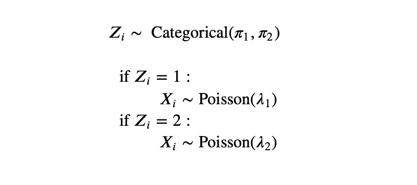

在本例中，有两个*集群。 *Zᵢ* 表示数据的簇 *Xᵢ* 。π表示来自某个集群的概率。*

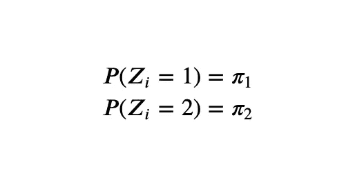

因此，所有π值的总和应该等于 1。对于本教程，我将假设这些参数值。

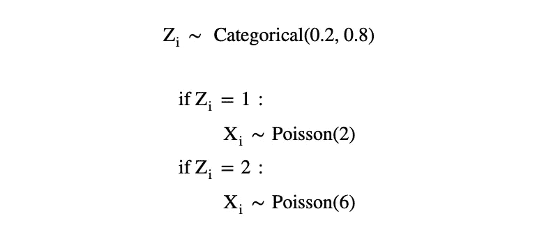

如果数据点来自第一个聚类，则它来自具有参数`λ = 2`的泊松分布，如果数据点来自第二个聚类，则它来自具有`λ = 6`的泊松分布。请记住，我们不知道这些参数值，并试图估计它们。

**EM 算法的目的是找到这个混合模型**的参数估计值。在上面的例子中，EM 算法会估计出 *π₁、π₂、λ₁和λ₂* 。 *π* 是聚类的概率， *λ* 是泊松分布的参数。因此，如果聚类的分布是高斯(正态)而不是泊松，EM 算法将估计 *μ* 和 *σ* 而不是 *λ。*让我把这个泊松 pdf 函数留在这里。请调整它以适合你自己想要的分布。

您可以更改它以适合您的发行版。

实际上，用户想要多少个集群就有多少个集群，每个集群的分布可以是我们想要的任何形式。我将再次提醒您，我们不知道任何参数值，也不知道每个数据点来自哪个集群。这种未知的聚类分配就是聚类被称为潜在变量的原因。EM 算法对于处理这种不可观察的变量非常有用。

由于 EM 算法是迭代的，我将使用θ来表示新的参数估计，使用θ⁰来表示先前的迭代估计。其他一些变量；n 表示样本总数，K 表示聚类总数。

您应该跳到第 **4 节。算法**直接进入揭秘部分，或者如果你正在寻找算法的非数学总结。

# 1.完全对数似然的期望

完全对数似然相当于数据的对数似然。我们使用术语“完全”是因为，在后面的章节中，将有另一个统计称为“*不完全对数似然性”*。对于本节，我将仅使用来互换使用“*完全对数似然*和“*对数似然*”**。**

## **全数学**

如果你对推导不感兴趣，跳到**你需要知道的一切**部分。

为了找到一些数据的分布参数，我们通常采用最大化该数据可能性的参数。EM 算法在这里应用相同的概念，试图最大化完全可能性。

完全可能性

我们可以将上面的公式展开如下，

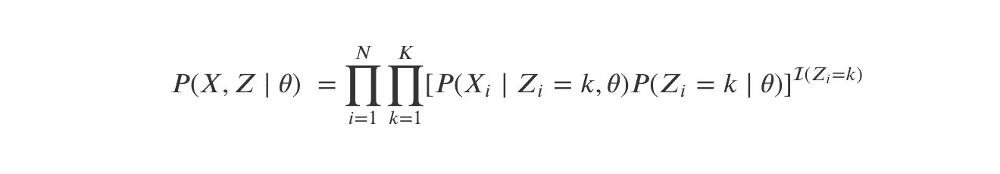

完全可能性

指数函数是一个指示函数，如果里面的条件为真，则返回 1，否则返回 0。为了简化后面的计算，我们希望这个指示函数不在指数中。让我们来看看可能性的对数。

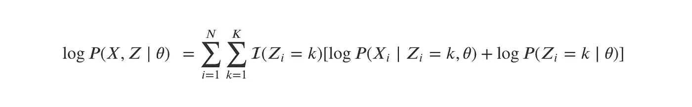

完全对数似然

这是最大化的一种更直接的形式。不幸的是，我们无法计算这个对数似然，因为我们不知道每个数据来自哪个集群。因此，我们不知道指标函数的输出和要使用的分布参数。这个问题的解决方案是使用对数似然的期望值，而不是实际的对数似然。让我们将对数似然的期望值定义如下:

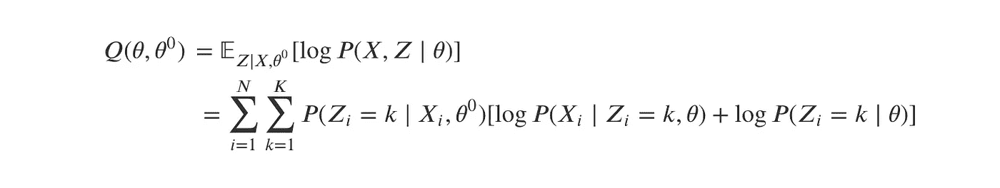

对数似然的期望

对数似然的期望用后验概率代替指示函数。我们将在后面的章节中计算后验概率的值。

对于我们上面的泊松例子，期望变成如下，

对数似然的泊松期望

## 你只需要知道

关于完全对数似然，你需要知道的只是我们想要找到使其最大化的参数。不幸的是，由于未知的聚类，很难计算完整的对数似然。为了解决这个问题，我们计算对数似然的期望值并最大化它，而不是实际的对数似然。

完全对数似然的期望被表示为 *Q(θ，θ⁰)* 。下面给出了 *Q(θ，θ⁰)* 的公式。

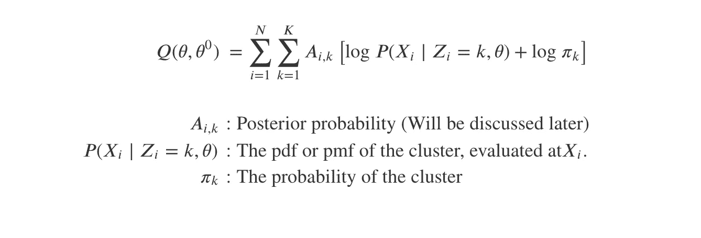

完全对数似然的期望

对于我们的泊松例子，这变成了，

对数似然的泊松期望

现在，这就是你需要知道的关于完全对数似然的**期望。**

# 2.后验概率

## 全数学

如果你对推导不感兴趣，跳到**你需要知道的一切**部分。

后验概率是给定数据点的值和当前迭代中的参数，从聚类中获得特定数据点的概率。这不要与π表示的概率相混淆。让我们来定义它们，

后验定义

如果你意识到我使用了条件概率定义来得到这个，这将会有所帮助。我们可以将这个表达式扩展为:

我不会深入我在这里应用的概率属性，但它是上面的精确条件概率定义。如果你注意到，分子是数据和聚类的似然性。我们在前面的章节中已经看到了这些概率。分母只是所有聚类可能性的总和。

对于泊松例子，后验概率变成，

泊松后验公式

注意，用于计算后验概率的参数是前一次迭代的参数。因此，在完全对数似然的期望中，后验概率将被视为常数。

## 你只需要知道

关于后验概率，你只需要知道，它是在给定当前数据和参数的情况下，获得一个聚类的概率。我们需要这个概率来计算完全对数似然的期望。值得庆幸的是，这并不太难找到，所以我只是给出了公式。

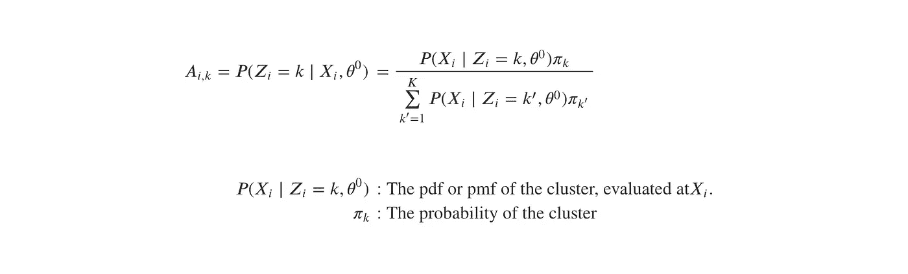

后验概率

这个公式很简单，因为我们已经知道了一切。分子是数据和聚类的似然性，而分母是相同数据和所有可能聚类的似然性之和。

泊松后验公式

在前面的例子中，我们只有两个可能的集群。因此，该示例的第一聚类的后验概率正好是第一聚类的似然性除以第一聚类的似然性和第二聚类的似然性之和。

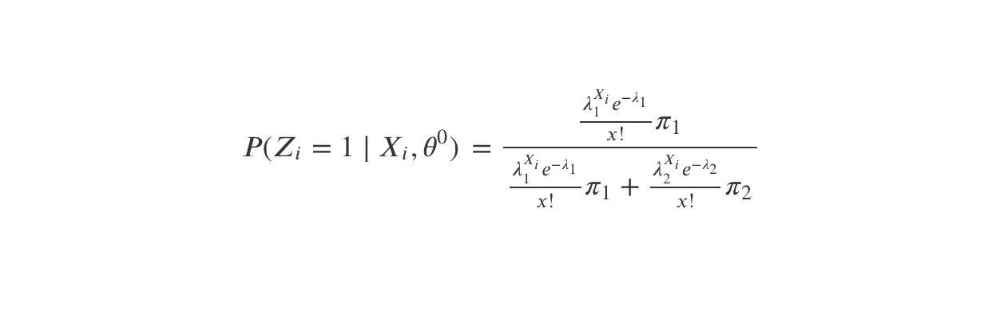

k = 1 时的泊松后验公式

我希望你能把这个例子推广到其他例子。

## Python 代码

以泊松混合为例，下面是一个计算后验概率的函数。

上面的函数返回列表的列表，其中每个内部列表表示一个聚类，内部列表的内容是后验概率。试着把这个 Python 代码和上面的*泊松后验公式*图片匹配一下。

# 3.最大化

## 全数学

如果你对推导不感兴趣，跳到**你需要知道的一切**部分。

最大化是指通过最大化完全对数似然的期望值来获得参数。我们通过找到期望值的导数并将其设置为零来实现这一点。让我们回到公式。

对数似然的泊松期望

我将使用这个符号来表示后验概率，以简化方程。

我们将从寻找最优π₁.开始因为我们只有两个集群，我们可以用 1 - π₁.来代替π₂现在让我们删除 *Q(θ，θ⁰)* 中不包含π₁.的所有项

我们被允许这样做，因为我们将要推导这个关于π₁.的方程这意味着所有其他不包含π₁的项都将变成 0，所以让我们把它们去掉，这样方程就更容易理解了。下一步是扩展内在西格玛。

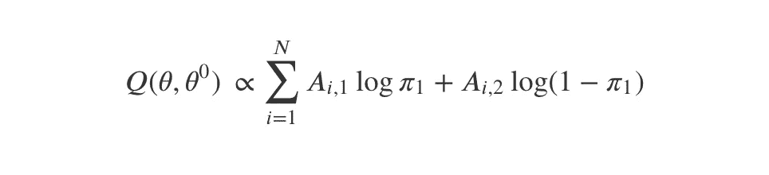

此时，求导就相对简单了。

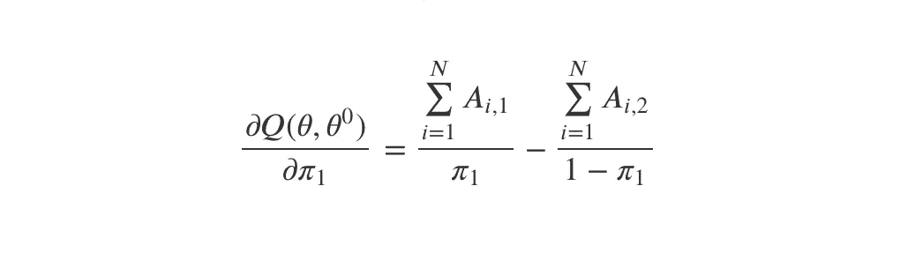

将导数设置为 0 将产生以下结果。

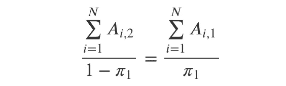

用一些简单的代数，解出π₁会让我们，

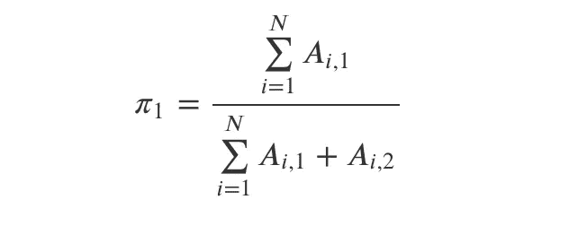

最佳配方

对这个结果的解释是，利用当前获得的后验概率，我们可以将π₁更新为这个方程的任何结果。

我不会为λ重复这个过程，因为它太长了。如果你有兴趣，请看我的计算[这里](https://drive.google.com/file/d/1a5mxg1RlGpyTMwsZGa6hn_DCHeTxO1xR/view?usp=sharing)。或者，访问**您需要知道的全部信息**部分，仅获取最终估计值。

## 你只需要知道

关于最大化过程，你需要知道的是，为了获得参数估计，我们需要最大化完整的对数似然期望。让我们回到公式。

对数似然的泊松期望

最大化的方法是对每个参数取 *Q(θ，θ⁰)* 的导数，并将其设置为 0。请记住，在求导时，后验概率是常数，因为它是使用前一次迭代的估计值计算的。

我将向你们展示泊松例子的推导结果。

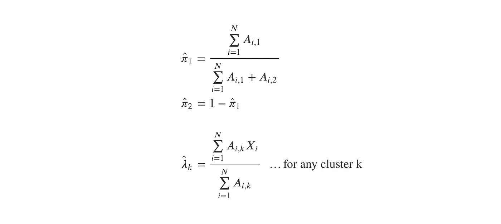

最佳配方

因此，为了获得每次迭代的新参数估计，我们需要计算这些方程。

## Python 代码

使用泊松混合的例子，下面是计算最佳参数估计的函数。

上面的函数分别返回π和λ估计值的两个列表。尝试将此 Python 代码与上面的*最佳公式*图片匹配。

# 4.算法

到目前为止，我们还没有了解到这篇文章的神秘之处。我知道一切可能还是很模糊。因此，让我们总结一下我们所知道的一切，并让算法发挥作用。

EM 算法的步骤:

1.  初始化随机参数值。
2.  导出完全对数似然的期望， *Q(θ，θ⁰).*
3.  计算后验概率。
4.  给定后验概率，通过对每个参数求微分 *Q(θ，θ⁰)* w.r.t 找到最优参数，设置导数为 0，求解参数。
5.  将当前参数更改为步骤 4 中获得的参数。

请注意，在步骤 5 中更改参数估计后，重新计算后验概率会产生不同的结果(见*泊松后验公式*图)。但是如果后验概率现在不同了，那么重新进行第 4 步肯定会产生不同的参数估计(见*最佳公式*图)。这就是 EM 算法的本质。让我们用英语重复一遍。EM 算法是，

1.  使用当前参数，计算后验概率。
2.  使用当前后验概率，更新参数。

我们一遍又一遍地重复这些步骤。这并不神秘，不是吗？当然，数学可能仍然很重，但算法的本质就是这两个小步骤。让我们试着把这个翻译成代码。

现在，不需要理解每个函数的内容，这个 python 代码应该能够突出 EM 算法的核心。它的核心是数学和复杂的，但算法很简单。

剩下的唯一未解决的难题是停止标准。既然我们已经了解了每个迭代中完成了什么，我们想知道什么时候停止迭代。下一节将解释这个停止标准。

# 5.不完全对数似然

在这一节中，我将介绍不完全对数似然的概念。不完全对数似然的概念类似于完全对数似然。我将不讨论数学细节，但本质上，不完全对数似然不关心数据聚类。它计算所有聚类的可能性，并将它们相加。而完全对数似然性仅取数据来源的聚类的似然性。

不完全对数似然

我要把这个公式翻译成 Python。

上面的函数返回不完全对数似然的值。

由于一些我不会探究的性质，不完全对数似然性将总是在每次迭代中增加。**当不完全对数似然的变化不再显著时，EM 算法迭代停止** *。*

# 5.摘要

让我们把一切都编码。

该函数的输出是最终的参数估计。

现在你可能想知道为什么我说 EM 算法是一种机器学习方法，而它显然是一种估计方法。我们一直在计算后验概率，我们可以用它来获得每个数据点的聚类。我们通过计算属于每个聚类的数据点的后验概率并将该类分配给具有最高概率的聚类来做到这一点。因此是一种无监督的机器学习方法。

上述参数`lambdas`和`probs`指的是来自 EM 算法的最终估计值。运行这个函数将返回一个 NumPy 数组的数据簇`X`。

# 6.恭喜

您已成功完成这篇文章。如果你设法理解并重现了算法，我会为你鼓掌。但如果不是，这是一个高级算法，通过更多的练习你会得到正确的答案。查看我在 GitHub 上的完整代码，了解如何在实际应用中使用我们的函数。如果你喜欢这篇文章，请考虑鼓掌并关注。请在评论中分享你的反馈和想法。感谢您的阅读！