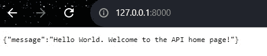
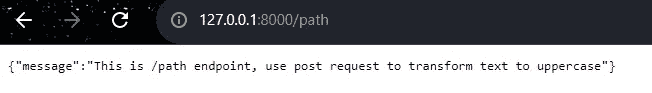
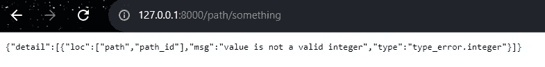
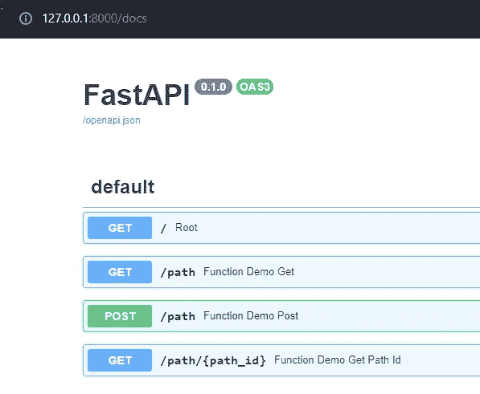
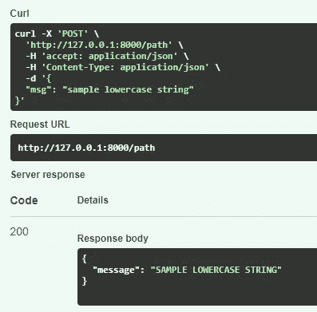
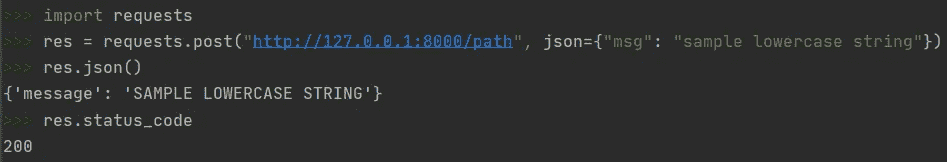

# 在 10 分钟内实现 FastAPI

> 原文：<https://towardsdatascience.com/implementing-fastapi-in-10-minutes-d161cdd7c075>

## 开发、测试和使用您的自定义 API


Levi Elizaga 在 [Unsplash](https://unsplash.com?utm_source=medium&utm_medium=referral) 上拍摄的照片

***API(应用编程接口)*** 是计算机程序之间的连接。通俗地说，我们可以把 API 想象成一个 Python 函数，用户“调用一个 API”就可以执行一个任务或者得到一定的结果。一个流行的例子是把 API 比作一个服务员，你告诉服务员你从菜单中选择的订单，服务员将把它传达给厨房(一个“系统”)，厨房准备你的订单，服务员将把你完成的订单返回给你。

API 是有价值的，可以货币化——现在几乎所有东西都是 API！想知道天气预报，网站界面调用一个[天气 API](https://openweathermap.org/api) 。如果你想知道从一个地方到另一个地方的最短路线，谷歌地图网站/移动应用程序调用[谷歌方向服务 API](https://developers.google.com/maps/documentation/javascript/directions) 。你明白了。

可以使用多种框架在 Python 中实现 API，其中一些框架包括 Django、Flask 或 FastAPI。本文是关于如何使用 FastAPI 框架开发、测试和使用自定义 API 的分步指南。如果您已经对 API 有所了解，可以跳过前两节。

***更新*** *:本文是系列文章的一部分。查看其他“10 分钟内”话题* [*此处*](https://medium.com/@kayjanwong/list/in-10-minutes-eeaa9aa67055) *！*

# 目录

1.  [HTTP 方法和状态代码](https://medium.com/p/d161cdd7c075/#5f2e)
2.  [为什么是 FastAPI？](https://medium.com/p/d161cdd7c075/#8cb2)
3.  [FastAPI 设置](https://medium.com/p/d161cdd7c075/#6086)
4.  [用 FastAPI 编写 API](https://medium.com/p/d161cdd7c075/#5232)
5.  [测试 API](https://medium.com/p/d161cdd7c075/#1966)
6.  [使用 API](https://medium.com/p/d161cdd7c075/#df38)

# HTTP 方法和状态代码

重要的是要知道 API 可以执行什么样的任务，并为正确的任务选择正确的 HTTP 方法。回到服务员的例子，HTTP 方法将菜单上的项目比作“开胃菜”、“主菜”和“甜点”是菜单的一部分，但是像“Bedsheet”这样的东西不属于菜单，也不能订购。

有 5 种流行的 HTTP 方法，即`GET`、`POST`、`PUT`、`PATCH`和`DELETE`，可以用来管理资源的状态。

*   `GET`:检索现有资源(只读)
*   `POST`:创建新资源
*   `PUT`:更新现有资源
*   `PATCH`:部分更新现有资源
*   `DELETE`:删除资源

用 ***HTTP 方法*** 处理一个请求后，响应中会包含一个 ***HTTP 状态码*** 。一般来说，状态代码的含义是这样的，

*   `2xx`:操作成功
*   `3xx`:重定向
*   `4xx`:客户端错误
*   `5xx`:服务器错误

状态代码的完整列表可在处找到[。查看状态代码以确保操作成功执行是很重要的，如果有错误，则进行调试，并将适当的结果返回给用户。](https://en.wikipedia.org/wiki/List_of_HTTP_status_codes)

# 为什么选择 FastAPI？

FastAPI 于 2019 年推出，晚于 Django (2006)和 Flask (2011)等流行框架，并因其快速和高性能而受到欢迎。与 Flask 框架相比，FastAPI 有以下优点:

*   Asyncio for concurrency:用关键字`async`和`await`调用
*   用于数据验证的 Pydantic:在运行时实施模式并检测数据类型
*   用于自动化文档生成的 Swagger UI:支持使用扩展名 ***/docs*** 测试 API 端点。文档也有助于理解。Swagger UI 的一个替代品是 Redoc，可以用扩展 ***/redoc*** 访问。
*   安全和认证功能

# FastAPI 设置

FastAPI 很容易设置，只需在终端上运行以下命令。

```
**$** pip install fastapi
**$** pip install uvicorn[standard]
```

事不宜迟，让我们开始编写一些 API 吧！

# 用 FastAPI 编写 API

实现 API 遵循相同的整体结构，

1.  定义一个 API 对象，如`app = FastAPI()`
2.  使用 Pydantic 定义数据类型
3.  将 HTTP 方法和路径映射到相关的 Python 函数。前面提到的不同的 HTTP 方法可以用`@app.get()`、`@app.post()`、`@app.put()`等来调用。分别与可插入的路径耦合为`@app.get("/path")`
4.  启动 API 应用程序，在命令行上运行`uvicorn main:app --reload`，其中`main`指的是 Python 文件名，`app`指的是在步骤 1 中创建的 API 对象

下面是 FastAPI 实现演示的代码片段，

以下部分将引用上面的代码片段，请确保您理解该代码片段！

# 测试 API

成功启动 API 应用程序后，控制台日志将打印托管 API 的 URL。通常在`http://127.0.0.1:8000`举办。主页遵循主`"/"`路径中定义的内容(第 14–16 行)。



图 API 主页——作者图片

我们可以用定义的路径测试各种端点。在本例中，我正在测试`/path`扩展(第 19–21 行)。注意，输入路径扩展名会执行一个`GET`请求。



图 API 的扩展/路径——作者图片

类似地，我创建了一个`/path/{path_id}`扩展(第 29–31 行),其中`path_id`是一个`int`值。如果我输入一个非整数值，将会返回一条错误消息，指出我的类型无效。



图 API 端点的类型检查——作者图片

上面的例子都是在执行一个`GET`请求，要执行一个`POST`请求，我们可以通过进入 ***/docs*** 路径扩展并测试一个示例`POST`请求来使用 Swagger UI。



图 Swagger UI 主页——作者图片

或者，我们可以使用一个`curl`命令来执行一个`POST`请求。Swagger UI 提供了确切的`curl`命令来运行，



图 5:在 Swagger UI 上测试 POST 请求——作者图片

恭喜您，您现在已经开发并测试了您自己的自定义 API！我们现在来看看如何在 Python 脚本中实现它，因为 API 的最终用户可能并不总是使用 curl 命令或 Swagger UI。

# 使用 API

要在 Python 脚本中访问和使用您的 API，请使用`requests`库，即`requests.get()`或`requests.post()`分别用于`GET`和`POST`方法。输入参数包括表示 API 端点的`url`和表示输入字典的`json`。

结果存储在`res`对象中，包含`res.json()`中的输出和`res.status_code`中的 HTTP 状态代码。



图 6:在 Python 脚本中使用 API 作者图片

希望本文介绍了什么是 API，以及如何开发、测试和使用 FastAPI 框架。展望未来，探索如何将您的 API 与后端数据库连接起来，或者甚至在线托管您的 API，以便更多用户可以使用它(不仅仅是在您的本地笔记本电脑上！).

**感谢您的阅读！如果你喜欢这篇文章，请随意分享。**

# 相关链接

`fastapi`文档:[https://fastapi.tiangolo.com/](https://fastapi.tiangolo.com/)

`fastapi`官方 GitHub:[https://github.com/tiangolo/fastapi](https://github.com/tiangolo/fastapi)