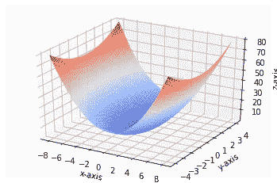
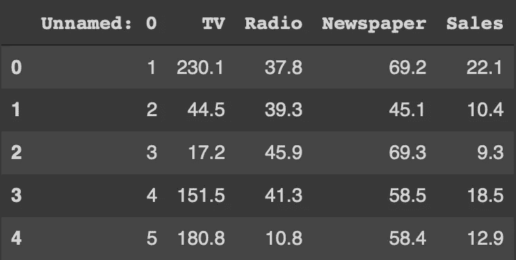
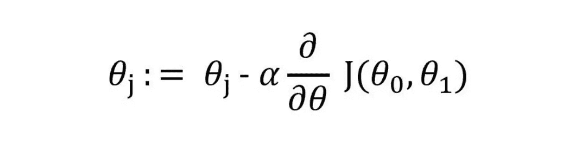
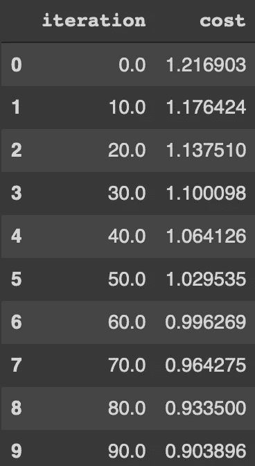
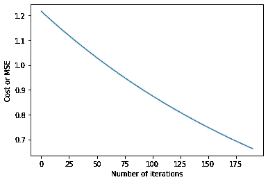
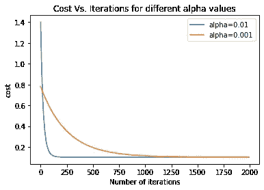

# 从头开始在 Python 中实现梯度下降

> 原文：<https://towardsdatascience.com/implementing-gradient-descent-in-python-from-scratch-760a8556c31f>

## 从头开始用代码实现梯度下降算法，了解它的工作原理。



**作者图片(使用 python 中的 matplotlib 创建)**

机器学习模型可能有几个特征，但是一些特征可能比其他特征对输出有更高的影响。例如，如果模型预测公寓价格，公寓的位置对输出的影响可能比公寓建筑的层数更大。因此，我们提出了权重的概念。每个特征都与一个权重(一个数字)相关联，即特征对输出的影响越大，与之相关联的权重就越大。但是，如何决定应该给每个特征分配多大的权重呢？这就是梯度下降的用武之地。

梯度下降是一种优化算法，可以帮助您找到模型的最佳权重。它通过尝试各种权重并找到最适合模型的权重来实现，即最小化成本函数。成本函数可以定义为实际产量和预测产量之间的差异。因此，成本函数越小，模型的预测输出就越接近实际输出。成本函数在数学上可以定义为:

```
**𝑦=𝛽+θnXn,** 
where x is the parameters(can go from 1 to n), 𝛽 is the             bias and θ is the weight
```

而另一方面，梯度下降的学习率被表示为 **α。**学习率是每个梯度所走的步的大小。虽然较大的学习率可能会给我们的 **𝛽** 和 **θ** 的优化值较差，但学习率也可能太小，这需要大量增加获得收敛点(𝛽和θ的最佳值点)所需的迭代次数。该算法给出α **、** 𝛽和θ的值作为输出。

如果你想更详细的了解梯度下降和代价函数，我推荐[这篇文章](/machine-leaning-cost-function-and-gradient-descend-75821535b2ef)。

现在我们知道了什么是梯度下降以及它是如何工作的，让我们开始用 python 实现它。但是，在我们开始相同的代码逻辑之前，让我们先来看看我们将要使用的数据和为了我们的目的将要导入的库。

对于这个实现，我们将使用广告数据集。这是一个数据集，它给出了不同产品在电视、广播和报纸上销售后的总销售额。使用我们的算法，我们可以找出哪种媒体对我们的销售表现最好，并相应地为所有媒体分配权重。该数据集可从以下链接下载:

> [https://www.kaggle.com/sazid28/advertising.csv](https://www.kaggle.com/sazid28/advertising.csv)

转到导入，我们将使用库 pandas 和 numpy，它们将用于读取数据以及对数据执行数学函数。我们还将使用 matplotlib 和 seaborn 来绘制我们的发现，并以图形方式解释结果。一旦我们导入了库，我们将使用 pandas 来读取我们的数据集，并打印前 5 列以确保数据被正确读取。一旦我们读取了数据，我们将为我们的梯度下降曲线设置 X & Y 变量。

```
import pandas as pdimport numpy as npimport matplotlib.pyplot as pltimport seaborn as sndf=pd.read_csv('Advertising.csv')df.head()
```

输出:



按作者分类的图像(数据集的前 5 行)

x 代表电视、广播和报纸，而 Y 代表我们的销售。由于所有这些销售可能在不同的规模，然后我们正常化我们的 X & Y 变量。

```
X=df[[‘TV’,’Radio’,’Newspaper’]]Y=df[‘Sales’]Y=np.array((Y-Y.mean())/Y.std())X=X.apply(lambda rec:(rec-rec.mean())/rec.std(),axis=0)
```

一旦我们有了一个标准化的数据集，我们就可以开始定义我们的算法。要实现梯度下降算法，我们需要遵循 4 个步骤:

1.  随机初始化偏差和权重θ
2.  给定偏差和权重，计算 Y 的预测值
3.  根据 Y 的预测值和实际值计算成本函数
4.  计算梯度和权重

首先，我们将为偏差和权重取一个随机值，它可能实际上接近最佳偏差和权重，也可能离得很远。

```
import randomdef initialize(dim):b=random.random()theta=np.random.rand(dim)return b,thetab,theta=initialize(3)print(“Bias: “,b,”Weights: “,theta)
```

输出:

```
Bias: 0.4439513186463464 Weights: [0.92396489 0.05155633 0.06354297]
```

这里，我们创建了一个名为 initialise 的函数，它为我们提供了一些偏差和权重的随机值。我们使用随机库来给出符合我们需要的随机数。下一步是使用这些权重和偏差计算输出(Y)。

```
def predict_Y(b,theta,X):return b + np.dot(X,theta)Y_hat=predict_Y(b,theta,X)Y_hat[0:10]
```

输出:

```
array([ 3.53610908, 0.53826004, 1.4045012 , 2.27511933, 2.25046604, 1.6023777 , -0.36009639, -0.37804669, -2.20360351, 0.69993066])
```

Y_hat 是预测的输出值，而 Y 将是实际值。这两者之间的差异将给出我们的成本函数。这将在我们下一个函数中计算。

```
import mathdef get_cost(Y,Y_hat):Y_resd=Y-Y_hatreturn np.sum(np.dot(Y_resd.T,Y_resd))/len(Y-Y_resd)Y_hat=predict_Y(b,theta,X)get_cost(Y,Y_hat)
```

输出:

```
0.5253558445651124
```

这是我们的成本函数，我们的目的是尽可能地减少这个，以获得最准确的预测。为了获得更新的偏差和权重，我们使用梯度下降公式:



图片作者(更新的 theta 公式)，

传递给该函数的参数有

1.  x，y:输入和输出变量
2.  y_hat:带有当前偏差和权重的预测值
3.  b_0，θ_ 0:电流偏置和权重
4.  学习率:调整更新步长的学习率

```
def update_theta(x,y,y_hat,b_0,theta_o,learning_rate):db=(np.sum(y_hat-y)*2)/len(y)dw=(np.dot((y_hat-y),x)*2)/len(y)b_1=b_0-learning_rate*dbtheta_1=theta_o-learning_rate*dwreturn b_1,theta_1print("After initialization -Bias: ",b,"theta: ",theta)Y_hat=predict_Y(b,theta,X)b,theta=update_theta(X,Y,Y_hat,b,theta,0.01)print("After first update -Bias: ",b,"theta: ",theta)get_cost(Y,Y_hat)
```

输出:

```
After initialization -Bias:  0.4733071000028529 theta:  [0.56745402 0.43024717 0.0722811 ]
After first update -Bias:  0.46384095800279584 theta:  [0.57117721 0.43202382 0.07171437]0.37245638135702513
```

如我们所见，新的偏差和权重降低了成本函数。目前我们将学习率定为 0.001，我们也将尝试 0.01，看看它是否能成为更好、更优的学习率。

现在我们已经创建了所有需要的函数，我们可以创建一个主梯度下降函数，它运行它们一个特定的迭代次数，并为我们找到最佳的偏差和权重。对于这个实现，我们运行这个函数 200 次迭代。

```
def run_gradient_descent(X,Y,alpha,num_iterations):b,theta=initialize(X.shape[1])iter_num=0gd_iterations_df=pd.DataFrame(columns=[‘iteration’,’cost’])result_idx=0for each_iter in range(num_iterations):Y_hat=predict_Y(b,theta,X)this_cost=get_cost(Y,Y_hat)prev_b=bprev_theta=thetab,theta=update_theta(X,Y,Y_hat,prev_b,prev_theta,alpha)if(iter_num%10==0):gd_iterations_df.loc[result_idx]=[iter_num,this_cost]result_idx=result_idx+1iter_num +=1print(“Final Estimate of b and theta : “,b,theta)return gd_iterations_df,b,thetagd_iterations_df,b,theta=run_gradient_descent(X,Y,alpha=0.001,num_iterations=200)
```

输出:

```
Final Estimate of b and theta : 0.31516040347417285 [0.39731522 0.31571747 0.61334115]
```

theta 是 3 个数字的列表，因为我们有 3 个输入，电视，广播和报纸。如果我们打印每次迭代的成本函数，我们可以看到成本函数的减少。我们也可以绘制迭代的成本函数来查看结果。

```
gd_iterations_df[0:10]
```

输出:



按作者分类的图像(迭代的输出)

```
%matplotlib inlineplt.plot(gd_iterations_df[‘iteration’],gd_iterations_df[‘cost’])plt.xlabel(“Number of iterations”)plt.ylabel(“Cost or MSE”)
```

输出:



按作者分类的图像(成本函数与迭代)

正如我们可以看到的，成本函数随着迭代次数的增加而减少，但我们仍然没有达到收敛。现在，让我们尝试使用α=0.01 进行 2000 次迭代，并将其与α=0.001 进行比较，找出哪个学习率对于该数据集更好。

```
alpha_df_1,b,theta=run_gradient_descent(X,Y,alpha=0.01,num_iterations=2000)alpha_df_2,b,theta=run_gradient_descent(X,Y,alpha=0.001,num_iterations=2000)plt.plot(alpha_df_1[‘iteration’],alpha_df_1[‘cost’],label=”alpha=0.01")plt.plot(alpha_df_2[‘iteration’],alpha_df_2[‘cost’],label=”alpha=0.001")plt.legend()plt.ylabel(‘cost’)plt.xlabel(‘Number of iterations’)plt.title(‘Cost Vs. Iterations for different alpha values’)
```

输出:



作者图片

可以看出，0.01 是更优的学习速率，因为它比 0.001 收敛得更快。0.01 在 100 大关附近收敛，而 0.001 需要 1000 次迭代才能达到收敛。

因此，我们成功地在 python 上构建了梯度下降算法。记住，学习率的最佳值对于每个数据集都是不同的。

希望你今天学到了新的有意义的东西。

谢谢你。