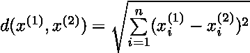
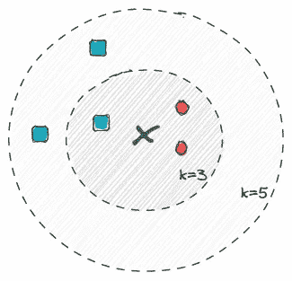
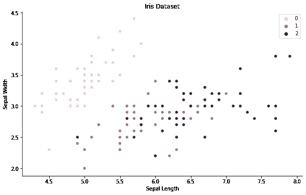

# 从零开始实施 KNN

> 原文：<https://towardsdatascience.com/implementing-knn-from-scratch-70c800f6f64b>

## 从头做起

# 从零开始实施 KNN

## 用 Python 和 NumPy 分解一个基本的机器学习算法

乔恩·泰森在 [Unsplash](https://unsplash.com?utm_source=medium&utm_medium=referral) 上的照片

深入理解和欣赏机器学习算法的内部工作原理的最有效方法之一是从头开始实现它。

从头开始实现它迫使我们不仅要将算法分解成主要的计算步骤，还要理解数学描述。我们还获得了如何使用参数的宝贵见解。

在接下来的部分，我们将从头开始实现一个经典的机器学习算法: *K 近邻。*我们将使用 Python 和 NumPy 逐步实现它。

但是在讨论一些实现细节之前，我们需要打下基础，对算法有一个大致的了解。

# 概述

由[于 1951 年](https://en.wikipedia.org/wiki/K-nearest_neighbors_algorithm)首次开发的 K 近邻(KNN)是一种非参数学习算法。KNN 通常被认为是简单的，因为底层模型基本上不存在，仅仅由存储的训练数据集定义。

KNN 很大程度上依赖于距离的概念，通过计算新观察值与训练数据集的每一行之间的欧几里德距离，将新观察值与存储的训练数据进行比较。

在检索和排序距离之后，可以选择 k 个最近邻居*(索引)*。超参数 *k* 指定相关邻域的大小，必须手动调整。

> k-最近邻可用于分类和回归任务。

分别返回类别成员的多个投票结果或 k 个最近值的平均值。

我们可以将算法的**主要步骤**描述如下:

1.  计算新观测值与训练数据集的每一行之间的距离。
2.  对距离进行升序排序*(从最小到最大)*并检索 k 个最近邻的索引。
3.  获取相应的类标签并返回最常用的标签。
4.  对每个新观察重复步骤 1-3。

在下一节中，我们将在一个类中实现主要步骤。整体结构可以通过下面的*骨架类*来描述，它将指导我们完成接下来的部分。

# 从头开始实施

在我们直接进入实际算法之前，我们需要打下一些基础——定义超参数 *k* 并拟合训练数据集，或者换句话说，存储完整的训练数据。这将为我们即将到来的计算做好准备。

现在，我们已经准备好继续学习那些更有趣的东西了。

## 计算距离

我们已经存储了完整的训练数据集，允许我们计算新观察和训练数据的每一行之间的距离。

为了计算距离，我们定义了一个辅助函数，返回每对行的欧几里德距离。

*欧几里德距离*就是两行之间的平方差的平方根*(向量)* —或者更正式地表述为以下等式:

helper 函数的实现相对简单，因为我们可以依靠 NumPy 来处理向量操作。

一旦定义好了，我们就可以调用 helper 函数，并在一个简单的列表中存储新观察和完整训练数据之间的所有距离。

## 获取 k-最近索引

接下来的步骤也很简单。我们需要按照升序对距离列表进行排序*(从最小到最大)*，允许我们只选择 k 个最近的邻居。

借助下图，我们可以想到由 *k* 定义的选择半径:

k 选择半径的示例说明[图片由作者提供]

> **注意**:k 值是一个重要的参数，因为大的 k 值扩大了半径，允许更好的泛化。另一方面，较小的 k 值提供了更大的灵活性，但更容易受到噪声的影响。我们可以使用可视化技术，如[“肘法”](https://en.wikipedia.org/wiki/Elbow_method_(clustering))来调整超参数。

我们可以使用内置的 NumPy 函数`numpy.argsort()`和 Python 切片符号对索引进行排序和选择。

## 返回最常用的标签

现在，我们只剩下一件事要做了—我们需要检索相应的类标签，并返回最常见的标签作为我们的预测。

基于 k-最近邻的索引，我们可以从我们的训练数据中选择相关联的标签，并将它们存储在列表中。

利用两个不同的 NumPy 函数——`numpy.bincount()`和`numpy.argmax()`——我们可以选择最常见的标签作为返回值。

## 预测并把它们放在一起

到现在为止，我们已经完成了大部分艰苦的工作。

我们需要做的最后一件事是对测试数据集中的每一行重复这些步骤，这就完成了我们的实现，并把它们放在一起。

# 测试分类器

完成我们的实现后，我们需要用真实的数据集来测试它。

为此，我们将使用虹膜数据集，该数据集由 150 个样本组成，具有 4 个不同的特征*(萼片长度、萼片宽度、花瓣长度、花瓣宽度)*。我们可以通过绘制前两个特征来可视化数据。

用`k=3`实例化我们的分类器，用`n_splits=5`进行交叉验证，我们得到了大约 96%的准确率——对于这样一个简单的算法来说，这绝对是不错的。

> **注意**:由于算法依赖于距离，如果数据包含不同的物理单位或位于非常不同的尺度上，归一化作为预处理步骤可能是必要的。

# 结论

在本文中，我们从头开始一步一步地实现了 K 近邻。我们了解了根据距离对新观测值进行分类所需的主要计算步骤。

虽然 KNN 是一个简单明了的算法，但从头开始实现它可以让我们获得更深入的理解。当算法应用于不同的环境时，例如缺失值的插补，这可能证明是特别有用的。

你可以在我的 GitHub 上找到[的完整代码。](https://github.com/marvinlanhenke/DataScience/tree/main/MachineLearningFromScratch)

[马文·兰亨克](https://medium.com/@marvinlanhenke?source=post_page-----70c800f6f64b--------------------------------)

## 从零开始的 ML 算法

[View list](https://medium.com/@marvinlanhenke/list/ml-algorithms-from-scratch-7621d01922ad?source=post_page-----70c800f6f64b--------------------------------)6 stories

> 感谢您的阅读！确保保持联系&在 [Medium](https://medium.com/@marvinlanhenke) 、 [Kaggle](https://www.kaggle.com/mlanhenke) 上关注我，或者在 [LinkedIn](https://www.linkedin.com/in/marvin-lanhenke-11b902211/) 上说声“嗨”

*喜欢这篇文章吗？成为* [*中等会员*](https://medium.com/@marvinlanhenke/membership) *继续无限学习。如果你使用下面的链接，我会收到你的一部分会员费，不需要你额外付费。*

 