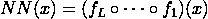
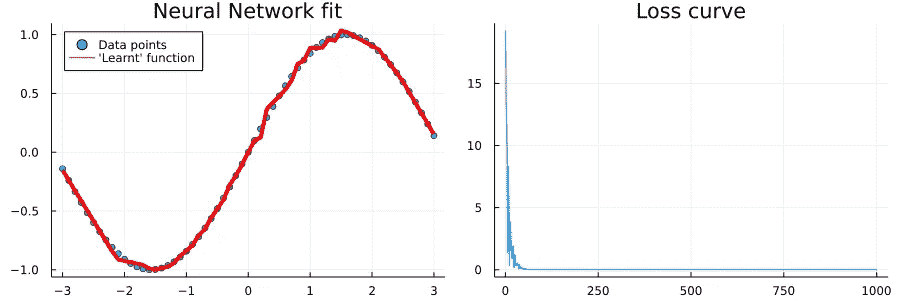

# 在 16 行 raw Julia 中实现神经网络

> 原文：<https://towardsdatascience.com/implementing-neural-networks-in-16-lines-of-raw-julia-aaa9512f007>

## 再用一些来训练它

[阿丽娜·格鲁布尼亚](https://unsplash.com/@alinnnaaaa?utm_source=unsplash&utm_medium=referral&utm_content=creditCopyText)在 [Unsplash](https://unsplash.com/s/photos/neural-network?utm_source=unsplash&utm_medium=referral&utm_content=creditCopyText) 上的照片

在构建神经网络和深度学习模型时，Tensorflow 和 PyTorch 是事实上的标准。虽然日常模型可以快速实现，但定制算法有时会导致代码看起来非常冗长。

这在一定程度上是由于 Tensorflow 和 PyTorch 都只是将 Python 作为其低级 API 的“前端”。另一方面，Julia 承诺用单一语言实现端到端的可区分机器学习。这无疑给更干净的代码库带来了希望！

因此，在准备 Julia 的介绍性演讲时，我试图用尽可能少的代码实现一个简单的前馈神经网络。如果没有空行，代码甚至可以减少到 14 行。然而，这会大大降低可读性。结果如下:

让我们一步一步地检查每个组件。如果你不熟悉前馈神经网络的内部结构，你可能会发现这些[维基百科参考文献](https://en.wikipedia.org/wiki/Feedforward_neural_network#References)很有用。

# 将前馈层编写为 Julia 结构

这是前馈层的标准设置。我们需要一个权重矩阵， **W** ，一个偏置向量， **b** ，以及一个**激活**函数。接下来，我们定义前馈层的前馈通道:

Julia 允许我们通过实例化的结构调用函数。在某种程度上，这使得层和网络实例的后续使用更加优雅。

和**标识**激活函数的实现应该是不言自明的。

# 将层聚集到全前馈神经网络中

网络本身只不过是其各个层的集合:

我们在构造函数中使用一个`Vararg`参数来允许任意数量的层。虽然我们可以在构造函数调用中只使用一个`Vector`，但是这种方法为我们节省了两个括号:)。

最后，我们要定义全局前馈通路。请记住，这可以表示为所有层的功能组合:

(图片由作者提供)

这里， **f** 表示总共 **L** 个前馈层的层函数。我们可以在 Julia 中这样写:

由于我们的函数组合是一个关联操作，我们可以使用`reduce()`函数。这使得我们可以在 Julia 中把这个关键元素变成另一个俏皮话。

如果你仔细观察，你会注意到我们在`reduce()`期间颠倒了`layer::Vector{Layer}`的顺序。虽然从**从左到右**推理网络拓扑更容易，但是合成操作本身是从**从右到左**执行的。

此外，请注意，如果我们想要优化网络，我们不能预先计算这个组成。让我们实际这样做，以便验证我们的实现是否如预期的那样工作。

# 在一个玩具例子上训练我们的 Julia 神经网络

由于梯度计算和优化器实现将是一个更大的任务，我们将使用两个 Julia 库来帮助完成这一步。对于玩具数据集，让我们在`[-3.0,3.0]`中的插值线上使用正弦函数:

总之，上面的代码片段执行以下步骤:

1.  创建玩具数据并定义损失函数
2.  实例化神经网络
3.  从网络实例中提取目标参数(网络权重)
4.  训练模型(即优化其参数)

# 检查输出

最后，让我们验证我们迄今所做的一切确实是正确的。如果一切顺利，我们的模型应该已经学会近似正弦函数。

这会产生以下情节:

*输出证实了我们的实现确实是正确的。我们可以进一步利用这个例子，用 Julia 以紧凑的方式实现例如* [*正则化*](/regularization-an-important-concept-in-machine-learning-5891628907ea) *。(图片由作者提供)*

# 太好了！现在我能放下 Tensorflow 和 PyTorch 吗？

肯定看情况！一方面，Julia 是一种以高效方式编写快速机器学习算法的优秀语言。另一方面，Julia 还是一门比较年轻的语言。就我个人而言，我还不会在任何非个人的商业产品中使用朱莉娅。

以下两个我亲身经历或在网上讨论中看到的问题仍然阻止我向我的客户推荐 Julia:

[当然，这个论点只有在涉及到可微分的机器学习模型时才有效。](https://github.com/FluxML/Zygote.jl/issues/796)

对于 JIT 编译来说，可部署性是具有挑战性的——一般来说，Julia 提供了成功部署模型甚至复杂应用程序所需的所有功能。然而，JIT 编译器的预热时间使得很难有效地这样做。

每当您开始一个新的 Julia 会话时，您基本上必须等待一两分钟，直到您的代码可以使用为止。如果您需要您的应用程序快速伸缩以适应突然的使用高峰，这可能是一个令人望而却步的问题。

然而，对于做研究或创建新算法的原型来说，Julia 是一种很棒的语言。一旦你的 Julia 神经网络或相关模型表现良好，你可以通过 [ONNX](https://github.com/FluxML/ONNX.jl) 轻松将其转移到 PyTorch 或 Tensorflow。从那里，您可以使用常用的、经过验证的工具集来部署它。

如果你愿意尝试，并且能处理偶尔的怪癖，你绝对应该给朱莉娅一个机会。

*原载于 2022 年 2 月 28 日 https://sarem-seitz.com*<https://sarem-seitz.com/blog/implementing-neural-networks-in-16-lines-of-raw-julia/>**。**