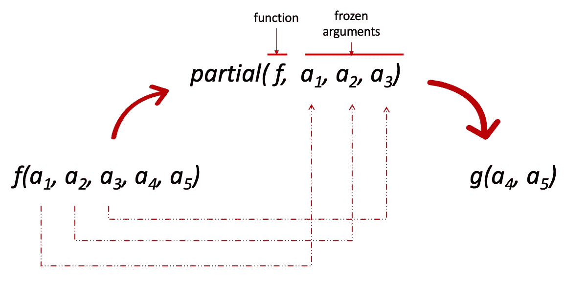

# 用 Python 从头开始实现管道机制

> 原文：<https://towardsdatascience.com/implementing-piping-mechanisms-from-scratch-with-python-802f13430140>

## 总是有一种用 Python 重现一些迷人语法的驱动力。管道是一个有趣的例子。


由 [Towfiqu barbhuiya](https://unsplash.com/@towfiqu999999) 在 [Unsplash](https://unsplash.com/) 上拍摄的照片

在之前的教程中，我们看到了如何使用 [Dunder 方法](https://medium.com/@tarek.samaali.92/dancing-with-python-dunder-methods-b5d89172b622)实现高级行为，以及 functools 模块提供的[分部方法如何利用参数多样性。](https://betterprogramming.pub/itertools-functools-two-python-lone-soldiers-d2ee1f0c7460)

我感兴趣的是使用这两个 Python 支柱来实现一个类似于 [PIPEY](https://pypi.org/project/pipey/) 的行为，即构建一个管道机制，该机制将对一段数据实现一系列连续的操作，如下所示:

```
pipe | operation1 >> operation2 >> operation3 >> ..  >> operationN
```

这个管道是可调用的，它将数据作为输入。

为此，我们将:

*   首先，构建一个基本的`Partial`可定制类，它将充当`functools.partial`模块。
*   给`Partial`级注入更多的能力。
*   通过一个`Pipe`类链接起来。

# 实验

正如你已经知道的，在`functools`中提供的`partial`方法用来冻结一个函数的一部分参数，然后给出一个新的函数。



作者图片

`partial`模块大致有如下实现:

让我们在官方文档中提到的同一个例子上测试它:

```
>>> basetwo = Partial(int, base=2)
>>> basetwo('1001')
... 9
```

这个`Partial`类将作为下一部分的构建模块。

为了模拟算术行为，能够使用反射右移`( >> )`并且能够使用可调用的管道，我们必须实现两个特殊的方法:`__rshift__`和`__call__`。让我先给你演示一下是怎么做的，然后再解释:

在实例初始化方面，与第一个基本`Partial`实现的区别在于属性的性质。我们需要构造一种累加器，在右移另一个`Partial`实例时从中受益。

请注意`__rshift__`方法是如何编写的，它总结起来就是将`other`的部分信息(函数、参数和关键字参数)附加到第一个信息上，从而跟踪管道的定位和执行顺序。一旦建立了管道，可调用的部分链从左到右启动计算。第一个可调用函数计算结果，该结果又成为下一个函数的输入。

让我们举个例子:

```
>>> first_pipeline = Partial(pow,2) >> Partial(pow,3) >> Partial(pow, 5) 
>>>
>>> first_pipeline(4)
... 1152921504606846976
>>> ((4 ** 2) ** 3 ) ** 5 
... 1152921504606846976
```

你可以停下来一会儿，惊叹于语法的美丽和结果的可信程度。

然而，我们当然不希望每次在管道中添加内容时都要明显地调用 Partial。

让我们写下我们需要的调整过的幺正函数。让我们定义一个`power`函数和一个`add`函数:

```
power = lambda x: Partial(lambda x_, n: pow(x_, n), x)
add = lambda x: Partial(lambda x_, n: x_ + n, x)
```

乍一看并不十分优雅，但让我们深入研究一下:
在幂的例子中，部分变量冻结了`x`变量，这样我们就能够改变幂项。

`Partial(lambda x_, n: pow(x_, n), x)`冻结 lambda 函数的第一个参数`x_`。
因为`x`是一个变量，它可以表示输入或者先前调用的结果，所以将这个`Partial`包装到另一个`lambda`函数中是有意义的。

```
>>> power = lambda x: Partial(lambda x_, n: pow(x_, n), x)
>>> add = lambda x: Partial(lambda x_, n: x_ + n, x)
>>> element = power(2) >> add(4) >> power(2) >> add(2)
>>> element(16)
>>> 67602
```

快速检查:

```
>>> ((((16 ** 2) + 4 ) ** 2 ) + 2)
>>> 67602
```

非常管用！

投资更多优雅如何？让我们把它们组装成一个`Pipe`类:

有了我们的`Pipe`事情变得更有意义:

```
>>> element = Pipe() | power(2) >> add(4) >> power(2) >> add(2)
>>> element 
... <__main__.Pipe at 0x7f869c3606a0>
>>> element(16)
... 67602
```

`element`不再是一个`Partial`实例，而是一个`Pipe`实例，它基本上提供了一种更高级的制作管道的方法。通常，Python 会抛出一个`TypeError`来警告你一种类型的冲突。但是因为我们在`Partial`类中指出了它应该如何处理两个`Partial`实例的反射右移，所以它很好地认识到如何用更多的抽象来完成。

我们用另一种类型的数据来测试我们的机制，比如说..名单！显然，我们宣布接下来的作品:

`add_list`和`power_list`需要额外的参数，因此使用外部`lambda`函数。`sorted_list`和`uniq_list`都不需要额外的参数。将它们包装成`Partial`类就足够了。

这是最后一个例子:

```
>>> list_elements = [1,2,3,3,4]
>>> element_list = Pipe() | add_list(2) >> power_list(3) >> sorted_list >> uniq_list
>>> element_list(list_elements)
... [64, 27, 125, 216]
```

即使我们有不同类型的数据，该机制也能正常运行。

# 结论

如果你做到了这一步，我非常感谢你的耐心和好奇心。

这是一个相当有趣的实验，用来测试我们在高级 python 工具中看到的一些隐藏功能。不可避免地，它们让我们质疑我们能达到的语法优雅程度。