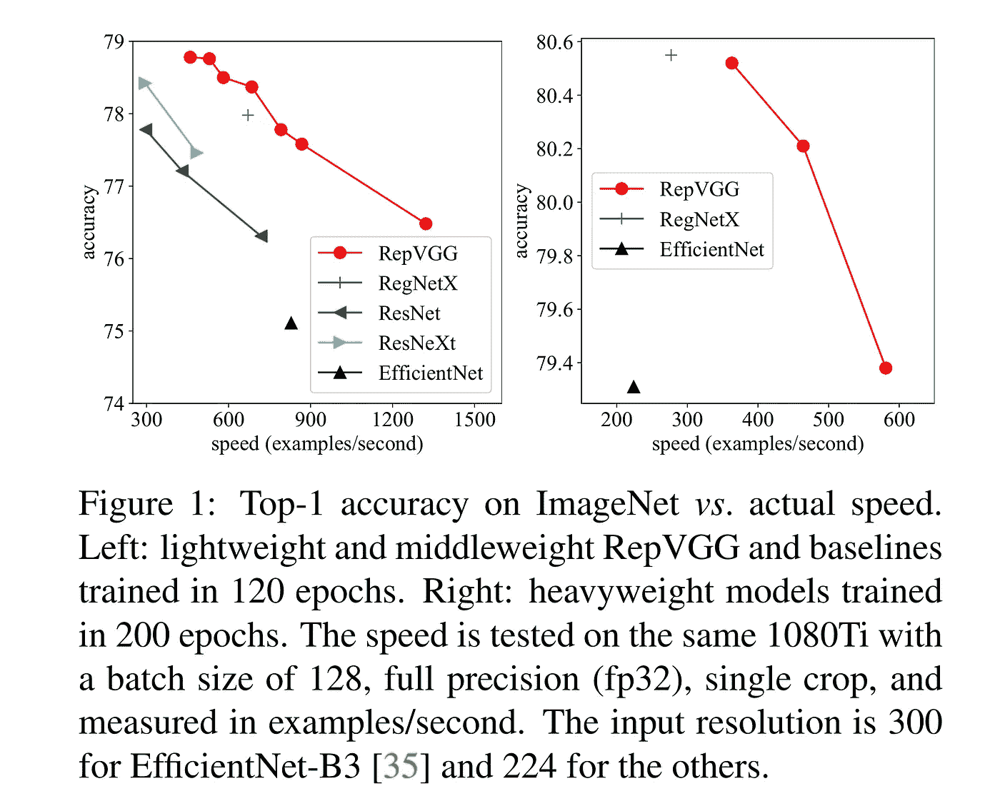
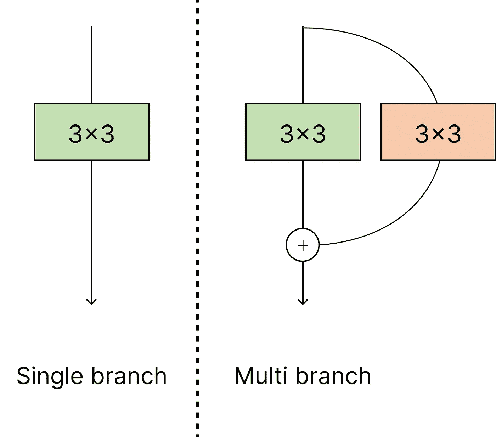
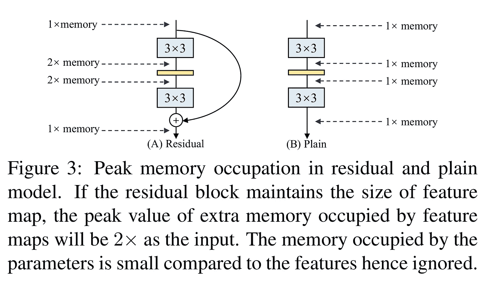
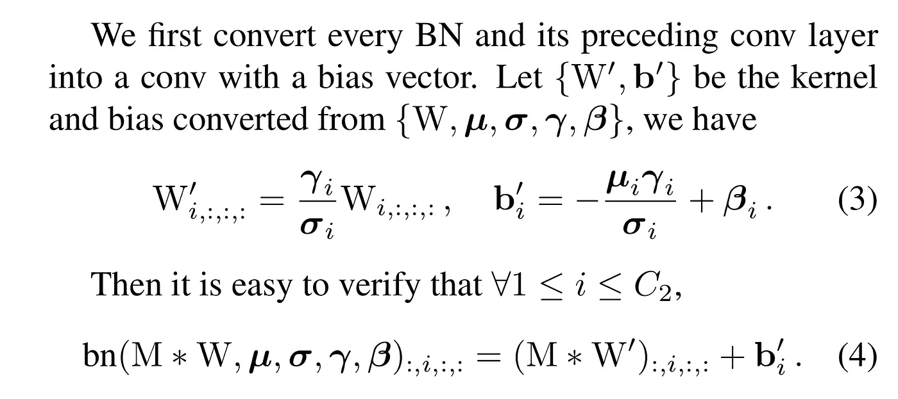
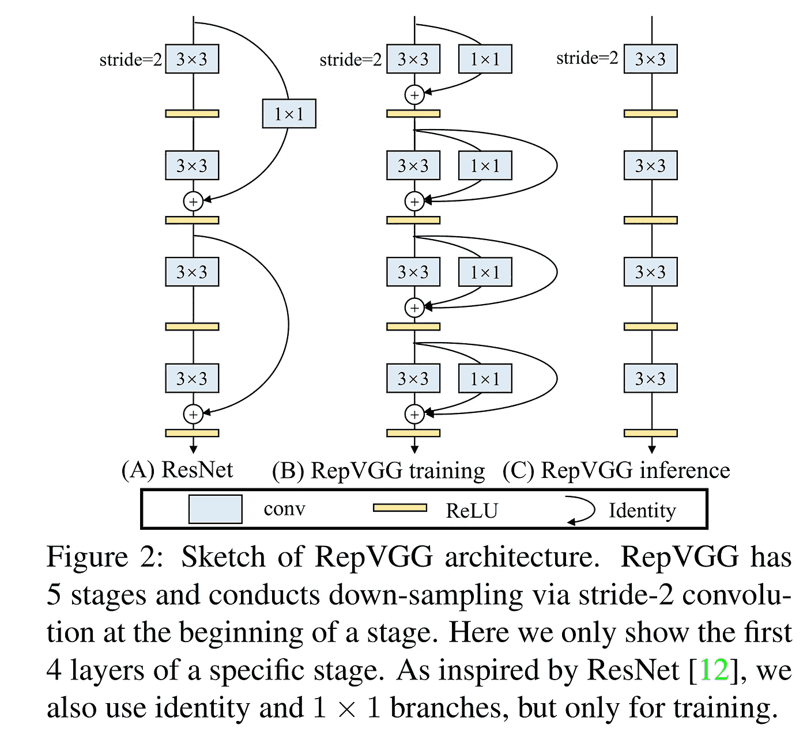
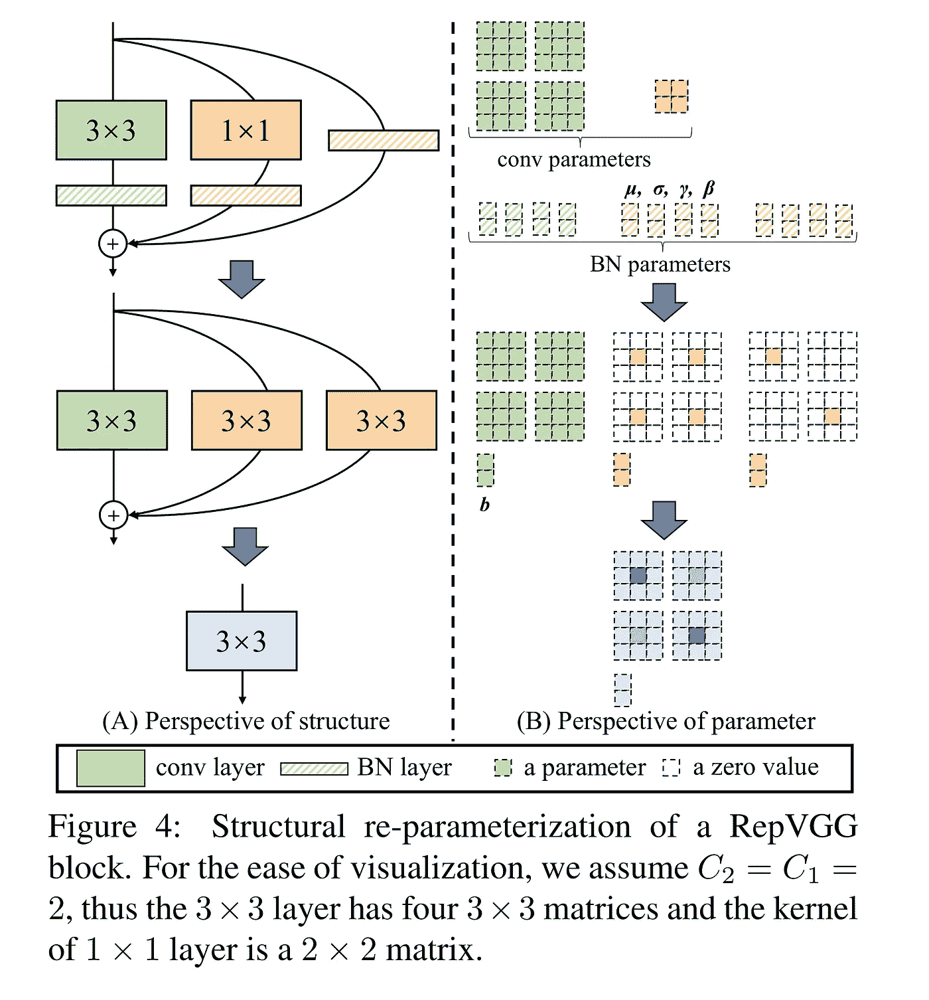

# 在 PyTorch 中实现 RepVGG

> 原文：<https://towardsdatascience.com/implementing-repvgg-in-pytorch-fc8562be58f9>


Alberto Restifo 在 [Unsplash](https://unsplash.com/photos/_RBcxo9AU-U?utm_source=unsplash&utm_medium=referral&utm_content=creditCopyText) 上拍摄的照片

## 让您的 CNN 速度快 100 倍以上

你好。！今天我们将看看如何在 PyTorch 中实现 RepVGG，这是在 [RepVGG:让 VGG 风格的网络再次伟大](https://arxiv.org/pdf/2101.03697.pdf)中提出的

这里的代码是[这里的](https://github.com/FrancescoSaverioZuppichini/RepVgg)，这篇文章的互动版本可以从[这里的](https://github.com/FrancescoSaverioZuppichini/RepVgg/blob/main/README.ipynb)下载。

我们开始吧！

该论文提出了一种新的架构，可以在训练后进行调整，使其在现代硬件上运行更快。我说的更快是指更快的照明速度，这个想法被苹果的手机型号所采用。



图像由[丁小寒](https://arxiv.org/search/cs?searchtype=author&query=Ding%2C+X)、[张翔宇](https://arxiv.org/search/cs?searchtype=author&query=Zhang%2C+X)、[马宁宁](https://arxiv.org/search/cs?searchtype=author&query=Ma%2C+N)、[韩](https://arxiv.org/search/cs?searchtype=author&query=Han%2C+J)、[丁桂光](https://arxiv.org/search/cs?searchtype=author&query=Ding%2C+G)、[孙健](https://arxiv.org/search/cs?searchtype=author&query=Sun%2C+J)

# 单分支与多分支模型

许多最近的模型使用多分支，其中输入通过不同的层传递，然后以某种方式聚合(通常有加法)。



作者图片

这很棒，因为它使多分支模型成为众多较浅模型的隐式集合。更具体地说，*该模型可以解释为 2^n 模型的集合，因为每个模块将流量分成两条路径。*

不幸的是，多分支模型比单分支模型消耗更多的内存，速度也更慢。让我们创建一个经典的`ResNetBlock`来看看为什么(查看我在 PyTorch 中关于 [ResNet 的文章)。](/residual-network-implementing-resnet-a7da63c7b278)

存储`residual`双倍内存消耗。这也显示在论文的下图中



作者注意到多分支结构仅在训练时有用。因此，如果我们有办法在测试时删除它，我们就可以提高建模速度和内存消耗。

# 从多分支到单分支

考虑以下情况，您有两个由两个`3x3`conv 组成的分支

```
torch.Size([1, 8, 5, 5])
```

现在，我们可以创建一个 conv，姑且称之为`conv_fused`，这样`conv_fused(x) = conv1(x) + conv2(x)`。很简单，我们只需将两个 convs 的`weight` s 和`bias`相加即可！因此我们只需要运行一个`conv`而不是两个。

让我们看看它快了多少！

```
conv1(x) + conv2(x) tooks 0.000421s
conv_fused(x) tooks 0.000215s
```

几乎`50%`更少(请记住，这是一个非常幼稚的基准，稍后我们会看到一个更好的)

# 融合 Conv 和 BatchNorm

在现代网络架构中，`BatchNorm`被用作卷积块之后的正则化层。我们可能希望将它们融合在一起，因此创建一个 conv，如`conv_fused(x) = batchnorm(conv(x))`。这个想法是改变`conv`的权重，以便结合`BatchNorm`的移动和缩放。

该文件解释如下:



代码如下:

让我们看看它是否有效

是的，我们融合了一个`Conv2d`和一个`BatchNorm2d`图层。PyTorch 也有一篇关于这个的[文章](https://pytorch.org/tutorials/intermediate/custom_function_conv_bn_tutorial.html)

因此，我们的目标是将所有分支融合在一个 conv 中，使网络更快！

作者提出了一种新型砌块，称为`RepVGG`。与 ResNet 类似，它有一个快捷方式，但它也有一个身份连接(或更好的分支)。



图像由[丁小寒](https://arxiv.org/search/cs?searchtype=author&query=Ding%2C+X)、[、](https://arxiv.org/search/cs?searchtype=author&query=Zhang%2C+X)[、](https://arxiv.org/search/cs?searchtype=author&query=Ma%2C+N)、[韩](https://arxiv.org/search/cs?searchtype=author&query=Han%2C+J)、[丁桂光](https://arxiv.org/search/cs?searchtype=author&query=Ding%2C+G)、[孙健](https://arxiv.org/search/cs?searchtype=author&query=Sun%2C+J)组成

在 PyTorch:

## 重新参数化

我们有一个`3x3` `conv->bn`，一个`1x1` `conv-bn`(有时)一个`batchnorm`(身份分支)。我们希望将它们融合在一起，创建一个单一的`conv_fused`，这样`conv_fused` = `3x3conv-bn(x) + 1x1conv-bn(x) + bn(x)`，或者如果我们没有身份连接，则`conv_fused` = `3x3conv-bn(x) + 1x1conv-bn(x)`。

我们一步一步来。要创建`conv_fused`,我们必须:

*   将`3x3conv-bn(x)`融合成一个`3x3conv`
*   `1x1conv-bn(x)`，然后将其转换为`3x3conv`
*   将身份`bn`转换为`3x3conv`
*   将所有三个`3x3conv`相加

由下图总结:



图像由[肖汉鼎](https://arxiv.org/search/cs?searchtype=author&query=Ding%2C+X)、[张翔宇](https://arxiv.org/search/cs?searchtype=author&query=Zhang%2C+X)、[马宁宁](https://arxiv.org/search/cs?searchtype=author&query=Ma%2C+N)、[韩](https://arxiv.org/search/cs?searchtype=author&query=Han%2C+J)、[桂广鼎](https://arxiv.org/search/cs?searchtype=author&query=Ding%2C+G)、[孙健](https://arxiv.org/search/cs?searchtype=author&query=Sun%2C+J)组成

第一步很简单，我们可以在`RepVGGBlock.block`(主`3x3 conv-bn`)上使用`get_fused_bn_to_conv_state_dict`。

第二步类似，`get_fused_bn_to_conv_state_dict`上`RepVGGBlock.shortcut`(下`1x1 conv-bn`)。然后我们在每个维度上用`1`填充融合的`1x1`的每个内核，创建一个`3x3`。

身份`bn`更加棘手。我们需要创建一个`3x3` `conv`作为身份函数，然后使用`get_fused_bn_to_conv_state_dict`将其与身份`bn`融合。这可以通过使`1`位于对应通道的对应内核的中心来实现。

回想一下，conv 的重量是一个张量`in_channels, out_channels, kernel_h, kernel_w`。如果我们想要创建一个身份 conv，比如`conv(x) = x`，我们需要为该通道创建一个单独的`1`。

例如:

[https://gist.github.com/c499d53431d243e9fc811f394f95aa05](https://gist.github.com/c499d53431d243e9fc811f394f95aa05)

```
torch.Size([2, 2, 3, 3])
Parameter containing:
tensor([[[[0., 0., 0.],
          [0., 1., 0.],
          [0., 0., 0.]], [[0., 0., 0.],
          [0., 0., 0.],
          [0., 0., 0.]]], [[[0., 0., 0.],
          [0., 0., 0.],
          [0., 0., 0.]], [[0., 0., 0.],
          [0., 1., 0.],
          [0., 0., 0.]]]], requires_grad=True)
```

看，我们创建了一个`Conv`，它的行为就像一个身份函数。

现在，把所有东西放在一起，这一步正式称为重新参数化

最后，我们来定义一个`RepVGGFastBlock`。它只由一个`conv + relu`组成

并在`RepVGGBlock`中添加一个`to_fast`方法来快速创建正确的`RepVGGFastBlock`

# RepVGG

让我们用一个方便的`switch_to_fast`方法来定义`RepVGGStage`(块集合)和`RepVGG`，该方法将就地切换到快速块:

# 让我们来测试一下！

我在`benchmark.py`中创建了一个基准测试，在我的 gtx 1080ti 上运行不同批量的模型，结果如下:

模型每级两层，四级，宽度`64, 128, 256, 512`。

在他们的论文中，他们将这些值缩放了一定的量(称为`a`和`b`)，并使用了分组转换。因为我们对重新参数化部分更感兴趣，所以我跳过它们。


作者图片

是的，所以基本上再参数化模型和普通模型相比，是在不同的时间尺度上。哇！

让我复制并粘贴我用来存储基准的数据帧

你可以看到默认模型(多分支)对于一个`batch_size=128`花费了`1.45` s，而参数化模型(快速)只花费了`0.0134` s，即 108x🚀🚀🚀

.

# 结论

结论在本文中，我们已经一步步地了解了如何创建 RepVGG 使用巧妙的重新参数化技术的超快的模型。

这项技术也可以移植到其他体系结构中。

感谢您的阅读！

👉[在 PyTorch 中实现 seg former](https://medium.com/p/8f4705e2ed0e)

👉[在 PyTorch 中实现 conv next](https://medium.com/p/7e37a67abba6)

弗朗西斯科