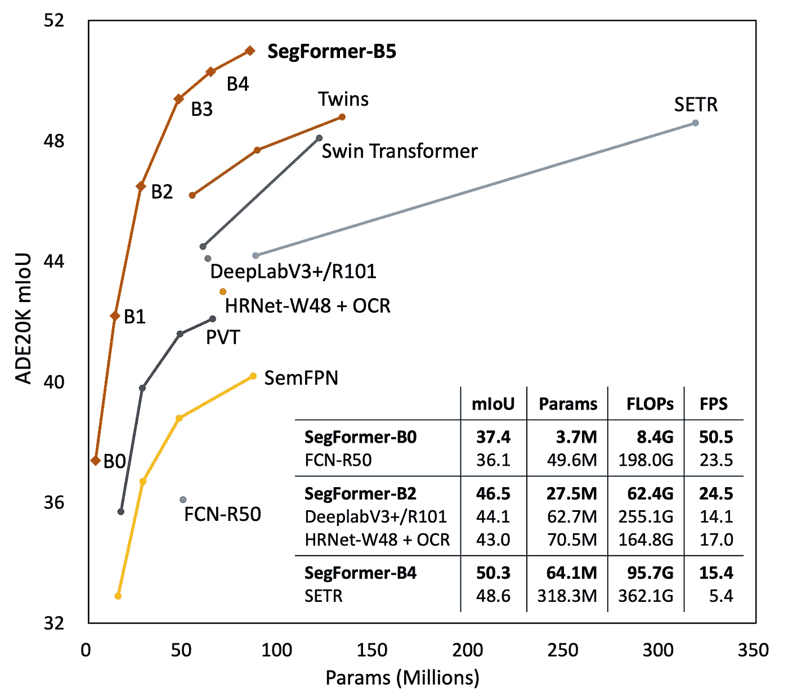
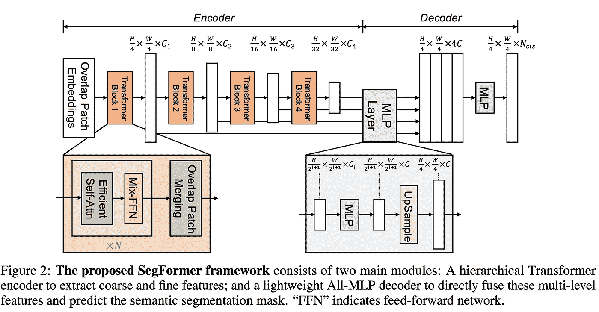
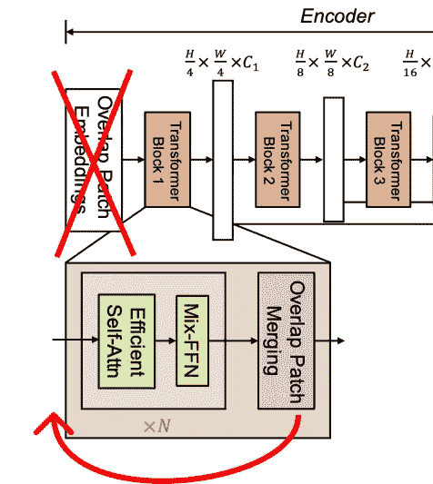
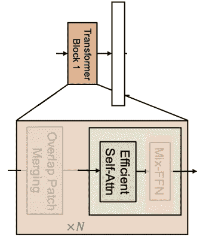
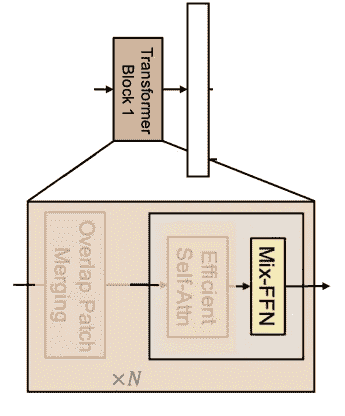
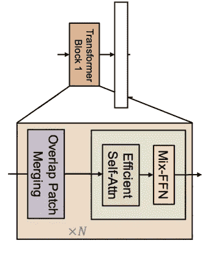
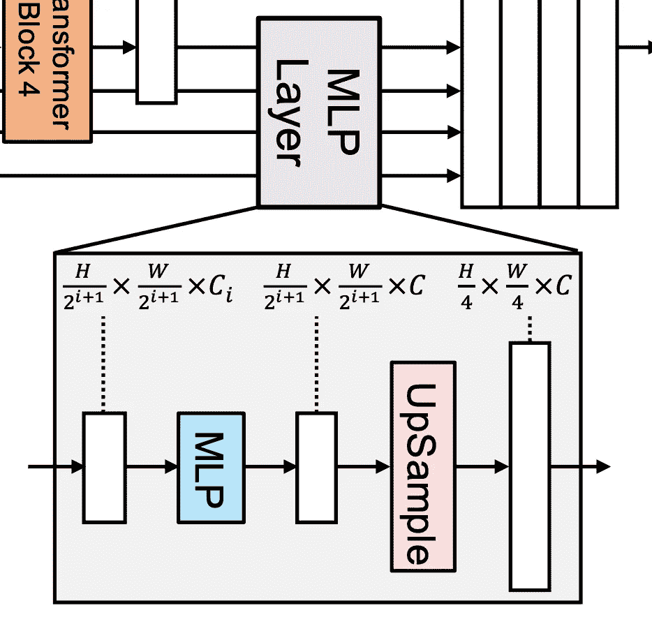
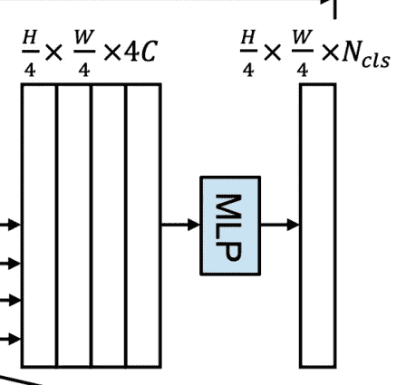

# 在 PyTorch 中实现 SegFormer

> 原文：<https://towardsdatascience.com/implementing-segformer-in-pytorch-8f4705e2ed0e>


作者图片

## *一种快速、高效、轻量级的图像分割模型*

你好。！今天我们将看看如何在 PyTorch 中实现 SegFormer，这是在 [SegFormer:用变形器进行语义分割的简单有效的设计](https://arxiv.org/abs/2105.15203)中提出的。

这里的代码是，这篇文章的互动版本可以从[这里](https://github.com/FrancescoSaverioZuppichini/SegFormer/blob/main/README.ipynb)下载。

我们开始吧！

提出了一种新的基于变换的图像分割模型。即使“变形金刚”是时下的流行语，模型本身也只有基本的注意机制。该模型有两个主要优点，首先 *SegFormer 包括一个新颖的分级结构的变压器编码器，它输出多尺度特征*。然后，*不需要位置编码，从而避免了当测试分辨率不同于训练时导致性能下降的位置代码插值*。

有趣的是，我们正在研究中倒退，这两个优点从一开始就存在于 convnet 中，我们将看到 SegFormer 最终只是一个 convnet + attention。

下图显示了 SegFormer 在 ADE20K 数据集上针对不同模型/大小的性能，他们有 sota。



图片由[恩泽](https://arxiv.org/search/cs?searchtype=author&query=Xie%2C+E)、[王文海](https://arxiv.org/search/cs?searchtype=author&query=Wang%2C+W)、[余](https://arxiv.org/search/cs?searchtype=author&query=Yu%2C+Z)、[阿尼玛](https://arxiv.org/search/cs?searchtype=author&query=Anandkumar%2C+A)、[何塞·阿尔瓦雷斯](https://arxiv.org/search/cs?searchtype=author&query=Alvarez%2C+J+M)、[平罗](https://arxiv.org/search/cs?searchtype=author&query=Luo%2C+P)

它比老式的 FCN-R50 要好，速度快两倍。既然它少了 24 次翻牌，我想知道为什么它的速度只有两倍。

# 体系结构

该模型是一个典型的编码器-解码器/主干-颈部。附加一个头部来预测最终的分割掩模。



图片由[恩泽](https://arxiv.org/search/cs?searchtype=author&query=Xie%2C+E)、[、](https://arxiv.org/search/cs?searchtype=author&query=Wang%2C+W)、[余](https://arxiv.org/search/cs?searchtype=author&query=Yu%2C+Z)、[阿尼玛](https://arxiv.org/search/cs?searchtype=author&query=Anandkumar%2C+A)、[何塞](https://arxiv.org/search/cs?searchtype=author&query=Alvarez%2C+J+M)、[平罗](https://arxiv.org/search/cs?searchtype=author&query=Luo%2C+P)

我们将以自下而上的方式实现它，从解码器内部的最低模块开始。

报纸上的图像是错误的🤦，我不明白为什么有评论者指出，也许我错了。在官方的[实现中](https://github.com/NVlabs/SegFormer/blob/master/mmseg/models/backbones/mix_transformer.py)没有第一次补丁嵌入。重叠补丁合并块(紫色的那个)应该在自我效能注意块之前。

它应该是这样的:



作者图片

用一点 photoshop


作者图片

参见处的代码

# 解码器

使用的解码器叫做`MixVisionTransformer` ( `MiT`)，另一个`ViT`，中间加了一些随机的东西，我们就叫它`SegFormerDecoder`。让我们从积木本身的第一个独立组件`OverlapPatchMerging`开始。

## 重叠合并


作者图片

`OverlapPatchMerging`块可以用一个`stride`小于`kernel_size`的卷积层来实现，因此它与不同的面片重叠。这与几年前提出的使用大于 1 的`stride`来减少输入的空间维度是一样的。在`SegFormer`中，conv 层之后是层规范。

由于 PyTorch 中的`nn.LayerNorm`适用于形状为`batch, ...., channels`的张量，我们可以创建一个`LayerNorm2d`，首先将`channels`轴与最后一个轴交换，然后应用层规范，并将其交换回来。我将使用`[einops](https://github.com/arogozhnikov/einops)`使代码更具可读性

那么我们的`OverlapPatchMerging`只是一个 conv 层，后面跟着我们的层范数

## 高效的自我关注



作者图片

我们都知道注意力有一个平方复杂度`O(N^2)`,而在我们的例子中`N=H*W`。我们可以将`N`减少`R`的一个因子，复杂度变成`O(N^2/R)`。一个简单的方法是平坦的空间维度，并使用线性层。

我们将空间大小减少了`r=4`，因此在每个维度上减少了`2`(`height`和`width`)。如果你考虑一下，你可以用一个`kernel_size=r`和一个`stride=r`的卷积层来达到同样的效果。

由于注意力等于`softmax((QK^T/scale)V)`，我们需要使用约化张量计算`K`和`V`，否则，形状不会匹配。我们可以用 PyTorch 的`MultiheadAttention`来计算注意力。

```
torch.Size([1, 8, 64, 64])
```

## MixMLP



作者图片

细心的读者可能已经注意到我们没有使用位置编码。SegFormer 使用了一个`3x3`深度 conv。引用论文*我们认为位置编码对于语义分割是不必要的。相反，我们引入了混合 FFN，它考虑了零填充的影响，以泄漏位置信息*。我不知道这意味着什么，所以我们会认为这是理所当然的。

我很确定它被称为 Mix，因为它使用`3x3` conv 来混合信息。

图层由`dense layer`->-`3x3 depth-wise conv`->-`GELU`->-`dense layer`组成。像在 ViT 中，这是一个逆瓶颈层，信息在中间层展开。

# 编码器(变压器)模块



作者图片

让我们把所有东西放在一起，创建我们的编码器模块。我们将遵循一个更好的(imho)命名惯例，我们称`SegFormerEncoderBlock`具有自我关注和混合 fpn 的部分和`SegFormerEncoderStage`整个重叠片合并+ N x `SegFormerEncoderBlock`

与`ViT`非常相似，我们有跳过连接和标准化层+随机深度，也称为丢弃路径，(我有一篇关于它的[文章](/implementing-stochastic-depth-drop-path-in-pytorch-291498c4a974))。

```
torch.Size([1, 8, 64, 64])
```

好吧，让我们创造一个舞台。我不知道为什么，他们在最后应用层规范，所以我们也这样做:)

最后的`SegFormerEncoder`由多个阶段组成。

我添加了函数`chunks`来保持代码的整洁。它是这样工作的

```
[[1, 2], [3, 4, 5]]
```

这很方便，因为`drop_probs`是一个列表，包含每个阶段的块的下落路径概率，我们需要将一个列表和正确的值传递给每个阶段。

从编码器中，我们返回一个内部特征列表，每个阶段一个。

# 解码器/颈部

幸运的是，解码器/neck 的图片与原始代码相匹配。他们称解码器部分为`MLP Layer`。



它所做的非常简单，它采用大小为`batch, channels_i, height_i, width_i`的`F`特征，并输出相同空间和通道大小的`F'`特征。空间大小固定为`first_features_spatial_size / 4`。在我们的例子中，由于我们的输入是一个`224x224`图像，输出将是一个`56x56`遮罩。

因此，单个`SegFormerDecoderBlock`包含一个上采样层(用于空间维度)和一个 conv 层(用于通道)。需要`scale_factor`参数来告诉它我们想要对特征进行多大程度的上采样。

在这种情况下，我们没有阶段，所以我们的`SegFormerDecoder`只是一个块列表。它获取要素列表，并返回具有相同空间大小和通道的新要素列表。

# SegFormer 头



我们快到了！解码器的功能在通道轴上串联(记住它们都具有相同的通道和空间维度)。然后，它们被传递到分段头，以将它们从`channels * number of features`减少到`channels`。最后，密集层输出最终分割。

# SegFormer

嗯，我们的最终模型只是`encoder + decoder + head`。容易的事

我们试试吧！

```
torch.Size([1, 100, 56, 56])
```

输出是正确的，我们期望一个空间形状的遮罩`image_size // 4`和`224 // 4 = 56`。

我们做到了！🎉🎉🎉

# 结论

在本文中，我们已经一步一步地看到了如何创建 SegFormer 一种快速有效的图像分割模型。

感谢您的阅读！

弗朗西斯科