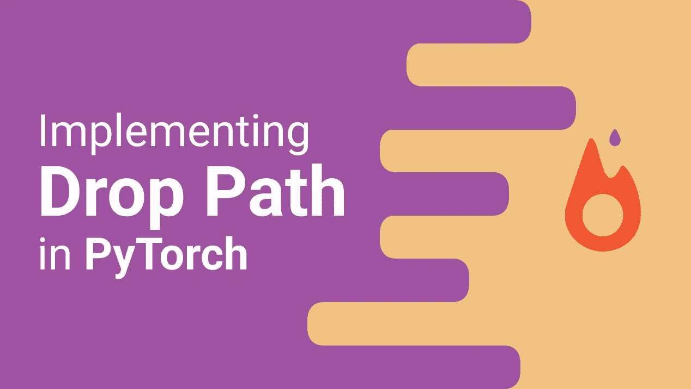
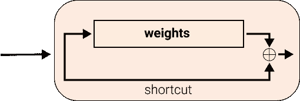
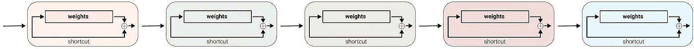
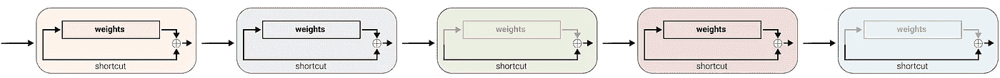

# 在 PyTorch 中实现随机深度/落差路径

> 原文：<https://towardsdatascience.com/implementing-stochastic-depth-drop-path-in-pytorch-291498c4a974>



作者图片

## DropPath 在 [**眼镜**](https://github.com/FrancescoSaverioZuppichini/glasses) 我的计算机视觉库中

代码是[这里](https://github.com/FrancescoSaverioZuppichini/DropPath)本文的互动版本可以从[这里](https://github.com/FrancescoSaverioZuppichini/DropPath/blob/main/README.ipynb)下载。

# 介绍

今天我们将在 PyTorch 中实现随机深度，也称为 Drop Path！[黄高等人引入的随机深度](https://arxiv.org/abs/1603.09382)是一种在训练过程中“去激活”某些层的技术。我们将坚持使用 **DropPath** 。

让我们来看一个使用剩余连接的普通 ResNet 块(像现在几乎所有的模型一样)。如果你不熟悉 ResNet，我有一篇[文章](/residual-network-implementing-resnet-a7da63c7b278)展示了如何实现它。

基本上，块的输出被添加到它的输入:`output = block(input) + input`。这被称为**剩余连接**



作者图片

这里我们看到四个类似 ResnNet 的块，一个接一个。



作者图片

随机的深度/下落路径会降低一些石块的重量



作者图片

# 履行

让我们从导入我们最好的朋友`torch`开始

```
import torch
from torch import nn
from torch import Tensor
```

我们可以定义一个 4D 张量(`batch x channels x height x width`)，在我们的例子中，让我们只发送 4 个图像，每个图像一个像素，这样更容易看到发生了什么:)

```
x = torch.ones((4, 1, 1, 1))
```

我们需要一个形状为`batch x 1 x 1 x 1`的张量，使用一个给定的 prob 来将批处理中的一些元素设置为零。伯努利来救援了。

```
keep_prob: float = .5
mask: Tensor = x.new_empty(x.shape[0], 1, 1, 1).bernoulli_(keep_prob)# mask = tensor([[[[1.]]],

        [[[1.]]],

        [[[0.]]],

        [[[0.]]]])
```

Btw，这相当于

```
mask: Tensor = (torch.rand(x.shape[0], 1, 1, 1) > keep_prob).float()
```

我们想把`x`的一些元素设置为零，因为我们的遮罩是由`0`和`1`组成的，我们可以把它乘以`x`。在我们这样做之前，我们需要用`x`除以`keep_prob`来降低训练期间输入的激活，参见 [cs231n](https://cs231n.github.io/neural-networks-2/#reg) 。因此

```
x_scaled : Tensor = x / keep_prob
```

最后

```
output: Tensor = x_scaled * mask
# output =
tensor([[[[2.]]],

        [[[0.]]],

        [[[2.]]],

        [[[2.]]]])
```

看看批处理中的一些元素是如何被设置为零的。我们可以把它放在一个函数中

```
def drop_path(x: Tensor, keep_prob: float = 1.0) -> Tensor:
    mask: Tensor = x.new_empty(x.shape[0], 1, 1, 1).bernoulli_(keep_prob)
    x_scaled: Tensor = x / keep_prob
    return x_scaled * mask

drop_path(x, keep_prob=0.5)
```

我们也可以就地做手术

```
def drop_path(x: Tensor, keep_prob: float = 1.0) -> Tensor:
    mask: Tensor = x.new_empty(x.shape[0], 1, 1, 1).bernoulli_(keep_prob)
    x.div_(keep_prob)
    x.mul_(mask)
    return x

drop_path(x, keep_prob=0.5)
```

然而，我们可能想在其他地方使用`x`，用`x`或`mask`除以`keep_prob`也是一样的。让我们来看看最终的实现

```
def drop_path(x: Tensor, keep_prob: float = 1.0, inplace: bool = False) -> Tensor:
    mask: Tensor = x.new_empty(x.shape[0], 1, 1, 1).bernoulli_(keep_prob)
    mask.div_(keep_prob)
    if inplace:
        x.mul_(mask)
    else:
        x = x * mask
    return x

x = torch.ones((4, 1, 1, 1))
drop_path(x, keep_prob=0.5)
```

`drop_path`仅适用于 2d 数据，我们需要从输入的尺寸中自动计算出维数，以使其适用于任何数据时间

```
def drop_path(x: Tensor, keep_prob: float = 1.0, inplace: bool = False) -> Tensor:
    mask_shape: Tuple[int] = (x.shape[0],) + (1,) * (x.ndim - 1) 
    # remember tuples have the * operator -> (1,) * 3 = (1,1,1)
    mask: Tensor = x.new_empty(mask_shape).bernoulli_(keep_prob)
    mask.div_(keep_prob)
    if inplace:
        x.mul_(mask)
    else:
        x = x * mask
    return x
```

让我们创建一个漂亮的`DropPath` `nn.Module`

```
class DropPath(nn.Module):
    def __init__(self, p: float = 0.5, inplace: bool = False):
        super().__init__()
        self.p = p
        self.inplace = inplace

    def forward(self, x: Tensor) -> Tensor:
        if self.training and self.p > 0:
            x = drop_path(x, self.p, self.inplace)
        return x

    def __repr__(self):
        return f"{self.__class__.__name__}(p={self.p})"
```

# 使用剩余连接

我们有我们的`DropPath`，酷！我们如何使用它？我们需要一个剩余块，我们可以使用一个经典的 ResNet 块:老朋友`BottleNeckBlock`

```
from torch import nn

class ConvBnAct(nn.Sequential):
    def __init__(self, in_features: int, out_features: int, kernel_size=1):
        super().__init__(
            nn.Conv2d(in_features, out_features, kernel_size=kernel_size, padding=kernel_size // 2),
            nn.BatchNorm2d(out_features),
            nn.ReLU()
        )

class BottleNeck(nn.Module):
    def __init__(self, in_features: int, out_features: int, reduction: int = 4):
        super().__init__()
        self.block = nn.Sequential(
            # wide -> narrow
            ConvBnAct(in_features, out_features // reduction, kernel_size=1),
            # narrow -> narrow
            ConvBnAct( out_features // reduction, out_features // reduction, kernel_size=3),
            # wide -> narrow
            ConvBnAct( out_features // reduction, out_features, kernel_size=1),
        )
        # I am lazy, no shortcut etc

    def forward(self, x: Tensor) -> Tensor:
        res = x
        x = self.block(x)
        return x + res

BottleNeck(64, 64)(torch.ones((1,64, 28, 28)))
```

要停用程序块，操作`x + res`必须等于`res`，因此我们的`DropPath`必须在程序块之后应用。

```
class BottleNeck(nn.Module):
    def __init__(self, in_features: int, out_features: int, reduction: int = 4):
        super().__init__()
        self.block = nn.Sequential(
            # wide -> narrow
            ConvBnAct(in_features, out_features // reduction, kernel_size=1),
            # narrow -> narrow
            ConvBnAct( out_features // reduction, out_features // reduction, kernel_size=3),
            # wide -> narrow
            ConvBnAct( out_features // reduction, out_features, kernel_size=1),
        )
        # I am lazy, no shortcut etc
        self.drop_path = DropPath()

    def forward(self, x: Tensor) -> Tensor:
        res = x
        x = self.block(x)
        x = self.drop_path(x)
        return x + res

BottleNeck(64, 64)(torch.ones((1,64, 28, 28)))
```

Tada！现在，随机地，我们的`.block`将被完全跳过！

# 结论

在本文中，我们看到了如何实现 DropPath 并在 residual 块中使用它。希望，当你阅读/看到下落路径/随机深度时，你知道它是如何制作的

保重:)

弗朗西斯科