# 从头开始实现支持向量机

> 原文：<https://towardsdatascience.com/implementing-svm-from-scratch-784e4ad0bc6a>

## 从头做起

# 从头开始实现支持向量机

## 通过从头推导理解具有梯度下降和铰链损失的最大间隔分类器

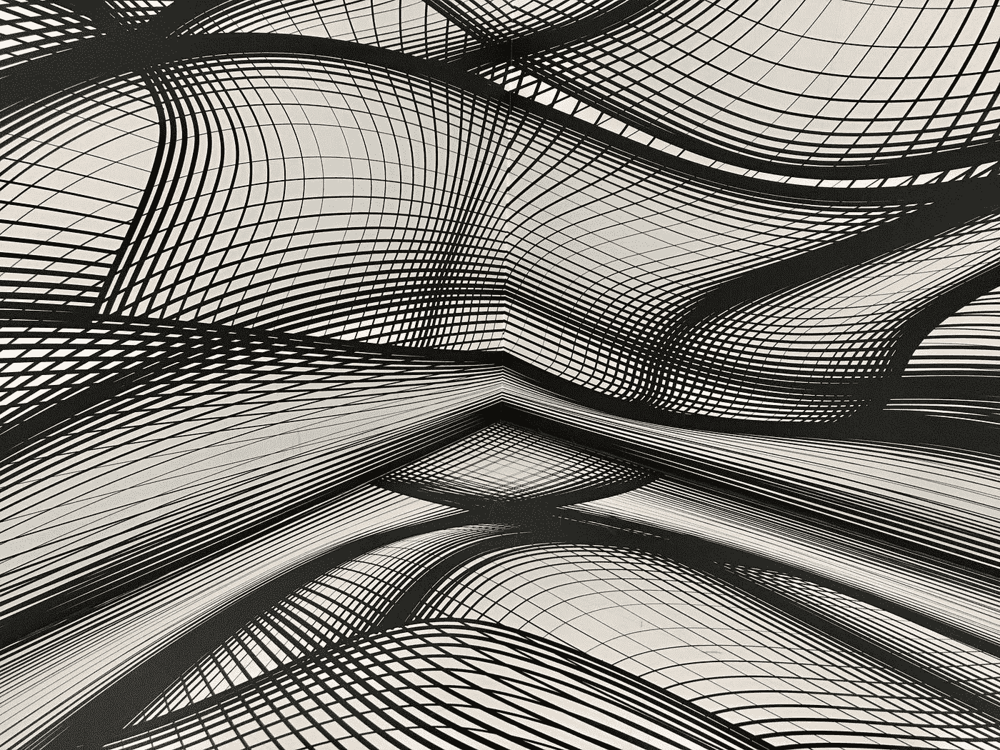

阿曼德·库利在 [Unsplash](https://unsplash.com?utm_source=medium&utm_medium=referral) 上拍摄的照片

当我决定学习一种机器学习算法时，我总是想知道它是如何工作的。

> 我想知道引擎盖下是什么。想知道是怎么实施的？我想知道它为什么有效。

从头开始实现机器学习算法迫使我们寻找所有这些问题的答案——这正是我们在本文中试图做的。

在接下来的小节中，我们将使用 Python 和 NumPy 一步步实现**支持向量机** 。我们还将学习基本的数学原理，铰链损失函数，以及如何应用梯度下降。

但是在深入实现细节之前，让我们建立一些关于支持向量机的基本直觉。

# 支持向量机

由计算机科学界在 20 世纪 90 年代开发的支持向量机(SVM)是一种常用的监督学习算法，最初用于二进制分类设置。

> 它通常被认为是最好的“开箱即用”分类器之一。

SVM 是一种简单而优雅的算法，称为最大间隔分类器的推广。然而，这种分类器不能应用于所有情况，因为它严重依赖于数据集是线性可分的假设，因此，存在几种扩展。

> **注意:**在下文中，我们将只讨论最大间隔分类器，有意避免不同的扩展。这使我们能够对基本原理和学习算法的主要目标有更深的理解。

让我们假设，我们有一个数据集，其中每个数据点属于两个类中的一个。假设数据集是线性可分的——最大间隔分类器试图找到**最佳分离超平面**，顾名思义——最大化间隔。

换句话说，我们只是通过最大化到任一类的最近数据点的距离来寻找分隔两类的决策边界。

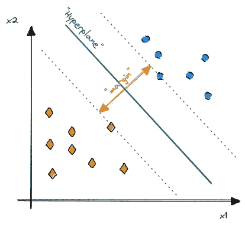

最大间隔分类器对超平面的可视化[图片由作者提供]

然而，一个基本问题浮现在脑海中——我们如何找到最佳超平面？

在回答这个问题之前，我们需要做一些基础工作。更准确地说，我们需要知道什么是超平面，它是如何定义的，以及如何通过计算和最大化边际来选择最优解。

# 了解超平面

一般来说， *p* 维的超平面可以描述为一个维数为 *p-1* 的平坦仿射子空间。

例如，在二维空间中，超平面可以由平坦的一维子空间来定义，或者换句话说，可以由一条简单的直线来定义。类似地，在三维中，超平面可以描述为二维子空间或平面。

现在，假设我们有一个二维空间的数据集，可以线性分离。因此，将数据点按其类别{-1，1}划分的超平面 *(H₀)* 是一条直线。

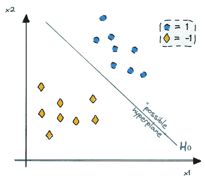

一个分离超平面的例子[图片由作者提供]

更正式地说，超平面由满足以下等式的点集 *x* 定义:

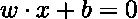

这个定义特别有用，因为它允许我们把超平面看作一个决策边界。不满足上述等式的任何点 *x* ，必定位于超平面的一侧或另一侧。

重新构建之前的情况，我们也可以认为这是选择另外两个超平面 *(H₁，H₂)* ，它们与 *H₀、*的距离相同，确保每个数据点都位于正确的一侧，中间没有数据。

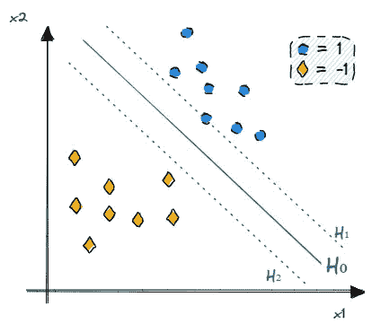

H2 H1 等距超平面的一个例子

超平面 *(H₁，H₂)* 因此可以定义为

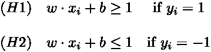

我们可以将它组合成一个用于分离超平面的**单一方程:**

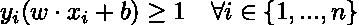

现在，我们知道分离超平面是如何定义的，但如何找到最优解的问题仍然没有答案。

# 寻找最优分离超平面

由于我们的数据集可以使用超平面完美地分离，并且任何超平面都可以通过微小的推动来移动和旋转，因此我们可以从无限量的可能解决方案中进行选择。

因此，我们需要一种合理的方法来决定使用哪个可能的超平面。

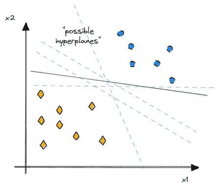

可能的分离超平面的例子[图片由作者提供]

不严格地说，**最优分离超平面**是离最近数据点最远的解——或者换句话说，是**最大化了余量**。

我们也可以把它想象成另外两个超平面*(支持向量)*，它们之间的距离最大化。最佳分离超平面可以想象成一条将边缘分成两半的平行线。

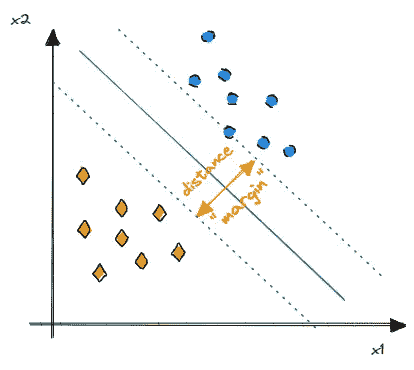

最大化边距[图片由作者提供]

为了最大化两个超平面之间的距离，我们需要找到一种计算边距的方法。

边缘也可以解释为垂直于任何超平面的向量，其大小等于边缘。因此，我们只需要定义这个向量，然后求解它的大小。

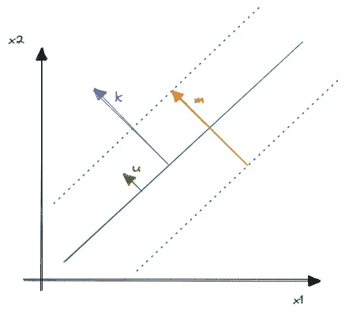

计算边距[图片由作者提供]

由于我们的权重向量 *w* 已经垂直于超平面，我们可以用下面的等式计算与 *w* 方向相同的单位向量 *u* :

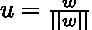

现在，我们只需要将单位向量 *u* 缩放一个标量 *m* 就可以得到一个方向和大小与边距相同的向量 *k* 。

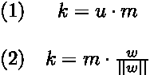

让我们想象一个任意的点 *x₀* 并加上我们的向量 *k* ，得到 *z₀ = x₀ + k* 。

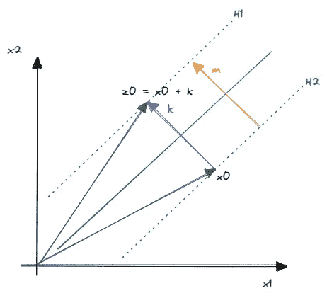

导出边距[图片由作者提供]

由于 *z₀* 和 *x₀* 分别位于超平面 *H₁* 和 *H₂* 上，我们可以如下求解余量:

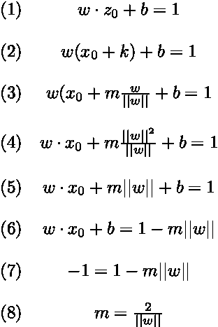

通过仔细研究我们的最终等式(8)，我们可以看到，为了最大化裕量，我们只需最小化分母——向量 *w* 的范数。

就是这样，我们最终收集了计算最优分离超平面所需的所有成分。剩下唯一要做的就是把所有的成分组合成一个单一的目标函数。

# 主要目标函数

有了如何定义分离超平面以及如何计算两个超平面之间的距离的知识，我们可以导出主目标函数。

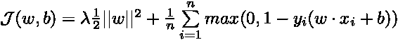

到目前为止，这个等式的某些部分对我们来说应该很熟悉。

第一项基本上负责最大化裕度，表示为具有附加正则化参数λ的最小化问题。

> **注**:当导出梯度时，简单地增加乘以 1/2 是为了方便。

第二项——包含我们对分离超平面的定义——是一个称为[铰链损失](https://en.wikipedia.org/wiki/Hinge_loss)的损失函数。不严格地说，这个术语负责确保我们以足够的余量预测正确的类标签。

例如，如果 *yᵢ = 1* 和 *xᵢ* 被正确分类，则计算铰链损耗的结果为零，因为 *max(0，1–1)= 0*。但是，如果错误地预测了类别标签，则铰链损耗将导致大于零的值。

由于我们要用[梯度下降](https://en.wikipedia.org/wiki/Gradient_descent)优化损失函数，我们需要计算函数相对于权重和偏差的偏导数。一旦我们获得梯度，我们可以简单地在相反的方向采取小步骤，以尽量减少损失。

为了获得*(子)*梯度，我们必须区分两种情况下的目标函数:

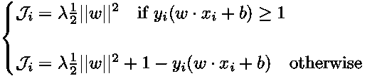

对第一种情况取偏导数，得到以下梯度:

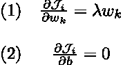

对第二种情况重复相同的步骤得到:

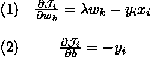

我们应该把梯度和导数放在手边，因为它们在实现梯度下降和下一节的主要算法时会派上用场。

# 介绍算法

在直接进入实现细节之前，我们将快速看一下算法的主要计算步骤，以提供一个高层次的概述以及一些基本结构。

**主算法**基本上可以分解为 4 个步骤:

1.  权重和偏差的基本设置和初始化
2.  将类别标签从{0，1}映射到{-1，1}
3.  执行 *n 次*迭代的梯度下降，这涉及梯度的计算并相应地更新权重和偏差。
4.  做最后的预测

由于第三步由多个动作组成，我们将把它分解成几个辅助函数。

该算法将用 Python 和 Numpy 在一个类中实现。下面，我们可以看一下*骨架类*，它可以解释为某种蓝图，指导我们完成下一节的实现。

# 从头开始实施

## 基本设置

我们从一些简单的内务开始，通过**初始化参数**(学习率，迭代次数)并定义用于初始化权重和偏差的辅助函数。

## 主算法

基本设置完成后，我们现在能够实现算法的核心计算步骤。

首先，我们需要**初始化权重和偏差**并**映射**我们的二进制**类标签**从{0，1}到{-1，1}，这使我们能够检查数据点是否位于分离超平面的正确一侧。

可以借助内置的 NumPy 函数`np.where()`来执行类映射，该函数简单地将 0 的每个类标签变成-1。

现在，继续进行**梯度下降**——在单次迭代中，我们必须检查是否满足分离超平面的约束，计算权重和偏差的梯度，并相应地更新参数。

为了计算正确的梯度，我们需要知道目标函数的哪种情况与特定的数据点相关。因此，我们需要检查数据点**是否满足约束**

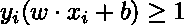

一旦我们知道是否满足约束，我们就可以相应地**计算梯度**。我们应该能够识别出前面部分的导数。一个简单的 *if 语句*完成了决定计算哪组渐变的工作。

有了手中的梯度，我们只需再做一件事——我们必须**更新权重和偏差**，允许我们向相反的方向迈出一小步，使损失函数最小化。

## 预测并把它们放在一起

进行预测非常简单，因为它只需要我们计算训练数据和权重的点积，并在顶部添加偏差。

我们还计算类标签的符号，并在返回预测标签之前，将它们从{-1，1}映射回原始值{0，1}。

到目前为止，我们基本上完成了所有的艰苦工作——我们只需要将所有的东西放在一起，完成我们的实现。

# 测试分类器

我们已经完成了最大间隔分类器的实现，我们仍然需要测试它。

出于测试目的，我们将简单地使用`sklearn.datasets.make_blobs()`并创建一个包含 250 个样本的基本数据集，其中只有两个特征。我们可以将数据可视化如下:

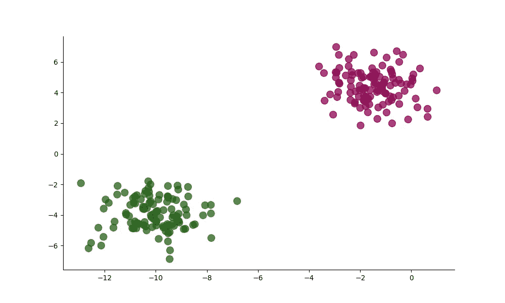

简单数据集的可视化[图片由作者提供]

现在，我们可以分割数据集，实例化并拟合我们的分类器来进行预测。

将预测的类别标签与真实的类别标签进行比较，得到 100 %的准确度分数。我们还可以通过绘制超平面来可视化结果，这验证了我们的算法是正确工作的。

结果超平面的可视化[图片由作者提供]

# 结论

在本文中，我们以循序渐进的方式从头开始实现了最大间隔分类器。我们还学习了基本的数学概念，如何实现铰链损失函数，以及如何应用梯度下降。

然而，最大间隔分类器仅覆盖数据集是线性可分的简单情况。因此，存在几个扩展，人们可以并且可能应该更深入地探索。

从零开始实现最大间隔分类器使我们能够对基本的和潜在的概念建立更深的理解。当探索一些建立在最大间隔分类器之上的更复杂的扩展时，这些知识将被证明是有用的。

你可以在我的 GitHub 上的这里找到[的完整代码。](https://github.com/marvinlanhenke/DataScience/tree/main/MachineLearningFromScratch)

[马文·兰亨克](https://medium.com/@marvinlanhenke?source=post_page-----784e4ad0bc6a--------------------------------)

## 从零开始的 ML 算法

[View list](https://medium.com/@marvinlanhenke/list/ml-algorithms-from-scratch-7621d01922ad?source=post_page-----784e4ad0bc6a--------------------------------)6 stories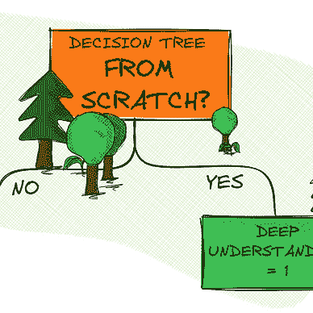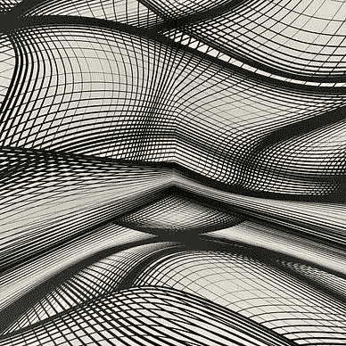

*喜欢这篇文章吗？成为* [*中等会员*](https://medium.com/@marvinlanhenke/membership) *继续无限学习。如果你使用下面的链接，我会收到你的一部分会员费，不需要你额外付费。*

<https://medium.com/@marvinlanhenke/membership>  

**参考资料/更多资料:**

*   [SVM 教程](https://www.svm-tutorial.com/2014/11/svm-understanding-math-part-1/)
*   加雷斯·詹姆斯，丹妮拉·威滕，特雷弗·哈斯蒂，罗伯特·蒂布拉尼。《统计学习导论:在 r .纽约的应用》: Springer，2013 年。