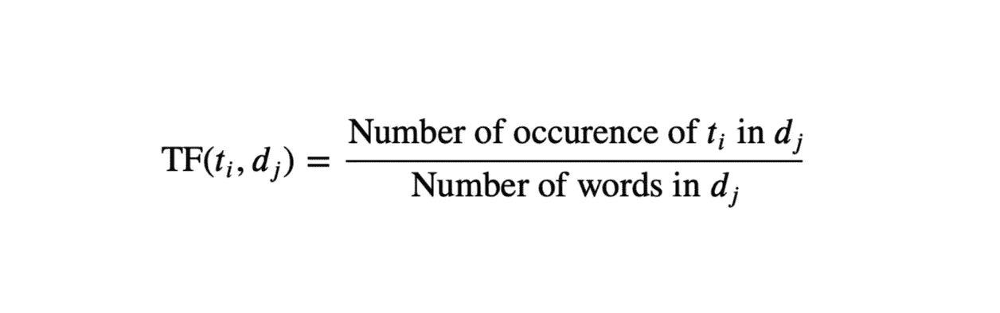
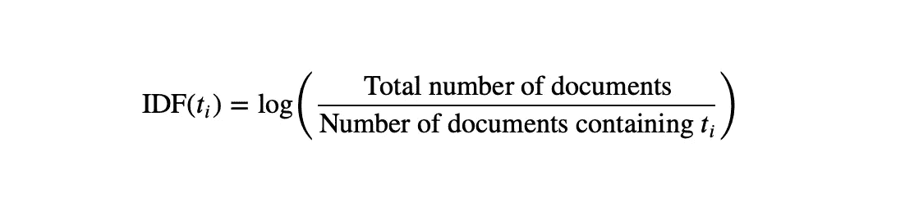
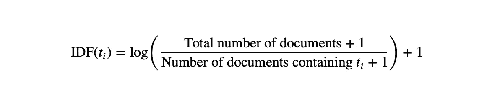

# 用 Python 实现各种 NLP 文本表示

> 原文：<https://towardsdatascience.com/implementing-various-nlp-text-representation-in-python-84781da0ec2d>

## 一键编码、单词包、N-Grams 和 TF-IDF


图片由 [**阿玛多**](https://unsplash.com/@amadorloureiro) **上的 Unsplash**

自然语言处理(NLP)是处理语言和语义的机器学习的子集。机器通过训练来学习单词的语义，就像典型的机器学习是如何工作的一样。当我们意识到几乎所有常用的机器学习模型都只能接受数字输入时，问题就出现了。因此，为了使用文本数据训练机器，我们必须找到一种将文本表示为数字向量的方法。本文将演示一些简单的数字文本表示，以及如何使用 Python 实现它们。

对于本教程，我们将使用以下数据。这个数据的背景是一门大学学科的复习。我对数据进行了预处理，即去除停用词、标点符号和词条释义。这些文字都是虚构的。

我们正在使用的数据

让我们从最简单的表示开始。我们用熊猫来称呼上面的数据，

```
df = pd.read_csv("data.csv")
```

## **1。一键编码(OHE)**

这个模型的想法是列出所有文本中存在的每个单词。我们可以使用下面的函数做到这一点。

运行下面的代码，

```
BagOfWords(df["Comments"])
```

会返回数据中所有唯一的单词，

```
array(['although', 'amazed', 'bad', 'beautiful', 'bob', 'caution', 'clear', 'concept', 'definitely', 'difficult', 'experience',
'fantastic', 'find', 'first', 'found', 'funny', 'hard',      'however', 'implication', 'interesting', 'jim', 'learned', 'lecturer', 'lot', 'much', 'order', 'people', 'practical', 'really', 'reasonably', 'revision', 'rewarding', 'rubbish', 'scraped', 'spent', 'still', 'subject', 'take', 'taking', 'taught', 'terrible', 'though', 'time', 'trying', 'understand', 'warned', 'way'], dtype='<U32')
```

然后，我们将这些单词中的每一个设置为新数据帧中的列，如果该单词存在于文档中，则将值设置为 *1* ，否则设置为 *0* 。

我们使用下面的函数来这样做，

第 *7* 行是这个表示的要点，说明如果文档中有一个单词，则将该值设置为 *1* 否则设置为 *0* 。

运行这些代码行将把 df 转换成 OHE 表示，

```
BoW = BagOfWords(df["Comments"])
dfOHE = TransformOHE(df, BoW)
```

变量`dfOHE`现在是`data.csv`的独热编码表示。

## 2.单词袋(蝴蝶结)

弓形文本表示类似于 OHE 表示。我们首先列出语料库中的每个单词。我们使用与上面相同的`BagOfWords()`函数。

在 OHE 表示中，如果一个单词存在于文档中，我们将该值设置为 *1* ，否则设置为 *0* 。在 BoW 表示中，我们计算文档中出现的单词数。

**举例**。对于文档“*蓝天碧海*”，单词“*蓝色*”的 OHE 表示将返回 *1* ，单词“*蓝色*”的弓形表示将返回 *2* 。

下面的函数将把我们的数据帧转换成 BoW 表示。

第 *7* 行是这种表示的要点，说明一个单词(列)的条目值是该单词在文档条目中的计数。

运行这些代码行将 df 转换成 BoW 表示，

```
BoW = BagOfWords(df["Comments"])
dfBoW = TransformBoW(df, BoW)
```

变量`dfBoW`现在是`data.csv`的单词包表示。

## 3.N-Grams

当使用弓形表示时会出现一个问题。字数统计的使用有时可能会忽略句子的语义。

**举例**。句子“a *pple 击败竞争对手*”和“c *竞争对手击败苹果*”将具有精确的 BoW 文本表示。相比之下，它们的含义完全相反。

为了解决这个问题，我们可以将单词袋方法修改为短语袋方法。我们可以计算短语的出现次数，而不是计算每个单词的出现次数。

我们可以将任何短语定义为任何 *N* 个连续单词的组合，其中用户指定 N 的值。

为了演示这是如何做到的，让我们以下面的文档为例，“给予比接受更好”，

这份文件的标题是，

```
["giving", "better", "than", "receiving"]
```

一袋 2 克的文件，

```
["giving better", "better than", "than receiving"]
```

该文件的 3 克袋的袋子是，

```
["giving better than", "better than receiving"]
```

然后，我们将所有唯一的 N 元语法设置为一列，并计算文档中出现的短语。这种方法理论上比 BoW 更好，因为它保留了句子的语义。

**举例**。为了展示这种模式的优势，使用同一个句子，“一个*苹果公司打败了竞争对手*”，这个句子的 2 个字母的表达是“*苹果公司打败了*”和“*打败了竞争对手*”。与“竞争对手击败苹果”的 2-gram 表示相比，其具有“*竞争对手击败*”和“*击败苹果*”的 2-gram 表示。现在应该很明显，这些 2-gram 表示保留了句子的语义。

我们使用下面的函数来得到这袋 N-grams。

运行下面的代码，

```
BagOfNGrams(df["Comments"], 2)
```

会输出下面的数组，

```
array(['although warned', 'amazed much', 'bad experience', 'bad lecturer', 'beautiful clear', 'bob bad', 'bob terrible', 'caution taking', 'clear practical', 'concept still', 'definitely hard', 'difficult first', 'difficult however', 'difficult subject', 'experience bob', 'fantastic subject', 'find subject', 'first take', 'found reasonably', 'funny lecturer', 'hard rewarding', 'hard spent', 'hard subject', 'however lot', 'however really', 'interesting subject', 'jim funny', 'learned revision', 'lecturer amazed', 'lecturer rubbish', 'lot concept', 'much learned', 'order found', 'people hard', 'practical implication', 'really beautiful', 'really hard', 'reasonably difficult', 'rewarding although', 'rubbish subject', 'scraped though', 'spent time', 'still hard', 'subject however', 'subject jim', 'subject really', 'subject scraped', 'subject taught', 'subject way', 'take caution', 'taking subject','taught difficult', 'terrible lecturer', 'though bad', 'time trying', 'trying understand', 'understand concept', 'warned people', 'way order'], dtype='<U32')
```

像 BoW 一样，我们将这些 N 元文法中的每一个都设置为列，并计算它们在文档中的出现次数。我们可以回收`TransformBoW()`函数来做转换。我将重写下面的函数，

运行这几行代码会将 df 转换成 N-grams 表示，

```
# Your choice of N
N = 2BoN = BagOfNGrams(df["Comments"], N)
dfBoN = TransformBoN(df, BoN)
```

变量`dfBoN`现在是`data.csv`的 N 元表示。

## 4.TF-IDF

使用前面三种表示法的另一个问题是，较长的文档比较短的文档有更多的非零条目。这是一个问题，因为我们不能假设越长的文档在一定范围内得分越高。

**举例**。句子“*精彩的主题*”和“*这是一个很棒的主题，清晰的解释，吉姆是一个很好的讲师*”在积极程度上可以说是相似的。但是使用 BoW 或 N-grams 表示会使模型偏向较长的文档。

为了解决这个问题，我们引入了 TF-IDF 文本表示。TF-IDF 代表“术语频率和逆文档频率”。我们通过将两个部分相乘来计算 TF-IDF，这两个部分是术语频率和逆文档频率。

类似于前面的表示，TF-IDF 表示的每一列是语料库的单词包中的每个单词。

对于单词包中的每个单词 *t* (列)，我们计算，

*   词频:该组件计算单词 *t* 在文档中的出现次数，类似于 BoW 表示。然后，我们对其进行“标准化”，以适应文档的长度。



检索词频率

*   逆文档频率:文档频率计算有多少文档包含单词 *t* 。逆文档频率将 *N* (文档总数)除以文档频率。我们通常采用 IDF 的对数值，以减少大型数据集对 IDF 值的影响。



逆文档频率

上面的 IDF 公式很好，假设单词包中的每个单词至少出现在一个文档中。如果您在训练数据上拟合 TF-IDF 并使用它来转换测试数据，情况可能就不一样了。换句话说，您正在使用训练数据的单词包来计算测试数据的 TF-IDF。因此，一些单词可能不会出现在任何文档中。在这种情况下，我们得到一个除以零的误差。为了防止这种情况，我们可以对 IDF 公式进行平滑处理。有许多关于不同平滑方法的文献。我下面提供的方法是`scikit-learn`库的默认方法。



平滑反转文档频率

因此，为了计算列(word) *i* 和行(document) *j* 的 TF-IDF，我们使用以下公式:


TF-IDF

正如我前面提到的，我们需要从语料库中获取单词包。我们可以再次使用我们的`BagOfWords()`函数。

我们使用下面的函数计算 TF-IDF，

运行这几行代码会将 df 转换成 N-grams 表示，

```
BoW = BagOfWords(df["Comments"])
dftf = TFIDF(df, BoW)
```

变量`dftf`现在是`data.csv`的 TF-IDF 表示。

如果需要应用平滑，记得在`TFIDF()`功能中指定`smoothing = True`。您可以修改我们的代码，在 TF-IDF 中使用 n 元语法。

## 恭喜

我们已经完成了这个关于基本文本表示的简单教程。我鼓励你探索更复杂的表示，比如`word2vec`或`doc2vec`。访问我的 [GitHub 库](https://github.com/gerchristko/Text-Representation)查看数据集、表示输出和完整代码。如果你喜欢这篇文章，请考虑鼓掌并关注。请在评论中分享你的反馈和想法。感谢您的阅读！