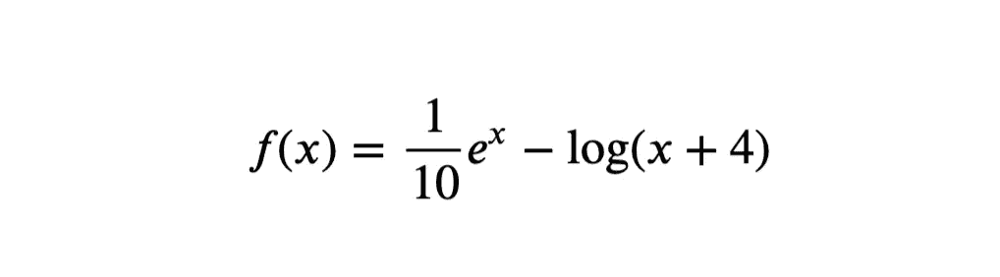
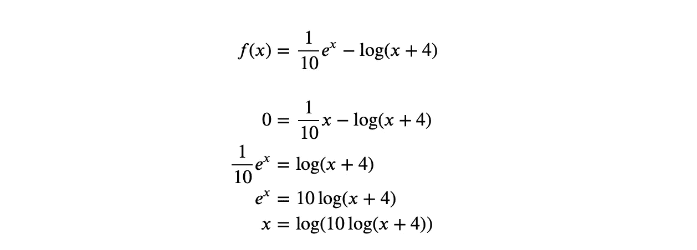
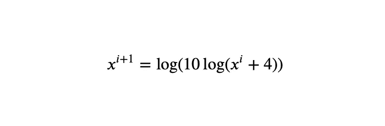
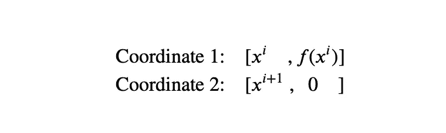
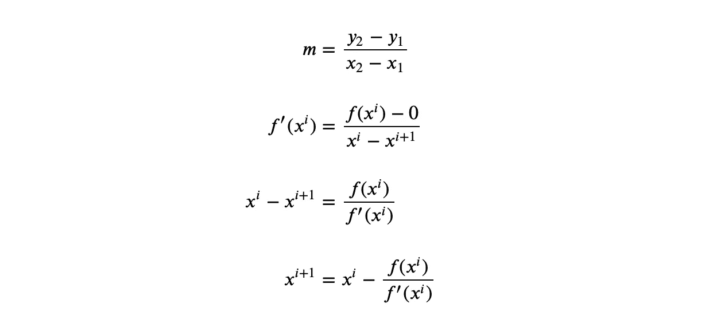
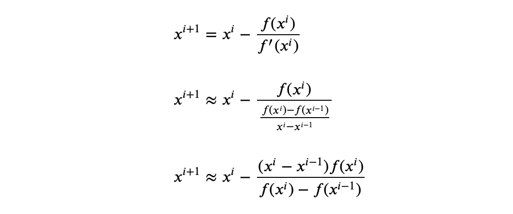
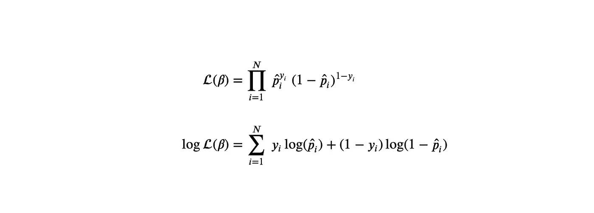
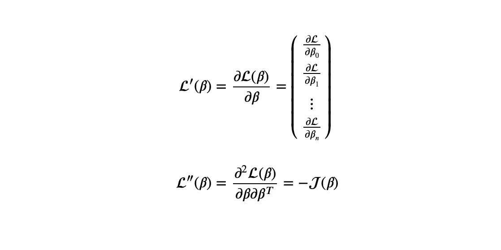
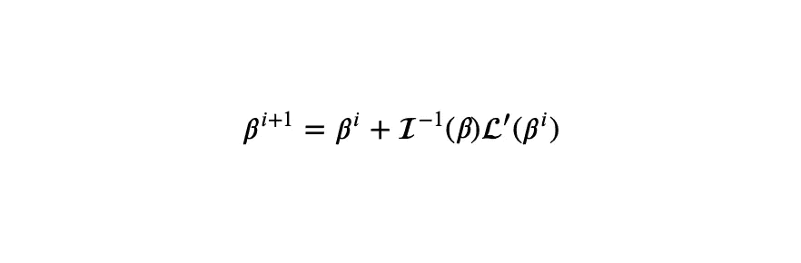
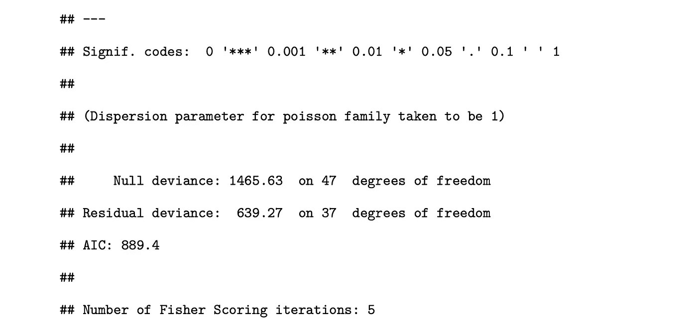

# 用 Python 实现各种求根算法

> 原文：<https://towardsdatascience.com/implementing-various-root-finding-algorithms-in-python-67917ef090b3>

## 通过在数据科学和逻辑回归中实际应用


Doggo 寻找根

在数据科学中，你会发现我们的许多任务包括最大化或最小化统计数据。在回归分析中，你会找到使误差平方和最小化的参数。在朴素贝叶斯中，你识别出**最大化**后验概率的类别。还有很多其他的例子，比如决策树**最大化**信息增益，SVM **最大化**余量，EM 算法**最大化**完全对数似然的期望，*等等*。这些计算中有一些非常基本，简单的代数就能很好地完成。然而，一些更复杂的计算需要数值算法来近似它们。

用于机器学习的最流行的优化算法当然是*梯度下降算法*。但是也有其他方法可以在数值上逼近一个函数的最大值或最小值。本文将向您展示一些可以替代*梯度下降算法*的*求根算法*。注意，每种求根算法都有特定的收敛要求；因此，没有一种算法可以普遍适用于所有问题。

求根算法是对满足任何连续函数 *f(x)* 的 *f(x) = 0* 的 *x* 值进行近似的数值方法。设 *g(x)* 为 *f(x)* 的导数。然后最大化或最小化 *f(x)* 可以通过找到 *g(x)* 的根来完成，其中 *g(x) = 0* 。我们使用求根算法来找到这些根*。*

注意，这里给出的所有算法都是迭代算法。因此，如果我提到“当前的 *x* 的值”，它仅仅意味着当前迭代的值。

对于我们所有的例子，我将在下面使用这个函数，



我们的主要功能

我将试图找出这个函数的根。如果你想最大化或最小化，你必须先求导。

# 1.定点方法

为了让我们开始，我选择了最简单的算法(在我看来)来让你感受一下求根算法是如何工作的。这个算法的思想是，在你设置了 *f(x) = 0* 之后，你要把剩下的方程排列成下面的形式 *x = g(x)* 。让我向您展示如何使用我们的函数来实现这一点，



x = g(x)格式的最终结果

请注意，您可以为任何 *f(x)* 找到多个 *g(x)* ，每个 *g(x)* 具有不同的收敛特性。接下来是从迭代的角度来看 *x = g(x)* 方程。



就迭代而言，x = g(x)

LHS 是 *x，*的下一次迭代更新，RHS 包含 *x* 的当前值。

让我们重述一下，要使用定点迭代找到 *f(x)* 的根，您必须:

1.  设置 *f(x) = 0*
2.  重新排列为 *x = g(x)*
3.  设置一个初始值 *x⁰*
4.  将 *x* 改为 *g(x)* 进行更新
5.  如果 *|f(x)|* 的值不小于εϵ，则转到步骤 4

你们中的一些人可能通过查看代码更容易理解这个概念，所以下面是我在 Python 中是如何做的，

我们不需要在定点方法的代码中指定我们的 f(x)函数，只需要指定 *g(x)* 形式。

如果我调用下面的代码，

```
FixedPoint(g, 4)
```

我会得到

```
2.965794554141745
```

定点方法到此结束。

# 2.牛顿-拉夫森方法

牛顿-拉夫森方法是最常用的求根方法之一，在数据科学中有实际应用。我们将在后面探索这个应用程序。

牛顿-拉夫森方法的思想是，给定我们当前的 *x* 的值，我们想要在 *x* 处画出 *f(x)* 的切线。然后我们在切线与 *x* 轴相交的截距处设置 *x* 的下一个值。

让我们做数学。回想一下在初中数学课上，我们被告知给定在 *xy* 平面上的 2 个点的坐标，我们可以用这个公式求出通过这 2 个点的直线的斜率，


梯度公式

把这个转化成我们的问题，我们有两组坐标。我们的第一个坐标是我们当前迭代的 *x* 及其在函数中对应的 *y* 值，或者简称为 *f(x)* 。我们的第二个坐标是新的 *x* 值及其对应的 *y* 值。但是回想一下，我们将新的 *x* 值设置为切线和 *x* 轴的交点，这意味着它的 *y* 值将始终是 *0* 。



我们的坐标

给定这些坐标，我们想要找到通过这些点的线的梯度。梯度就是由集合定义在当前 x 值处评估的 *f(x)* 的导数。



获得牛顿-拉夫逊公式

计算的最后一行是牛顿-拉夫森公式。概括地说，这个算法的步骤非常简单，

1.  设置一个初始值 x⁰
2.  给定 *x* 的电流值，找到 *f(x)* 和*f’(x)*
3.  使用牛顿-拉夫森公式更新 x
4.  如果 *|f(x)|* 的值不小于εϵ，则转到步骤 2

为了将此代码化，

注意，我使用了一个外部库来计算导数。如果能手动计算导数就更理想了。

运行下面的代码行，

```
NewtonRaphson(f, 4)
```

会回来

```
2.9657944029135495
```

这就结束了牛顿-拉夫森方法。

# 3.割线法

割线法是牛顿-拉夫逊法的一种近似。我们不是使用 *x* 的当前值来计算 *x* 的下一个值，而是使用 *x* 的当前值和先前值来计算 *x* 的下一个值。当函数的导数很难得到时，我们就用割线法。

为此，我们使用在当前值 *x* 处评估的导数 *f(x)* 的以下近似值。


割线法导数逼近

注意，这个近似值使用了当前和先前的 *x* 的迭代。然后我们把这个近似值代入牛顿-拉夫森公式。



从牛顿-拉夫逊到割线

最后一行是割线公式，我们将用它来逼近函数的根。让我们回顾一下，

1.  设定一个初始值 *x⁰* 和 *x* ，表示 *x* 的先前和当前值
2.  给定 *x* 的最后两个值，使用割线公式更新 *x*
3.  如果 *|f(x)|* 的值不小于εϵ，则转到步骤 2

为了将此代码化，

运行下面的代码行，

```
SecantMethod(f, 2, 4)
```

会回来

```
2.9657943958960433
```

割线法到此结束。

# 4.二分法

二分法是一种括号法，这意味着它需要两次初始猜测。但是与割线法不同，在割线法中，最初的两次猜测是连续的，二分法要求最初的两次猜测将根括起来。

设 ***L*** 为下界猜测，*为上界猜测。大意是如果*f(****L****f(****U****)<0*或者换句话说，*f(****L****)*和*f(****U*我们用一种有点类似于二分搜索法的方法来求这个根。注意，这意味着 ***L*** 和 ***U*** 必须是不同的符号。*****

设 ***R*** 为我们当前对 f(x)的根的猜测，我们设 ***R*** 为 ***L*** 和 ***U*** 的中点。


二分法更新公式

如果 R 不是 f(x)的实际根，我们将需要评估根是在 ***R*** 之下还是之上。我们可以使用与之前类似的逻辑对此进行测试，即测试是否*f(****L****)f(****R****)<0 和 f(****R****)f(****U****<0)如果前者成立，那么我们希望将搜索区域限制在 ***L*** 和 ***R*** 内，因此我们更新**=****R***并保持 ***L*** 的值。同样如果后者成立，我们更新***L****=****R***并保持 ***U*** 的值。我们一直这样做，直到*f(****R****)*足够接近零。**

*让我们回顾一下，*

1.  *设置一个初始化的猜测值 ***L*** 和 ***U*** ，其中至少有一根 ***R*** 必须在区域***L****<****R****<*之间*
2.  *使用二分法更新公式将 ***R*** 设置为 ***L*** 和 ***U*** 的中点。*
3.  *检查是否有*f(****L****)f(****R****)<0 和 f(****R****)f(****U****
4.  *如果是前者，设置***U****=****R***并保持 ***L*** 的值。如果是后者，设置***L****=****R***并保持 ***U*** 的值。*
5.  *如果*|****f(r)****|*的值不小于εϵ，则转到步骤 2*

*让我们把它编码，*

*运行下面的代码行，*

```
*BisectionMethod(f, 0, 5)*
```

*会回来*

```
*2.96579440290151*
```

*这就结束了二分法。*

# *5.假定位法*

*对于假定位法，我会非常简要的说明一下。该方法与二分法相同，除了我们在每次迭代中使用不同的公式更新 ***R*** 。*

**

*错误位置更新公式*

*这个更新和对分更新的区别在于，这个考虑的是*f(****L****)*和*f(****U****)*哪个更接近零。*

*我们可以从二分法中回收代码来提高效率。但是为了清楚起见，我将再次给出完整的代码。*

*运行下面的代码行，*

```
*FalsePosition(f, 0, 4)*
```

*会回来*

```
*2.965794050755957*
```

*这就结束了伪定位方法。对于本文中的所有算法，您可以通过设置一个较小的 epsilon 值来增加近似的准确性，以换取运行时间。*

# *真实数据科学应用*

*这是一个关于牛顿-拉夫森方法如何用于数据科学的数学解释推导。如果你只是在寻找关于求根方法的解释，跳过这一节。*

*我确实提到过牛顿-拉夫森方法通常用于数据科学。事实上，它被用来估计广义线性模型(GLM)的参数。最流行的 GLM 当然是逻辑回归(LR)。我将演示在 LR 拟合中使用牛顿-拉夫森方法。*

*LR 以下面的方式模拟结果的概率，*

**

*逻辑回归*

*拟合 LR 包括找到使其似然性或对数似然性最大化的所有β参数。为了简单起见，我们通常选择后者。*

**

*似然和对数似然*

*请注意，估计概率(或等式中的 p-hat)是β的函数。因此，我们现在的任务是找到使对数似然最大化的β。*

*回想一下牛顿-拉夫森公式，*

**

*牛顿-拉夫逊求根公式*

*这个公式用来求一个函数 *f(x)* 的根。如果我们想找到使函数最大化的 *x* ，我们需要在*f’(x)*上应用这个函数。牛顿-拉夫森公式因此被更新为:*

**

*函数最大化的牛顿-拉夫逊公式*

*将此转化为我们的 LR 问题，*

**

*LR 的牛顿-拉夫逊公式*

*注意到，*

**

*衍生产品的定义*

*一阶导数只是由每个参数导出的对数似然的向量( *n×1* )。二阶导数等于负雅可比矩阵( *n×n* )。负雅可比矩阵的逆也是一个( *n×n* )矩阵。当二阶导数的倒数乘以一阶导数时，我们得到一个( *n×1* )向量。*

*如果我们用雅可比矩阵相对于 *y* 的期望值来代替雅可比矩阵，这个算法就叫做 **Fisher Scoring** 。*

**

*费希尔信息*

*费希尔评分算法现在可以定义为:*

**

*费希尔评分*

*估计参数现在只是这个费希尔评分公式的迭代。如果你使用 R(编程语言)通过*远程*包来做你的 GLMs，默认的参数估计技术是 Fisher 评分算法。*

**

*以 R 表示的 GLM 输出*

*注意最后一行陈述了费希尔评分迭代的次数。这仅仅意味着牛顿-拉夫森方法的迭代次数。*

# *恭喜*

*你已经完成了基本求根算法的所有解释。特别感谢那些完成并理解逻辑回归部分的人。在 GitHub 上找到完整的代码。如果你喜欢这篇文章，请考虑鼓掌并关注。请在评论中分享你的反馈和想法。感谢您的阅读！*