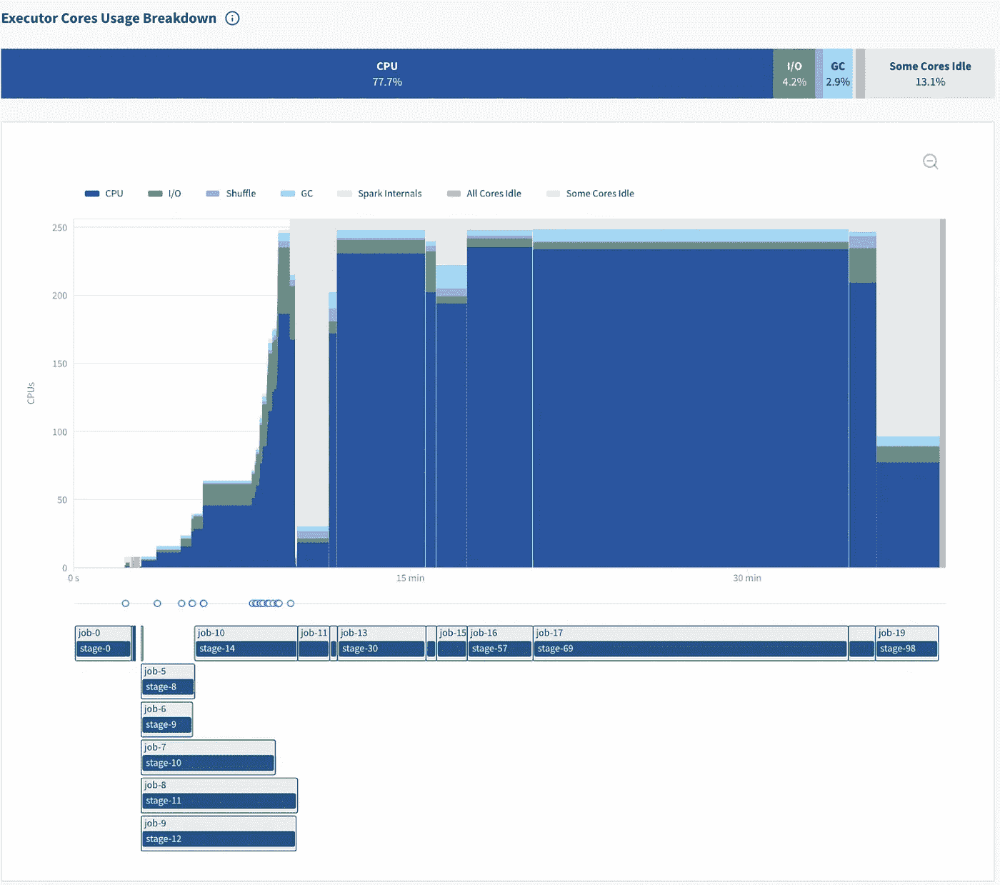

# 使用 S3 魔术提交器提高 Apache Spark 性能

> 原文：<https://towardsdatascience.com/improve-apache-spark-performance-with-the-s3-magic-committer-257a34e367af>

# 使用 S3 魔术提交器提高 Apache Spark 性能

## 使用 Spark 3.2 和 Hadoop 3.3 的最新 S3 magic committer 实现高达 65%的性能提升！

大多数 Apache Spark 用户忽略了 S3 提交器的选择(Spark 在将输出结果写入 S3 时使用的一种协议)，因为它相当复杂，并且关于它的文档很少。每当 Spark 向 S3 写入数据时，这种选择都会对性能产生重大影响。由于对于 AWS 用户来说，Spark 工作的很大一部分都花在了给 S3 写信上，所以选择合适的 S3 提交者非常重要。

随着 [Apache Spark 3.2 于 2021 年 10 月](https://www.datamechanics.co/blog-post/apache-spark-3-2-release-main-features-whats-new-for-spark-on-kubernetes)发布，一种特殊类型的 S3 提交器**魔法提交器**得到了显著改进，使其性能更高、更稳定、更易于使用。

我们在我们客户的一些管道上测试了 S3 提交器，并意识到对于像 [Weather20/20](https://www.datamechanics.co/blog-post/cost-effective-weather-analytics-at-scale-with-cloud-native-apache-spark) 这样的客户，它将 Spark 作业的速度提高了 65%。**我们现在向所有 AWS Spark 用户推荐使用该提交器。** ‍

以下是我们将在这篇博文中涉及的内容:

*   什么是 S3 委员？为什么我应该使用魔法提交器？
*   它能带来哪些性能优势？
*   我怎样才能打开魔法提交器？
*   Spark 3.2 发生了什么？对未来的 Spark 版本有什么期待？

# 什么是 S3 委员？为什么我应该使用魔法提交器？

下面是默认提交器(FileOutputCommiter)的工作方式。图片作者。

Apache Spark 和之前的 Hadoop MapReduce 一样，将工作的输出写在文件系统中。更准确地说，许多 Spark 任务并行运行，每个 Spark 任务将其输出作为文件写入。系统必须产生一致的输出，即使:

*   一些任务可以在进行中被中断(例如，定点清除、执行器内存不足错误)并在另一个执行器上重试
*   同一任务的多个副本可以在不同的执行器上并行执行(一种称为推测的机制，有助于提高性能)

为了解决这个问题，Hadoop MapReduce 使用了一种称为提交协议的技术，它列出了中间输出目录，并将文件重命名到它们的最终位置。这在 Hadoop 分布式文件系统(HDFS)上运行良好，因为列出目录会产生一致的结果，重命名文件是一个快速的“O(1)”操作。

虽然对 HDFS 来说是这样，但对 S3 来说却不是这样。在 S3 上重命名文件*不是*原子操作，它是作为一个**复制**和一个**删除**操作来实现的，运行起来大约需要 6MB/秒。

因此，Spark 的默认作业提交器(称为**fileoutputcommitter**)与 S3 一起使用是不安全的。例如，如果在重命名操作进行过程中出现故障，数据输出可能会损坏。除了不安全之外，它还可能非常慢。

为了解决这个问题，社区为 S3 开发了特殊的提交器，称为 S3A 提交器:

*   网飞开发的 staging committer。它工作得很好，但是它需要像 HDFS 或 NFS 这样的集群级共享存储来存储中间输出文件，这不太方便设置，特别是对于 Spark-on-Kubernetes 用户来说。
*   magic committer，由社区领导，是新的 Hadoop 默认值。

最初，magic committer 有一个很大的缺点:它需要安装一个 Dynamodb 数据库来启用一个名为 S3Guard 的 S3 客户端机制(“保护”您避免不一致的结果)。

自 2020 年 12 月以来， [S3 在全球范围内提供了强大的写后读一致性](https://aws.amazon.com/about-aws/whats-new/2020/12/amazon-s3-now-delivers-strong-read-after-write-consistency-automatically-for-all-applications/)，这意味着在写入文件后，当您列出目录时，您一定会看到文件(就像在笔记本电脑的硬盘上一样)。因此，没有必要再安装 S3Guard，这使得 magic committer 更易于使用。

> 要深入了解这个主题，请参阅官方 Hadoop 文档[和这篇由 Steve Loughran 和其他 Apache 贡献者撰写的关于“零重命名提交者”的研究论文](https://hadoop.apache.org/docs/stable/hadoop-aws/tools/hadoop-aws/committers.html)[。](https://github.com/steveloughran/zero-rename-committer/releases/tag/tag_release_2021-05-17)

**重要提示:**如果您使用纯清单表格式，如 Delta.io、Apache Iceberg 或 Apache 胡迪，S3 提交器与您无关，因为这些表格式处理提交过程的方式不同。

# S3 提交者可以实现哪些性能优势？

确切的性能收益取决于工作负载，但是根据经验，如果您的 Spark 工作的很大一部分用于向 S3 写入数据(这是一种非常常见的情况)，收益将会非常显著。除了性能优势之外，使用 magic committer 代替默认的 FileOutputCommitter 还可以保护您在边缘情况下免受讨厌的数据损坏错误(执行器丢失、推测等)。

让我们评估一下我们的一个客户 [Weather20/20](https://www.datamechanics.co/blog-post/cost-effective-weather-analytics-at-scale-with-cloud-native-apache-spark) 在真实世界 Spark 管道上的性能优势，这是一个天气分析平台。在使用 magic committer 之前，他们的管道将运行许多 Spark 作业和任务一个小时，然后“休息”近一个小时，在此期间，Spark 似乎是空闲的，因为没有执行任何任务，然后最终退出。

通过查看我们的免费 Spark 监控工具 [Delight](https://github.com/datamechanics/delight) ，这个问题非常明显:

右边的灰色区域表示所有 Spark 执行器都空闲了将近一个小时——然而 Spark 作业并没有退出。图片作者。

Spark 应用结束时的 48 分钟中断在 Spark driver 日志中也清晰可见:

> 21/11/08 20:52:11 INFO Dag scheduler:作业 7 已完成:在 nativemethodaccessorimpl . Java:0 处插入，耗时 3495.605049 秒
> 
> 21/11/08 21:40:13 信息文件格式写入程序:写入作业 13 ca 8 CB 6–5fc 0–4fe 9–9fd 0-bb a5 cf 9 e 2f 7 f 已提交。

最后一行提示在 20:52 到 21:40 之间，Spark 正在运行 FileOutputCommitter 协议的[作业提交](https://github.com/apache/spark/blob/master/sql/core/src/main/scala/org/apache/spark/sql/execution/datasources/FileFormatWriter.scala#L264)步骤。如前所述，S3 重命名操作非常慢(对于大型数据集)。除了缓慢的 S3 调用之外，提交者正在进行成千上万的 S3 调用，在某些情况下，这些调用可以被 S3 抑制(您可以通过启用 S3 日志并查找 503 API 响应来确认这一点)。

通过切换到 magic committer，下面是应用程序愉悦图的样子:

Spark 应用结束的空闲时间几乎完全消失了。图片作者。

这条管道现在只需 40 分钟，而以前需要 1 小时 48 分钟。这是一个 **63%** 的提升！这条管道可能是一个特别极端的改进例子，但我们经常看到向 S3 写入大量数据的管道有 15–50%的改进。所以你绝对应该亲自尝试一下。

# 我怎样才能打开魔法提交器？

您可以通过在 sparkConf 中插入一个配置标志来打开它:**" spark . Hadoop . fs . s3a . bucket . all . committer . magic . enabled ":" true "**

> **注意:**以前需要在您的 spark 配置键***spark . Hadoop . fs . s3a . bucket .<bucket>. committer . magic . enabled .***中提供 bucket 名称，这是因为最初您必须在每个 bucket 的基础上安装 S3Guard。现在 S3 已经非常稳定了，这已经没有必要了。如果传递标志***spark . Hadoop . fs . s3a . bucket . all . committer . magic . enabled，***magic committer 将在所有 bucket 上使用。

您还需要将 [spark-hadoop-cloud](https://mvnrepository.com/artifact/org.apache.spark/spark-hadoop-cloud) 库包含在 docker 映像中或作为一个依赖项，因为它提供了 S3A 提交者使用的类。如果您缺少这个依赖项，您将会得到一个类似这样的错误:***Java . lang . classnotfoundexception:org . Apache . spark . internal . io . cloud . pathoutputcommitprotocol***

要验证是否使用了神奇的提交器，最简单的方法是在 Spark 驱动程序日志中查找单词“committer”。

如果您看到这样的日志:

> 21/11/08 19:53:54 WARN abstracts 3a Committer factory:21/11/08 19:53:54 INFO FileOutputCommitter:文件输出提交器算法版本为 1 **使用标准 File Output Committer 提交工作。这既慢又有潜在的不安全。**

那么就有一个问题了——使用了标准的 FileOutputCommitter。正如警告所说，它速度慢，而且有潜在的不安全因素。但是，如果您看到下面的日志，那么您就知道 magic committer 被正确地使用了:

> 21/11/14 00:05:11 信息摘要 3ACommitterFactory: **使用 committer magic** 将数据输出到 s3a://…

# Spark 3.2 发生了什么？对未来的 Spark 版本有什么期待？

Spark 3.2 使得魔术提交器更容易使用( [SPARK-35383](https://issues.apache.org/jira/browse/SPARK-35383) )，因为你可以通过插入一个配置标志来打开它(以前你必须传递 4 个不同的标志)。Spark 3.2 也建立在 Hadoop 3.3.1 的基础上，Hadoop 3 . 3 . 1 包含了针对 magic committer 的错误修复和性能改进。[阅读我们关于 Spark 3.2 的文章](https://www.datamechanics.co/blog-post/apache-spark-3-2-release-main-features-whats-new-for-spark-on-kubernetes)，了解更多关于这个版本的主要特性和改进。

> ***注:*** 另一个无关的 Hadoop 3.3 改进。如果通过配置标志***" spark . Hadoop . fs . s3a . directory . marker . retention ":" keep "***Hadoop 会停止不必要的删除[目录标记](https://hadoop.apache.org/docs/stable/hadoop-aws/tools/hadoop-aws/directory_markers.html)。您需要选择加入这种行为(您需要传递标志)，因为它不是向后兼容的。只有当所有 Spark 应用程序都使用 Hadoop 3.3+时，才应该传递这个标志。

Steve Loughran(自 2000 年以来一直是 Apache 软件基金会的成员)正在为 Azure 和 GCP 的对象存储( [MAPREDUCE-7341](https://issues.apache.org/jira/browse/MAPREDUCE-7341) )构建类似的任务清单提交算法，并提高 magic committer([HADOOP-17833](https://issues.apache.org/jira/browse/HADOOP-17833))的性能。这是一个巨大的工作量(谢谢史蒂夫！)首先需要贡献给 Hadoop，然后由一个新的 Spark 版本来完成。

# 结论

从 Spark 3.2 开始，我们向通过管道向 S3 写入数据的 AWS Spark 用户强烈推荐 magic committer(除非他们已经在使用像 Delta、胡迪或 Iceberg 这样的表格式)。通过切换单个配置标志，您可以在管道上实现高达 65%的性能提升，并避免由默认的 FileOutputCommitter 导致的严重的数据损坏错误。

*原 NetApp 博客现场发布:*[*https://spot.io/blog/*](https://spot.io/blog/improve-apache-spark-performance-with-the-s3-magic-committer/)