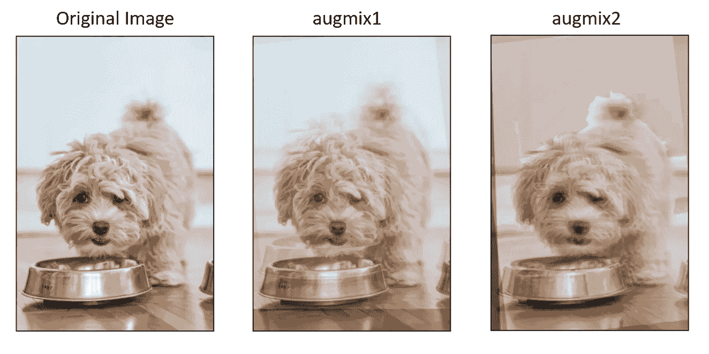
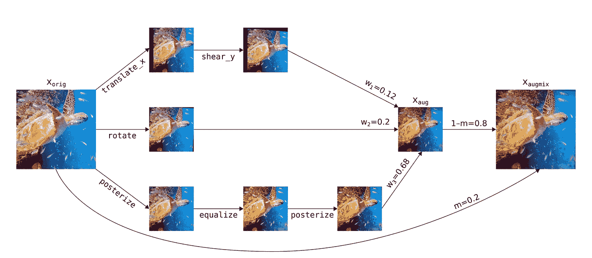
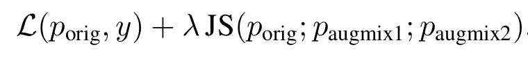
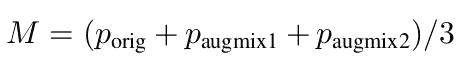
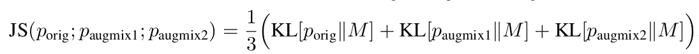

# 利用 AugMix 增强图像分类模型的鲁棒性

> 原文：<https://towardsdatascience.com/improve-image-classification-robustness-with-augmix-59e5d6436255>

## 添加 AugMix 增强影像之间的一致性损失，以增强影像分类模型的泛化能力



图 1 -可视化 AugMix:原始图像(左)和两个增强版本。|作者图片

**简介**

图像分类模型最能够预测来自与训练数据相同的分布的数据。但是，在现实世界中，输入数据可能会有变化。例如，当使用不同的相机进行推理时，照明条件、对比度、颜色失真等。可能会因定型集而异，并显著影响模型的性能。为了解决这一挑战，由 [*亨德里克斯等人*](https://arxiv.org/abs/1912.02781)*【1】*提出的 AugMix 算法可以应用于任何图像分类模型，以提高其鲁棒性和不确定性估计。**

**AugMix 是一种生成每个训练图像的增强变化的数据增强技术。当与一致性损失结合时，它鼓励模型对同一图像的所有版本做出一致的预测。虽然使用这些扩充数据版本训练模型需要更长的时间，但生成的模型变得更加稳定、一致，并且对大范围的输入具有抵抗力。**

****AugMix 增强技术****

**训练图像的增强版本是通过应用三个并行链来生成的，这三个并行链由一个到三个随机选择的增强操作组成，例如平移、剪切和对比度，具有随机确定的强度。然后，这些链以不同的权重与原始图像组合，以产生单一版本的增强图像。增强版本包含了几个随机性来源，包括操作的选择、这些操作的强度、增强链的长度和混合权重。**

****

**图 2:aug mix 扩增链的实现，摘自 Hendrycks 等人(2020)。**

**对于每个训练图像，AugMix 生成两个保留图像语义内容的增强版本(augmix1 和 augmix2)。您可以在图 1 中查看图像及其增强版本的演示。**

****加载带有 AugMix 版本的数据集****

**数据加载器应该处理原始图像及其使用 AugMix 技术生成的修改版本。PyTorch 图像模型(timm)库[2]为创建 PyTorch 数据集和生成这些 AugMix 增强提供了一个方便的实现。**

```
**train_dir = '/path/to/training/images/dir/'
train_dataset = ImageDataset(train_dir)
train_dataset = AugMixDataset(train_dataset, num_splits=3) 
loader_train = create_loader(train_dataset,
    input_size=(3, 224, 224),
    batch_size=32,
    is_training=True,
    scale=[0.08, 1.],
    ratio=[0.75, 1.33],
    num_aug_splits=3)**
```

**上面的代码创建了一个训练数据集和一个数据加载器。`ImageDataset`类用于从训练图像创建数据集对象。`AugMixDataset`类用于通过生成原始图像的附加修改版本来扩充训练图像。`num_splits`参数指定了每幅图像应该生成多少个增强版本。例如，如果`num_splits=3`，那么对于数据集中的每个图像，除了原始图像之外，还会生成两个修改版本。论文作者建议使用两个增强版本，因此 num_splits 应该设置为 3。`create_loader`函数用于创建数据加载器对象，该对象可用于在训练过程中小批量迭代训练数据集。**

****詹森-香农一致性损失****

**在每次向前传递中，原始图像与两个增强图像 augmix1 和 augmix2 一起传递给模型。为了鼓励模型对相同输入数据的不同增强版本做出一致的预测，将 Jensen-Shannon 散度(JS)添加到原始交叉熵损失(L)中，并通过 lambda 超参数进行加权。**

****

**Jensen-Shannon 一致性损失由原始交叉熵损失(L)和 Jensen-Shannon 散度(JS)组成**

**詹森-香农散度(JS)通过首先获得平均预测概率来计算:**

****

**然后，计算每个图像版本和平均预测概率之间的平均 KL 散度。**

****

**Jensen-Shannon 一致性损失迫使模型相似地嵌入同一图像的所有版本，这可以帮助它学习更鲁棒和可概括的特征。**

**timm 库包括 Jensen-Shannon 一致性损失的用户友好实现。`num_splits`参数指定了扩充版本的数量。`alpha`参数，在原始论文中也称为加权因子λ，指定了 JSD 项的加权因子。默认值为 12，但应进行调整以最适合用于定型模型的数据的特征。**

```
**loss_fn = JsdCrossEntropy(num_splits=3, alpha = 12)**
```

****代码概述****

**下面的代码演示了如何使用 timm 库将 AugMix 数据扩充技术合并到简化的训练循环中。该代码首先使用 AugMix 技术创建一个训练数据集，以生成原始图像的修改版本。数据加载器迭代训练数据集，处理原始图像及其增强版本。还创建了模型、损失函数、优化器和调度器。最后，训练循环在数据加载器上迭代指定数量的时期。**

```
**from timm import create_model
from timm.data import ImageDataset, AugMixDataset, create_loader
from timm.loss import JsdCrossEntropy
from timm.optim import AdamP
from tqdm import tqdm
from timm.scheduler import CosineLRScheduler
from matplotlib import pyplot as plt

epochs = 50

train_dir = '/path/to/training/images/dir/'
train_dataset = ImageDataset(train_dir)
train_dataset = AugMixDataset(train_dataset, num_splits=3)
loader_train = create_loader(train_dataset,
    input_size=(3, 224, 224),
    batch_size=1,
    is_training=True,
    scale=[0.08, 1.],
    ratio=[0.75, 1.33],
    num_aug_splits=3)

model = create_model('resnet18', pretrained=True, num_classes=2).cuda()
loss_JSL = JsdCrossEntropy(num_splits=3)
optimizer = AdamP(model.parameters(), lr=0.01)
scheduler = CosineLRScheduler(optimizer, t_initial=epochs)

for epoch in tqdm(range(epochs)):
    for batch in loader_train:
        inputs, targets = batch

        # Forward pass
        outputs = model(inputs)
        loss = loss_JSL(outputs, targets)

        # backward_pass
        loss.backward()           
        optimizer.step()          
        optimizer.zero_grad()     

    scheduler.step(epoch + 1)**
```

****结束语****

**总之，AugMix 是一种强大的数据处理技术，用于提高图像分类器的鲁棒性和不确定性估计。在部署过程中遇到的数据分布可能不同于训练分布的情况下，例如使用不同的摄像机捕获图像时，这种方法很有用。AuxMix 已被证明可以有效地提高泛化性能，而无需对基本模型进行任何更改，并且在 ImageNet-C 上的域泛化挑战中被公认为最先进的(SOTA)算法，ImageNet-C 是一个基准数据集，包括应用于 ImageNet 数据集图像的各种损坏。它实现起来很简单，并且值得它增加到训练过程中的计算开销。就个人而言，我发现它在我的项目中很有用，我推荐它作为一种工具，为图像分类器的健壮性增加额外的价值。**

# **感谢您的阅读！**

****想了解更多？****

*   **[**探索**](https://medium.com/@lihigurarie) 我写过的附加文章**
*   **[**订阅**](https://medium.com/@lihigurarie/subscribe) 在我发布文章时得到通知**
*   **关注我的 [**Linkedin**](https://www.linkedin.com/in/lihi-gur-arie/)**

*****参考文献*****

**[1] [亨德里克斯博士，金佩尔 k .，&金，B. (2020)。AugMix:一种提高稳健性和不确定性的简单数据处理方法。预印本 arXiv:2006.13718。](https://arxiv.org/abs/1912.02781)**

**PyTorch 图像模型(timm)库。[https://timm.fast.ai/](https://timm.fast.ai/)**