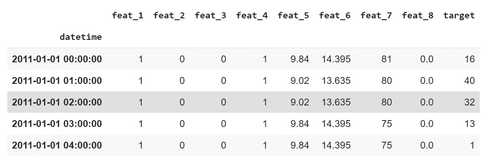
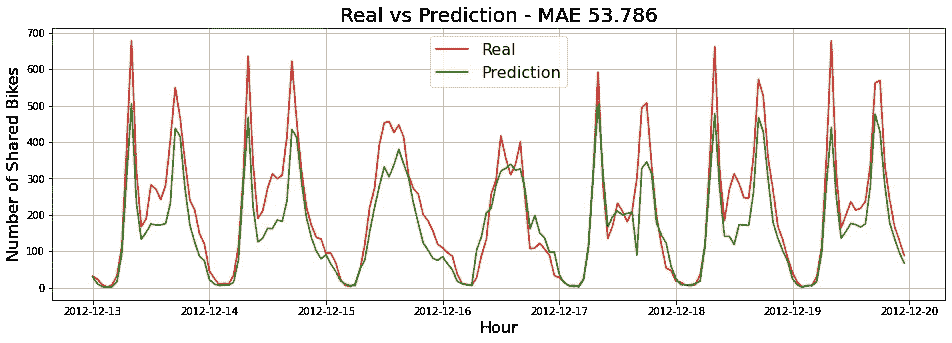
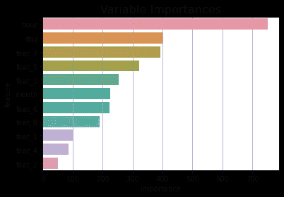
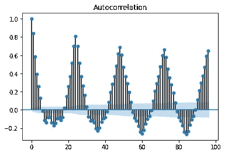
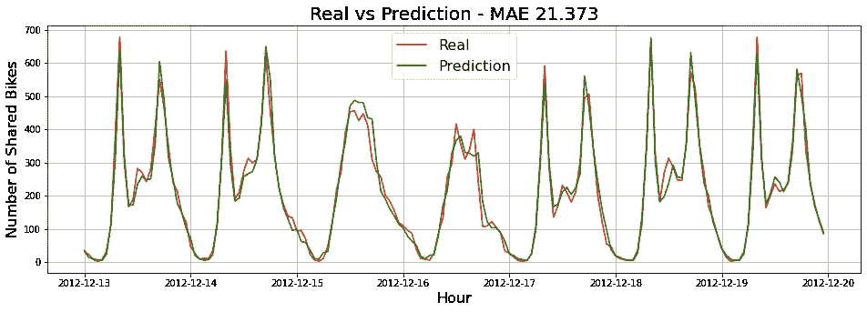
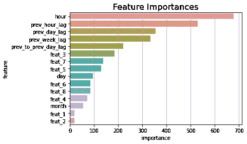
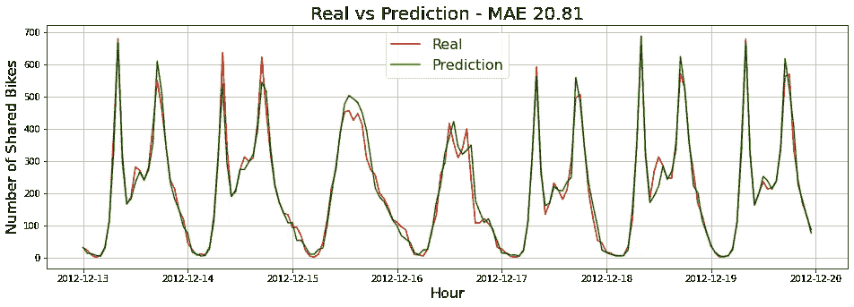
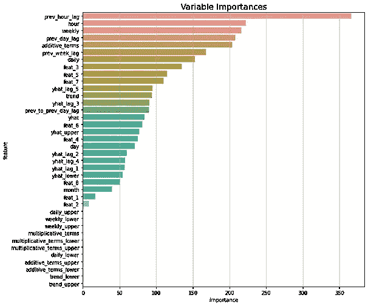

# 使用脸书预言家模型提高时间序列预测性能

> 原文：<https://towardsdatascience.com/improve-time-series-forecasting-performance-with-facebook-prophet-model-f7e83ffab6a3>

## 时间序列特征工程和预测基本指南

科林·伯伦斯来自[的图片](https://pixabay.com//?utm_source=link-attribution&amp;utm_medium=referral&amp;utm_campaign=image&amp;utm_content=3068300)

时间序列预测涉及基于历史时间戳数据值和外部因素构建模型，以做出科学预测，推动未来的战略决策。鉴于其对相关决策的直接影响，为准确可靠的预测训练稳健的时间序列预测模型是最具挑战性的任务之一。时间序列预测模型的稳健性完全取决于建模前进行的特征工程和数据分析。

> 在之前的一篇文章中，我讨论了一个开源包 tsfresh，它可以为您的时间序列用例生成数百个相关特性。

 [## 用几行 Python 代码实现时间序列特征工程的自动化

### 为您的时间序列用例提取数百个相关特征

towardsdatascience.com](/automate-time-series-feature-engineering-in-a-few-lines-of-python-code-f28fe52e4704) 

即使在包括 tsfresh ad 外部特征之后，时间序列模型有时也不会预测到与业务预期相匹配。在本文中，我们将讨论和实现如何使用脸书先知模型的特征来提高监督时间序列模型的性能。

## 开始使用:

我们将使用自定义生成的基于时间的样本数据集，该数据集具有 8 个独立特征和一个连续的从属特征“目标”。我们将为不同的特征工程策略训练一个轻型 GBM 模型:

*   具有外部特征的轻型 GBM
*   轻型 GBM，带外部特征+滞后
*   Light-GBM 带外部功能+ lags + facebook prophet 功能

我们将实现并比较上述每个特征工程策略的性能，并得出脸书先知特征在训练稳健模型中是否有效的结论。

## 数据:

基于时间的原始数据是基于时间的，并且具有 8 个独立特征和作为从属特征的“目标”。我已经创建了小时、日和月特性来捕获数据中的时间因素。在下面找到一个数据示例:

(图片由作者提供)，样本数据快照

# 训练轻型 GBM 模型:

我们将在上述原始样本数据上训练一个 light-GBM 模型，并计算其最佳性能特征，以及用于基准测试的 MAE(平均绝对误差)。

(图片由作者提供)，**左:**绘制可视化推理数据的真实值和预测值，**右:**轻型 GBM 模型的最佳性能特征

对于推断数据，我们得到了的**MAE**53.79**，表现最好的特征是小时、日、湿度等。**

# 带滞后的轻型 GBM:

先前的模型仅根据外部因素/数据进行训练，不涉及从属特征“目标”的滞后。为了计算要包含的滞后数，我们可以观察自相关。

(图片由作者提供)，相关特征“目标”的自相关图

从上面的关联图中，我们可以观察到“目标”功能在 1 小时、24 小时、48 小时等时间内都具有很高的相关性。因此，我们可以创建计算滞后要素的要素:

*   通过将目标值移动 1 小时，获得 1 小时滞后变量
*   通过将目标值移动 1 天，获得 1 天的滞后变量
*   通过将目标值移动 2 天，获得 2 天滞后变量
*   通过将目标值移动 1 周，获得 1 周的滞后变量

我们将包括先前的静态特性和滞后特性。

(图片由作者提供)，**左:**绘制可视化推理数据的真实值和预测值，**右:**轻型 GBM 模型的最佳性能特征

对于推断数据，我们得到了 21.37 的 **MAE，性能最好的特性是小时、前一小时滞后、前一天滞后等。**

# 带 lags + FB Prophet 功能的轻型 GBM:

我们现在将包括脸书先知包的功能。想法是在训练数据上训练 FB Prophet 模型，并利用来自`**prophet.predict()**` API 的训练和推理特征来生成 22 维统计特征。

(图片由作者提供)，**左:**绘制可视化推理数据的真实值和预测值，**右:**轻型 GBM 模型的最佳性能特征

对于推断数据，我们得到了 20.81 的 **MAE，性能最好的特性是前一小时滞后、当前小时、每周、前一天滞后、附加特性等。**

# 结论:

在本文中，我们已经讨论了一些时序用例的特性工程策略。根据我们对数据样本的实验，原始数据集给出的 MAE 为 **53.78，**在包括滞后之后，MAE 提高到 **21.37** 。在引入脸书先知 API 的统计特征后，MAE 进一步提高到 **20.81** 。

虽然在包含 FB Prophet 特性后 MAE 的改进还不够，但它仍然可以在其他用例或真实世界数据集的更大样本中表现良好。

# 参考资料:

[1]https://facebook.github.io/prophet/脸书先知文献:

> 感谢您的阅读