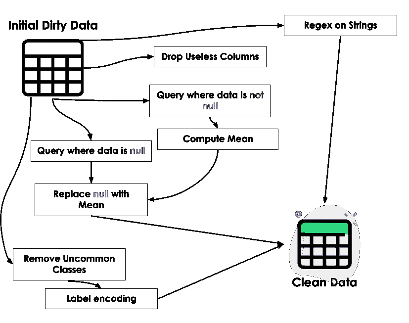
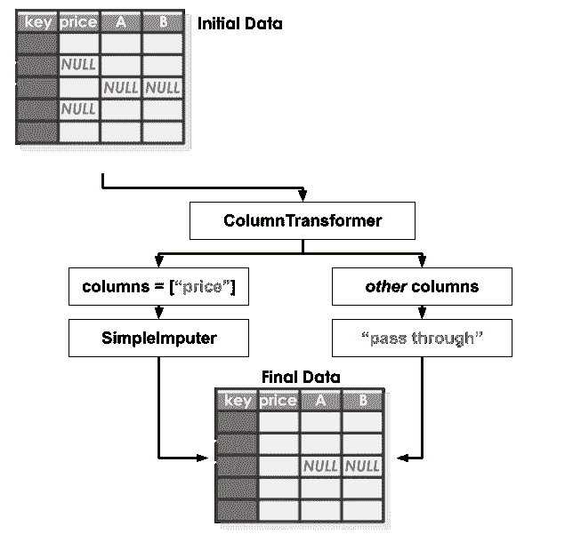
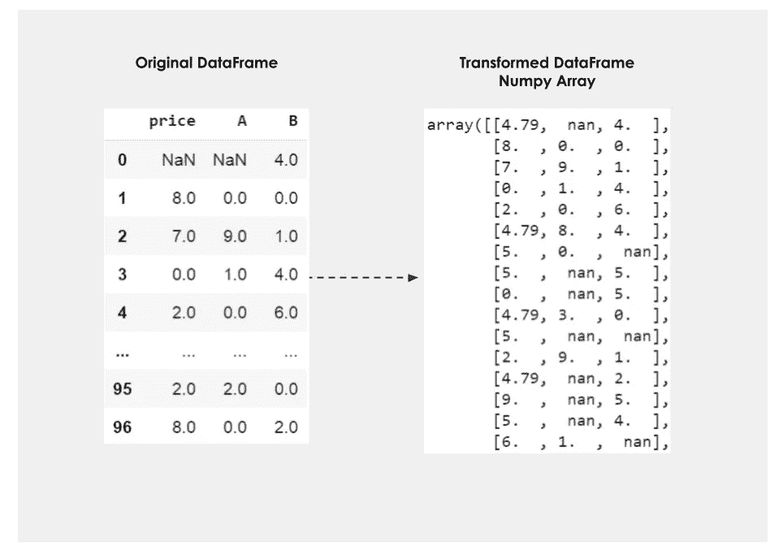
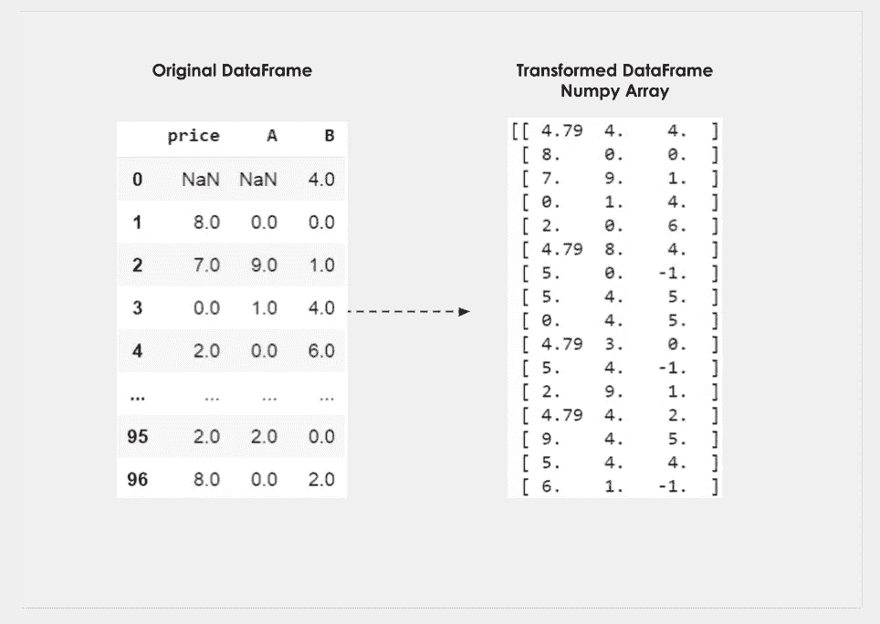
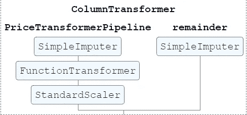
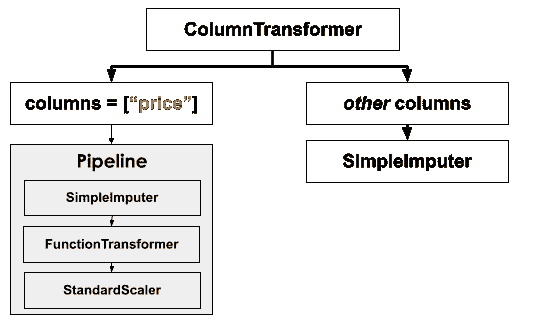
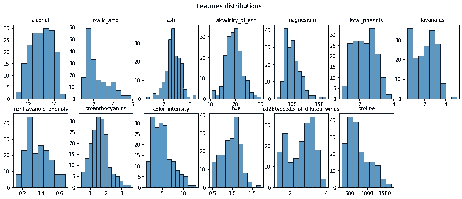
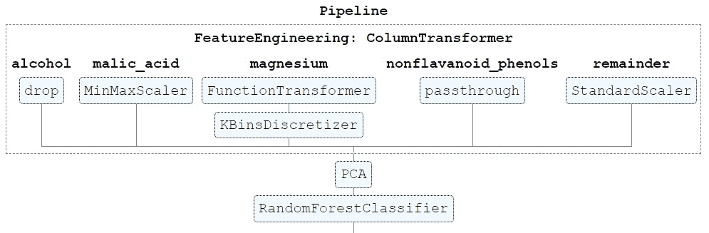

# 使用 ColumnTransformer 和管道改进数据预处理

> 原文：<https://towardsdatascience.com/improve-your-data-preprocessing-with-columntransformer-and-pipelines-b6ff7edd2f77>

## 使用 Sklearn 的 ColumnTransformer 创建高度定制和有组织的预处理管道

西蒙·卡杜拉在 [Unsplash](https://unsplash.com?utm_source=medium&utm_medium=referral) 上的照片

# 介绍

数据预处理可能是机器学习/数据科学管道中最耗时的步骤之一。

在大多数现实场景中，可用的原始数据是无格式的、脏的，并且不适合机器学习模型/数据分析，需要几个步骤**清理**和**特征工程**。

在结构化数据(表)的上下文中，开发人员需要处理各种各样的问题，比如缺失值、非规范化数据、无格式字符串、重复行等。

他们还需要通过标准化数字特征、嵌入分类特征、创建更有意义的列以及许多其他步骤来提高 ML 模型性能或改进仪表板的质量，从而改进数据表示。

这种对数据帧实施特定规则的需求很容易导致产生错综复杂的代码，难以维护和更新，并且容易出错。

数据预处理。图片作者。弗里皮克的图标。

Sklearn 的 Pipelines with ColumnTransformer 是一种以标准方式应用转换规则的简单方法，创建了一个更有组织和更干净的代码。

# 了解列转换器

> 如果您已经熟悉了来自 *sklearn* 的 ColumnTransformer 模块，您可以跳过这一节。

在处理表格数据时，通常要对不同的数据列执行几个清理步骤。

例如，数字特征“价格”可能需要用数据平均值替换空值的操作。正如你可能已经知道的，Sklearn 提供了一个转换器来实现这个功能，即**简单估算器**。

ColumnTransformer 允许的是只在一组列中应用 Sklearn 的**转换器**。

了解 ColumnTransformer。图片作者。弗里皮克的图标。

让我们看看这在代码中是如何工作的。

ColumnTransformer 对象接收一个元组列表，该列表由转换器名称(这是您的选择)、转换器本身以及要应用转换的列组成。参数 *remainder* 指定需要对所有其他列做什么。

下图显示了代码输出。

DataFrame 列转换(1)。图片作者。

替换操作只发生在指定的列中，而其余的保持不变(由*余数* =“通过”指定)。熊猫数据帧也被 Numpy 数组取代，因为这是 Sklearn 变形金刚的默认行为。

让我们看一个更复杂的例子。

在上面的例子中,“Price”列的空值被替换为平均值,“A”列的空值被替换为中值，所有其他列的空值被替换为值-1。下图显示了结果。

数据帧列转换(2)。图片作者。

*提示*:如果你正在使用 Jupyter 笔记本，通过在 Sklearn 的配置中设置 display =“diagram ”,可以非常容易地在[交互图](https://scikit-learn.org/stable/auto_examples/miscellaneous/plot_pipeline_display.html)中显示评估者。

下面的代码进行了这种配置，图像显示了前一个示例的可视化效果。

希望您已经理解了 ColumnTransformer 类的强大功能。这是一种对许多列执行转换的简单方法，所有的逻辑都封装在一个对象中。

# 对管道使用列转换器

ColumnTransformer 相当有用，但还不够。在许多情况下，一个列需要分多个步骤进行处理。

例如，数字特征“价格”可能需要用数据平均值替换空值的操作、更对称地分布数据的对数变换以及使其值更接近区间[-1，1]的标准化。

不幸的是，sklearn 中没有转换器来完成所有这些工作，这就是**管道**的用武之地。

通过管道，我们可以将多个变压器连接起来，形成一个复杂的流程。因为管道对象相当于一个简单的转换器(例如，它有相同的*)。fit()* 和*。transform()* 方法)，它可以插入到 ColumnTransformer 对象中。

您还可以将 ColumnTransformer 放在管道中，因为它也是一个简单的 Transformer 对象，并且这个循环可以根据您的需要继续下去。

这就是 Sklearn 架构的妙处之一:所有的变形金刚模块共享同一个*接口*，因此它们可以轻松地协同工作。

让我们看看这在代码上是如何工作。

管道对象有一个非常直观的界面。它接受一个元组列表，每个元组代表一个转换器，带有您选择的名称和转换器对象本身。它以指定的顺序应用转换。

下图显示了之前创建的转换器。

带管道的柱式变压器。图片作者。

# 正在做一个例子

让我们通过在 Sklearn 上为葡萄酒分类数据集[4]制作一个分类器管道，快速探索这种技术如何在“真实案例”中有所帮助。

该数据集包含 13 个关于葡萄酒化学性质的数字特征，分为 3 类。下面的代码导入数据。

导入数据

绘制特征分布图，我们可以选择每个人需要的治疗方法。

特征分布。图片作者。

让我们假设选择了以下处理方法:

*   **苹果酸** : *最小-最大*结垢
*   **镁** : *对数*变换，离散化 4 个仓中的值
*   **灰**:掉落特征
*   **非类黄酮 _ 酚类**:无
*   **任何其他**:标准定标器

之后，数据需要经过 PCA 降维，然后到达 RandomForestClassifier。

下面的代码显示了如何构建这个管道。

管道看起来像这样:

然后，我们可以将该对象用作普通分类器:

这个练习的主要目标是展示将所有这些复杂的逻辑封装到一个单一的对象(估计器)中是可能的。最终的对象与所有其他 sklearn 模块兼容，这可以使生活变得容易得多。

例如，可以执行网格搜索，从预处理步骤到分类器本身改变超参数。由于 sklearn 架构，创建新模块(转换器、分类器、回归器等)相当容易..)所以，如果你需要一个非常具体的任务，创建一个新的类并使之与管道兼容是非常容易的。estimator 架构也很容易序列化，所以它可以以各种格式存储，比如 JSON 和 XML。

最后，代码是干净的和标准化的，这使得更新和维护更容易。

# 结论

预处理数据是任何数据科学过程中至关重要的一步。然而，当每个数据集的特殊性出现时，预处理步骤可能变得非常复杂，并且充满了特定的领域规则。

在这种情况下，在单个对象中维护所有的转换可能非常有用，因为单个实例可以很容易地移动、存储和更新。

这篇文章探讨了 Sklearn column transformer 类如何通过将所有预处理逻辑封装在一个地方，同时保持对象之间的高度标准化，来提高代码质量和组织。

尽管这篇文章专门探讨了 ColumnTransformer 类，但是逻辑可以扩展到其他 sklearn 模块，因为这篇文章的主要目标是展示如何生成更健壮的代码。Sklearn 的架构非常有条理，了解更高级的能力可以让你的生活轻松很多。所以，我希望这篇短文能帮到你。

感谢阅读！:)

## 参考

[1] Scikit-Learn，[关于 ColumnTransformer](https://scikit-learn.org/stable/modules/generated/sklearn.compose.ColumnTransformer.html)
的官方文档【2】Scikit-Learn，[关于管道](https://scikit-learn.org/stable/modules/generated/sklearn.pipeline.Pipeline.html)的官方文档
【3】géRon，A. (2019)。使用 Scikit-Learn、Keras 和 TensorFlow 进行机器学习:构建智能系统的概念、工具和技术。奥莱利媒体公司。UCI:葡萄酒数据集。[知识共享署名 4.0 国际](https://creativecommons.org/licenses/by/4.0/legalcode) (CC BY 4.0)许可”