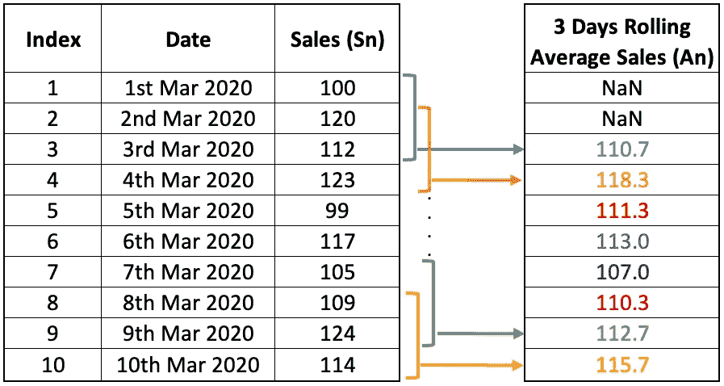
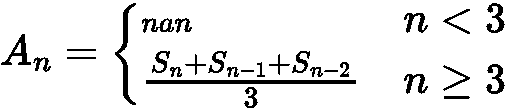
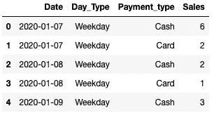
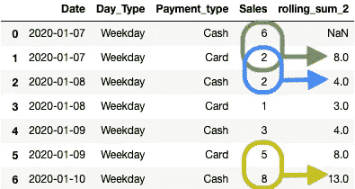
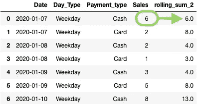
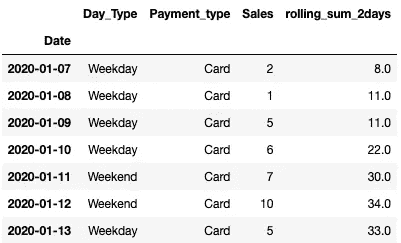
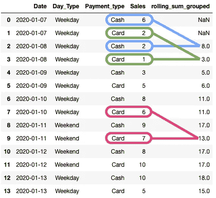
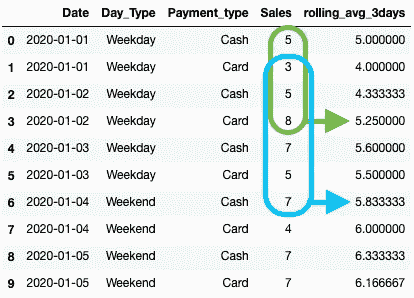
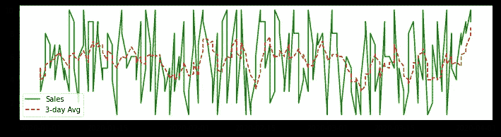

# 使用 Pandas 中的滚动功能改进您的数据科学工作流程

> 原文：<https://towardsdatascience.com/improve-your-data-science-workflow-with-rolling-functions-in-pandas-69c4b44e3f7e>

## 熊猫滚动特征指南

安妮·斯普拉特在 [Unsplash](https://unsplash.com?utm_source=medium&utm_medium=referral) 上的照片

我们今天看到的许多表格数据分析都是由流行的 Pandas 基于系列的方法驱动的，这些方法一次性考虑所有数据进行分析。这些方法通常包括使用`value_counts()`评估序列分布，使用`unique()`确定唯一值，使用`groupby()`找到基于另一列中的值分离的一列的分布，或者使用`crosstab()`从多列中生成值的交叉表等。

然而，另一组经常被数据科学家忽视的强大的特征工程方法是**基于窗口的数据分析**。这里，不是在整个数据列上估计特定的数据统计/度量，而是考虑预定义数量的连续记录(或值窗口)来进行评估。

例如，考虑下面的虚拟销售数据。我们可以通过同时聚合三个记录来计算每个销售日的平均三天滚动销售额，如图所示。

商店销售的虚拟数据集(图片由作者提供)

下图描述了计算三天滚动平均值的数学公式。

计算三天滚动平均值的公式(图片由作者提供)

这类特征生成方法尤其适用于时间序列数据。寻找*滚动平均值*、*滚动总和*、*滚动最小值、*和*滚动最大值*是基于窗口的特征工程方法的一些最常见的应用。

这篇文章是熊猫滚动特征的介绍性指南。我将借助虚拟数据框演示计算滚动特征的方法。

你可以在这里找到这篇文章[的笔记本。](https://deepnote.com/workspace/avi-chawla-695b-aee6f4ef-2d50-4fb6-9ef2-20ee1022995a/project/Rolling-Window-Pandas-fa9dd7e3-c9cc-4931-9dd5-1e3103832fba/%2Fnotebook.ipynb)

我们开始吧🚀！

# 资料组

出于本文的目的，我创建了一个从`7th Jan 2020`到`13th Jan 2020`为期 7 天的虚拟每日商店销售数据集。对应每个日期，我们知道它是`weekend`还是`weekday`。此外，我生成了一个随机销售号码，对应于现金和信用卡支付模式。这在下面实现。

下图显示了虚拟销售数据集的前五行:

数据帧的前五行(图片由作者提供)

# 滚动功能

如上所述，窗口函数每次考虑行的子集，以估计给定数据的统计/测量。在 Pandas 中，可以使用`[df.rolling()](https://pandas.pydata.org/docs/reference/api/pandas.DataFrame.rolling.html#pandas.DataFrame.rolling)`类来访问这个函数家族。创建的 python 对象的类型如下所示:

## 滚动总和

顾名思义，滚动和方法计算预定义数量的连续记录的移动和。这在下面的虚拟数据集上有详细说明:

窗口大小为 2 时滚动求和的结果(图片由作者提供)

对于`window=2`，我们打算对`2`连续记录上的“销售”列求和。另外，请注意滚动总和列的第一个值是`NaN`。

如果您想只考虑第一条记录来计算第一条记录的滚动和，请在滚动类的定义中传递`min_periods=1`,如下所示:

在最小周期数为 2 的窗口大小上滚动求和的结果(图片由作者提供)

`min_periods`参数指定生成滚动值所需的当前窗口中的最小观察次数；否则结果是`NaN`。

## 几天的累计总和

接下来，假设您想要计算过去两天的滚动总和，而不是上面讨论的前两个记录。

在这种情况下，获取几天的滚动总和而不是记录是非常重要的。这是因为我们有多个对应于同一日期的记录。因此，如果您想要查找多日窗口内的销售额，您可以执行以下操作:

两天的累计结果(图片由作者提供)

参数`window=’2d’`被滚动类解释为“2 天”。同样，如果您想获得 2 秒内的滚动和，您可以指定`window=’2s’`。

这里，如果您只想过滤对应于每个日期的最后一条记录，您可以使用如下的`groupby()`方法:

过滤滚动总和以获得每天的最后一条记录(图片由作者提供)

## 分组轧制

最后，假设您希望分别为支付和现金卡模式生成滚动总和。换句话说，滚动求和应该在一列上分组。这也可以通过向数据帧添加一层`groupby()`并计算各个组的滚动特征来实现。下面演示了这一点:

按 Payment_type 分组的窗口大小为 2 的滚动求和结果(图片由作者提供)

# 其他轧制方法

类似于上面讨论的基于总和的窗口操作，Pandas 还允许您执行各种其他滚动功能。这些包括滚动平均值、标准偏差、最小值和最大值等。你可以在这里找到所有支持的方法。下面我们来讨论其中的一个。

## 滚动平均值

滚动平均，也称为移动平均，计算值窗口内的值的平均值。移动平均是数据科学中用于时间序列数据的一种流行的数据分析技术。

就 Pandas 中的语法而言，我们上面讨论的一切都保持不变，除了我们用`mean()`代替`sum()`来寻找移动平均线。这将在下面演示。

注意:为了演示移动平均线，我创建了三个月的虚拟数据，从`1st Jan 2020`到`31st Mar 2020`。

min_periods = 1 时窗口大小为 6 的移动平均结果(图片由作者提供)

您可以使用 Matplotlib 绘制移动平均值，如下所示:

描绘移动平均值和实际值的折线图(图片由作者提供)

总之，在这篇文章中，我们讨论了 Pandas 中的滚动功能，以及如何在下一个时间序列分析的表格数据分析中使用它们。

要了解 Pandas 的“窗口”模块中可用的更多方法，我强烈推荐在这里查看 Pandas 的官方文档。

一如既往，感谢阅读。下面是我的一些其他文章，你可能会喜欢读:)

   