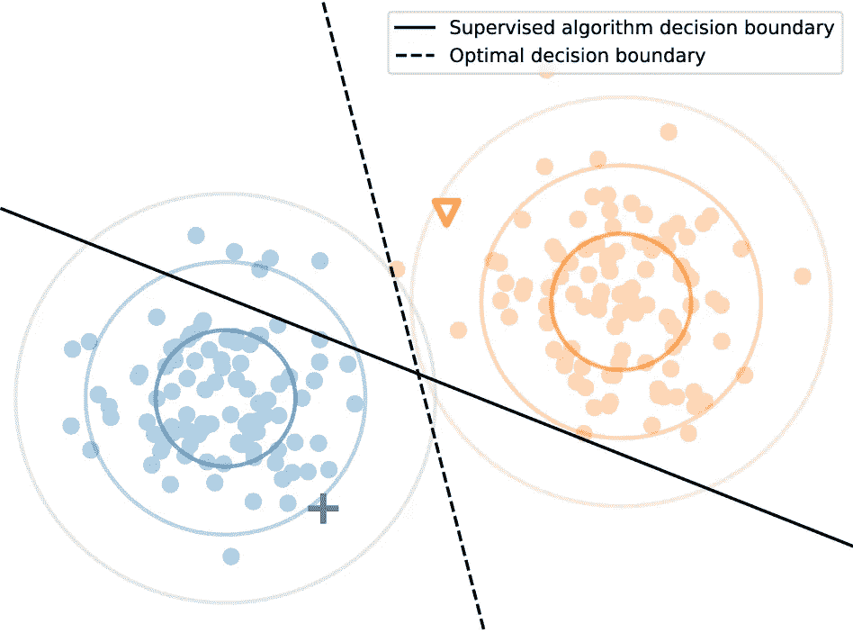
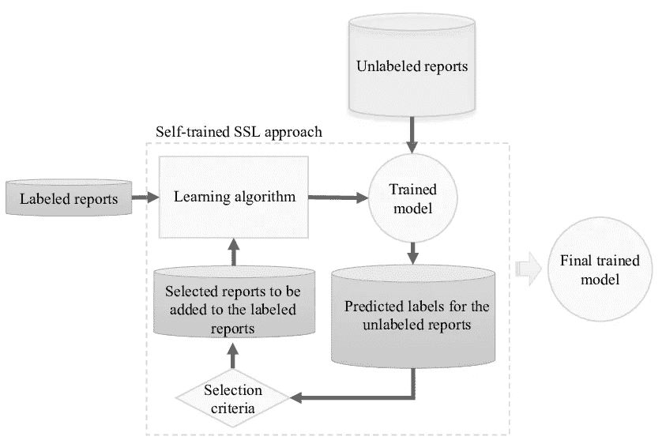

# 使用未标记的数据提高模型的性能

> 原文：<https://towardsdatascience.com/improve-your-models-performance-with-unlabeled-data-d6e78a57fadb>

## 半监督学习及其在非结构化数据中的应用

克里斯多夫·伯恩斯在 [Unsplash](https://unsplash.com?utm_source=medium&utm_medium=referral) 上拍摄的照片

数据科学家通常解决的大多数机器学习问题要么是[监督学习](https://www.ibm.com/cloud/learn/supervised-learning)(即观察值可获得基本事实或实际标签，算法对条件概率进行建模以准确预测基本事实或实际标签)，要么是[非监督学习](https://www.ibm.com/cloud/learn/unsupervised-learning)(即每个观察值没有标签，因此我们可以在观察值中识别聚类、模式或减少的潜在维度)。

半监督学习通常试图将上述两个任务结合在一起，其中，我们试图通过利用通常与另一个任务相关的信息来提高这两个任务之一的性能(范·恩格伦，J.E .，胡，H.H 2020)。这一系列算法的本质在于，它允许使用大量的未标记数据结合少量的标记数据来构建更通用(并且可能更准确)的算法。

半监督学习(SSL)是一个正在进行积极研究的非常广阔的主题领域，我们相信，它肯定是一个在未来几年有显著增长的领域。该领域已经取得了一些重大进展，一些论文对 SSL 技术进行了一些调查，包括范·恩格伦、J.E .、霍斯、H.H. [1]的工作，这些工作可以在这里访问:[https://link . springer . com/article/10.1007/s 10994-019-05855-6 # sec 54](https://link.springer.com/article/10.1007/s10994-019-05855-6#Sec54)。这是一本强烈推荐的读物，尽管有点技术性。我们将利用、解释和简化本次调查中的一些关键概念，以巩固对不同类型的半监督学习技术的理解。

虽然半监督学习在所有形式的数据中都是可能的，但文本/非结构化数据集更棘手，标记起来更耗时。几个例子包括:根据意图对电子邮件进行分类，预测电子邮件对话中的滥用/不当行为，对没有许多标签的长文档进行分类。标签数量越少，使用有限的标签数据就越困难。

本条的内容将按以下顺序排列:

1.  半监督学习的入门概念和假设
2.  理解两类半监督学习(SSL)方法

**半监督学习的起始概念和假设**

半监督学习使用来自监督学习(即，对输入数据分布和标签分布之间的关系进行建模)和非监督学习(将未标记数据分组到同质组中)的概念。

让我们假设预测电子邮箱中是否有辱骂内容的任务。这是一个预测监督的学习任务，我们需要一组标记为滥用或非滥用的电子邮件，以便训练分类器。现在，这种带标签的电子邮件不可能自然存在，我们将需要人类在浏览这种电子邮件的内容后进行注释，从而提供一个标签。鉴于电子邮件是高度个性化的，获取成千上万封电子邮件进行标记可能不是一件容易的事情。如果我们构建一个只有少量标记观察值的分类器，分类器可能只是在我们提供给分类器的有限标签的单词出现之间形成关系，而不是概括上下文，这仅仅是因为缺乏足够的标记数据。

开发语言模型或使用预训练的语言模型(如 BERT)可以通过概括上下文和单词替换来显著缓解上述问题，但我们仍然需要足够的标签来训练好分类器。我们将在第 3 部分中选择上述情况，但是现在，如果我们能够利用未标记文章上的输入数据，并允许模型以某种方式从中学习。这将理想地改进分类器。这就是半监督学习的用武之地。

下面的图片取自范·恩格伦，J.E .，霍斯，h . h .【1】的调查报告，从视觉上突出了讨论。在图像中，我们可以看到两个彩色类的固有分布，但只有两个观察值(实心形状)作为标签提供，其他所有内容都只作为未标记的数据提供。对于两类问题，当分类器仅将两个实心点(三角形和加号)视为标记观察值时，它构建的最自然的决策边界是平分两个数据标记点之间最短距离的边界。从实线和虚线的方向差异可以清楚地看出，我们的标记分类器与最佳决策边界显著不同(范·恩格伦，J.E .，胡斯，H.H 2020)。

图片由范·恩格伦，J.E .胡斯，H.H .拍摄自[https://link . springer . com/article/10.1007/s 10994-019-05855-6/figures/1](https://link.springer.com/article/10.1007/s10994-019-05855-6/figures/1)

这就带来了一个自然的问题——如何在创建正确的决策边界方面实现上述改进？

正如范·恩格伦、J.E .霍斯和 H.H .所做的调查所确定的那样[1]，半监督学习最广泛认可的假设是:

> 1.平滑度假设(如果两个样本 x 和 x’在输入空间中接近，它们的标签 y 和 y’应该相同)，
> 
> 2.低密度假设(决策边界不应穿过输入空间中的高密度区域)，以及
> 
> 3.流形假设(同一低维流形上的数据点应该有相同的标签)。

尽管上述情况经常发生，但没有保证性能提升，就像在监督学习中一样，没有一种算法是最好的。有时，半监督模型会降低监督模型的性能，特别是当上述假设不成立时，即，您通过输入与监督模型已知的现有(和真实)条件分布有显著不同分布的输入数据，向分类器添加噪声。

除此之外，不同的半监督算法在标记数据的大小、数据流形及其分布、甚至所使用的特定标记数据点方面表现出不同的性能。因此，对一系列数据集和标注的数据大小进行比较非常重要，这样才能真正执行任何类型的评估。

**了解两大类半监督学习(SSL)方法**

关于目前可用的各种半监督算法，如范·恩格伦、J.E .和霍斯进行的调查所确定的[1]:

> M 方法的不同之处在于它们所基于的半监督学习假设，(1)它们如何利用未标记的数据，以及(2)它们与监督算法相关的方式。

让我们从 SSL 算法通常属于的两个明显不同的家族开始:

1.  **归纳:**Romeyn，J. W. (2004 年)发表的著作[2]指出了归纳算法的如下作用:

> 归纳预测过程从过去和当前的样本中得出关于未来实例的结论，即它通常依赖于由现象的特定实例组成的数据集。

这与依赖于条件概率建模的经典机器学习是一样的。他们如何使用未标记的观察值是不同归纳 SSL 算法的不同之处。

1.  **直推式:**根据[维基百科](https://en.wikipedia.org/wiki/Transduction_(machine_learning))【3】:

> 转导或转导推理是从观察到的特定(训练)案例到特定(测试)案例的推理。这与归纳形成对比，归纳是从观察到的训练案例中推理出通用规则，然后应用于测试案例。

简而言之，直推方法通过利用所有未标记的数据，使用未标记的观察值内的距离和对照标记的观察值，为未标记的数据点产生预测的标记。最终目标是一个目标函数，当它被优化时，会对标记的观察结果产生正确的预测，并允许基于相似性对未标记的观察结果进行预测。

归纳法的执行和实现要简单得多。可用的学习算法的整个家族可以从范·恩格伦，J.E .，霍斯，H.H 的调查论文中读到[1]。

通过这个系列，我们计划使用两种类型的归纳半监督方法进行实验。在第一种方法中，我们仅从已标记的数据开始并构建模型，在模型有信心提供标签的地方，我们顺序地向其中添加未标记的数据。在第二种方法中，我们一起处理整个数据集，并通过添加微小变化和噪声来增加数据集，以减少输入分布中的边界分离。

1.  **使用伪标签的自我训练:** **使用伪标签的自我训练:**我们从有标签的数据开始，通过利用初始模型，在有标签的数据上训练，预测无标签的数据。这些预测被称为伪标签，因为这些预测被缓慢地(即，如果它们高于要被包括的某个阈值，或者如果它们是单次迭代中允许的前 N 个的一部分)添加以重新训练分类器。重复这个过程直到收敛。通过将这些伪标签包含在更简单的包装器函数中，可以生成这些伪标签并将其添加到任何监督学习算法之上的再训练中(范·恩格伦、J.E .、胡斯、H.H. 2020)。我们将在[第二部分](https://medium.com/@naveen.rathani/improving-model-performance-using-semi-supervised-wrapper-methods-31d8712ca20)中通过实验实现这一点。
2.  **扩充输入数据:**这些算法通过一起使用标记和未标记的数据来训练模型。除了原始标记样本之外，还通过对增加的数据点进行训练来实现这一点(范·恩格伦，J.E .胡思，H.H. 2020)。通过比如说反向翻译或生成合成数据，将噪声添加到现有的观察数据中，允许模型更好地从未标记的数据中进行归纳和学习。我们将在[第 3 部分](https://medium.com/@naveen.rathani/improving-model-performance-using-semi-supervised-wrapper-methods-31d8712ca20)的实验中实现这一点。

图片由 [Hamed-Hassanzadeh](https://www.researchgate.net/profile/Hamed-Hassanzadeh) 提供，直观解释自我训练，摘自[https://www . research gate . net/publication/326733520 _ Clinical _ Document _ class ification _ Using _ Labeled _ and _ Unlabeled _ Data _ cross _ Hospitals](https://www.researchgate.net/publication/326733520_Clinical_Document_Classification_Using_Labeled_and_Unlabeled_Data_Across_Hospitals)

这就是你们——我们已经从根本上理解了半监督学习技术试图在引擎盖下做什么，以及一些更直接的技术如自我训练实际上是如何工作的。

接下来，在[第二部分](https://medium.com/@naveen.rathani/improving-model-performance-using-semi-supervised-wrapper-methods-31d8712ca20)中，我们将用 Python 在不同的文本数据集上运行这些算法。到时见，感谢您的阅读！

包括本文在内的 3 部分系列是 Sreepada Abhinivesh 和 Naveen Rathani 的合作成果，Sreepada Abhinivesh 是一位热情的 NLP 数据科学家，拥有印度科学研究所(IISC)的硕士学位，而 Naveen rat Hani[是一位应用机器学习专家和数据科学爱好者。](https://www.linkedin.com/in/naveen-rathani-72192719/)

[1]范·恩格伦，J.E .，胡斯，H.H .关于半监督学习的调查。*马赫学* **109，**373–440(2020)。[https://doi.org/10.1007/s10994-019-05855-6](https://doi.org/10.1007/s10994-019-05855-6)

[2]罗梅因，J. W. (2004 年)。[“假设和归纳预测:包括坠机数据的例子”](https://pure.rug.nl/ws/files/2720641/romeijn_-_hypotheses_and_predictions.pdf) (PDF)。*合成*。**141**(3):333–64。[doi](https://en.wikipedia.org/wiki/Doi_(identifier)):[10.1023/B:synt . 0000044993.82886 . 9 e](https://doi.org/10.1023%2FB%3ASYNT.0000044993.82886.9e)。[JSTOR](https://en.wikipedia.org/wiki/JSTOR_(identifier))2011 8 4 86。[S2CID](https://en.wikipedia.org/wiki/S2CID_(identifier))121862013。

[3]转导(机器学习)。"[https://en . Wikipedia . org/wiki/Transduction _(machine _ learning)](https://en.wikipedia.org/wiki/Transduction_(machine_learning))