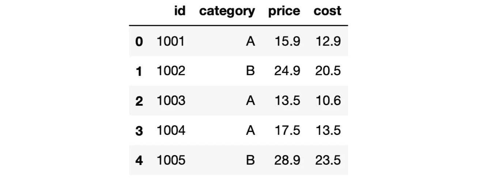
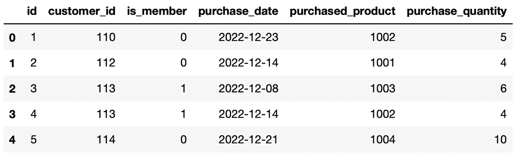

# 使用纯 Python 提高您的 SQL 技能

> 原文：<https://towardsdatascience.com/improve-your-sql-skills-using-pure-python-9e50736b3d9c>

## 而不需要安装任何东西。


在 [Unsplash](https://unsplash.com/photos/hhUx08PuYpc?utm_source=unsplash&utm_medium=referral&utm_content=creditCopyText) 上由 [Iewek Gnos](https://unsplash.com/@imkirk?utm_source=unsplash&utm_medium=referral&utm_content=creditCopyText) 拍摄的照片

如果你从事数据科学领域的工作，无论职位高低，SQL 都是你需要具备的最重要的技能之一。我会把它和 Python 一起放在前 3 名。

当我刚开始学习数据科学时，我发现建立一个练习 SQL 的环境有点困难。我需要安装一个数据库引擎和一个 IDE 来编写查询，如 MySQL Workbench 或 pgAdmin。

进行这种设置并不复杂，当你在数据科学领域找到一份工作时，你可能会使用这样的环境。然而，当你刚开始学习时，有一个更简单的练习方法。

这个选项是 sqlite3，它是一个内置的 Python 模块。它提供了一个易于使用的 SQL 接口。sqlite3 模块基于 sqlite，这是一个 C 语言库，提供了一个轻量级的基于磁盘的数据库。

既然我们大多数人都是从安装 Python 开始数据科学之旅的，为什么不利用它来学习 SQL 呢？

在本文中，我们将通过几个示例来学习如何:

*   创建数据库
*   创建表格
*   填充表格
*   查询表格

使用 sqlite3 模块。

# 创建数据库

第一步是创建一个数据库。我们可以使用连接功能来完成这项任务。它用于连接数据库，如果数据库不存在，connect 函数也会创建它。

```
import sqlite3
con = sqlite3.connect("sample.db")
```

下一步是创建数据库游标，这是执行 SQL 语句和获取结果所必需的。

```
cursor = con.cursor()
```

我们可以使用下面的查询和 fetchall 函数来查看这个数据库中的表。我们基本上是在查询内置的 sqlite_master 表。

```
check_tables = """SELECT name FROM sqlite_master WHERE type='table';"""
cursor.execute(check_tables)
cursor.fetchall()

# output
[]
```

因为数据库不包含任何表，所以 fetchall 函数返回一个空列表。

# 创建表格

让我们创建一个表。我们将编写查询来创建一个表，然后使用游标来执行它。

```
create_products_table = """CREATE TABLE IF NOT EXISTS products (
                                    id integer PRIMARY KEY,
                                    category text NOT NULL,
                                    price real,
                                    cost real
                                );"""

cursor.execute(create_products_table)
```

让我们再次检查示例数据库中的表。

```
check_tables = """SELECT name FROM sqlite_master WHERE type='table';"""
cursor.execute(check_tables)
cursor.fetchall()

# output
[('products',)]
```

我们现在看到数据库中存在 products 表。

我们可以使用光标执行任何查询。例如，下面的代码片段执行查询来选择 products 表中的所有行，并将结果赋给一个名为 result 的变量。然后，对结果变量调用 fetchall 函数，以查看它包含的内容。

```
result = cursor.execute("SELECT * FROM products")
result.fetchall()

# output 
```

因为 products 表是空的，所以它不返回任何内容。让我们使用 insert into 语句填充它。

```
populate_products_table = """INSERT INTO products VALUES
                                    (1001, 'A', 15.9, 12.9),
                                    (1002, 'B', 24.9, 20.5),
                                    (1003, 'A', 13.5, 10.6),
                                    (1004, 'A', 17.5, 13.5),
                                    (1005, 'B', 28.9, 23.5)
                                ;"""

cursor.execute(populate_products_table)
```

**注意**:insert 语句隐式打开一个事务，需要在修改保存到数据库之前提交。

```
con.commit()
```

products 表现在应该有 5 行。让我们通过执行上面的 select 语句来确认。

```
result = cursor.execute("SELECT * FROM products")
result.fetchall()

# output
[(1001, 'A', 15.9, 12.9),
 (1002, 'B', 24.9, 20.5),
 (1003, 'A', 13.5, 10.6),
 (1004, 'A', 17.5, 13.5),
 (1005, 'B', 28.9, 23.5)]
```

当然，我们可以编写更高级的查询。例如，以下查询返回属于类别 a 的行。

```
result = cursor.execute("SELECT * FROM products WHERE category='A'")
result.fetchall()

# output
[(1001, 'A', 15.9, 12.9),
 (1003, 'A', 13.5, 10.6),
 (1004, 'A', 17.5, 13.5)]
```

# 创建熊猫数据框架的一行代码

sqlite3 模块的一个好处是它兼容熊猫。因此，我们可以很容易地将查询结果写入 Pandas 数据帧。

我们可以用查询和连接对象调用熊猫的 read_sql_query 函数。

```
products = pd.read_sql_query("SELECT * FROM products", con)

products
```



产品数据框架(图片由作者提供)

让我们创建另一个表并填充它。

```
create_customers_table = """CREATE TABLE IF NOT EXISTS customers (
                                    id integer PRIMARY KEY,
                                    customer id integer NOT NULL,
                                    is_member integer NOT NULL,
                                    purchase_date text,
                                    purchased_product integer,
                                    purchase_quantity integer
                                );"""

populate_customer_table = """INSERT INTO customers VALUES
                                    (1, 110, 0, "2022-12-23", 1002, 5),
                                    (2, 112, 0, "2022-12-14", 1001, 4),
                                    (3, 113, 1, "2022-12-08", 1003, 6),
                                    (4, 113, 1, "2022-12-14", 1002, 4),
                                    (5, 114, 0, "2022-12-21", 1004, 10)
                                ;"""

cursor.execute(create_customers_table)
cursor.execute(populate_customer_table)

con.commit()
```

我们可以用 customers 表创建一个数据框架，如下所示:

```
customers = pd.read_sql_query("SELECT * FROM customers", con)

customers
```



客户数据框架(图片由作者提供)

# 更复杂的查询

让我们编写一个查询，从 products 和 customers 表中检索数据。它将包括一个连接语句。

```
query = '''
        SELECT
            customer_id,
            purchased_product,
            purchase_quantity,
            price
        FROM customers c
        LEFT JOIN products p ON c.purchased_product = p.id
        '''
cursor.execute(query)
cursor.fetchall()

# output
[(110, 1002, 5, 24.9),
 (112, 1001, 4, 15.9),
 (113, 1003, 6, 13.5),
 (113, 1002, 4, 24.9),
 (114, 1004, 10, 17.5)]
```

您可以使用 description 属性查看查询输出中的列名:

```
cursor.description

# output
(('customer_id', None, None, None, None, None, None),
 ('purchased_product', None, None, None, None, None, None),
 ('purchase_quantity', None, None, None, None, None, None),
 ('price', None, None, None, None, None, None))

# save the names in a Python list using list comprehension
col_names = [description[0] for description in cursor.description]

col_names

# output
['customer_id', 'purchased_product', 'purchase_quantity', 'price']
```

# 关闭连接

我们可以使用 close 方法来关闭当前到数据库的连接。

```
con.close()
```

为了验证更改是否保存在数据库中，我们可以创建一个新的连接并编写一个查询来进行检查。

```
con = sqlite3.connect("sample.db")
cursor = con.cursor()
result = cursor.execute("SELECT * FROM products")
result.fetchall()

# output
[(1001, 'A', 15.9, 12.9),
 (1002, 'B', 24.9, 20.5),
 (1003, 'A', 13.5, 10.6),
 (1004, 'A', 17.5, 13.5),
 (1005, 'B', 28.9, 23.5)]
```

是的，更改保存在 sample.db 数据库中。

# 结论

sqlite3 模块为实践 SQL 提供了一个易于使用的环境，这对于在数据科学生态系统中工作的几乎所有人来说都至关重要。

不必安装任何额外的工具或数据库引擎，这使得使用 sqlite3 更加令人鼓舞。此外，将查询结果保存到 Pandas 数据框架中只需要一行代码。我认为这是一个很棒的特性，因为 Pandas 是使用最广泛的数据操作和分析工具。

*你可以成为* [*媒介会员*](https://sonery.medium.com/membership) *解锁我的全部写作权限，外加其余媒介。如果你已经是了，别忘了订阅*<https://sonery.medium.com/subscribe>**如果你想在我发表新文章时收到电子邮件。**

*感谢您的阅读。如果您有任何反馈，请告诉我。*