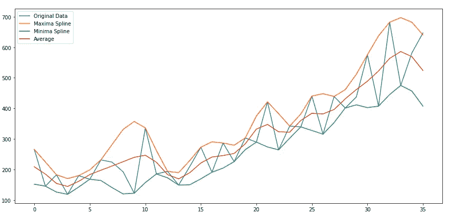
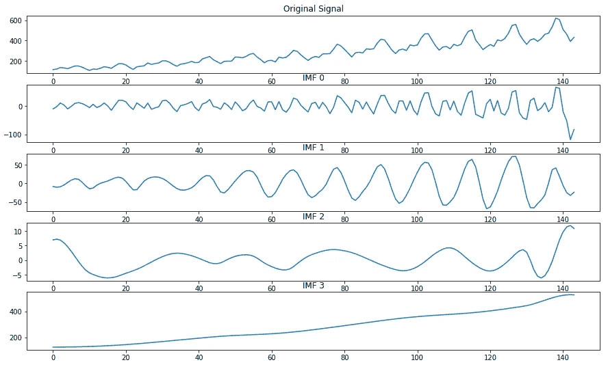
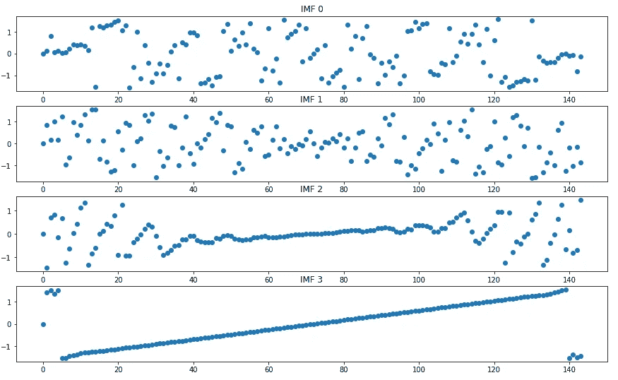
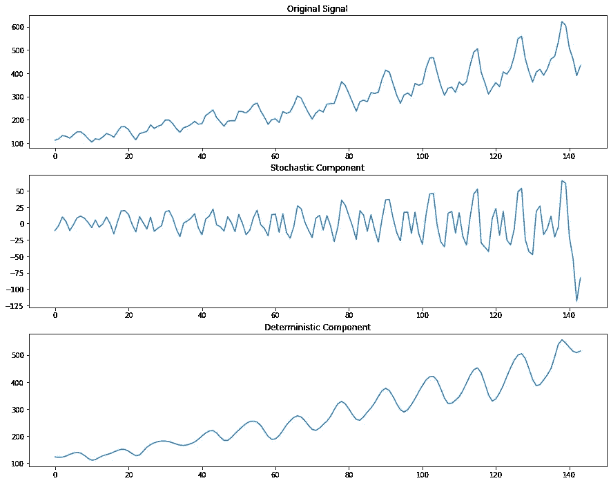

# 利用随机和确定性成分分解改进时间序列分析

> 原文：<https://towardsdatascience.com/improve-your-time-series-analysis-with-stochastic-and-deterministic-components-decomposition-464e623f8270>

## 如何将时间序列分解成可以用动力系统和随机过程方法预测的部分


[m.](https://unsplash.com/@m_____me?utm_source=medium&utm_medium=referral) 在 [Unsplash](https://unsplash.com?utm_source=medium&utm_medium=referral) 上拍照

在[我的上一篇文章](https://medium.com/towards-data-science/time-series-forecasting-with-dynamical-systems-methods-fa4afdf16fd0)中，我谈到了如何使用 Taken 的嵌入定理，通过标准的机器学习算法来预测确定性的时间序列数据。

我在那篇文章中没有谈到的是，如果我们正在处理的序列不是完全确定的，我们可以做什么。正如我们在文章中看到的，当系列出现一些噪音时，预测的质量会下降很多。

在本文中，我们将分析并实现论文“[的结果，该论文应用经验模式分解和互信息来分离嵌入信号](https://www.sciencedirect.com/science/article/abs/pii/S0165168415002297?via%3Dihub)【1】中的随机和确定性影响，该论文提出了一个框架，在给定时间序列的情况下，将其分解为随机和确定性成分。

能够生成这种分解将提高我们利用图克嵌入定理所能实现的预测，并且还将允许我们单独对随机分量建模。

这里的主要思想是分析由应用于时间序列的经验模式分解方法产生的 IMFs 的相位谱。让我们来理解这意味着什么，以及我们如何将它应用到现实世界的问题中。

## 经验模态分解

第一步是把我们的时间序列分成所谓的固有模态函数(IMF)。为此，我们将使用一种称为经验模式分解(EMD)的方法，它将接收一个时间序列作为输入，并从中生成 IMF。

但什么是国际货币基金组织？

IMF 本身是一个时间序列，它满足两个条件:

*   序列的最大值和最小值之间的差值绝对不能大于 1
*   IMF 的平均值必须为零

EMD 将通过应用以下算法来生成这些 IMF:

*   找出数列的所有最大值和最小值
*   使用三次样条插值它们，生成我们所说的包络。对于计算机科学的人来说，你可以把它看作是大 O 和大ω函数
*   计算这个包络的平均值，并从中减去原始信号

我们可以在这个图上看到我所说的上述过程的意思:



基于 EMD 方法的包络创建。由作者生成的图像

我们从平均值中减去原始时间序列后获得的这个新信号将被测试，以验证它是否是一个 IMF。如果一个或多个条件不满足，那么算法将重复自身，但是这次是在这个新的候选上而不是在原始的时间序列上。直到我们找到一个国际货币基金组织。

一旦找到一个 IMF，就从这个 IMF 中减去原始时间序列，产生一个新的信号，我们称之为 h。然后，我们将对 h 重复整个过程，直到找到下一个 IMF，然后从 h 中减去，依此类推。

只有当我们找到一个单调的序列(即，它只增长或减少)，或者换句话说，一个只有一个极值点(最大值或最小值)的序列时，这个过程才会停止。这一系列将被称为剩余。

## 解释 IMFs 并编码

由于这个过程是如何完成的，人们可以很容易地看到，如果我们得到所有的 IMF 和残差，并将它们相加，我们将得到原始序列。

这就是为什么我们称这种方法为“分解”。我们正在将我们的系列分解成一组组件。除此之外，第一个 IMF 将包含噪声最大的信号，而后面的 IMF 将呈现更具确定性的成分，如下所示。

现在，让我们把它编码起来。为此，我们需要安装一个已经实现了 EMD 的库，名为 PyEMD。我们可以通过 pip 轻松做到这一点:

```
pip install EMD-signal
```

我们还将使用 sknet 库中的一些免费数据集和 sklearn 库中的一个函数，因此我们也必须安装它们:

```
pip install scikit-learn
pip install sktime
```

现在，让我们创建一个函数，它将返回给定信号的 IMFs:

```
import numpy as np
from scipy.fft import fft
import matplotlib.pyplot as pltfrom PyEMD import EMD
from sktime.datasets import load_airline, load_shampoo_sales
from sklearn.feature_selection import mutual_info_regressiondef emd(signal):
    emd = EMD(DTYPE=np.float16, spline_kind='akima')
    imfs = emd(signal.values)

    t = [i for i in range(len(signal))]
    N = imfs.shape[0]
    fig, axs = plt.subplots(N + 1, 1, figsize=(15,9)) axs[0].plot(t, signal)
    axs[0].set_title('Original Signal')
    for n, imf in enumerate(imfs):
        axs[n+1].plot(t, imf)
        axs[n+1].set_title(f'IMF {n}')

    return imfs
```

在这个函数中，我们只是从 PyEMD 库中调用 EMD，并将它们与原始数据一起绘制。让我们将它应用到来自 sktime 的航空公司数据[2]中，这是我们可以免费使用的，看看会发生什么:



航线数据集的 EMD 分解[3]。图片由作者生成。

你可以看到 IMF 3 实际上表现得像一个残渣。

现在我们有了自己的国际货币基金组织，我们能用它们做什么？它们对我们如何区分时间序列中的随机成分和确定成分有用？

## 相位谱

生成 IMF 后，我们可以分析这些元件在频谱上的表现。一个随机信号的频谱到处都是，没有清晰的频率。另一方面，确定性信号会表现得更好。

一种直观的方法是在频率空间上观察这些成分的相位谱。为此，我们必须首先通过快速傅里叶变换(FFT)获得 IMF 的频率表示，然后用虚部除以实部。

现在，我们将从那个阶段的角度来看，这将使我们更容易看到发生了什么。为此，我们必须应用反正切函数。

让我们看看这在代码中是什么样子的:

```
def phase_spectrum(imfs):
    imfs_p = []
    fig, axs = plt.subplots(len(imfs), 1, figsize=(15,9))
    for i, imf in enumerate(imfs):
        trans = fft(imf)
        imf_p = np.arctan(trans.imag / trans.real)

        imfs_p.append(imf_p)

        axs[i].plot(imf_p, 'o')
        axs[i].set_title(f'IMF {i}')

    return imfs_p
```

我们只是应用 Scipy 库中的 FFT，然后进行我之前描述的计算。最后，我们还绘制了阶段图，生成了下图:



国际货币基金组织的阶段。由作者生成的图像

可以看到，当我们沿着 IMF 向下接近余数时，随着角度开始对齐，一种模式开始出现。这对我们来说是决定性行为的一个标志。

所以，看这个图，最后两个部分似乎比前两个更具决定性。因此，我们可以这样选择它们，并手动定义随机和确定性组件。然而，有一种更好的方法。

## 利用互信息选择 IMFs

评估两个分布之间关系的一种方法是互信息。这一指标的逻辑是，通过观察一个变量，衡量一个人可以从另一个变量获得多少信息。

两个随机信号之间的互信息应该为零。如果它们中只有一个是确定性的，那么这个值也应该相当接近于零。如果我们有两个确定性信号，那么这个值应该更大。

知道了这一点，我们可以在我们的 IMF 上应用互信息，并观察它何时达到峰值。在这一点上，我们应该开始将 IMFs 视为确定性组件。

让我们把它编码起来:

```
def phase_mi(phases):
    mis = []
    for i in range(len(phases)-1):
        mis.append(mutual_info_regression(phases[i].reshape(-1, 1), phases[i+1])[0])

    return np.array(mis)
```

这里我们利用了 sklearn 库中的计算。

现在，有很多方法可以使用交互信息。在这篇文章中，我们将寻找一个分界点。

## 分割信号

现在我们有了将时间序列分成两部分所需的一切。让我们看看代码:

```
def divide_signal(signal, imfs, mis, cutoff=0.05):
    cut_point = np.where(mis > cutoff)[0][0] stochastic_component = np.sum(imfs[:cut_point], axis=0)
    deterministic_component = np.sum(imfs[cut_point:], axis=0)

    t = [i for i in range(len(signal))]

    fig, axs = plt.subplots(3, 1, figsize=(15,12))
    axs[0].plot(t, signal.values)
    axs[0].set_title('Original Signal')

    axs[1].plot(t, stochastic_component)
    axs[1].set_title('Stochastic Component')

    axs[2].plot(t, deterministic_component)
    axs[2].set_title('Deterministic Component')

    return stochastic_component, deterministic_component
```

这里，我们定义多少互信息将被视为确定性分量的开始，然后我们对 IMF 求和，并绘制原始信号旁边的分量:



现在，有了这两个分量，我们就可以利用图森嵌入定理预测确定性分量，利用 ARIMA 等预测工具预测随机分量，以捕捉可能仍存在于该分量上的某些确定性残差。

## 结论

现在，我们的工具包中又多了一个工具，可以用来改进我们的时间序列分析。使用这种方法和图克的嵌入定理，我们有一个很好的框架来开始分析和预测时间序列数据。

当然，没有一种方法是完美的，在某些情况下，这个框架不会产生最好的结果。但这就是数据科学的美妙之处，没有先验的正确答案，所以我们必须深入问题，找出前进的最佳方式。

## 感谢

我必须在这里感谢 Rodrigo Mello，他在 2019 年在我们大学的一堂课上首次向我介绍了这些概念。

[1]里奥斯，里卡多·阿劳若；罗德里戈·费尔南德斯·德·梅洛(2016 年)。应用经验模式分解和互信息分离嵌入信号中的随机和确定性影响。信号处理，118()，159–176。doi:10.1016/j.sigpro

[2] Box，G. E. P .，Jenkins，G. M .和 Reinsel，G. C. (1976 年)时间序列分析、预测和控制。第三版。霍尔登日。g 系列。