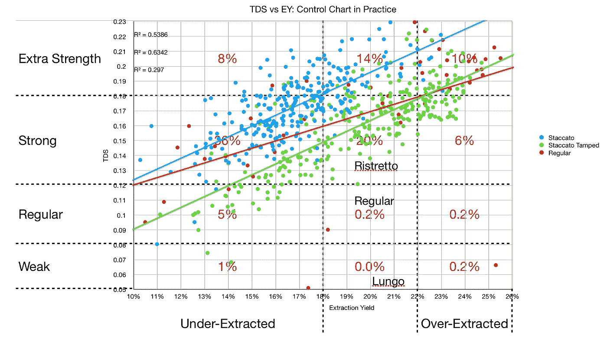
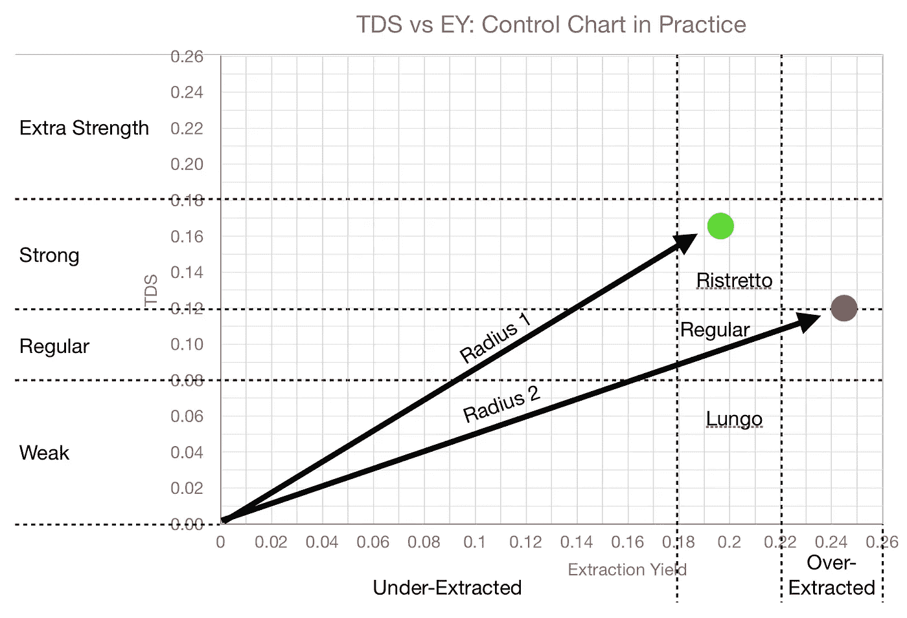
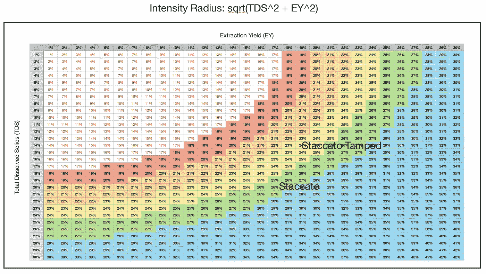
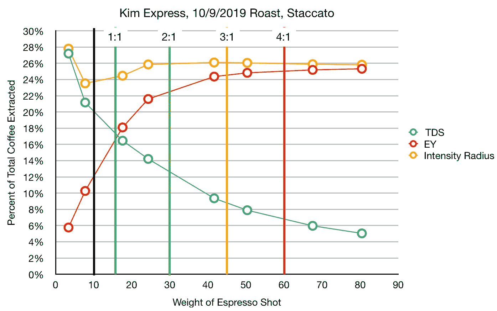
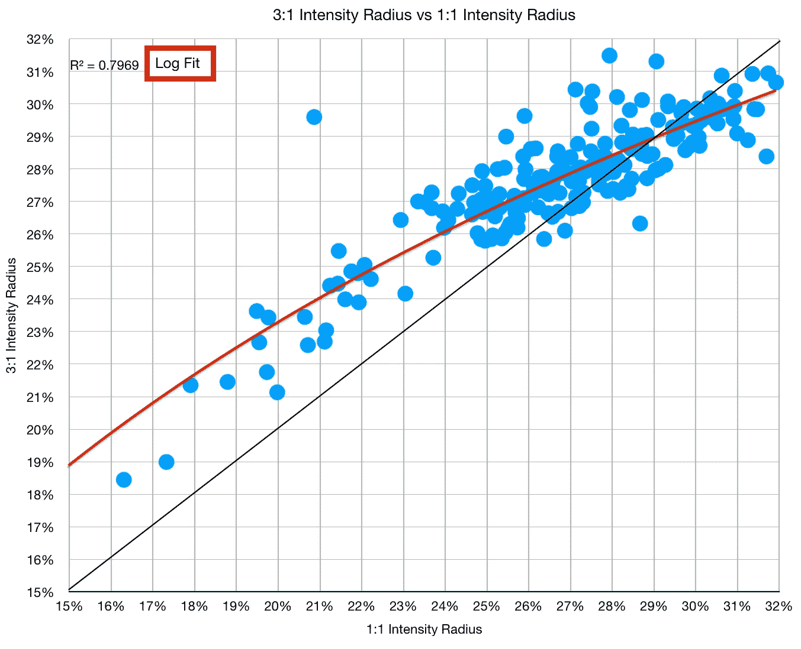

# 改善咖啡萃取指标:强度半径

> 原文：<https://towardsdatascience.com/improving-coffee-extraction-metrics-intensity-radius-bb31e266ca2a>

## 咖啡数据科学

## 结合 TDS 和 EY，更好地比较不同产出比的咖啡

在过去的三年里，我一直在研究咖啡数据科学。我通常根据味道和提取率来评价事物(EY)。然而，EY 的一个一贯问题是产量。我试着让我的浓缩咖啡产量彼此接近，但这和其他技术相比如何呢？这就是为什么我在看一个我称之为强度半径的东西，但是很有可能其他人也在做同样的事情，称它为别的东西。

# 绩效指标

我使用两个[指标](/metrics-of-performance-espresso-1ef8af75ce9a)来评估技术之间的差异:最终得分和咖啡萃取。

[**最终得分**](https://towardsdatascience.com/@rmckeon/coffee-data-sheet-d95fd241e7f6) 是记分卡 7 个指标(尖锐、浓郁、糖浆、甜味、酸味、苦味和回味)的平均值。当然，这些分数是主观的，但它们符合我的口味，帮助我提高了我的拍摄水平。分数有一些变化。我的目标是保持每个指标的一致性，但有时粒度很难确定。

**用折射仪测量总溶解固体量(TDS)，这个数字结合咖啡的输出重量和输入重量用于确定提取到杯中的咖啡的百分比，称为**提取率(EY)** 。**

> **EY = ( TDS *输出)/输入**

**然后，您可以在控制图中比较 TDS 和 EY，如下所示:**

****

**所有图片由作者提供**

# **产出产量**

**产量就是一杯浓缩咖啡的重量(g)。我通常用 22 克咖啡，22 克到 28 克之间。所以我的产出投入比范围是 1:1 到 1.3:1。**

**通常在浓缩咖啡中，人们会选择 2:1 的比例或者 1:2 的比例(我用另一种方式写，因为基于我的工程背景，这样感觉更正确)。有些人要求允许 4:1 或 5:1 的赔率。**

**这些较长的镜头 TDS 较低，但 ey 较高。那么如何比较断奏和全奏呢？**

****

****强度半径(IR)** 定义为 TDS vs EY 控制图上原点的半径，所以 IR = sqrt( TDS + EY)。这一指标有助于标准化产量或酿造比的击球性能。**

****

**强度半径示例**

**所以我们可以用强度半径来看这张控制图。这意味着，如果你在 27%的 EY 拍摄一个 5% TDS 的镜头，它的 IR 为 27%，这与在 20% EY 拍摄一个 18% TDS 的镜头是一样的。目标是获得更高的 IR。**

****

# **我自己的数据**

**我回顾了我的一些数据，看看 IR 会显示什么，这在两个变量的情况下很难看到。当看一张意大利腊肠照片时，我最初画的是 EY，但是我在这张图上加了 TDS 和 IR。**

****

**IR 开始很高，下降，然后达到稳定状态，略有下降。这可能有助于理解何时达到提取的物理极限，因为 IR 应该开始随时间而降低。**

# **短镜头对长镜头**

**对于一大块数据，我有 TDS 和 EY 的两个数据点。我收集了我通常拍摄的 1:1 和 3:1 的照片。我有一个杠杆式咖啡机，所以当我拿掉杯子后，咖啡会一直流出来。因此，我分别测量了 TDS 和重量，以通知 EY 拍摄更长的镜头。**

**然后，我绘制了这些数据对的强度半径，以观察它们的趋势。**

****

**这个数据表明，大约 28%的红外辐射，拉一个更长的镜头会降低红外辐射。一个例子是 20% TDS 的拍摄，即 1:1 拍摄，因此 EY 也是 20%，但 IR 是 28.3%。随着拍摄时间延长，红外线会增加还是减少？不清楚。**

**我的目的是帮助更公平地比较我的镜头以及其他镜头和技术的变化。即使在我拉的各种镜头中，我也希望有更好的对比。断奏拍摄拉非常高的 EY 在 1:1，其中断奏捣实拍摄达到最大 EY 约 1.3:1，但这是棘手的比较两者，因为他们最好的 EY 和口味达到不同的比例。**

**如果你愿意，可以在推特、 [YouTube](https://m.youtube.com/channel/UClgcmAtBMTmVVGANjtntXTw?source=post_page---------------------------) 和 [Instagram](https://www.instagram.com/espressofun/) 上关注我，我会在那里发布不同机器上的浓缩咖啡照片和浓缩咖啡相关的视频。你也可以在 [LinkedIn](https://www.linkedin.com/in/dr-robert-mckeon-aloe-01581595) 上找到我。也可以关注我在[中](https://towardsdatascience.com/@rmckeon/follow)和[订阅](https://rmckeon.medium.com/subscribe)。**

# **[我的进一步阅读](https://rmckeon.medium.com/story-collection-splash-page-e15025710347):**

**[我的书](https://www.indiegogo.com/projects/engineering-better-espresso-data-driven-coffee)**

**[浓缩咖啡系列文章](https://rmckeon.medium.com/a-collection-of-espresso-articles-de8a3abf9917?postPublishedType=repub)**

**[工作和学校故事集](https://rmckeon.medium.com/a-collection-of-work-and-school-stories-6b7ca5a58318?source=your_stories_page-------------------------------------)**

**[个人故事和关注点](https://rmckeon.medium.com/personal-stories-and-concerns-51bd8b3e63e6?source=your_stories_page-------------------------------------)**

**[乐高故事启动页面](https://rmckeon.medium.com/lego-story-splash-page-b91ba4f56bc7?source=your_stories_page-------------------------------------)**

**[摄影启动页面](https://rmckeon.medium.com/photography-splash-page-fe93297abc06?source=your_stories_page-------------------------------------)**

**[改善浓缩咖啡](https://rmckeon.medium.com/improving-espresso-splash-page-576c70e64d0d?source=your_stories_page-------------------------------------)**

**[断奏生活方式概述](https://rmckeon.medium.com/a-summary-of-the-staccato-lifestyle-dd1dc6d4b861?source=your_stories_page-------------------------------------)**

**[测量咖啡磨粒分布](https://rmckeon.medium.com/measuring-coffee-grind-distribution-d37a39ffc215?source=your_stories_page-------------------------------------)**

**[浓缩咖啡中的粉末迁移](https://medium.com/nerd-for-tech/rebuking-fines-migration-in-espresso-6790e6c964de)**

**[咖啡萃取](https://rmckeon.medium.com/coffee-extraction-splash-page-3e568df003ac?source=your_stories_page-------------------------------------)**

**[咖啡烘焙](https://rmckeon.medium.com/coffee-roasting-splash-page-780b0c3242ea?source=your_stories_page-------------------------------------)**

**[咖啡豆](https://rmckeon.medium.com/coffee-beans-splash-page-e52e1993274f?source=your_stories_page-------------------------------------)**

**[浓缩咖啡滤纸](https://rmckeon.medium.com/paper-filters-for-espresso-splash-page-f55fc553e98?source=your_stories_page-------------------------------------)**

**[浓缩咖啡篮及相关主题](https://rmckeon.medium.com/espresso-baskets-and-related-topics-splash-page-ff10f690a738?source=your_stories_page-------------------------------------)**

**[意式咖啡观点](https://rmckeon.medium.com/espresso-opinions-splash-page-5a89856d74da?source=your_stories_page-------------------------------------)**

**[透明 Portafilter 实验](https://rmckeon.medium.com/transparent-portafilter-experiments-splash-page-8fd3ae3a286d?source=your_stories_page-------------------------------------)**

**[杠杆机维修](https://rmckeon.medium.com/lever-machine-maintenance-splash-page-72c1e3102ff?source=your_stories_page-------------------------------------)**

**[咖啡评论和想法](https://rmckeon.medium.com/coffee-reviews-and-thoughts-splash-page-ca6840eb04f7?source=your_stories_page-------------------------------------)**

**[咖啡实验](https://rmckeon.medium.com/coffee-experiments-splash-page-671a77ba4d42?source=your_stories_page-------------------------------------)**