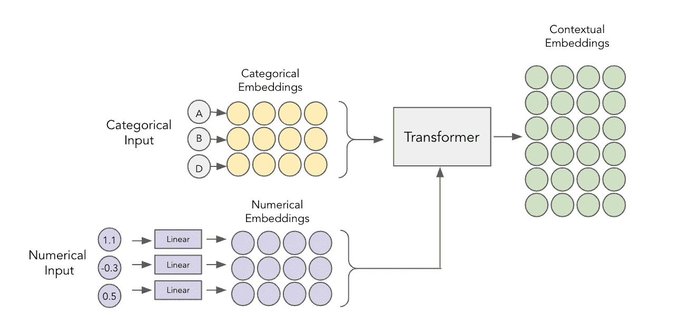
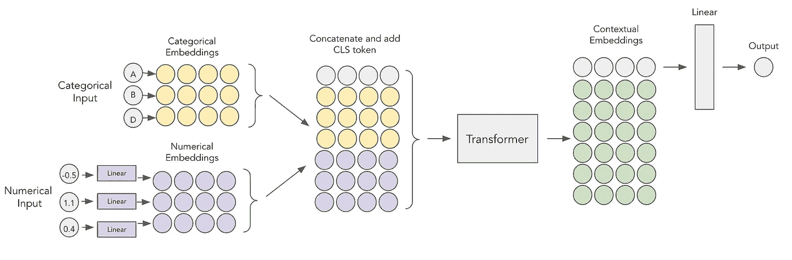
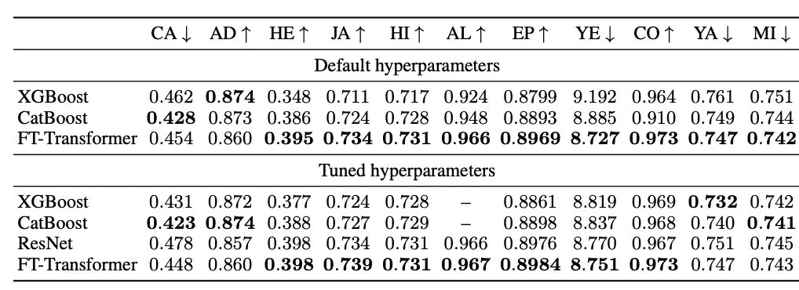
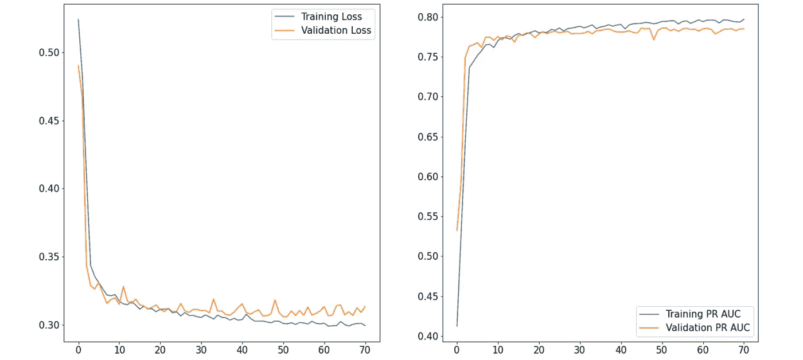
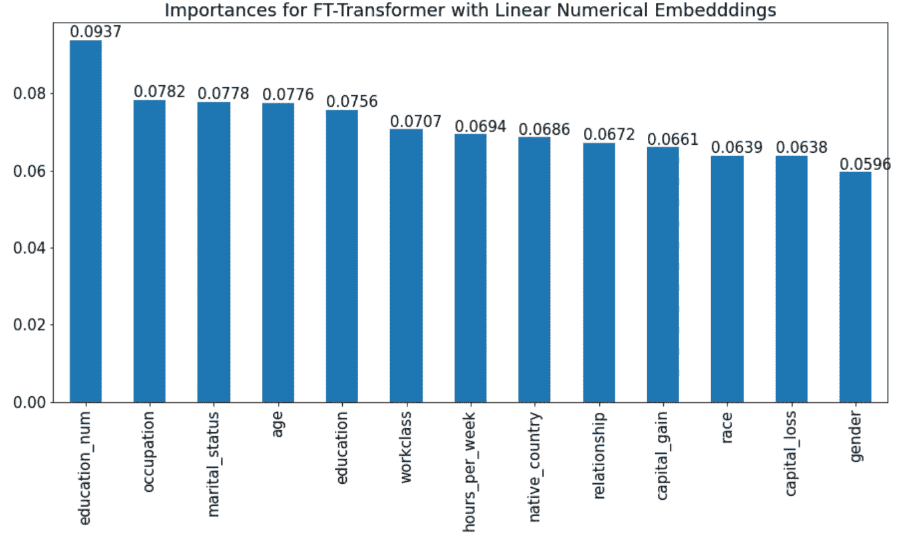
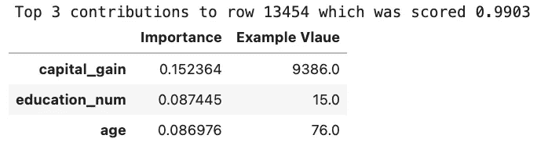
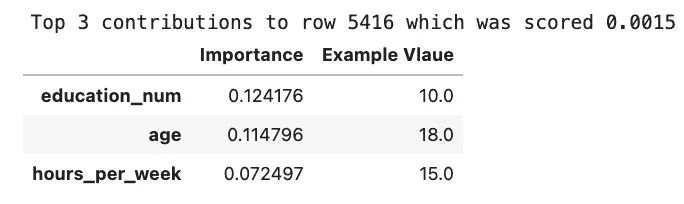

# 表格数据的转换(第二部分):线性数字嵌入

> 原文：<https://towardsdatascience.com/improving-tabtransformer-part-1-linear-numerical-embeddings-dbc3be3b5bb5>

## 基于 FT-Transformer 的表格数据深度学习

尼克·希利尔在 [Unsplash](https://unsplash.com?utm_source=medium&utm_medium=referral) 上的照片

# 介绍

[在上一篇关于 TabTransformer](/transformers-for-tabular-data-tabtransformer-deep-dive-5fb2438da820) 的文章中，我描述了这个模型是如何工作的，以及如何应用到你的数据中。这篇文章将建立在它的基础上，所以如果你还没有阅读它，我强烈建议你从那里开始，然后再回到这篇文章。

在一些数据集上，TabTransformer 的性能优于传统的多层感知器(MLPs ),接近梯度提升树(GBTs)的性能。然而，该架构有一个明显的缺点——在构建上下文嵌入时，它没有考虑数字特征。这篇文章深入探讨了 Gorishniy 等人(2021)的[论文](https://arxiv.org/pdf/2106.11959v2.pdf)，该论文通过引入 **FT-Transformer(特征标记器+ Transformer)** 解决了这个问题。

# TabTransformer 与 FT-Transformer

两个模型都使用变压器( [Vaswani 等人，2017](https://arxiv.org/abs/1706.03762) )作为其模型主干，但有两个主要区别:

*   数字嵌入的使用
*   使用 CLS 令牌进行输出

## 数字嵌入

传统的 TabTransformer 接受分类嵌入，并通过 Transformer 块将它们转换成上下文相关的嵌入。然后，数字特征与这些上下文嵌入连接，并通过 MLP 得到预测。

TabTransformer 图。图片作者。

大部分的魔法都发生在变形金刚内部，所以很遗憾数字特征被忽略了，只在模型的最后一层使用。Gorishniy 等人(2021)提出通过嵌入数字特征来解决这个问题。

FT-Transformer 使用的嵌入是线性的，这意味着每个特征在通过一个简单的完全连接的层后被转换为密集矢量。需要注意的是，这些密集图层不共享权重，因此每个数字要素有一个单独的嵌入图层。

线性数字嵌入。图片作者。

您可能会问自己—如果这些特征已经是数字了，为什么还要这样做？主要原因是数字嵌入可以与分类嵌入一起通过转换器块。这增加了更多可以学习的上下文，从而提高了表示质量。

数字嵌入变压器。图片作者。

有趣的是，已经证明(例如[这里](https://arxiv.org/abs/2203.05556))这些数字嵌入的添加可以提高各种深度学习模型的性能(不仅仅是 TabTransformer)，因此它们甚至可以应用于简单的 MLP。

数字嵌入的 MLP。图片作者。

## CLS 代币

CLS 令牌的用法来自 NLP 领域，但它可以很好地转换成表格任务。基本思想是，在我们嵌入了我们的特征之后，我们向它们附加另一个“嵌入”,它代表一个 CLS 令牌。通过这种方式，分类、数字和 CLS 嵌入通过转换程序块得到语境化。之后，上下文化的 CLS 令牌嵌入充当简单 MLP 分类器的输入，该分类器产生期望的输出。

## 傅立叶变换变压器

通过用数字嵌入和 CLS 令牌扩充 TabTransformer，我们得到了最终提出的架构。

FT-变压器。图片作者。

# 报告的结果

FT-Transformer 的报告结果。来源:[戈里什尼等人(2021 年)](https://arxiv.org/pdf/2106.11959v2.pdf)

从结果中我们可以看出，FT-Transformer 在各种数据集上都优于梯度提升模型。此外，它优于 ResNet，ResNet 是一个强大的表格数据深度学习基线。有趣的是，超参数调整并没有改变 FT-Transformer 结果太多，这可能表明它对超参数不是那么敏感。

# 验证结果

本节将向您展示如何通过验证[成人收入数据集](https://archive.ics.uci.edu/ml/datasets/adult)的结果来使用 FT-Transformer。我将使用一个名为`tabtransformertf`的包，它可以使用`pip install tabtransformertf`来安装。它允许我们使用表格变压器模型，而无需大量的预处理。下面您可以看到分析的主要步骤和结果，但请务必查看[补充笔记本](https://github.com/aruberts/TabTransformerTF/blob/main/notebooks/fttransformer-demo.ipynb)了解更多详情。

## **数据预处理**

数据可以从[这里](https://archive.ics.uci.edu/ml/datasets/adult)下载或者使用一些 API。数据预处理步骤与本文无关，因此您可以在 [GitHub](https://github.com/aruberts/TabTransformerTF/blob/main/notebooks/fttransformer-demo.ipynb) 上找到完整的工作示例。特定于 FT-Transformer 的预处理类似于 [TabTransformer](/transformers-for-tabular-data-tabtransformer-deep-dive-5fb2438da820) ，因为我们需要创建分类预处理层并将数据转换成 TF 数据集。

## FT-变压器初始化

模型的初始化相对简单，每个参数都有注释。三个 FT-变压器特定参数是— `numerical_embeddings`、`numerical_embedding_type`和`explainable`

*   `numerical_embeddings` —类似于`category_lookup`，这些是预处理层。对于 FT-Transformer 来说是`None`，因为我们没有对数字特征进行预处理。
*   `numerical_embedding_type` — `linear`用于线性嵌入。更多类型将在下一篇文章中介绍。
*   `explainable`-如果设置为`True`，模型将输出每行的特征重要性。它们是从注意力权重中推断出来的。

## **模特培训**

培训程序类似于任何 Keras 模型。唯一需要注意的是，如果您已经将`explainable`指定为`True`，那么您需要两个损失和指标，而不是一个。

训练需要大约 70 个时期，下面你可以看到损失和度量值的进展。您可以减少提前停止的回合数，或者进一步简化模型(例如，减少注意力头数)，以加快训练速度。

培训/验证损失和指标。作者的情节。

## 估价

测试数据集使用 ROC AUC 和 PR AUC 进行评估，因为这是一个不平衡的二元分类问题。为了验证报告的结果，我还包括了假设阈值为 0.5 的准确性指标。

得到的准确度分数为 0.8576，略低于报告的分数 0.86。这种差异可能是由于训练过程中的随机变化或不同的超参数造成的。尽管如此,**结果与报道的足够接近,**,所以这是一个好迹象，表明这项研究是可重复的。

## 可解释性

FT-Transformer 最大的优点之一是内置的可解释性。由于所有的特征都通过一个转换器，我们可以得到它们的注意力图，并推断出特征的重要性。这些重要性是使用以下公式计算的

特征重要性公式。来源:[戈里什尼等人(2021 年)](https://arxiv.org/pdf/2106.11959v2.pdf)

其中 *p_ihl* 是从第*I*个样本的第 *l* 层向前传递的【CLS】令牌的第 *h* 个头部注意图。该公式基本上总结了跨越不同注意头(`heads`参数)和变压器层(`depth`参数)的【CLS】令牌的所有注意分数，然后将它们除以`heads x depth`。局部重要性( *p_i* )可以跨所有行进行平均，以获得全局重要性( *p* )。

现在，让我们看看成人收入数据集的重要性。

从上面的代码中，您可以看到模型已经输出了我们需要的大部分信息。对其进行处理和绘图会得到以下结果。

特征重要性。由作者策划。

前五个特征确实有道理，因为收入较高的人往往年龄较大，已婚，受教育程度较高。我们也可以通过查看最大预测和最小预测的重要性来检测局部重要性。

前 3 名贡献。由作者创建。

同样，重要性有直观的意义。最大概率赚 50K 以上的人，资本收益大，受教育 15 年，年龄大。可能性最低的人只有 18 岁，完成了 10 年的教育，每周工作 15 个小时。

# **结论**

在这篇文章中，你看到了 FT-Transformer 是什么，它与 TabTransformer 有何不同，以及如何使用`tabtransformertf`包来训练它。

总的来说，FT-Transformer 是深度表格学习领域的一个有前途的补充。与 TabTransformer 相比，该模型不仅嵌入了分类特征，还嵌入了数字特征，因此能够显著提高其性能，并进一步缩小深度模型与 XGBoost 等梯度增强模型之间的差距。此外，该模型是可解释的，这有利于许多领域。

我的下一篇文章将讨论不同的数字嵌入类型(不仅仅是线性的),这将进一步提高性能。敬请期待！

# 文献学

*   成人收入数据集(知识共享署名 4.0 国际许可(CC BY 4.0)) — Dua，d .和 Graff，C. (2019)。UCI 机器学习知识库[http://archive . ics . UCI . edu/ml]。加州欧文:加州大学信息与计算机科学学院。
*   Yury Gorishniy 等人，2021 年，[重新审视表格数据的深度学习模型](https://arxiv.org/abs/2106.11959)
*   瓦斯瓦尼等人，2017 年，【https://arxiv.org/abs/2106.11959 