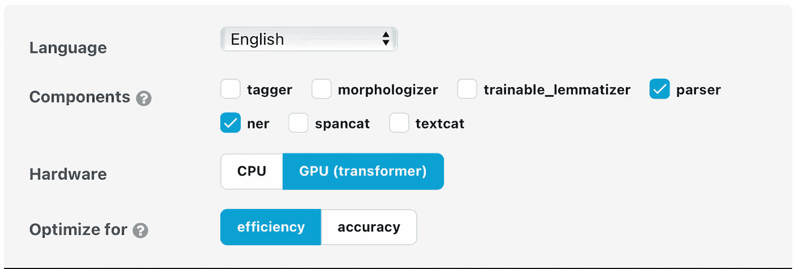
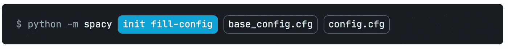
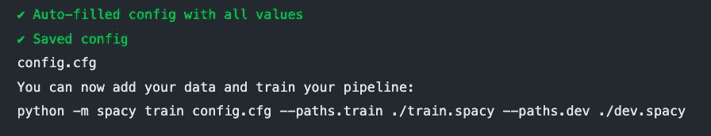
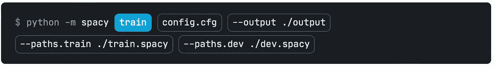
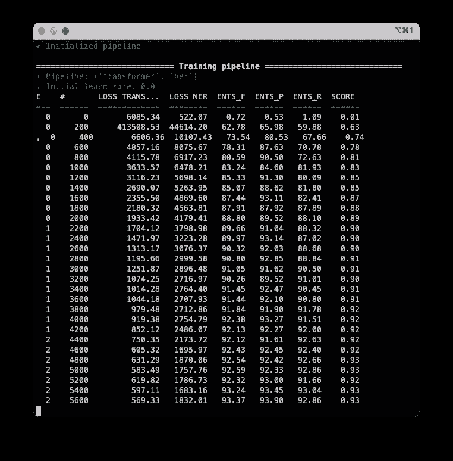
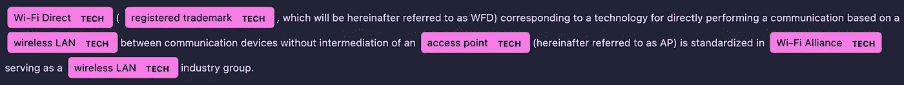
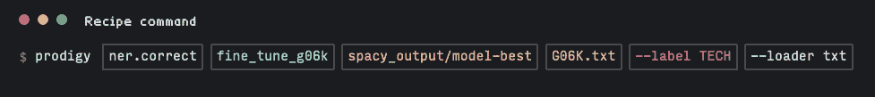
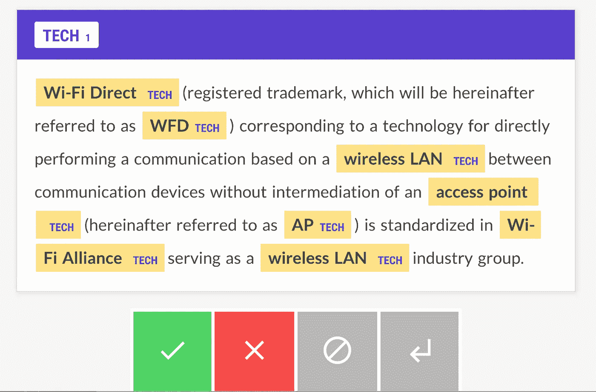
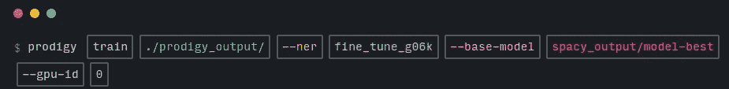

# 用专利文本改进命名实体识别(NER)模型| SpaCy、Prodigy 和一点神奇的🪄

> 原文：<https://towardsdatascience.com/improving-the-ner-model-with-patent-texts-spacy-prodigy-and-a-bit-of-magic-44c86282ea99>

> **命名实体识别**(**NER**)——是[信息提取](https://en.wikipedia.org/wiki/Information_extraction)的一个子任务，寻求定位 [**命名实体**](https://en.wikipedia.org/wiki/Named_entity) **…并将其**分类到预定义的类别**中，如人名、组织、地点、[医疗代码](https://en.wikipedia.org/wiki/Medical_classification)、时间表达式、数量、货币值、百分比等。**
> 
> … NER 也简称为实体识别、实体分块和实体提取。

简而言之，我们识别文本中有意义的实体，并根据类别对它们进行分类。

## 为什么有用？

它在许多方面都有帮助:

*   **HR** (通过汇总简历加快招聘过程)
*   **医疗保健**(从实验室报告中提取重要信息)
*   **推荐引擎【Booking.com】查看这个故事！)**

## 如何改进？

拥有最受欢迎的实体类别的数据集已经存在，比如组织或品牌。但是定制数据集呢？通常，人们手动注释数据集，这可能是昂贵的，时间长，并且质量仍然取决于初始数据。

在这篇文章中，我提出了另一种方法。我使用已经分类的文本，其中充满了相关术语，来训练特定领域的 NER 管道。

# 专利数据集

由[马库斯·温克勒](https://unsplash.com/@markuswinkler?utm_source=medium&utm_medium=referral)在 [Unsplash](https://unsplash.com?utm_source=medium&utm_medium=referral) 拍摄的照片

专利，准确地说是专利的文本，是提供专利发明高度具体信息的文件。换句话说，它根据其**领域中的功能来描述发明。这意味着专利将包含特定于该领域的术语，文本的简洁有助于数据检索的方便。**

例如，其中一个来源是谷歌专利，它提供对国际专利分类数据库的访问:

  

但更重要的是**版权免费。根据** [**USPTO**](http://www.uspto.gov/news/media/ccpubguide.jsp)

> 除了 37 CFR 1.71(d) & (e)和 1.84(s)中反映的有限例外情况外，**专利的文本和图纸通常不受版权限制**。

这意味着我们可以自由地使用这些文本来训练我们的模型，而不用担心版权问题，这对构建商业系统至关重要。

对于实验，我选择了专利的**【G06K】***(数据识别/数据呈现)* 小节，而**G06**——是*计算/计算*小节。这样的文本应该有助于训练对特定于数据分析领域的技术实体的识别，例如计算机视觉、信号处理等。

  

# 提取术语

由于专利文本是特定于其领域的，我们需要从中提取每个频繁命名的实体。为此，我们可以使用，例如， [Wikicorpus](https://www.cs.upc.edu/~nlp/wikicorpus/) 。在项目的存储库中，您会发现已经策划好的名为`manyterms.lower.txt`的列表。

要从文本中提取相关术语，我们可以使用 [scikit 中的`CountVectorizer`-learn](https://scikit-learn.org/stable/modules/generated/sklearn.feature_extraction.text.CountVectorizer.html)。通过这种方式，我们可以去除比某个阈值频率低的术语，并分别留下具有更多提及和更多句子的术语来训练。

利用计数向量机从专利文本中抽取实体

# 模特培训

提取潜在术语后，我们可以开始训练模型。这里我使用了 SpaCy 库,因为准备 NER 管道很简单，而且有全面的文档。但在此之前，我们需要以适当的格式制作数据集。

这里我使用库的`PhraseMatcher`类从预定义的维基列表中查找实体。

然后，用自定义标签***TECH****和标注每个实体，并以 SpacCy 格式保存。*

*当训练和评估时。布景准备好了，我们可以开始训练模特了。由于 SpaCy 是为生产量身定制的，所以配置非常广泛。然而，对于一个简单的例子，基本的就足够了。为此，只需进入[网站](https://spacy.io/usage/training#quickstart)，选择型号并下载`base-config.cfg`。*

**

*我们使用的配置选项|截图来自 [spacy.io](https://spacy.io/usage/training#quickstart)*

*之后，使用以下命令初始化完整配置:*

**

*配置初始化命令*

**

*作者图片|配置初始化后的输出*

*在这个命令之后，spacy 填充所有其他配置参数，并为训练做准备。现在我们可以运行一个命令来训练:*

**

*带参数的训练命令*

**

*图片作者|培训期间输出*

*瞧，我们的 NER 模特训练好了！现在我们可以看到结果了。*

> ***重要注意事项！**经过训练的 NER 模型将不仅从预先标记的训练数据中学习标记实体**。**它将学习根据给定的上下文查找和识别实体。*

*只需加载`model-best`并运行所需的文本输入来运行测试。SpaCy 提供了一个很好的可视化 NER 标签，在 Jupyter 笔记本内支持。*

*对文本样本运行模型推理的代码*

**

*图片由作者|以上代码输出*

# *额外收获:主动学习，天赋异禀*

> *⚠️ [Prodigy](https://prodi.gy/docs) 是业内广泛使用的付费脚本注释工具，由 SpaCy 团队开发并集成到他们的 NLP 库中。这不是创建 NER 模型的关键部分，但对一些人来说还是有帮助的。⚠️*

*完美是无止境的，因此我们可以用 Prodigy 进一步改进我们的 NER 模型。它的很酷的一个特点就是主动学习。简而言之，这意味着我们可以根据手动标记的数据来调整模型。然而，由于我们的模型已经训练好了，我们只需要一堆带注释的例子，而不是整个数据集。*

*如何选择例子？这就是为什么神童是有用的。**自动给出模型置信度最低的测试集中的例子。***

**

*图片由作者提供|使用 Prodigy 运行主动学习的命令*

*该命令将打开注释窗口。在这里，我们可以检查标签并修复它们。*

**

*图片作者| Prodigy 注释窗口*

*这些注释会自动保存到 prodigy 数据集。在完成对几个例子的注释之后，我们现在可以对模型进行微调了。由于与 SpaCy 的集成，我们可以直接从 prodigy 运行我们的模型的训练。*

**

*使用 prodigy 注释数据运行模型调整的命令*

# *结果*

*就是这样！我们训练了 NER 模型，它现在可以识别和标记特定领域的实体。利用专利数据集可以快速准备数据，而无需人工管理。*

*完整的代码和解析的数据可以在这里找到:*

*<https://github.com/kinivi/patent_ner_linking>  

## 附言

NER 是创建实体链接的关键步骤，它允许在被认可的实体之间创建层级和连接。在这种情况下，模型验证同样复杂。*但这将在我的下一篇文章中描述*😉*