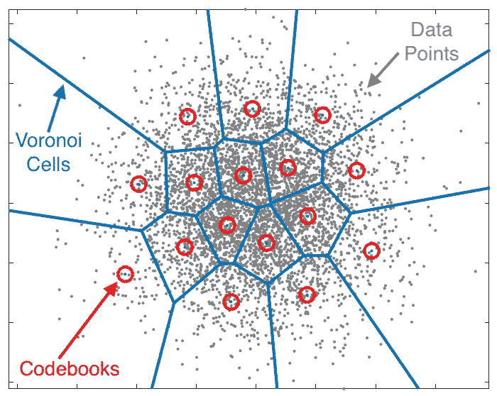
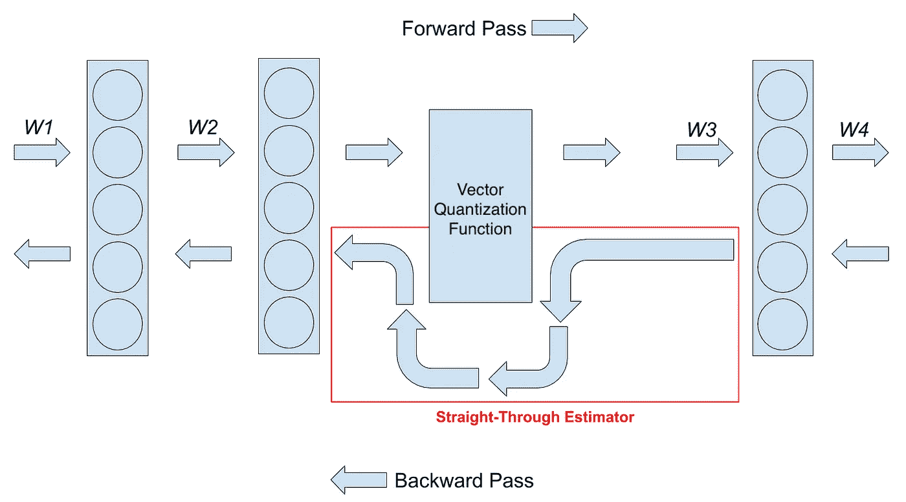
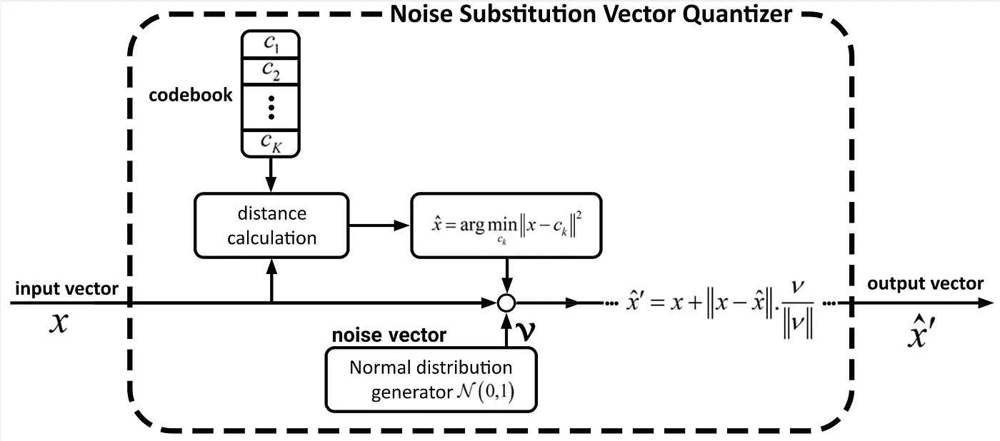
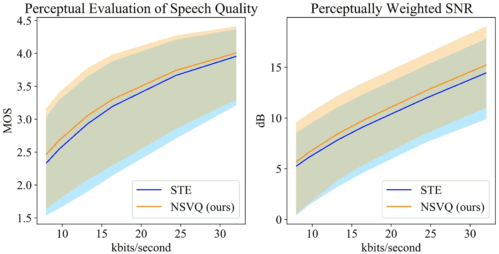
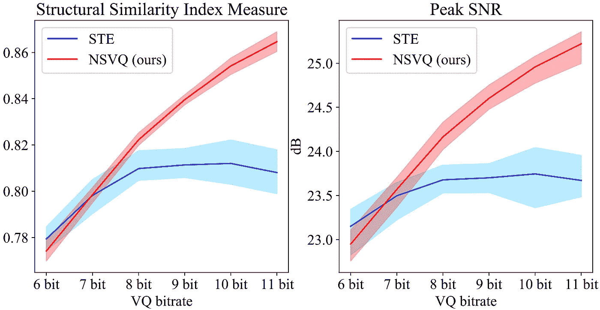
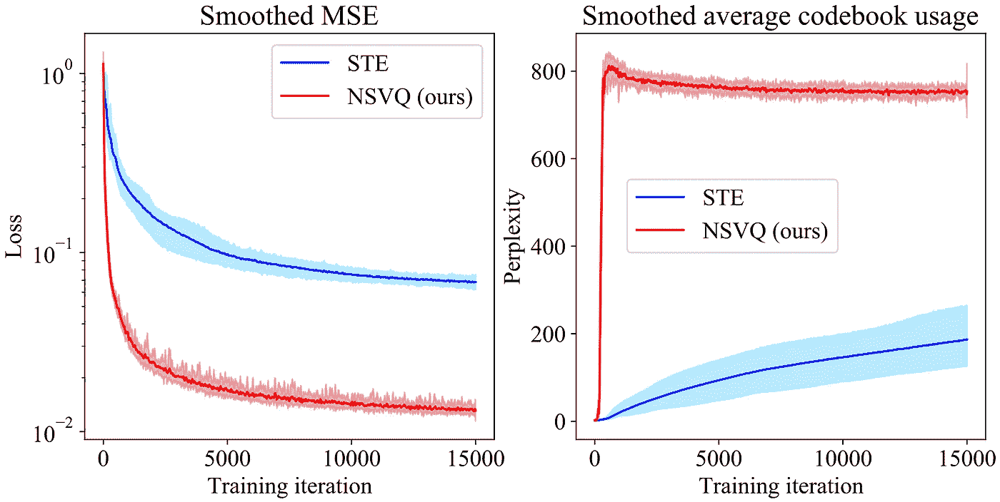
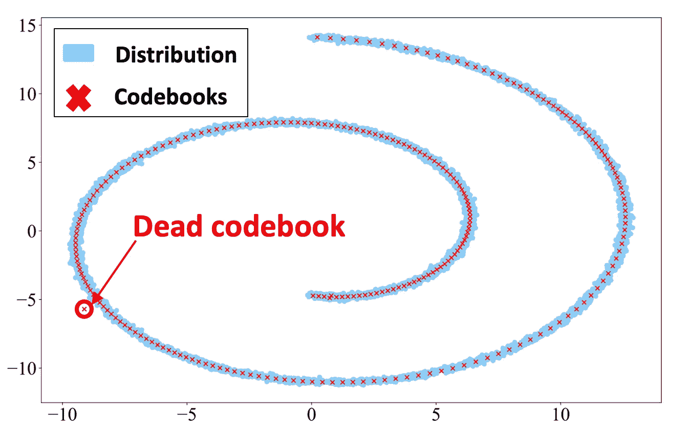
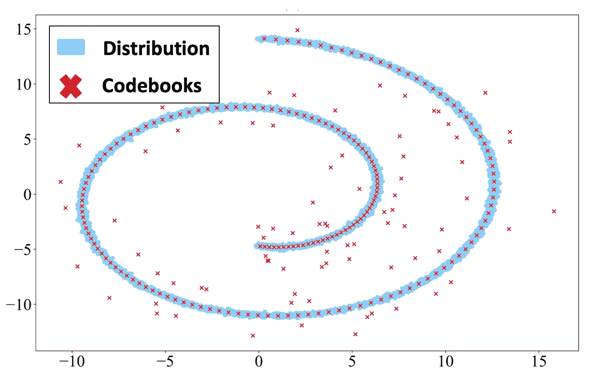
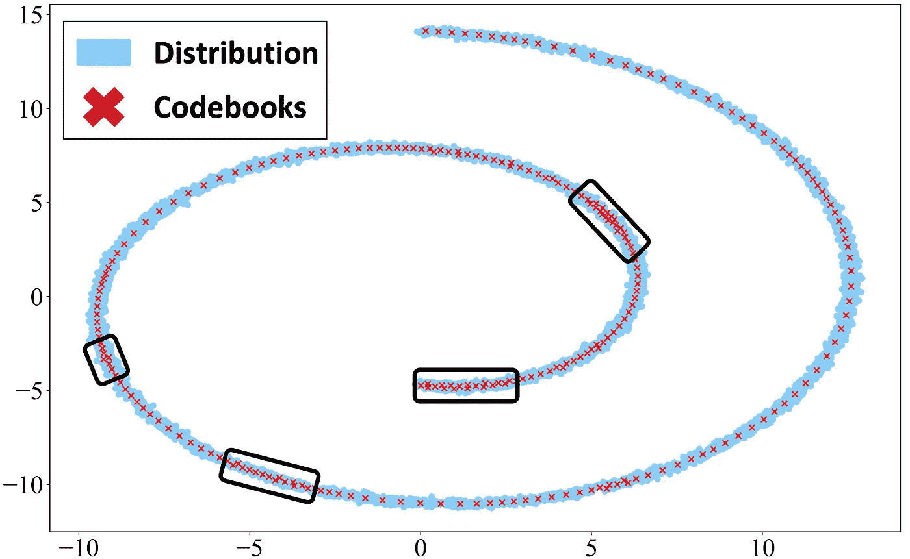

# NSVQ:用于神经网络训练的改进矢量量化技术

> 原文：<https://towardsdatascience.com/improving-vector-quantization-in-vector-quantized-variational-autoencoders-vq-vae-915f5814b5ce>

## 用于机器学习优化的高效矢量量化。向量量化变分自动编码器)，优于直通估计器

[vackground.com](https://unsplash.com/@vackground?utm_source=medium&utm_medium=referral)在 [Unsplash](https://unsplash.com?utm_source=medium&utm_medium=referral) 上拍照

矢量量化(Vector quantization，VQ)是一种类似 k-means 聚类算法的数据压缩技术，它通过一些有代表性的称为码本的矢量来模拟数据的概率密度函数。矢量量化最近被广泛用于基于机器学习的应用中，尤其是那些基于矢量量化变分自动编码器(VQ-VAE)的应用；例如图像生成[1]、语音编码[2]、语音转换[3]、音乐生成[4]和文本到语音合成[5]。

根据下图，矢量量化是将所有数据点(在 voronoi-cell 中)映射到其最近的码本点的操作。换句话说，它使用下面的公式从一组码本向量(c_k)s 中找到最接近输入数据向量(x)的码本向量(c_k*)，并且通过用最接近的码本(c_k*)替换 x 的值来将 x 映射(量化)到 x_hat。

矢量量化公式

矢量量化运算(图片来自[此处](https://speechprocessingbook.aalto.fi/Modelling/Vector_quantization_VQ.html))

显然，矢量量化不能直接用于基于机器学习的优化，因为没有为它定义真正的梯度(对于上述方程)。因此，我们需要应用一些技巧来估计 VQ 函数的梯度，并使其通过反向传播来传递这些梯度并更新码本向量。

VQ-VAE 在 Oord 等人的论文[神经离散表示学习](https://proceedings.neurips.cc/paper/2017/file/7a98af17e63a0ac09ce2e96d03992fbc-Paper.pdf)中首次提出。他们应用 VQ 来模拟变分自动编码器的潜在空间的离散表示。换句话说，他们将 VQ 应用于编码器的输出，并为此找到最佳嵌入(码本)，然后将这些嵌入传递给解码器。为了在反向传播(反向传递)中传递 VQ 函数的梯度，本文和上述所有文章都使用直通估计器(STE) [7]，它只是简单地复制 VQ 模块上的梯度，如下图所示。

直通估计器(图片来自[此处](https://www.hassanaskary.com/python/pytorch/deep%20learning/2020/09/19/intuitive-explanation-of-straight-through-estimators.html)

然而，直通估计器(STE)没有考虑量化的影响，并导致梯度和矢量量化的真实行为之间的不匹配。此外，对于使用 STE 的方法，有必要在全局损失函数中增加一个额外的损失项，以使 VQ 码本(嵌入)得到更新。因此，附加损失项的加权系数是一个新的超参数，需要手动调整。奥尔德等人[6]引入的 VQ-VAE 损失函数如下所示。公式中的第二项和第三项是 VQ 模块所需的损失项，加权系数为α和β。关于损失函数的更多细节，请参见论文。

奥尔德等人[6]在 VQ-VAE 论文中使用的损失函数

在这篇文章中，我们想介绍我们最近提出的基于机器学习方法的矢量量化技术，它以“ [**NSVQ:机器学习矢量量化中的噪声替换**](https://ieeexplore.ieee.org/abstract/document/9696322)【8】的标题发表。NSVQ 是一种技术，其中通过将噪声添加到输入向量来模拟向量量化误差，使得模拟的噪声将获得原始 VQ 误差分布的形状。NSVQ 的框图如下所示。

NSVQ 框图:矢量量化中的噪声替代(图片由作者提供)

我们在三个不同的实验场景中测试我们的 NSVQ 方法，

1.  语音编码:对语音信号的频谱包络进行建模([在【9】](https://www.isca-speech.org/archive/pdfs/interspeech_2021/vali21_interspeech.pdf)中提出的语音编码方法)
2.  图像压缩:对[6]中提出的 VQ-VAE 的潜在表示进行建模
3.  玩具示例:对一些众所周知的数据分布进行建模。

基于[我们的论文](https://ieeexplore.ieee.org/abstract/document/9696322)【8】中的结果(在下面的图中也提供了这些结果)，已经表明 NSVQ 不仅可以通过后向通道中的梯度，而且可以为码本提供比 STE 更精确的梯度。此外，与 STE 相比，NSVQ 导致更高的量化精度和更快的收敛。此外，在多次运行单个实验时，NSVQ 的性能更具确定性(表现出更小的性能差异)。使用 NSVQ 的一大好处是，它不需要在全局损失函数中添加任何额外的损失项。因此，它不会导致任何额外的超参数调整(STE 额外损失项的系数)。

在语音编码场景中，我们使用语音质量感知评估(PESQ)和感知加权信噪比(pSNR)作为客观度量来评估 STE 和我们提出的 NSVQ 方法的解码语音质量。下图显示了结果。

在语音编码场景中，在 8、9.6、13.2、16.4、24.4 和 32 kbit/s 的总比特率下，针对 12 比特 VQ，在 PESQ 和 pSNR 度量方面，所提出的 NSVQ 和 STE 的性能；实线指的是 PESQ 和 pSNR 的平均值，对应的填充区域指的是它们的 95%分位数。(图片由作者提供)

在图像压缩场景中，我们采用结构相似性指数度量(SSIM)和峰值信噪比(峰值 SNR)作为客观度量来评估 VQ-VAE 解码器端的重建图像的质量。下图展示了结果。

在图像压缩场景中，在 15 k 训练更新和超过 20 次单独实验之后，STE 的 SSIM 和峰值 SNR 值以及针对不同 VQ 比特率提出的 NSVQ 实线指的是 SSIM 和峰值 SNR 的平均值，相应的填充区域指的是它们的 95%分位数。(图片由作者提供)

根据上图，当增加 VQ 比特率时，所提出的 NSVQ 获得严格上升的 SSIM 和峰值 SNR 值，这证实了它的行为与比特率的增加一致。这种行为是我们对真正的 VQ 的期望。然而，STE 方法不遵循相同的行为。我们认为原因是 STE 没有考虑 VQ 函数在反向传播中的影响。

在图像压缩场景中，除了客观评价之外，我们还研究了另外两件事；训练收敛速度和码本向量混乱度(平均码本使用率)。这是结果。

在图像压缩场景中，在 15 k 训练更新和超过 20 次单独实验之后，STE 的平滑训练误差(MSE)和平滑平均码本使用(困惑)以及针对 11 比特 VQ 提出的 NSVQ 实线指的是 MSE 和困惑度的平均值，对应的填充区域指的是它们的 95%分位数。(图片由作者提供)

在本文的第三个场景中，我们使用我们提出的 NSVQ、STE 和 MiniBatchKmeans(来自 scikit-learn 库)方法对几个著名的机器学习数据分布进行建模。这里，我们仅示出了使用 8 比特(2⁸=256 码本)在 2D 空间中对*瑞士滚*分布应用的矢量量化。我们从数据分布中初始化码本向量的位置，以使 VQ 更具挑战性。下图显示了 NSVQ、STE 和 MiniBatchKmeans 方法的最终优化码本位置。

使用 **NSVQ** 方法的 8 位矢量量化的最终优化码本(图片由作者提供)

使用 **STE** 方法的 8 位矢量量化的最终优化码本(图片由作者提供)

使用 **MiniBatchKmeans** 方法的 8 位矢量量化的最终优化码本(图片由作者提供)

根据这些图，NSVQ 捕获*瑞士卷*分布形状比 STE 好得多，并且具有少得多的死码本数量(从数据分布中选择的并且对解码阶段无用的码本)。因此，可以得出结论，与 STE 相比，NSVQ 对码本的初始化不太敏感。请注意，NSVQ 的这种行为部分是由于我们论文中提到的*码本替换*功能。

此外，NSVQ 以比 MiniBatchKmeans 方法更统一和同类的方式定位码书。查看上图中黑框中的密集码本分布，它显示了 MiniBatchKmeans 方法的码本位置。这种现象在 NSVQ 方法中没有发生(注意，数据分布的性质在黑盒区域中并不密集)。对于所有这三种方法，我们已经计算了原始数据分布与其矢量量化版本之间的均方误差(MSE)。根据我们在[论文](https://ieeexplore.ieee.org/abstract/document/9696322)【8】中发表的 MSE 值，NSVQ 用比 STE 和 MiniBatchKmeans 方法更低的 MSE 值量化数据。

最后，我必须提到，NSVQ 技术适用于训练任何机器学习应用程序，这需要在计算图中的某个位置进行矢量量化。然而，请注意 **NSVQ 仅应用于训练阶段**以便学习矢量量化码本。但是，它不用于推理阶段，因为我们不需要在反向传播中传递任何梯度。因此，在推理阶段，使用上面提到的原始矢量量化公式会更好、更准确。

我们在以下公开网页中提供 NSVQ 的 **PyTorch 代码:**

 [## 阿尔托大学/ NSVQ GitLab 的语音交互技术

### 论文“机器学习矢量量化中的噪声替换”代码的 Python 实现…

gitlab.com](https://gitlab.com/speech-interaction-technology-aalto-university/nsvq) 

# 确认

特别感谢我的博士生导师[Tom bck strm](https://research.aalto.fi/en/persons/tom-bäckström)教授，他支持我，也是这项工作的另一位贡献者。

# 参考

A. Razavi，A. van den Oord 和 O. Vinyals，“用 VQ-VAE-2 号生成多样的高保真图像”，在 *Proc。第 33 届 Int。糖膏剂神经感染。过程。系统。*，2019 年第 32 卷，第 14866–14876 页。

**【2】**c . Garbacea，A. V. den Oord，Y. Li，F. S. C. Lim，A. Luebs，O. Vinyals 和 T. C. Walters， *Proc .IEEE Int。糖膏剂声音。，语音信号处理。(ICASSP)* ，2019 年 5 月，第 735–739 页。

**【3】**s . Ding 和 R. Gutierrez-Osuna，“非并行语音转换中矢量量化变分自动编码器的分组潜在嵌入”，*Inter-speech*论文集，2019，第 724–728 页。

**【4】**p . Dhariwal，H. Jun，C. Payne，J. W. Kim，a .拉德福德，I. Sutskever，《点唱机:音乐的生成模型》， *arXiv 预印本 arXiv:2005.00341* ，2020 年。

**a . TJ andra，B. Sisman，M. Zhang，S. Sakti，H. Li，S. Nakamura，“用于 Zerospeech challenge 2019 的 VQVAE 无监督单元发现和多尺度 code2spec 反相器”， *arXiv 预印本 arXiv:1905.11449* ，2019。**

****【6】**a . van den Oord，O. Vinyals，K. Kavukcuoglu，“神经离散表征学习”，载于*第 31 届国际神经信息处理系统会议论文集*，2017 年，第 6309–6318 页。**

****【7】**y . beng io，n . Le \u onard，a .库维尔，“通过随机神经元估计或传播梯度用于条件计算”， *arXiv 预印本 arXiv:1308.3432* ，2013 年。**

****【8】**m . h .瓦利和 t . bck strm，“NSVQ:用于机器学习的矢量量化中的噪声替换”， *IEEE Access* ，第 10 卷，第 13 598–13 610 页，2022 年。**

****m . h .瓦利和 t .贝克斯特罗姆，“语音和音频编码频谱包络的端到端优化多级矢量量化”，载于 Pr *oc。Interspeech，【2021 年 8 月，第 3355–3359 页。*****