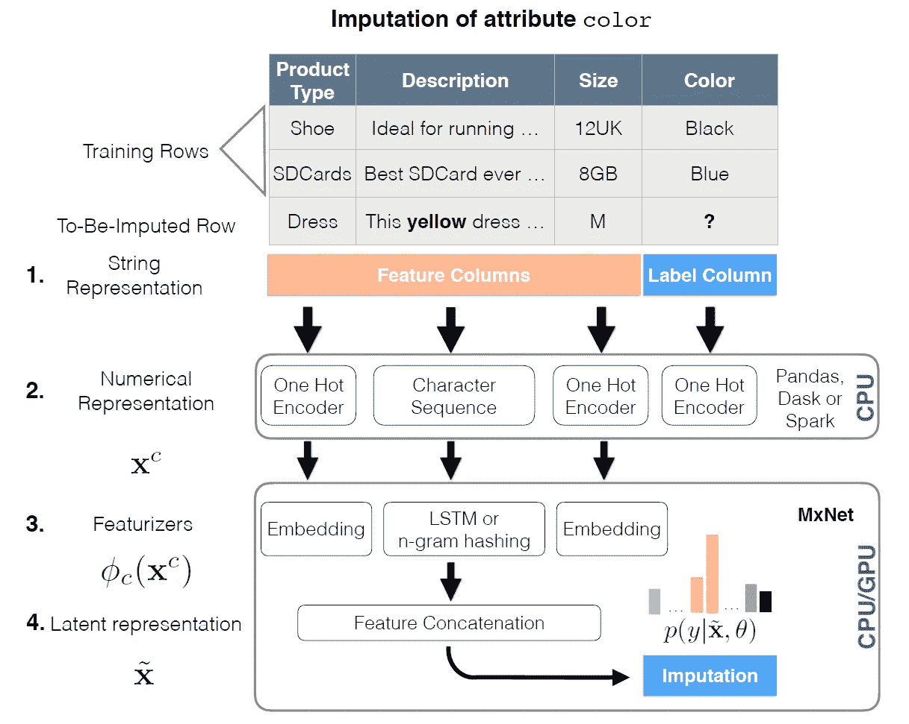
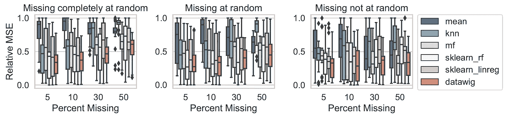
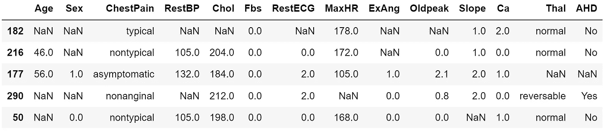
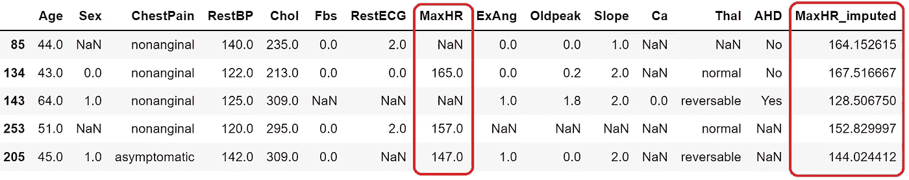
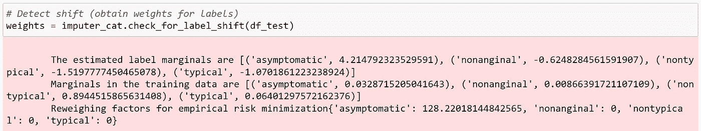

# 用 DataWig 对表中缺失数据的插补

> 原文：<https://towardsdatascience.com/imputation-of-missing-data-in-tables-with-datawig-2d7ab327ece2>

## 用 Python 实现 Amazon 的 DataWig 来估算表格数据中的缺失值


亨特·哈里特在 [Unsplash](https://unsplash.com?utm_source=medium&utm_medium=referral) 上的照片

现实世界数据集中的缺失值是一种常见现象，给所有数据从业者带来了重大挑战。当数据集包含异构数据类型时，这个问题甚至更具挑战性。

在本文中，我们将探讨 DataWig 如何帮助我们有效且高效地对表格数据中的缺失值进行插补。

## 内容

> ***(1)*** [*缺失数据的类型和插补技巧*(可选)](#f928)***(2)***[*关于 Data wig*](#80ce)***(3)***[*Data wig 如何工作*](#8401)

# (1)缺失数据的类型和插补技术

> (可选底漆)

在我们开始之前，最好了解缺失数据的类型和各种可用的插补技术。为了保持这篇文章的简短，我已经将底漆放在一篇单独的文章中。如果您已经熟悉这些概念，可以跳过这一部分。

# (2)关于 DataWig

[**data wig**](https://github.com/awslabs/datawig)**由 [Amazon Science](https://www.amazon.science/) 开发，是一个软件包，它将缺失值插补应用于包含**异构**数据类型的表格，即数字、分类和非结构化文本。**

**目标是建立一个健壮的、可扩展的框架，允许用户在没有大量工程工作或机器学习背景的情况下估算缺失值。**

# **(DataWig 的工作原理**

**DataWig 运行三个组件对异构数据进行插补:**编码、特征器**和**插补器**。**

**我们可以通过一个包含**非数字**数据的例子来了解 DataWig 是如何工作的。假设我们有一个 3 行的产品目录数据集，其中第三行的' ***Color*** '列缺少一个值。**

**因此，' ***颜色*** '列是待估算列(又名**输出**列)，而其他列是**输入**列。**

**目的是使用前两行(包含完整数据)来训练插补模型，并预测第三行中缺失的' ***、颜色*** '值。**

****

**改编自 [DataWig JMLR 论文](https://jmlr.org/papers/v20/18-753.html) |图片在 CC-BY 4.0 下使用**

1.  **首先使用**试探法**自动确定列的数据类型。例如，如果一个列的行数至少是唯一值的十倍，则该列被定义为分类而不是纯文本。**
2.  **使用列编码器将特征转换成数字表示，例如，一键编码。**
3.  **数字格式的列被转换成特征向量。**
4.  **特征向量被连接成潜在的表示，以被解析成用于训练和预测的插补模型。**

**让我们来探索这三个组件:**

## **(一)编码器**

*****column encoder***类将原始数据转换成数字表示。不同的数据类型有不同类型的编码器，例如:**

*   ***sequential encoder*—**字符串**符号(如字符)的序列**
*   ***BowEncoder* —将**字符串**表示为稀疏向量的单词包表示**
*   ***分类编码器* —用于分类变量(**一键**编码)**
*   ***数字编码器* —用于数值(**数值归一化**)**

## **㈡特色化**

**在编码成数字表示之后，下一步是使用特征化器将数据转换成特征向量。**

**目的是将数据作为矢量表示输入插补模型的计算图，用于训练和预测。**

**还有不同类型的特征来迎合不同的数据类型:**

*   ***lstmfeaturer*—使用 [LSTM](https://en.wikipedia.org/wiki/Long_short-term_memory) 将输入序列映射成潜在向量**
*   ***bow featurezer*—将字符串数据转换成稀疏向量**
*   ***嵌入分类器* —将编码的分类数据映射成矢量表示(即嵌入)**
*   ***数字分类器* —使用完全连接的层提取特征向量**

## **㈢估算者**

**最后一部分是创建**插补** **模型**，执行训练，并生成预测以填充缺失值。**

**DataWig 采用 [MICE](https://stats.stackexchange.com/a/421586/336914) 技术进行插补，内部使用的模型是用 [MXNet](https://mxnet.apache.org/versions/1.9.1/) 在后端训练的神经网络。**

**简而言之，深度学习模型使用包含有用信息的列来估算待估算列中的缺失值。**

**假设将有不同的数据类型，适当的损失函数(例如，平方损失或交叉熵损失)也被自动选择。**

# **(DataWig 的插补性能**

**亚马逊科学团队对 DataWig 进行了评估，将它与五种输入**缺失数值**的流行技术进行了比较。**

**这些其他插补技术包括均值插补、kNN、矩阵分解(MF)和[迭代插补](https://scikit-learn.org/stable/auto_examples/impute/plot_iterative_imputer_variants_comparison.html#sphx-glr-auto-examples-impute-plot-iterative-imputer-variants-comparison-py)(线性回归和随机森林)。这种比较是在具有不同数量的缺失数据和缺失类型的合成数据和真实数据之间进行的。**

****

**改编自 [DataWig JMLR 论文](https://jmlr.org/papers/v20/18-753.html) |图片在 CC-BY 4.0 下使用**

**根据[归一化均方误差](https://math.stackexchange.com/questions/488964/the-definition-of-nmse-normalized-mean-square-error)，DataWig 优于其他方法，即使在困难的 MNAR 遗漏类型中。结果显示在上面的图中。**

**评估的更多细节(包括非结构化文本)可在[研究论文](https://jmlr.org/papers/v20/18-753.html)中找到。**

***作者的想法:鉴于 DataWig 在处理分类和文本特征方面据称的优势，我很惊讶研究论文的评估重点是缺失的数值。***

# **(5) Python 的实现**

**为了展示 DataWig 的工作原理，我们将使用 [**心脏病数据集**](https://archive.ics.uci.edu/ml/datasets/heart+disease) ，因为它包含数字和分类数据类型。**

***注:你可以在这里* [***找到这个项目的 GitHub 回购***](https://github.com/kennethleungty/DataWig-Missing-Data-Imputation) *和完整的 Jupyter 笔记本演示* [***这里***](https://github.com/kennethleungty/DataWig-Missing-Data-Imputation/blob/main/notebooks/DataWig-Example.ipynb) *。***

**特别是，作为演示的一部分，我们将进行两次插补:**

1.  ****数值插补**:在数值`**MaxHR**`栏填写缺失值(人达到的最大心率)**
2.  ****分类插补**:在分类`**ChestPain**` 栏填写缺失值(遇到的胸痛类型)**

## **步骤 1 —初始设置**

*   **用 Python 版本 3.7 创建并激活一个新的 [*conda* 环境](https://conda.io/projects/conda/en/latest/user-guide/tasks/manage-environments.html)。原因是 DataWig 目前支持 3.7 及以下版本。**

```
conda create -n myenv python=3.7
conda activate myenv
```

*   **通过 pip 安装 DataWig**

```
pip install datawig
```

*   **如果您希望环境出现在您的 Jupyter 笔记本中，您可以运行以下命令:**

```
python -m ipykernel install --user --name myenv --display-name "myenv"
```

***注意:确保 pandas、NumPy 和 scikit-learn 库更新到最新版本。***

## **步骤 2 —数据预处理**

**插补前有两个预处理步骤要做:**

*   **执行随机洗牌训练-测试分割(80/20)**
*   **随机隐藏**测试**数据集中任意比例(如 25%)的值，以模拟缺失数据。对于插补模型的训练，训练集将保持完全不缺失。**

**下面是一个测试集的例子，缺失的数据显示为`NaN`:**

****

**测试集样本|作者图片**

## **步骤 3 —设置插补模型**

**构建和部署插补模型的最简单方法是使用`SimpleImputer`类。它会自动检测列数据类型，并使用一组默认的编码器和特征，在各种数据集上产生良好的结果。**

**我们首先定义一个输入列的列表，这些输入列对于预测待估算列中的缺失值非常有用。该列表基于**用户的领域知识和批判性判断。****

**然后我们创建两个`SimpleImputer`的实例，每个实例对应两个要估算的列(即`**MaxHR**` 和`**ChestPain**`)**

## **步骤 4 —拟合插补模型**

**准备好模型实例后，我们可以将它们放入我们的训练数据集。除了简单的模型拟合，我们还可以利用`SimpleImputer`的超参数优化(HPO) `fit_hpo`功能找到最佳插补模型。**

**HPO 函数在超参数(例如，学习率、批量大小、隐藏层数)的定制网格上使用随机搜索。**

**如果不需要 HPO，我们可以省略超参数搜索参数(如分类插补示例所示)**

## **步骤 5-执行插补并生成预测**

**下一步是通过对有缺失值的测试集运行经过训练的插补模型来生成预测。**

**输出是原始数据帧**加上**估算数据的新列。**

****

**输出预测数据框(红色框中的原始列和估算列)|作者图片**

## **第 6 步—评估**

**最后，让我们看看我们的插补模型如何处理这些评估指标:**

*   **数值插补的均方误差(MSE)**
*   **分类插补的马修相关系数( [MCC](https://bmcgenomics.biomedcentral.com/articles/10.1186/s12864-019-6413-7) )**

**本次演示中，均方误差为 **342.4，**MCC 为 **0.22** 。这些值构成了与其他插补技术进行比较的基准。**

# **(6)高级功能**

**除了前面描述的基本实现，我们还可以利用高级 DataWig 特性来满足我们特定的项目需求。**

## **㈠估算者**

**如果我们希望对模型类型和插补模型中的预处理步骤有更多的控制，我们可以使用`Imputer`类。**

**与`SimpleImputer`中的默认设置相比，它为模型参数的定制规范(如特定的编码器和特征)提供了更大的灵活性。**

**下面是一个例子，说明如何在`Imputer`中明确定义每一列的编码器和特征:**

**然后可以使用`Imputer`实例来执行`.fit()`和`.predict()`。**

***作者的想法:列类型的具体定义可能是有帮助的，因为自动编码和特征化可能并不总是完美地工作。例如，在该数据集中，* `*SimpleImputer*` *将分类* `*Thal*` *列误识别为文本列。***

## **(ii)标签移位检测和校正**

**`SimpleImputer`类有一个方便的函数`check_for_label_shift`，帮助我们检测数据漂移的问题(特别是[标签移位](https://datascience.stackexchange.com/questions/86350/what-is-label-shift))。**

**当训练数据和真实数据之间的边际分布不同时，就会发生标签偏移。通过理解标签分布是如何变化的，我们可以解释插补的变化。**

**`check_for_label_shift`函数记录偏移的严重程度，并返回标签的权重因子。下面是权重的输出示例:**

****

**标签移位检查|作者图片的输出**

**然后，当我们重新拟合插补模型以纠正偏移时，我们通过传递权重来重新训练具有加权似然性的模型。**

# **包装它**

**我们已经介绍了如何使用 DataWig 有效地估算数据表中的缺失值。**

**一个重要的警告是，像 DataWig 这样的插补工具不是处理缺失数据的灵丹妙药。**

**处理缺失数据是一个具有挑战性的过程，需要适当的调查以及对数据和背景的深刻理解。本演示中展示了一个清晰的示例，其中用户需要决定将哪些输入要素输入到模型中，以准确估算输出列。**

**这个项目的 GitHub repo 可以在 [**这里**](https://github.com/kennethleungty/DataWig-Missing-Data-Imputation) 找到。**

# **在你走之前**

**欢迎您**加入我的数据科学学习之旅！**点击此[媒体](https://kennethleungty.medium.com/)页面，查看我的 [GitHub](https://github.com/kennethleungty) ，了解更多精彩的数据科学内容。同时，享受用 DataWig 输入缺失值的乐趣吧！**

**[](/feature-selection-with-simulated-annealing-in-python-clearly-explained-1808db14f8fa)  [](/how-to-dockerize-machine-learning-applications-built-with-h2o-mlflow-fastapi-and-streamlit-a56221035eb5)  [](/top-tips-to-google-search-like-a-data-science-pro-897599f4d9ae) **