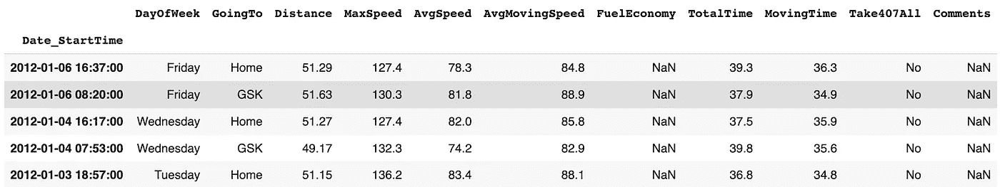
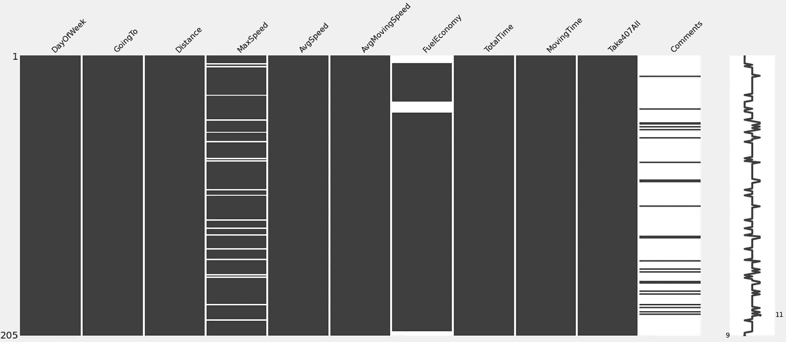
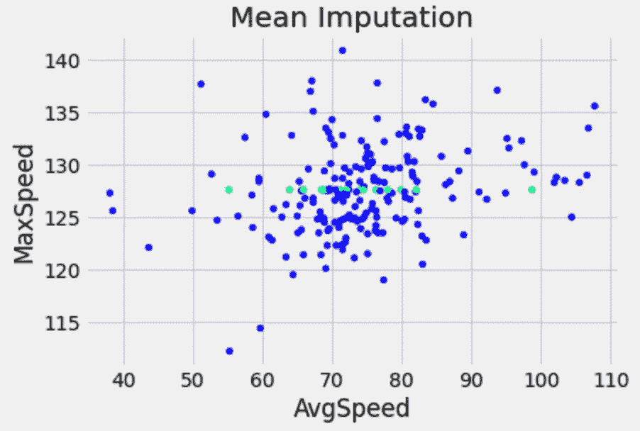
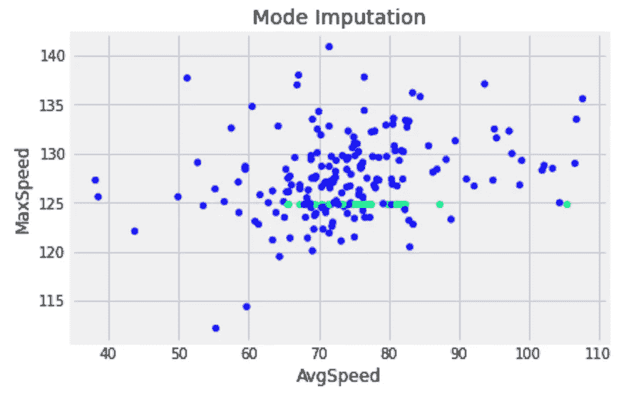
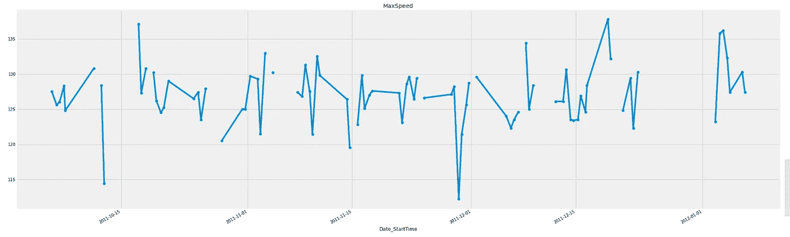
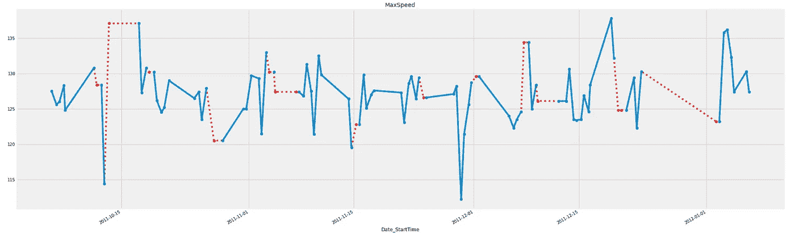
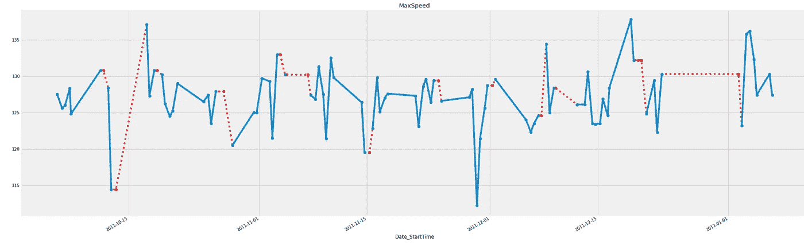
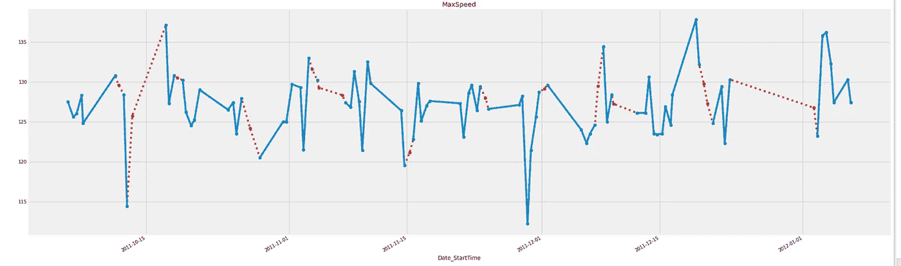
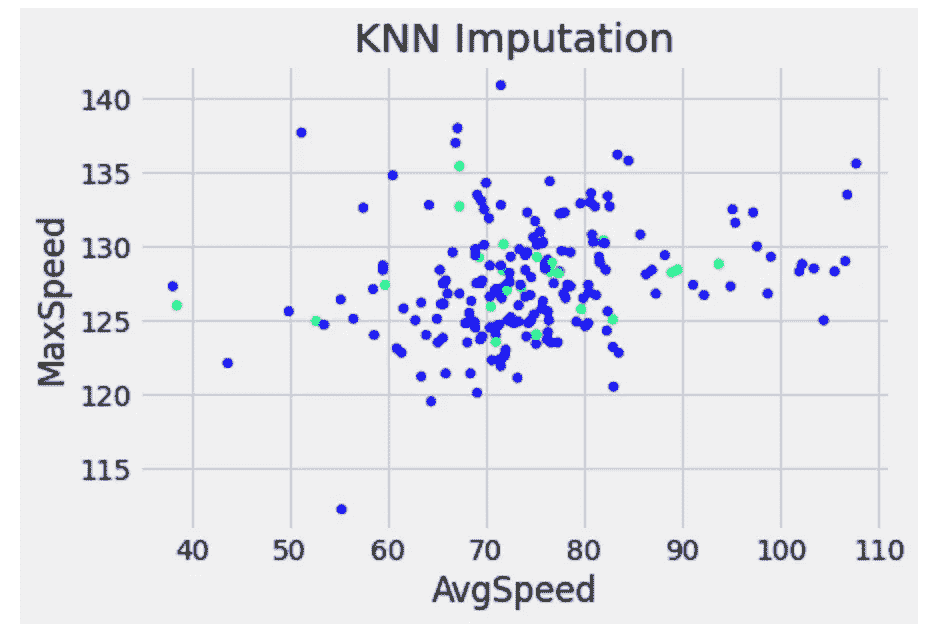
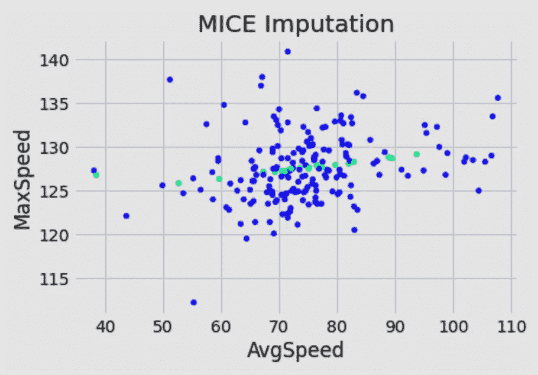

# 用简单和先进的技术输入缺失数据

> 原文：<https://towardsdatascience.com/imputing-missing-data-with-simple-and-advanced-techniques-f5c7b157fb87>

## 均值、众数、时间序列、KNN 和 MICE 插补教程


照片由[阿莱西奥·罗维西](https://unsplash.com/@alessionord?utm_source=medium&utm_medium=referral)在 [Unsplash](https://unsplash.com?utm_source=medium&utm_medium=referral) 拍摄

[缺失数据](https://en.wikipedia.org/wiki/Missing_data)当数据集中没有存储感兴趣变量的数据时发生。根据其数量，丢失的数据可能会损害任何数据分析的结果或机器学习模型的稳健性。

在使用 Python 处理缺失数据时，Pandas 的`dropna()`函数派上了用场。我们用它来删除包含空值的行和列。它还有几个参数，如**轴**定义是否删除行或列，**如何**确定是否在任一或所有行/列中出现缺失值，以及**子集**选择一组要应用 drop 函数的列或标签。

```
df.dropna(axis=0, how='any', subset=None, inplace=False)
```

然而，还有其他*可能* *更好的*处理缺失数据的方法。在这篇文章中，我们将看到如何用简单和先进的技术来估算(替换)丢失的数据。我们将首先介绍简单的单变量技术，如均值和众数插补。然后，我们将看到时间序列数据的向前和向后填充，我们将探索用于填充缺失值的线性、多项式或二次插值。稍后，我们将探索先进的多变量技术，并学习如何使用 KNN 和小鼠的机器学习来估算缺失值。

在阅读本文的同时，我鼓励您查看我的 GitHub 上的 [Jupyter 笔记本](https://github.com/Idilismiguzel/data_analysis/blob/main/missing_data/Missing_Value_Imputation.ipynb)以获得完整的分析和代码。

抓紧，让我们开始吧！🦾

## 数据

在本文中，我们将使用来自 OpenMV.net[的](https://openmv.net/)[旅行时间数据集](https://openmv.net/info/travel-times)。使用下面的代码，我们将通过解析 Date 和 StartTime 列并将随机值转换为 MaxSpeed 列的 10%上的缺失值来加载数据。

让我们打印数据的前 5 行:



数据的前五行

## 检测缺失值

我们可以使用`isna()`或`isnull()`方法来检测数据中的缺失值。我们可以用`sum()`得到每一列中缺失值的总数，或者用`mean().`取平均值

```
df.isnull().sum()
```

> day ofweek:0
> going to:0
> Distance:0
> **max speed:22**
> avg speed:0
> avg moving speed:0
> fuel economy:17
> total time:0
> moving time:0
> take 407 all:0
> 评论:181

```
df.isnull().mean()*100
```

> 星期:0.00%
> 去向:0.00%
> 距离:0.00%
> **最大速度:10.73%** 平均速度:0.00%
> 平均移动速度:0.00%
> 燃油经济性:8.29%
> 总时间:0.00%
> 移动时间:0.00%
> 耗时 40

因为我们用 np.nan 随机替换了 MaxSpeed 列中 10%的值，所以它有大约 10%的丢失值就不足为奇了。

我们还可以使用`missingno`包来生成数据缺失的可视化表示。如果您试图检测缺失值之间的关系，例如与其他列一起缺失或在特定周、月等期间缺失，这是一个非常有用的工具。

在下面的矩阵视图中，我们可以用空行看到缺失值，用黑线看到未缺失值。正如所料，我们丢失的值随机出现在 MaxSpeed 列。



缺少值，缺少编号

# 1.基本插补技术

## 1.1.均值和众数插补

我们可以使用 scikit-learn 中的`SimpleImputer`函数用一个填充值替换缺失值。[简单插补器](https://scikit-learn.org/stable/modules/generated/sklearn.impute.SimpleImputer.html)函数有一个名为**策略**的参数，它为我们提供了四种选择插补方法的可能性:

*   `strategy='mean'`使用列的平均值替换缺失值。
*   `strategy='median'`使用列的中间值替换缺失值。
*   `strategy='most_frequent'`使用列的最频繁(或模式)替换缺失值。
*   `strategy='constant'`使用定义的填充值替换缺失值。

下面我们将在 MaxSpeed 列上使用 SimpleImputer transformer，它有 10%的随机缺失值。我们首先用 strategy=mean 定义均值估算器，然后在列上应用 fit_transform。

让我们绘制一个散点图，x 轴是 AvgSpeed，y 轴是 MaxSpeed。正如我们所知，AvgSpeed 列没有缺失值，我们用列平均值替换了 MaxSpeed 列中缺失的值。在下图中，绿点是转换后的数据，蓝点是原始的非缺失数据。



在绿色中，查看 MaxSpeed 的平均值为~127 的估算数据点。

我们可以对中间值、最频繁值或常量值重复同样的操作。🌀
这里是用最频繁值(mode)进行输入的例子。



在绿色，看到估算数据点的最小模式的最大速度，约 124。

> 注:如果有一种以上的模式，则插补使用最小模式。

但是，均值插补可能会使标准误差产生偏差，如果值不是随机缺失的，也可能会使该列的实际均值/众数产生偏差。根据缺失量的不同，这种方式的输入也会影响列之间的真实关系。如果该列有许多异常值，则中位数插补应优先于平均数插补。

## 1.2.时间序列插补

在加载数据集时，我们用日期和开始时间列的组合定义了索引，如果不清楚，请参见上面的*数据*部分。☝️

估算时间序列数据中缺失值的一种方法是用上一个或下一个观察值填充它们。Pandas 有 [fillna()](https://pandas.pydata.org/docs/reference/api/pandas.DataFrame.fillna.html) 函数，该函数有**方法**参数，我们可以选择 *"ffill"* 填充下一个观察值或 *"bfill"* 填充上一个观察值。

下图按时间显示了 MaxSpeed 列的前 100 个数据点。

```
df['MaxSpeed'][:100].plot(title="MaxSpeed", marker="o")
```



这里可以看到缺少的值

如果我们想用下一个观察值填充缺失值，我们应该使用 method="ffill "。



用下一个观察值填充缺失值

如果我们想用以前观察到的值来填充缺失的值，我们应该使用 method="bfill "。



用先前观察值填充的缺失值

除了 bfill 和 ffill，我们还可以使用 Pandas 的`[interpolate()](https://pandas.pydata.org/docs/reference/api/pandas.DataFrame.interpolate.html)`函数，并选择**方法** =“线性”来填充缺失值，在前一个和下一个观察值之间按升序排列。重要的是要注意，这个函数通过忽略索引来威胁等距值。



用线性插值填充的缺失值

除了 method= *linear* 进行插值，我们还可以选择*多项式，样条，最近，*，*二次等*。如果你对插值技术感兴趣，可以看看这个[熊猫文档](https://pandas.pydata.org/docs/reference/api/pandas.DataFrame.interpolate.html)。📖

# 2.先进的技术

## 2.1.k 近邻(KNN)插补

估算缺失值的另一种方法是预测它们。最近邻插补被广泛应用，并被证明是缺失值插补的有效方法。

我们可以使用 Scikit-learn 中的`[KNNImputer](https://scikit-learn.org/stable/modules/generated/sklearn.impute.KNNImputer.html)`，其中缺失值使用训练集中找到的 *K-* 最近邻的平均值进行估算。

```
from sklearn.impute import KNNImputerKNNImputer(*missing_values=np.nan*, *n_neighbors=5*, *weights='uniform'*, *metric='nan_euclidean'*)
```

KNNImputer 有几个参数，例如默认设置为 np.nan 的 **missing_values** ，默认设置为 5 的用于插补的相邻样本的选定数量的 **n_neighbors** ，默认设置为‘nan-euclidean’的用于搜索邻居的距离度量的 **metric** ，但也可以使用用户定义的函数进行定义。

KNNImputer 可以处理连续、离散和分类数据类型，但不能处理文本数据。因此，我使用选定的列子集过滤数据——Distance、MaxSpeed、AvgSpeed 和 AvgMoovingSpeed。此外，我使用了 scikit-learn 中的`MinMaxScaler`,在 0 和 1 之间规范化这个数字数据。因为 KNNImputer 是基于距离的算法，所以缩放是流水线中的重要一步。

在定义了 KNNImputer 之后，我们进行 fit_transform 并保存新的(估算)数据。下面是估算数据与原始数据的散点图，绿色显示了 MaxSpeed 的估算值。



在绿色中，请参见使用 KNN 估算器估算的数据点

KNNImputer 有几个优点，比如易于实现，能够处理数字和分类数据类型。然而，定义邻居的数量— *k* 可能很棘手，因为它引入了鲁棒性和速度之间的权衡。如果我们选择一个小的 *k* ，那么我们有快速的计算，但是不太稳健的结果。相比之下，如果我们选择一个大的 *k* ，那么我们有一个更健壮但是更慢的计算。

## 2.2.用链式方程进行多元插补——小鼠

MICE 算法可能是最常用的插补技术之一，也是一个常见的面试问题。😈

MICE 首先计算有缺失值的每一列的平均值，并将平均值用作占位符。然后，它运行一系列回归模型(链式方程)来依次估算每个缺失值。与任何回归模型一样，MICE 使用特征矩阵和目标变量进行训练，在这种情况下，目标变量是缺少值的列。MICE 预测并更新目标列上缺失的值。通过不断地用前一次迭代的预测来改变占位符变量，MICE 反复多次重复这个过程。最后，得到一个稳健的估计。

为了应用 MICE 算法，我们将使用 scikit-learn 中的`[IterativeImputer](https://scikit-learn.org/stable/modules/generated/sklearn.impute.IterativeImputer.html#sklearn.impute.IterativeImputer)`。这个估计器还在实验中，所以我们必须导入`enable_iterative_imputer.`

```
IterativeImputer(*estimator=None*, *missing_values=np.nan*, *sample_posterior=False*, *max_iter=10*, *tol=0.001*, *n_nearest_features=None*, *initial_strategy=’mean’*, *imputation_order=’ascending’*)
```

见下图，估算数据与原始数据的散点图。



绿色表示使用鼠标插补的插补数据点

# 结论

在本文中，我们探索了不同的方法来估算数据集中的缺失值。我们从使用无丢失包来检测丢失的数据开始。然后，我们使用简单的估算器计算缺失数据列的平均值和最频繁值。由于数据中存在时间元素，我们还讨论了使用时间序列填充缺失值的回填、前向填充和线性插值。最后，我们转向更先进的技术；k-最近邻插补(KNN)和使用机器学习填充缺失值的链式方程多元插补(MICE)。

我希望你喜欢阅读关于估算缺失值的文章，并发现这篇文章对你的工作有用！

*如果你喜欢这篇文章，你可以在这里**[***阅读我的其他文章***](https://medium.com/@idilismiguzel)**和* [***关注我的中***](http://medium.com/@idilismiguzel/follow)*如果有任何问题或建议，请告诉我。✨***

***喜欢这篇文章吗？ [**成为会员求更！**](https://idilismiguzel.medium.com/membership)***

***参考***

1.  ***旅行时间数据集:learnche.org 凯文·杜恩***
2.  ***[阿莱西奥·罗维西](https://unsplash.com/@alessionord?utm_source=medium&utm_medium=referral)在 [Unsplash](https://unsplash.com?utm_source=medium&utm_medium=referral) 上拍摄的标题照片***
3.  ***所有其他图片均由作者提供***