# 寻找完美的机器学习模型

> 原文：<https://towardsdatascience.com/in-search-of-the-perfect-machine-learning-model-cf4e97b95e64>

## **概率表现和几乎免费的午餐**

[王华伦](https://unsplash.com/@wflwong?utm_source=unsplash&utm_medium=referral&utm_content=creditCopyText)在 [Unsplash](https://unsplash.com/s/photos/searching?utm_source=unsplash&utm_medium=referral&utm_content=creditCopyText) 上的照片

首席研究员:戴夫·古根海姆博士

# **简介**

在机器学习中，没有免费的午餐定理(NFLT)表明，当每个学习模型的性能在所有可能的问题上平均时，它们表现得一样好。因为这种平等，NFLT 是明确的——预测分析没有单一的最佳算法([机器学习，也没有免费的午餐定理| Brainfuel 博客](https://www.brainfuel.io/blog/machine-learning-and-its-no-free-lunch-theorem/))。

与此同时，学习模型也有了显著的改进，特别是在打包和提升集合方面。随机森林模型是 bagging 的一个版本，针对 179 个不同的分类器和 121 个数据集进行了测试，发现它们在更多时候更准确(Fernández-Delgado，Cernadas，Barro 和 Amorim，2014 年)。但 XGBoost 算法是 boosting 的一个版本，于 2015 年推出，此后一直统治着其他学习模型(Chen et al .，2015)。它因为创造了许多 Kaggle 竞赛获奖者而获得了这个称号([XGBOOST 是什么？|数据科学与机器学习| Kaggle](https://www.kaggle.com/getting-started/145362) )。它的部分吸引力在于广泛的超参数调整功能，这些功能允许对不同数据集进行定制拟合( [XGBoost 参数— xgboost 1.6.2 文档](https://xgboost.readthedocs.io/en/stable/parameter.html))。

为此，我们将关注随机森林和 xgboost 模型，将其作为核心的底层集成，我们将向其添加额外的学习模型，从而创建“极端集成”，以找到一个能够很好地概括的模型。这项研究将探索极端系综的默认配置，并将它们与高度调优的 XGBoost 模型进行比较，以确定超调的功效和实际准确性的限制。最后，在“堂吉诃德”时刻，我们将尝试从实际意义上发现一个通用模型，该模型在所有数据集上都处于或接近顶级水平。

**研究问题**

1.  如果我们预测多种未来，而不是只有一种，我们的模型会是什么样子？

2.数据质量如何影响多未来模型性能？

3.超参数调优是做什么的？

4.是否需要超参数调整，或者未调整的模型能否达到同样的性能？

5.如果没有免费的午餐，那么有几乎免费的午餐吗？

**触发警告**

请查看以下陈述:

1.  数据只是另一种机器学习资源。
2.  训练/测试分割的随机种子值可以是您想要的任何整数，因此 1、42、137 和 314159 都是好的。
3.  超参数调整是数据挖掘过程中最重要的步骤之一，超调整的 XGBoost 模型是最好的全方位机器学习算法。
4.  Kaggle 竞赛反映了真实的数据科学，准确率为 90.00%的人击败了所有达到 89.99%的人。

如果你认同这些说法中的任何一个，那么这就是你的“红色药丸”时刻——在继续阅读之前，也许你应该找回你的情感支持动物，并泡一杯热茶。

因为系好金凤花，这将是一段颠簸的旅程。

# **车型**

这项研究创建了 21 个模型，从默认的随机森林和 xgboost 到极端集成的发明，其中 bagging 或 boosting 与其他学习算法相结合，以从数据中捕捉更多信息(有关更多信息，请参见图 1-4)。

随机森林或 xgboost 与逻辑回归相结合，用于获取线性信息，和/或与具有径向基核的支持向量分类器相结合，用于发现平滑曲线关系。此外，特征缩放集成被添加到支持向量分类器中，因为它在原始特征缩放研究中表现出优异的性能([特征缩放的奥秘最终被解决|由戴夫·古根海姆|走向数据科学](/the-mystery-of-feature-scaling-is-finally-solved-29a7bb58efc2))。特征缩放集成没有与逻辑回归相结合，因为早期的研究仅显示了多项数据的改进([逻辑回归和特征缩放集成|由 Dave Guggenheim |向数据科学发展](/logistic-regression-and-the-feature-scaling-ensemble-e78a56fc6c1))，并且这里的所有数据都表示二元分类。

对于极端集成，使用投票分类器([sk learn . ensemble . voting classifier-scikit-learn 1 . 1 . 2 文档](https://scikit-learn.org/stable/modules/generated/sklearn.ensemble.VotingClassifier.html))或堆叠分类器([sk learn . ensemble . stacking classifier-scikit-learn 1 . 1 . 2 文档](https://scikit-learn.org/stable/modules/generated/sklearn.ensemble.StackingClassifier.html?highlight=stackingclassifier#sklearn.ensemble.StackingClassifier))来组合算法的默认配置。

更多详细信息请参见以下模型描述:

1)RF:random _ state = 1 的默认 RandomForestClassifier

2)XGB:random _ state = 1 的默认 XGBoostClassifier

3) RF_XGB VOTE:默认随机森林和 xgboost 与 VotingClassifier 相结合

4) RF_XGB STACK:默认随机森林和 xgboost 与 StackingClassifier 相结合

5) RF_LOG 投票:使用投票分类器的默认随机森林和逻辑回归

6) RF_LOG 堆栈:具有堆栈分类器的默认随机森林和逻辑回归

7) RF_SVM 投票:具有投票分类器的默认随机森林和支持向量分类器

8) RF_SVM 堆栈:具有堆栈分类器的默认随机森林和支持向量分类器

9)RF _ SVM _ 对数投票:默认随机森林、支持向量分类器和具有投票分类器的逻辑回归

10)RF _ SVM _ 对数堆栈:默认随机森林、支持向量分类器和具有堆栈分类器的逻辑回归

11) RF_SVM_FSE 投票:默认随机森林和支持向量分类器，其具有带有投票分类器的特征缩放集成

12) RF_SVM_FSE 堆栈:具有特征缩放集成的默认随机森林和支持向量分类器与堆栈分类器

13) XGB_LOG VOTE:使用 VotingClassifier 的默认 XGBoost 和逻辑回归

14) XGB_LOG 堆栈:使用 StackingClassifier 的默认 XGBoost 和逻辑回归

15) XGB_SVM 投票:默认 XGBoost 和支持向量分类器，带有投票分类器

16) XGB_SVM 堆栈:具有 StackingClassifier 的默认 XGBoost 和支持向量分类器

17) XGB_SVM_FSE 投票:默认 XGBoost 和支持向量分类器，具有与投票分类器相结合的特征缩放集成

18) XGB_SVM_FSE 堆栈:默认 XGBoost 和支持向量分类器，具有与堆栈分类器相结合的特征缩放集成

19) XGB_SVM_LOG 投票:默认 XGBoost、支持向量分类器和具有投票分类器的逻辑回归

20)XGB _ SVM _ 日志堆栈:默认 XGBoost、支持向量分类器和带有堆栈分类器的逻辑回归

21) XGB 调优:超调优 XGBoost 模型，使用具有多个调优周期递归试探法。

**逻辑回归详情**

许多教科书会告诉你选择 l1 或套索正则化而不是 l2，因为它在特征选择方面有额外的能力。他们没有告诉你的是，l1 的运行时间可能是它的 50-100 倍。一个模型组使用 l1 运行了超过 72 小时而没有完成(风暴期间断电)；使用 l2 在两个小时内完成了相同的模型集。是的，我现在有一个不间断电源系统。

**低训练样本数*(<2000):****LogisticRegressionCV(penalty = " L1 "，Cs=100，solver='liblinear '，class_weight = None，cv=10，max_iter=20000，scoring="accuracy "，random_state=1)*

**高训练样本数*(>= 2000):****LogisticRegressionCV(penalty = " L2 "，Cs=50，solver='liblinear '，class_weight = None，cv=10，max_iter=20000，scoring="accuracy "，random_state=1)*

*make _ pipeline(standard scaler()，log_model)*

**支持向量分类器详情**

*SVC(kernel = 'rbf '，gamma = 'auto '，random_state = 1，probability=True) # True 启用 5 重 CV*

*make _ pipeline(standard scaler()，svm_model)*

**支持向量分类器与特征尺度集成**

*SVC(kernel = 'rbf '，gamma = 'auto '，random_state = 1，probability=True)*

*make _ pipeline(standard scaler()，svm_model)*

*make _ pipeline(robust scaler(copy = True，quantile_range=(25.0，75.0)，with_centering=True，with_scaling=True)，svm_model)*

**voting classifier(RF _ SVM _ FSE 显示)**

*voting classifier(estimators =[(' RF '，rf_model)，(' std _ 标准'，标准 _ 处理器)，(' std _ 罗布'，罗布 _ 处理器)]，voting = '软')*

**堆叠分类器(RF_SVM_FSE 显示)**

*估计器= [('RF '，rf_model)，(' SVM 标准'，标准 _ 处理器)，(' std _ 罗布'，罗布 _ 处理器)]*

*stacking classifier(estimators = estimators，final _ estimator = LogisticRegressionCV(random _ state = 1，cv=10，max_iter=10000))*

在更世俗的方面，当一个极端集合包含一个逻辑回归模型时，那么使用“ *drop_first = True* ”的一键编码被编码。如果不是，那么' *drop_first = False* '就是标准。

**超调 xgboost 分类器**

有许多不同的超调算法使用贝叶斯优化(optuna、Hyperopt 等。)，但这是一个使用 GridSearchCV 的有趣实现的例子，它递归地迭代精化的超参数。在修改了这种自动调整启发式算法以适应分类问题之后，我测试了这种算法，发现尽管运行时间很长，但它经常实现同类最佳的性能。以下是详细情况:

[sylwiaoliwia 2/xgboost-auto tune:在 Python 中自动调优 xgboost 的总结。(github.com)](https://github.com/SylwiaOliwia2/xgboost-AutoTune)

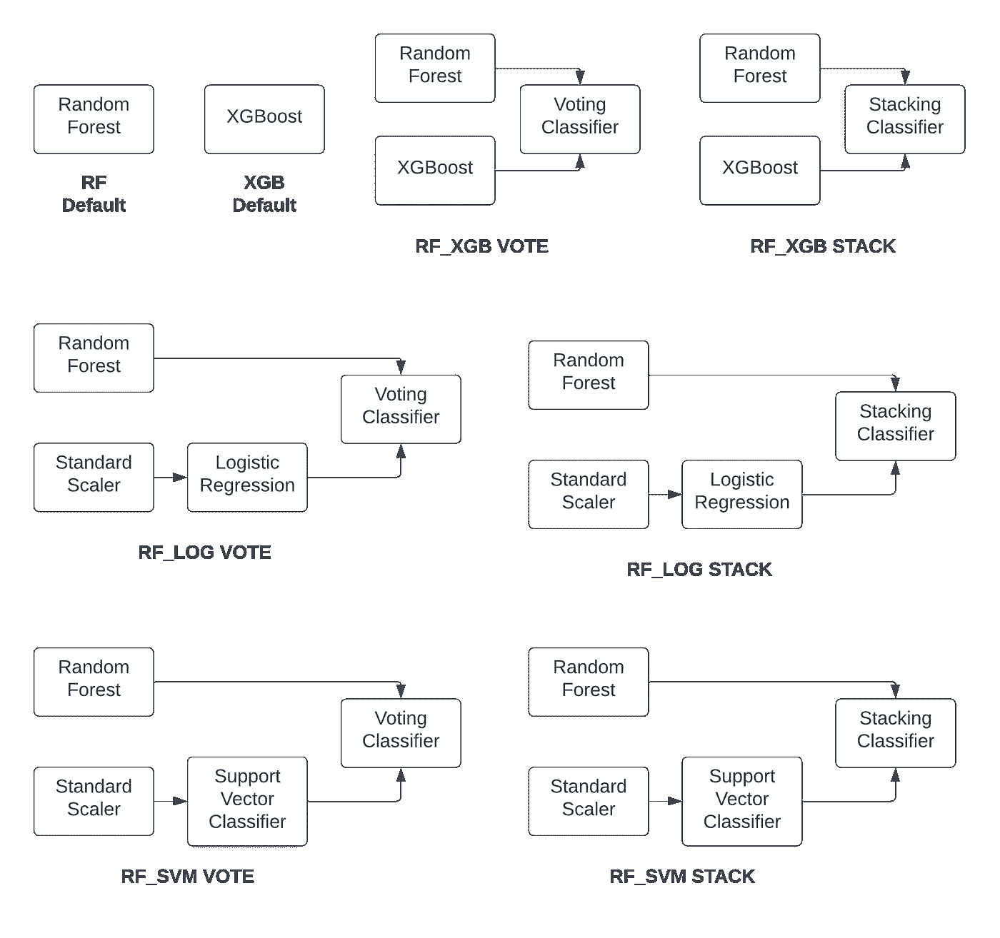

图 1 基本模型和随机森林极限集合(图片由作者提供)

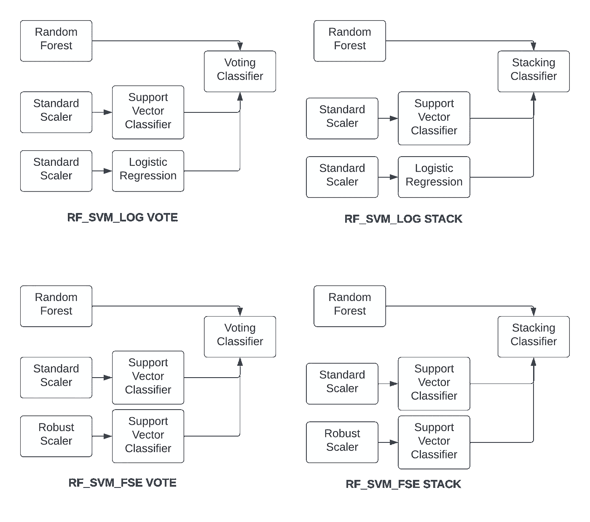

图 2 更多随机森林极限合集(图片由作者提供)

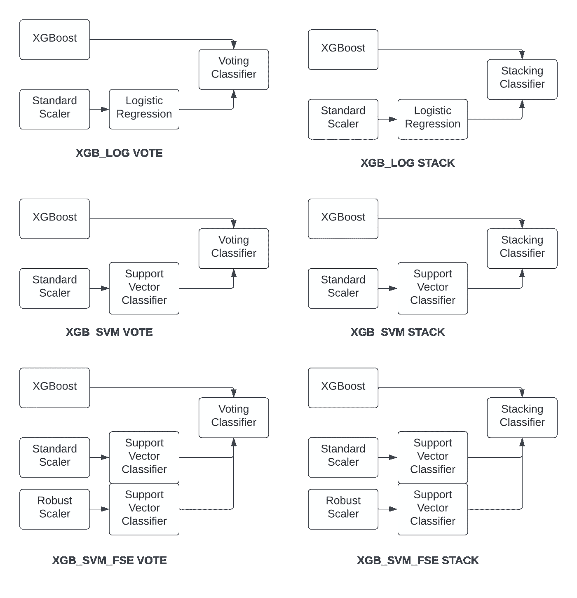

图 3 XGBoost Extreme 合集(图片由作者提供)

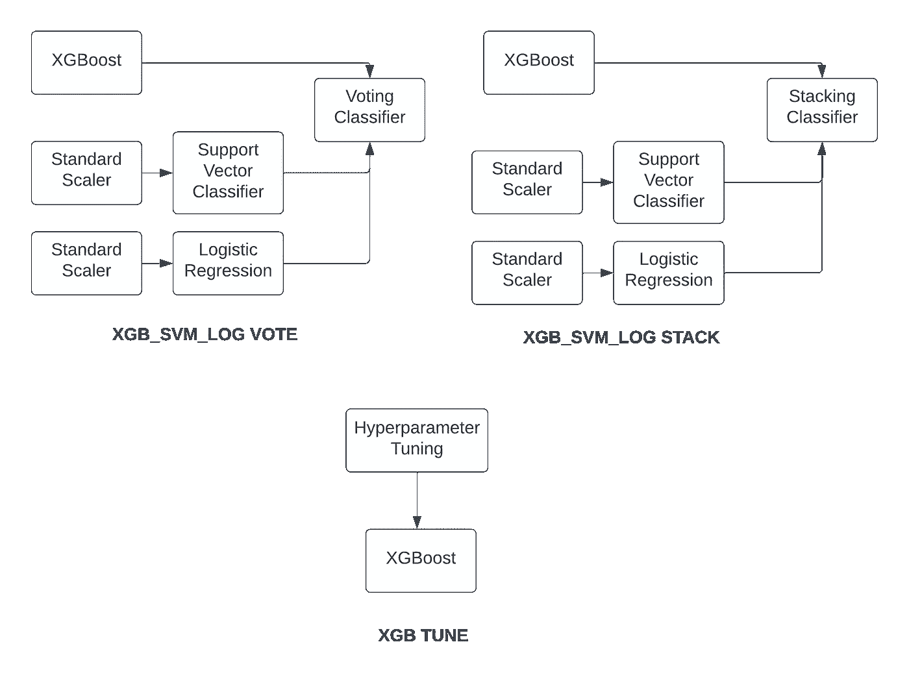

图 4 更多 XGBoost Extreme 系综和超调 XGBoost(图片由作者提供)

但是我们如何确定哪个是最好的模型呢？

# **介绍性能概率图**

单点准确性不一定不诚实，但肯定是不真诚的。数据科学竞赛之于商业分析，就像真人秀之于现实世界一样，因为使用单个随机种子值对数据进行单次分割，就可以预测一个预定义的未来，一个预先编写好的未来。一些数据具有这种远见。但是我们知道方差，一个随机函数，在大多数情况下有其他的计划——也就是引起混乱。

**性能概率图(PPG)** 展示了更接近真实的情况，其中使用 100 个训练/测试数据的排列生成 100 个模型，同时保持相同的比率(训练/测试和类别不平衡)。生成的直方图不仅展示了新数据的潜在性能，还展示了实现相同性能的可能性(见图 5)。核密度估计器表示概率密度函数，而直方图对应于概率质量函数。

如果您的业务决策需要 87.9%的准确性，即图 5 中的中值，那么您将有 50%的机会是正确的(这种情况与“一半正确”相混淆)。如果你的决策需要 94%，这个模型将实现它，即使只是短暂的。所有剩下的模型都代表分析失败。相反，如果你把你的决策阈值设置为 81%，你的模型在大多数时候都会成功。PPG 是保守的，因为它没有考虑数据漂移，或者新数据如何超出我们当前人口的界限。思考这一现象的一种方式是**对于训练/测试分割的每个排列，我们向模型呈现相同的预测器质量但不同的样本质量，并且每个模型将这些属性转换成实现准确度的概率**。

作为使用 PPGs 的初步调查，我们将比较箱线图和直方图，以寻找整个范围移动到更高精度的模型，而不仅仅是单个新的异常值结果。但是需要更多的工作来有效地比较这些通常非正态的图。

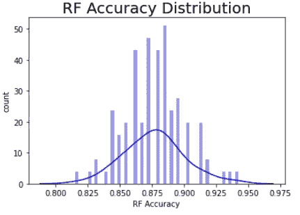

图 5 性能概率图(图片由作者提供)

本研究中使用了 12 个开源数据集，代表了混合的数据类型和复杂性。这里有全浮点和全整数数据，以及数字和分类类型的融合。提出的一个关键指标是样本与预测因子的比率，或样本比率，因为广义误差、预测因子和使用 Vapnik-Chervonenkis 维数界限的这个方程的训练样本数之间的关系，所以包括这个指标:

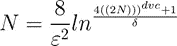

图 6 样本大小与使用 VC 维的一般误差(图片由作者提供)

你可以在这里了解更多关于这项技术的内容:[slides lect 07 . DVI(rpi.edu)](https://www.cs.rpi.edu/~magdon/courses/LFD-Slides/SlidesLect07.pdf)。本系列讲座基于从数据中学习(Abu-Mostafa，Magdon-Ismail，& Lin，2012)。本研究中的数据集可容纳从最低约 12 个样本/预测值到超过 440 个样本/预测值。

将采样误差视为一个物理常数，因为它决定了所有模型的精度上限。采样比率将向我们展示关于 XGB 模型调优(也称为超调)的一些非常重要的东西。

因为 N，期望的样本数出现在等式的两边，如果你在 Excel 中编码，那么你需要在选项菜单中启用“迭代计算”,然后为 N 设置一个种子值以准备解决方案。我建议使用 10 *预测因子的数量作为一个好的起点，这也是加州理工学院推荐的所需最小样本数。哦，如果你有一个大的样本比率和预测数，你将需要在 Wolfram Alpha ( [Wolfram|Alpha:计算智能(wolframalpha.com)](https://www.wolframalpha.com/)中执行计算，因为 Excel 不能处理极大的数字。

除电信公司流失外，所有缺失值都用 miss forest([miss forest PyPI](https://pypi.org/project/MissForest/))进行估算；它的 11 个缺失值从 7000 多个样本中被删除。所有无信息预测都被丢弃(id 等。).当然，所有数据处理都是通过对训练数据使用“fit_transform”和对测试数据使用“transform”来执行的，每个排列和每个模型都保持了数据分区的完整性。测试规模由三个设定点组成:25%、30%和 50%，以管理样本比例，但仍保持普遍性。

和往常一样，**所有的性能结果，所有的 25，200+预测，都是基于测试数据**，那些模型还没有看到的样本。

# **数据集及其预测性能**

**数据集#1**

澳大利亚信贷来源: [UCI 机器学习库:Statlog(澳大利亚信贷审批)数据集](https://archive.ics.uci.edu/ml/datasets/statlog+(australian+credit+approval))

样本比率:每个预测值 12.32 个样本

呈现给模型的预测值:float64(3)，int64(3)，uint8(36)

预期抽样误差:7.36%，置信区间为 90%

根据 Delmaster 和 Hancock (2001 年，第 12 页),该数据集的训练/测试分割被设置为实现二元分类问题所需的最小样本数。68).

有关基线默认随机森林、默认极端梯度提升和默认极端集合的详细信息，请参见图 7。

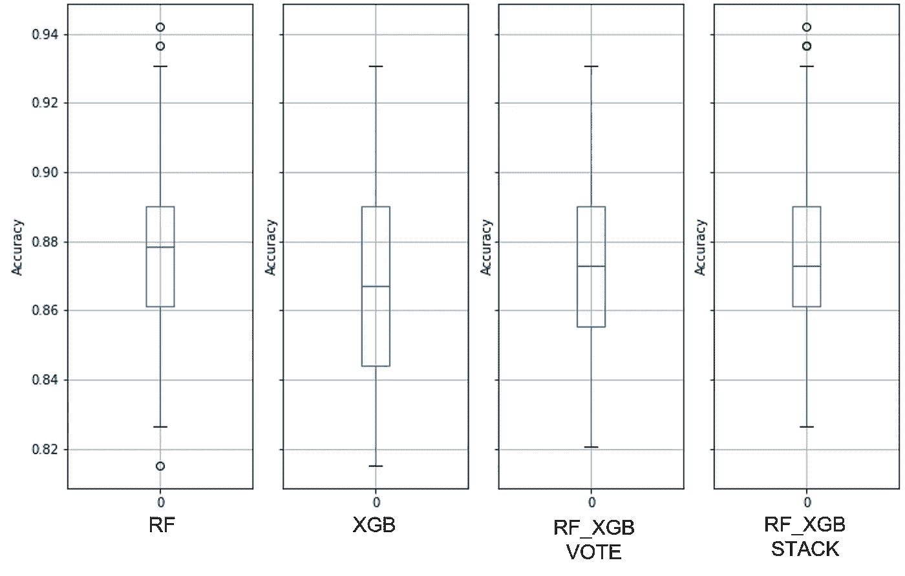

图 7 澳大利亚信贷基线 RF_XGB 箱线图(图片由作者提供)

请注意 RF 和 XGB 范围之间的重叠，这些是模型相同的性能量。我们可以看到，结合这两个整体并没有提高性能。

默认 XGB 型号的最大 PPG 范围是从 81.5%到 93%，这表明存在数据质量问题。您可以将中位数精度视为预测值质量的代理，将 PPG 离差视为样本质量(即所有观测值的一致性)。大约 88%的中值准确度可能对许多决策很有效，因此预测器可能是好的。

很容易看出，100 次排列中的每一次的超调谐过程都没有将 PPG 缩小到一个很窄的范围内，或者使其更加精确(见图 8)；事实上，这与未调整的 XGB 模型非常相似，但四分位间距(IQR)缩小到了随机森林模型。这显示了超调的局限性— **由于改进很小，数据质量差无法从模型中“调整”出来**。数据比模型更重要的另一个标志。

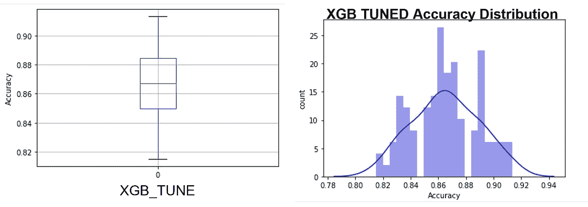

图 8 澳大利亚信用 XGB 调谐盒图和 PPG(图片由作者提供)

从所有模型中捕获描述性统计数据，我们将尝试从中找到“最佳”模型，而不使用单点性能值。更多信息参见表 1。

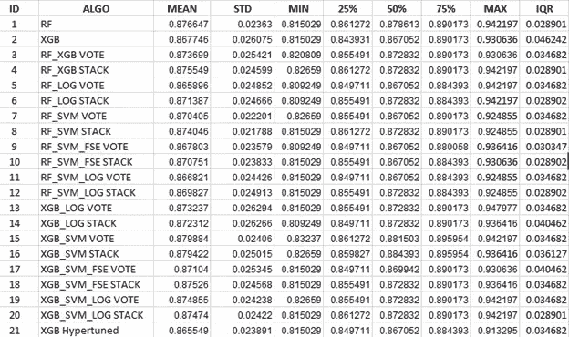

表 1 按模型分类的澳大利亚信贷描述性统计(图片按作者分类)

从每个数据集中过滤 2100 个结果需要设计排序算法来发现“最佳”模型。使用了两种不同的排序方法，并且出现在列表**和**中与顶级模型的精确度在 0.3%以内(百分之零点三)的任何模型都被选为顶级模型。严格的精度阈值被选择作为实际需求和对新数据的适应性之间的折衷，但这将在即将到来的工作中重新讨论。

**排序#1 中位数排序**

a.50%从最大到最小

1.IQR 从最小到最大

I .从最大到最小为 75%

**排序# 2 75%百分比排序**

a.75%从最大到最小

1.IQR 从最小到最大

I .从最大到最小各占 50%

均值排序对于算法选择来说不是一个好的度量，因为 PPG 很少是正态分布，而是具有尖峰，这使得模态量子成为一个更有趣的度量。详细情况请参考图 8。

由于极低的样本数和较差的数据质量，中值范围很广，只有两个模型通过了严格的 0.3%测试(表 2 中的前两个)，但更多的模型使用第 75 个百分位排序在下一个量程进行分组:

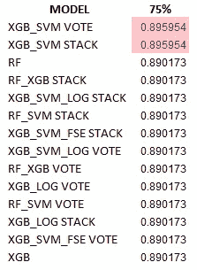

表 2 澳大利亚信贷最佳表现模型(图片由作者提供)

总体最佳极端系综(XGB_SVM 投票和 XGB_SVM 堆栈)的有趣之处在于，投票具有较窄的 IQR，而堆栈具有较高的中值:

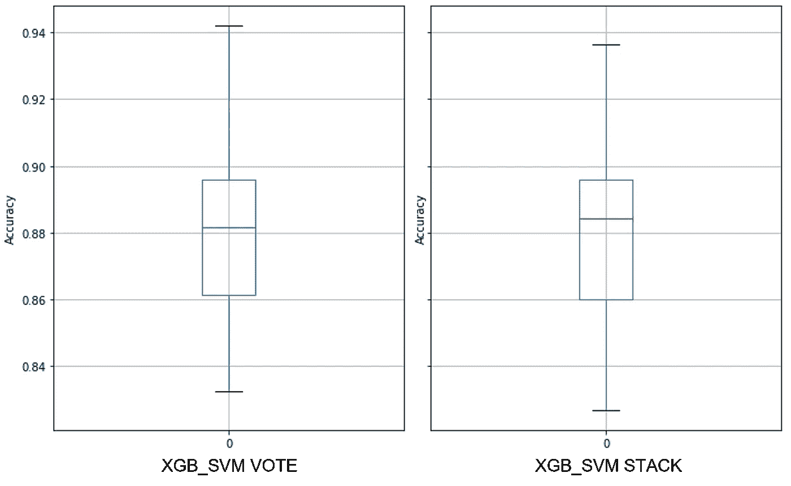

图 9a 澳大利亚信贷最佳表现模型箱线图(图片由作者提供)

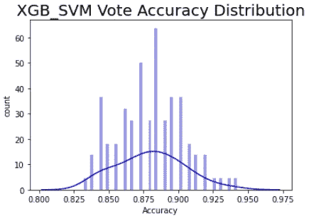

图 9b 澳大利亚信贷最佳表现模型 PPG(图片由作者提供)

为了解析数据质量误差和抽样误差之间的区别，就像我们在澳大利亚信贷中看到的那样，数据集#2 将确认数据质量的巨大贡献。

**数据集#2**

Wisc 诊断来源: [UCI 机器学习知识库:乳腺癌 Wisconsin(诊断)数据集](https://archive.ics.uci.edu/ml/datasets/breast+cancer+wisconsin+(diagnostic))

样本比率:13.28

呈现给模型的预测值:float64(30)

预期抽样误差:6.97%，置信区间为 90%

在样本比率仅为～13 的情况下，中值都接近或高于 96%，这表明可能唯一的误差来自于样本比率。与数据集#1 相比，样本质量有所提高，箱线图范围约为 6.5%，这可能是由于这 30 种浮点生物测量值的一致性及其相对相似性。请参见图 10，了解低采样率和良好预测性能数据集的详细信息。

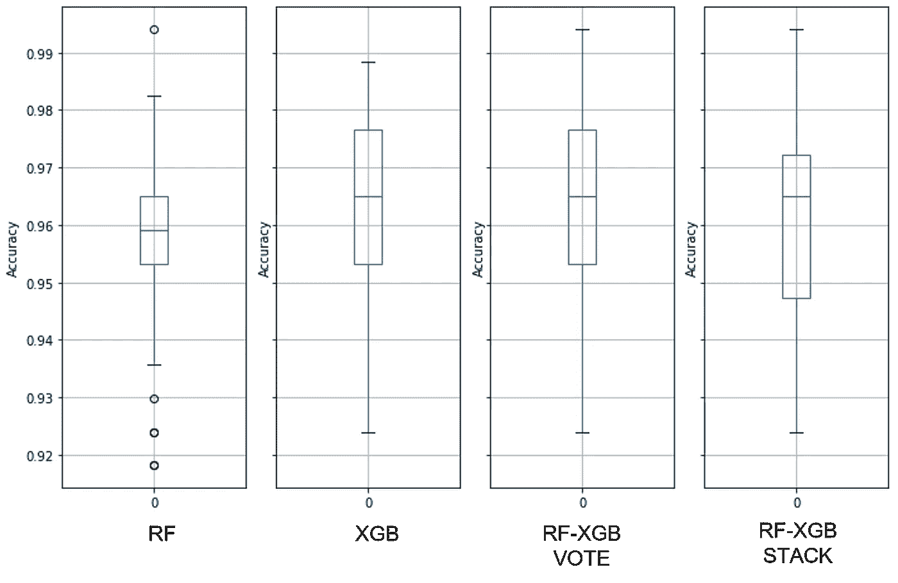

图 10 Wisc 诊断 RF_XGB 基线箱线图(图片由作者提供)

同样，与未经调整的版本相比，超调整的 XGBoost 模型缩小了 IQR，但降低了第 75 百分位。更多信息参见图 11。

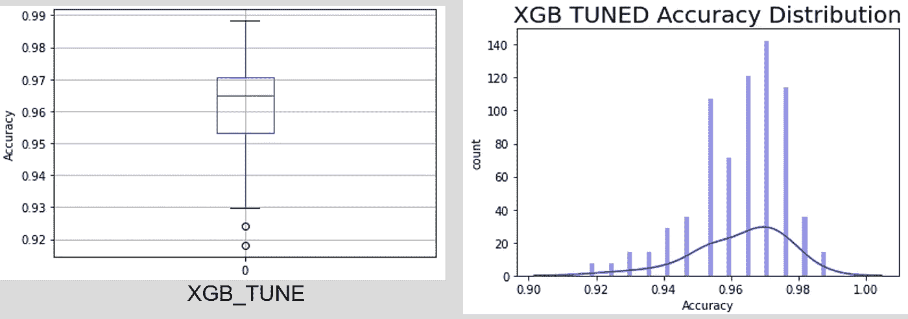

图 11 Wisc 诊断超调 XGB 箱线图和 PPG(图片由作者提供)

使用规定的两种排序机制和 0.3%的准确度阈值，这些是由中位数排序确定的该数据集的排名最高的模型:

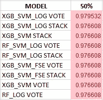

表 3 Wisc Diag 排名榜(图片由作者提供)

请注意，有一个单一的顶级模型，接下来的八个被分组到一个较低的量子级别，共享的中值为六位小数。总体最佳极限合奏，XGB _ SVM _ 日志投票看起来是这样的:

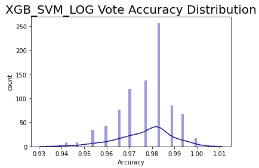

图 12 Wisc Diag 最佳表现车型 PPG(图片由作者提供)

对于该数据集，尽管样本数量较少，但由于预测器的复杂性导致 100 个模型的运行时间较长(使用英特尔 12700K、32MB DDR4 3200 RAM 和 2TB PCIe4 固态硬盘时超过 3 天)，因此对逻辑回归模型采用了 L2 正则化。

**这就是如何分析数据集的，所有剩余的数据集将在附录 A 中讨论，以加快我们对完美模型的搜索。**

# **寻找完美的模特**

我们收集并分析了所有结果，但在开始搜索之前，我们需要解释图 40–42 中的信息，即:

**样本比率**:每个预测器的样本比率。

**惩罚**:用于逻辑回归模型的正则化惩罚。

**最差模型**:根据排序机制，这是该数据集所有 21 个模型中性能最低的模型。

**PPG 最大范围**:使用最差模型，这是所有 100 个模型的最大精度范围，从一致性来看表示数据质量。记住——更高的 T4 中值准确度=更好的预测器,更窄的 PPG 范围=样本之间更好的同质性。

**击败宣传**:这显示了我们的通用模型极限合奏是否胜过超调 XGB 模型。

除了澳大利亚信贷和输血，模型排名中的每个模型与表现最佳的模型相差不超过 0.3%，处于第一位。并非所有型号都出现在这些列表中，因此性能最差的型号可能不会出现在此处。

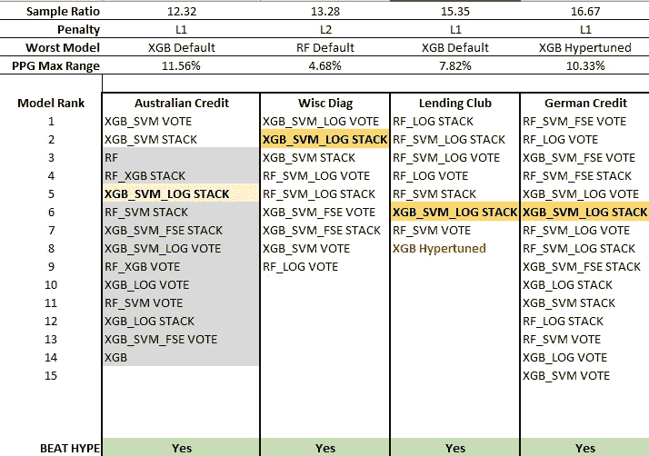

图 40 完美模型搜索路径 1(图片由作者提供)

快速浏览一下图 40 中的表格，可以发现在这些数据集上没有一个表现最好的模型。从最严格的角度来看，没有免费的午餐定理成立。然而，使用我们严格的 0.3%阈值(同样是 0.3%)，有一个通用模型出现在“噪声”之外——XGB _ SVM _ 对数叠加极端系综(见图 42-44)。诚然，澳大利亚信贷和输血是例外，但这是数据质量超过抽样误差的重要一课，在这两种情况下，极端集合仍优于超调谐 XGB 模型。

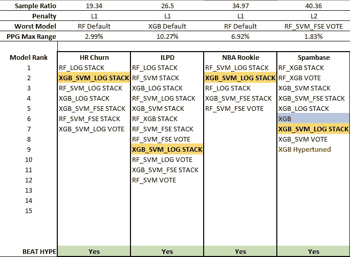

图 41 完美模型搜索路径 2(图片由作者提供)

图 42 完美模型搜索路径 3(图片由作者提供)

当采样比达到 40.36(spam base 数据集)时，超调 XGB 模型终于出现在了榜首，但它落后于 extreme ensemble。这种定位在电信客户流失中重复出现，但超调 XGB 模型和 extreme ensemble 都没有出现在输血的列表中，输血是一个既有不良预测因素(低中值)又有高样本异质性(宽 PPG)的数据集。尽管没有达到 0.3%的阈值，并且比顶部低一个量程，但 XGB _ SVM _ 对数堆栈模型仍然以 93.5 的采样比率击败了超调优 XGB，因为超调优模型低两个量程。

不过，通过最后两个数据集，超调 XGB 性能优于极端集成，因此该模型似乎更喜欢非常大的采样比。基本上，在每个预测器超过 100+样本的某个点上，超调 XGB 模型优于大多数极端集成。但在此之前，它的总体表现很差，仅在这项研究中的 42%的数据集上名列前茅。另一方面，XGB_SVM_LOG 堆栈极端集合在 85%的时间里达到顶级。**调谐 XGB 模型需要比建模所需更多的样本，而极端集合不需要调谐。**

没有完美的模型，但这里有两个可能适用于连续系列中的所有数据集——几乎免费的午餐就在这里。从 12 到大约 100+的最小样本比率，使用极端集合，通用模型。100+以上，转超调 XGB 型号。从实际意义上来说，这两个模型应该可以在任何地方处理表格数据。而且不是只有一个注定的未来，而是有许多可能的未来。

**特殊奖金数据集**

作为额外的检查和测试采样率上限，对 MAGIC Gamma 望远镜数据执行了另一个 2100 模型运行，其采样率为 951: [UCI 机器学习库:MAGIC Gamma 望远镜数据集](https://archive.ics.uci.edu/ml/datasets/magic+gamma+telescope)。结果见图 43:

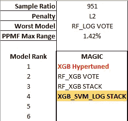

图 43 MAGIC Gamma 性能结果(图片由作者提供)

同样，由于采样比率非常高，超调 XGB 模型是最好的模型，但通用模型 XGB_SVM_LOG 堆栈仍然使用 0.3%阈值的中值排序机制进入了短名单。

extreme ensemble 有计算成本，需要用低级语言重新编码以提高速度，就像 XGB 一样。

# **结论**

这项研究打开了极端组合的大门，还需要更多的工作来探索这些算法组合。此外，需要更多的研究来开发性能概率图之间的比较分析，也许是基于它们从建模过程中分离误差成分的独特能力。

也就是说，假设采样误差为“常数”，PPG 允许我们将模型误差区分为两个不同的组:

1)预测器质量以中值准确度衡量。

2)通过 PPG 系列本身测量的样品质量(一致性)。

更高的中值精度由单个模型决定，并且受到采样误差和预测器质量的影响。虽然数据质量是存在的，但它是通过中值计算“平均”出来的。

相反，更宽的 PPG 范围是由样本一致性(一种数据质量形式)决定的，因为模型精度之间的差异是由数据划分的差异(即方差的产生)预见的。这种误差源的分离可以指导未来的行为。例如，银行营销数据集的 PPG 最大范围为 0.46%，因此训练/测试分割无关紧要，因为这些数据高度相似。了解这一点将有助于我们专注于提高预测器的质量，因为这是妨碍更好性能的误差。

**由于 PPG 的范围很窄，我们可以回到决策阈值的单点精确度，因为大量可能的未来已经崩溃为那些密切相关的。**

以下是其他一些重要的要点:

1.数据质量是首要的指示，是道德的要求。花时间获取更好的数据，而不是探索另一种算法，因为**如果数据质量差，所有算法都会有学习障碍**。

2.超调一个 XGB 模型只能在大采样率的情况下提供高性能，因为**调优需要的样本远多于建模**；在那之前，它是一个表现不佳的模型。**但是如果你有那么大的抽样率，那么这就是可以使用的模型**。

3.有一个极端的系综，**XGB _ SVM _ 日志堆栈**在这项研究的 12 个数据集的 10 个中表现最佳——**几乎免费的午餐**。此外，它还登上了 Magic Gamma 数据集的入围名单——这是又一次确认，使它在 13 个获奖者中占了 11 个。

计划中的研究将探索超调 XGB 模型持续处于顶级的样本比率。鉴于极端集合中的三个模型中有两个对异常值具有鲁棒性，其他工作正在设计中，以调查 PPG 最大值范围的样本质量来源。

**要点**:如果您不知道您的 PPG 的宽度，那么输入一个随机的种子值进行数据分区就是掷骰子，纯粹是为了让您的模型在未来得到适当的定位。

**参考文献**

Abu-Mostafa，Y. S .、Magdon-Ismail，m .、和 Lin，H.-T. (2012 年)。*从数据中学习*(第 4 卷)。美国纽约 AMLBook:

陈、汤、何、贝内斯蒂、米、霍季洛维奇、唐、赵、h……其他。(2015).Xgboost:极限梯度提升。 *R 包版本 0.4–2*， *1* (4)，1–4。

德尔马斯特和汉考克(2001 年)。数据挖掘解释。马萨诸塞州波士顿:数字出版社

Fernández-Delgado，m .，Cernadas，e .，Barro，s .，和 Amorim，D. (2014 年)。我们需要数百个分类器来解决现实世界的分类问题吗？*《机器学习研究杂志》*， *15* (1)，3133–3181。

# 附录 A

**数据集#3**

Lending Club 来源:[所有 Lending Club 贷款数据| Kaggle](https://www.kaggle.com/datasets/wordsforthewise/lending-club)

样本比率:15.35

呈现给模型的预测值:float64(4)，int64(1)，uint8(15)

预期抽样误差:90%置信区间时为 6.38%

缺失值插补:缺失森林

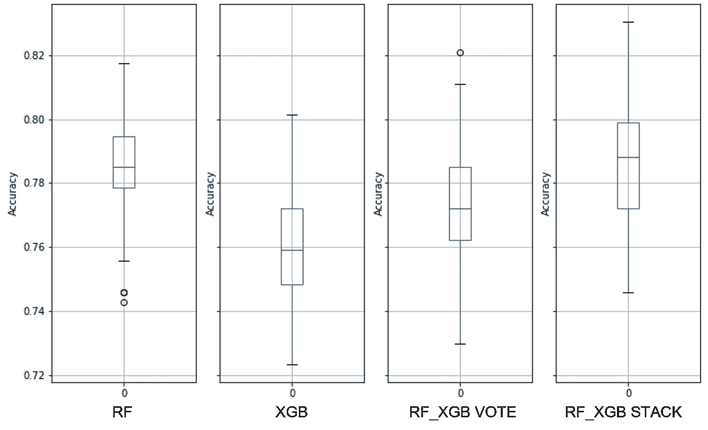

图 13 Lending Club 基线 RF_XGB 箱线图(图片由作者提供)

最后，超调 XGB 模型已经将整个 PPG 范围移到更高的地面。详情参见图 14。这足以将超调 XGB 模型转移到 0.3%阈值内的最高性能列表中，尽管是在最后一位(见表 4)。

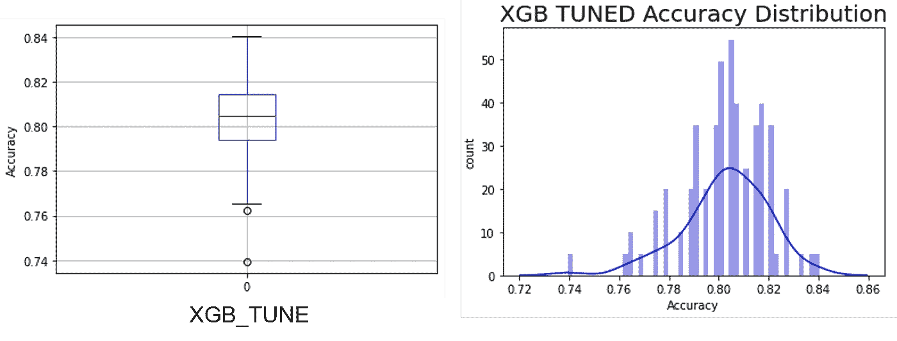

图 14 借贷俱乐部 XGB_TUNE Boxplot 和 PPG

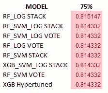

表 4 Lending Club 排名靠前的车型(图片由作者提供)

尽管超调模型有所改进，但这是一个表现最佳的极端组合模型。参见图 15，了解 RF_LOG 堆栈性能概率质量函数。

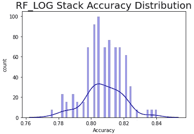

图 15 借贷俱乐部最佳表现模式(图片由作者提供)

**数据集#4**

德国信用来源: [UCI 机器学习知识库:Statlog(德国信用数据)数据集](https://archive.ics.uci.edu/ml/datasets/statlog+(german+credit+data))

样本比率:16.67

呈现给模型的预测值:int64(30)

预期抽样误差:90%置信区间时为 6.31%

全整数预测器显示了随机森林模型相对于 XGBoost 的明显优势(见图 16)。过度调整 XGB 模型并没有改善结果的范围，只是略微缩小了四分位数范围(见图 17)。

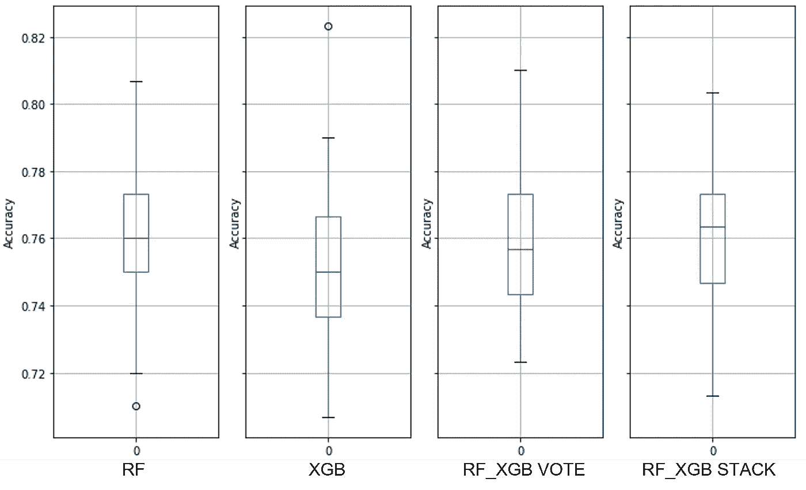

图 16 德国信贷基线 RF_XGB 箱线图(图片由作者提供)

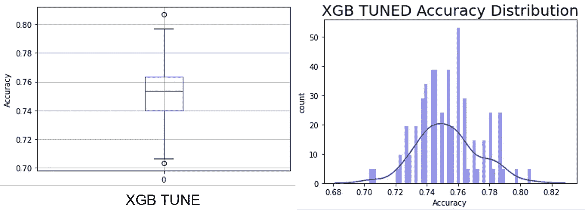

图 17 Lending Club XGB_TUNE Boxplot 和 PPG(图片由作者提供)

**数据集#5**

HR 流失来源: [IBM 流失数据集| Kaggle](https://www.kaggle.com/datasets/yasserh/ibm-attrition-dataset)

样本比率:19.34

呈现给模型的预测值:int64(19)，uint8(19)

预期抽样误差:5.99%，置信区间为 90%

采样比率再次增加，数据类型现在是整数和二进制预测值的均匀混合。在基线箱线图中，极端系综显示出最好的性能，投票分类器挤掉了堆叠分类器；投票运行速度比堆叠快得多，所以当你可以选择一个投票极端合奏时，推荐。详情参见图 18。

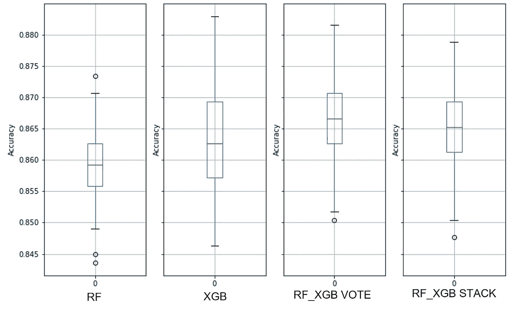

图 18 HR 流失基线 RF_XGB 箱线图(图片由作者提供)

超调 XGB 模型确实限制了最小-最大距离，并且与默认模型相比，它将 IQR 压缩到更窄的范围内，所有这些都是准确性和稳定性提高的迹象(见图 19)。即便如此，超调模型也没有在这个阈值为 0.3%的数据集上排名第一(见表 6)。

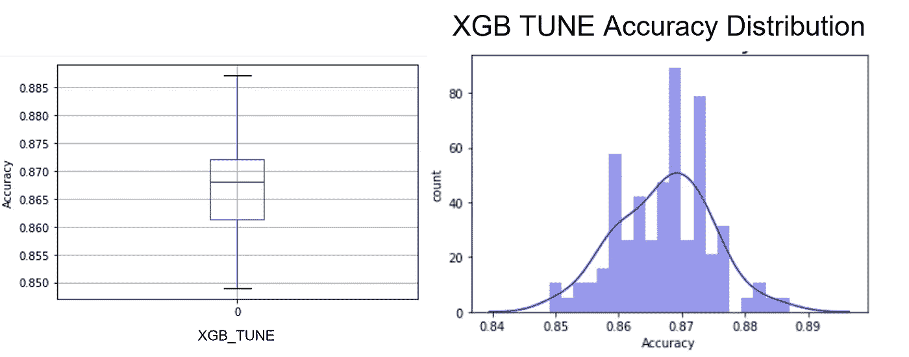

图 19 HR Churn XGB 调谐盒图和 PPG(图片由作者提供)

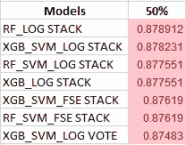

表 6 人力资源流失排名靠前的模型(图片由作者提供)

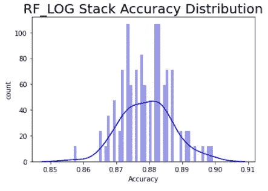

图 20 人力资源流失最佳表现模型 PPG(图片由作者提供)

**数据集#6**

ILPD: [UCI 机器学习知识库:ILPD(印度肝病患者数据集)数据集](https://archive.ics.uci.edu/ml/datasets/ILPD+(Indian+Liver+Patient+Dataset))

样本比率:26.5

呈现给模型的预测值:float64(5)，int64(4)，uint8(2)

预期抽样误差:4.84%，置信区间为 90%

不考虑模型，该数据集显示了非常强的模式和弱的预测器以及宽的 PPG 范围(更多细节见图 22 和 23)。请注意，默认的随机森林模型在这个数据上胜过了默认的 XGB 模型。

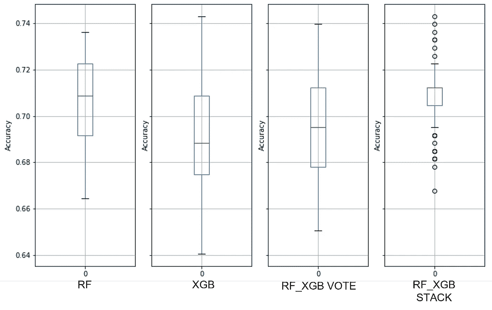

图 21 ILPD 基线 RF_XGB 箱线图(图片由作者提供)

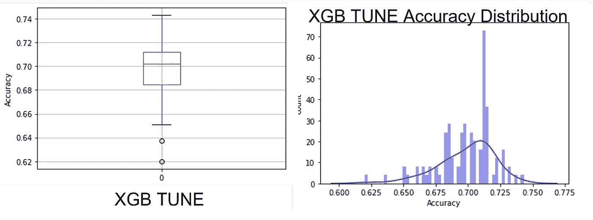

图 22 ILPD XGB 调谐盒图和 PPG(图片由作者提供)

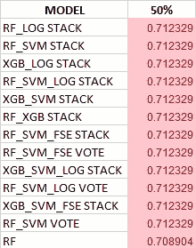

表 7 ILPD 排名靠前的车型(图片由作者提供)

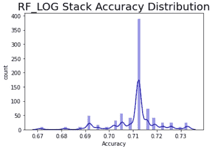

图 23 ILPD 最佳表演模特 PPG(图片由作者提供)

***剩余的数据集将只作为结果呈现给限定的文本。***

**数据集#7**

NBA 新秀: [NBA 新秀|卡格尔](https://www.kaggle.com/competitions/iust-nba-rookies/data)

样本比率:34.97

呈现给模型的预测值:float64(18)，int64(1)

预期抽样误差:4.43%，置信区间为 90%

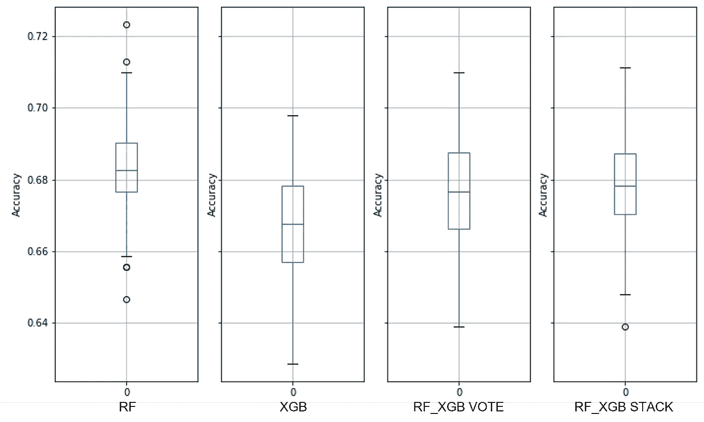

图 24 NBA 新秀基线 RF_XGB 箱线图(图片由作者提供)

图 25 NBA 新秀 XGB TUNE Boxplot 和 PPG(图片由作者提供)

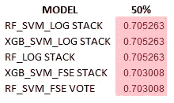

表 8 NBA 新秀顶级模特(图片由作者提供)

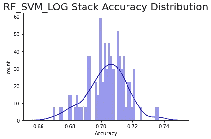

图 26 NBA 新秀最佳表演模特 PPG(作者图片)

**数据集#8**

Spambase: [UCI 机器学习库:Spambase 数据集](https://archive.ics.uci.edu/ml/datasets/spambase)

样本比率:40.36

呈现给模型的预测值:float64(55)，int64(2)

预期抽样误差:4.41%，置信区间为 90%

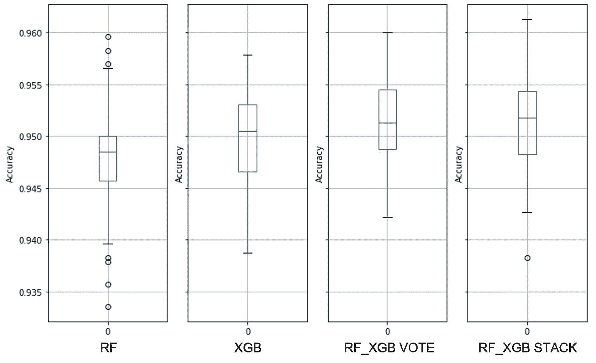

图 27 Spambase 基线 RF_XGB 箱线图(图片由作者提供)

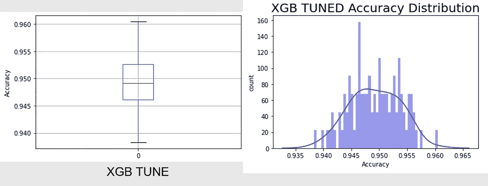

图 28 Spambase XGB 调谐盒图和 PPG(图片由作者提供)

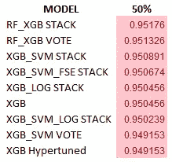

表 9 Spambase 排名靠前的模型(图片由作者提供)

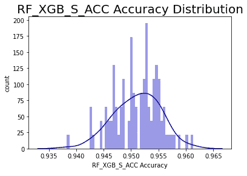

图 29 Spambase 顶级表演模特 PPG(图片由作者提供)

**数据集#9**

电信客户流失:[电信客户流失|卡格尔](https://www.kaggle.com/datasets/blastchar/telco-customer-churn)

样本比率:78.25

呈现给模型的预测值:float64(2)，int64(2)，uint8(41)

预期抽样误差:3.24%，置信区间为 90%

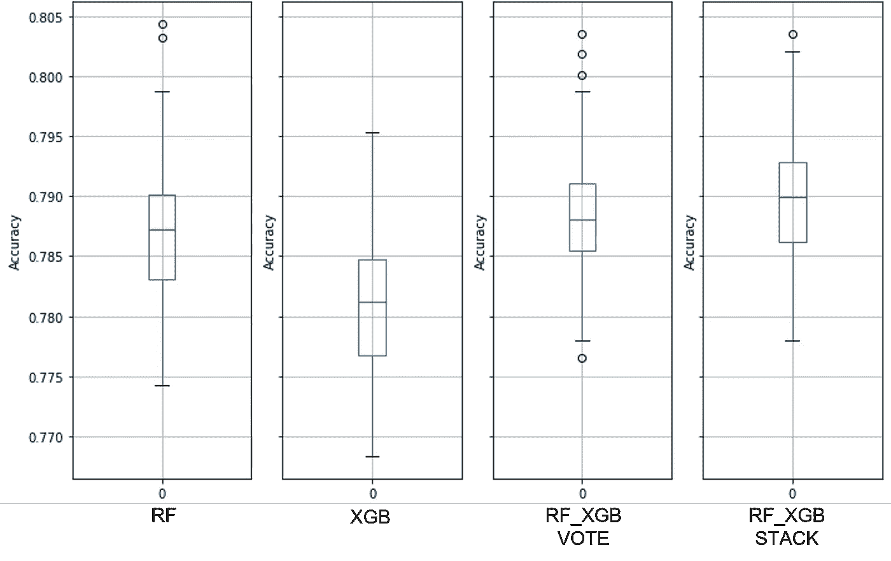

图 30 电信客户流失基线 RF_XGB 箱线图(图片由作者提供)

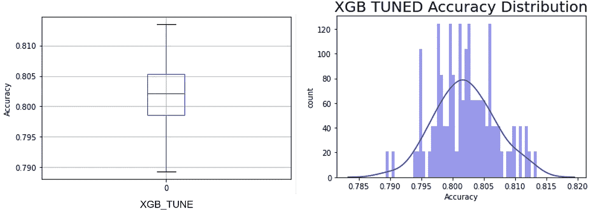

图 31 电信客户流失 XGB 调谐盒图和 PPG(图片由作者提供)

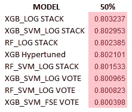

表 10 电信客户流失排名模型(图片由作者提供)

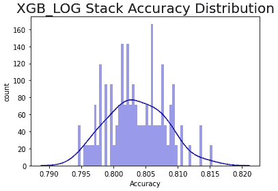

图 31 电信客户流失最佳表现模型 PPG(图片由作者提供)

**数据集#10**

输血: [UCI 机器学习知识库:输血服务中心数据集](https://archive.ics.uci.edu/ml/datasets/Blood+Transfusion+Service+Center)

样本比率:93.5

呈现给模型的预测值:int64(4)

预期抽样误差:2.62%，置信区间为 90%

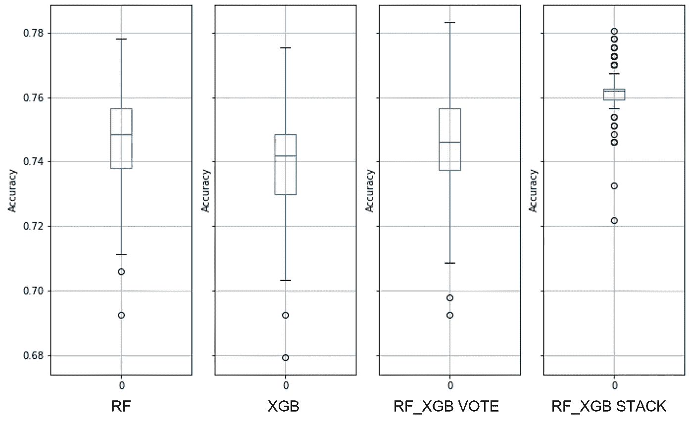

图 32 输血基线 RF_XGB 箱线图(图片由作者提供)

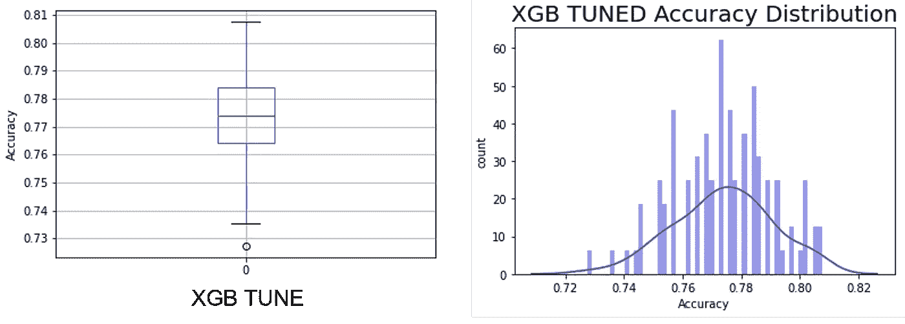

图 33 输血 XGB 调谐盒图和 PPG(图片由作者提供)

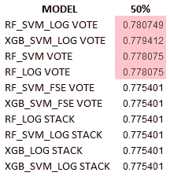

表 12 输血顶级模型(图片由作者提供)

**数据集#11**

成人收入: [UCI 机器学习知识库:成人数据集](https://archive.ics.uci.edu/ml/datasets/adult)

样本比率:246.67

呈现给模型的预测因子:int64(6)，uint8(60)

预期抽样误差:1.18%，置信区间为 90%

注意:预测值“国家”被删除，因为许多国家的样本太少。

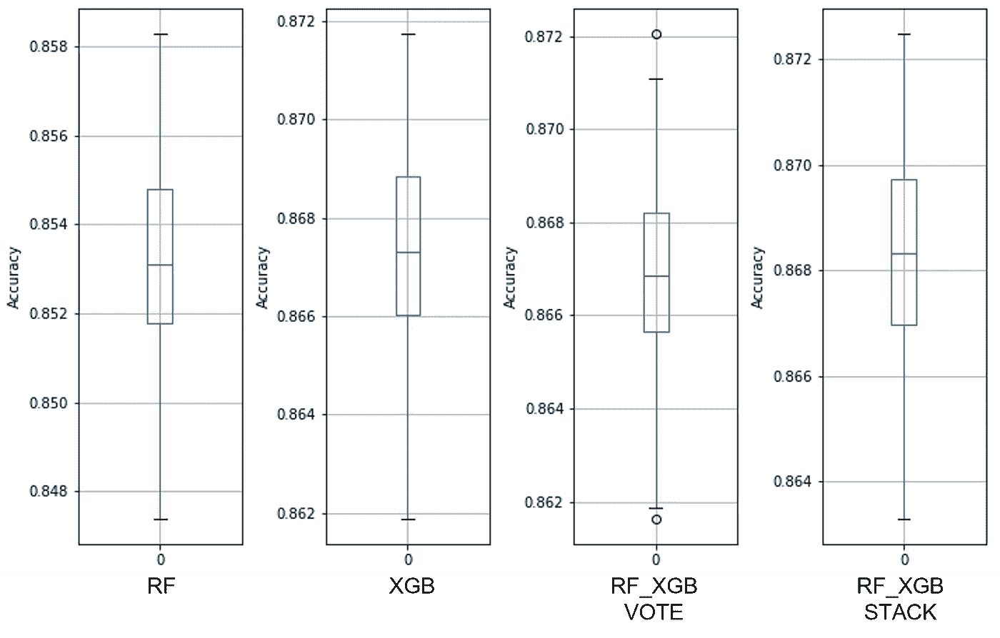

图 34 成人收入基线 RF_XGB 箱线图(图片由作者提供)

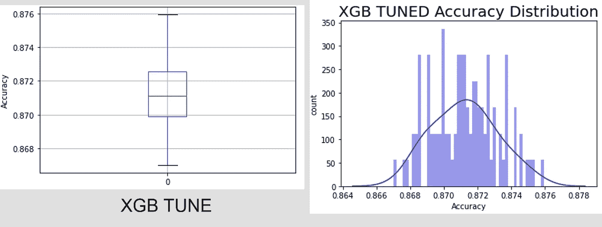

图 35 成人收入 XGB 调盒图和 PPG(图片由作者提供)

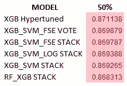

表 13 成人收入最高的模型(图片由作者提供)

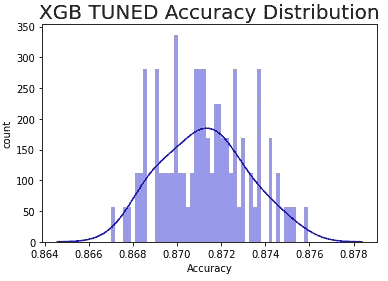

图 36 你会选择哪个决策阈值？(图片由作者提供)

**第 12 号数据集**

银行营销: [UCI 机器学习知识库:银行营销数据集](https://archive.ics.uci.edu/ml/datasets/bank+marketing)

样本比率:443.25

呈现给模型的预测因子:int64(7)，uint8(44)

预期抽样误差:1.10%，置信区间为 90%

图 37 银行营销基线 RF_XGB 箱线图(图片由作者提供)

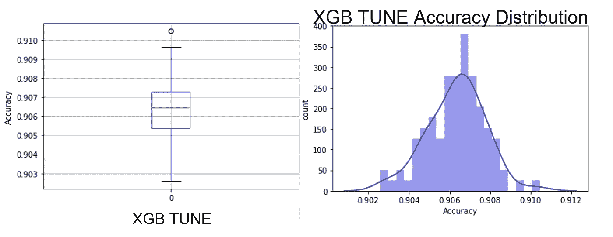

图 38 银行营销 XGB TUNE Boxplot 和 PPG(图片由作者提供)

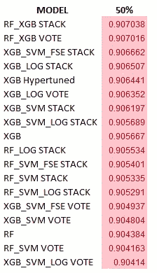

表 14 银行营销顶级模型(图片由作者提供)

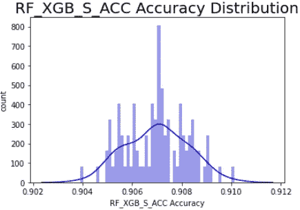

图 39 银行营销最佳表现模型 PPG(图片由作者提供)