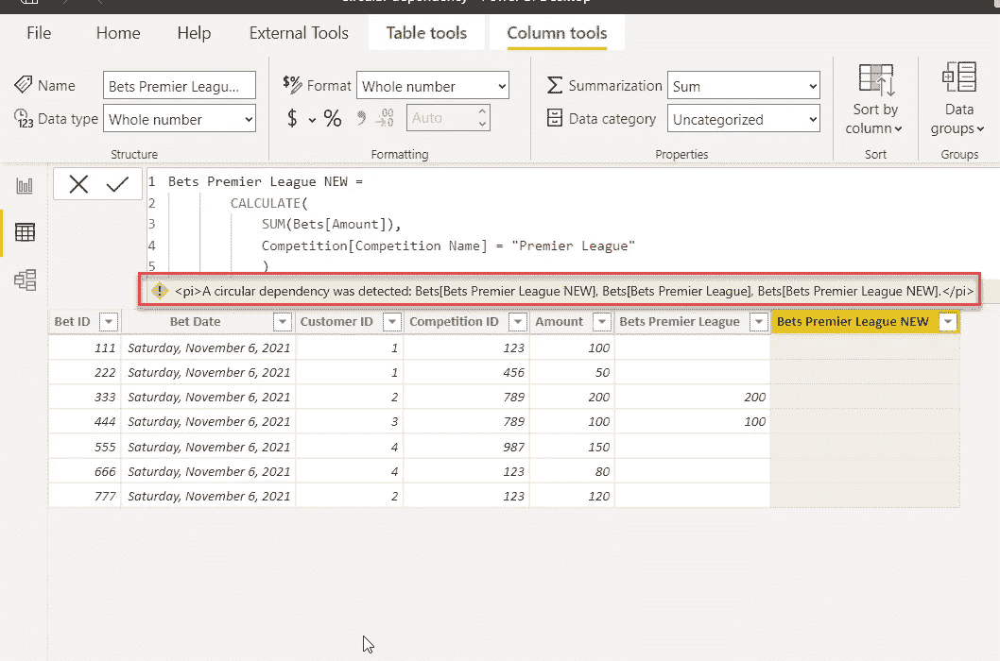
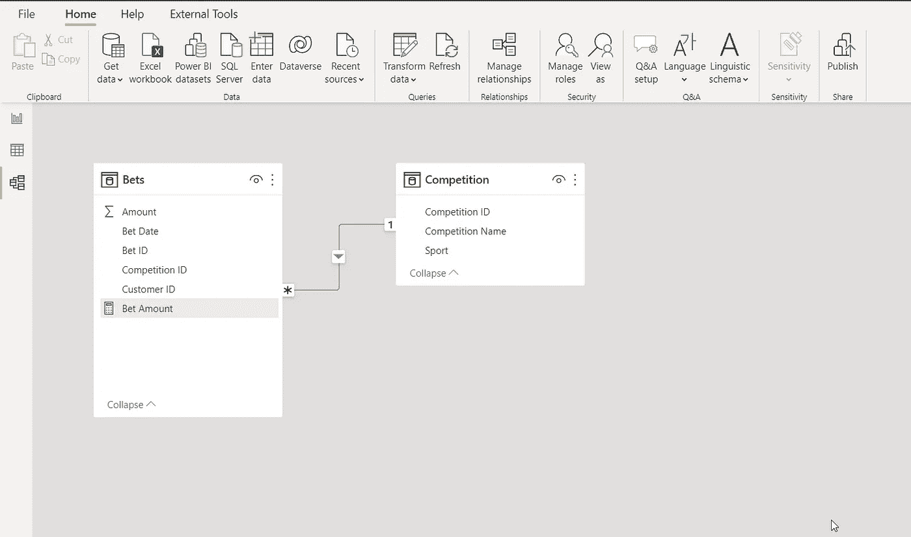
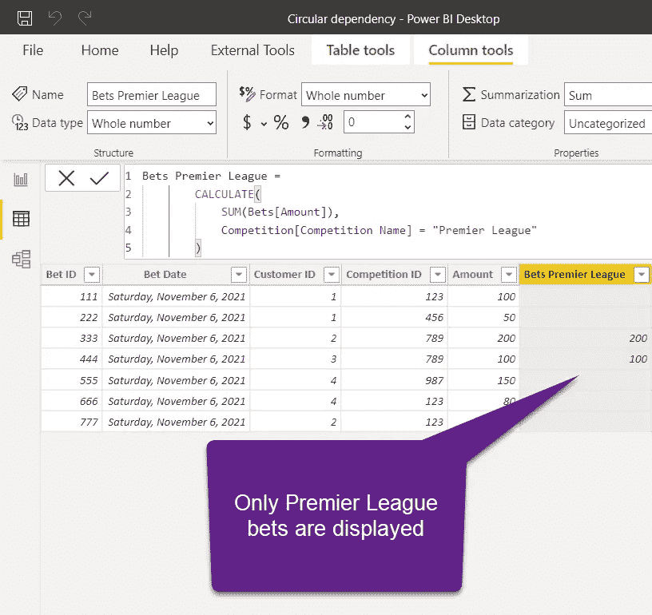
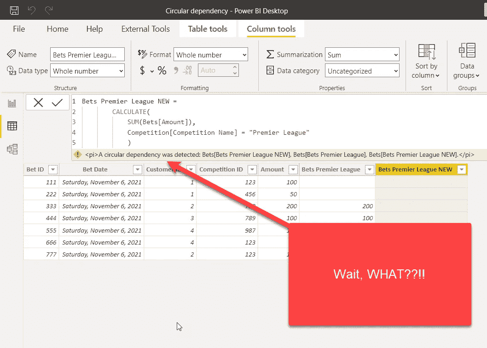
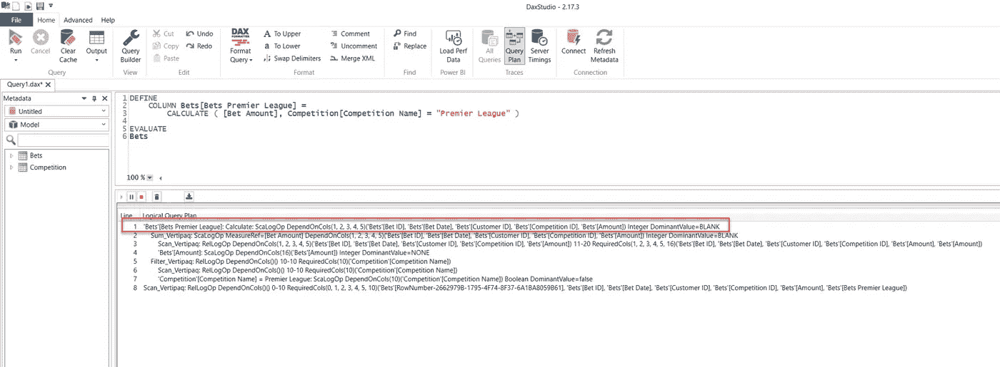
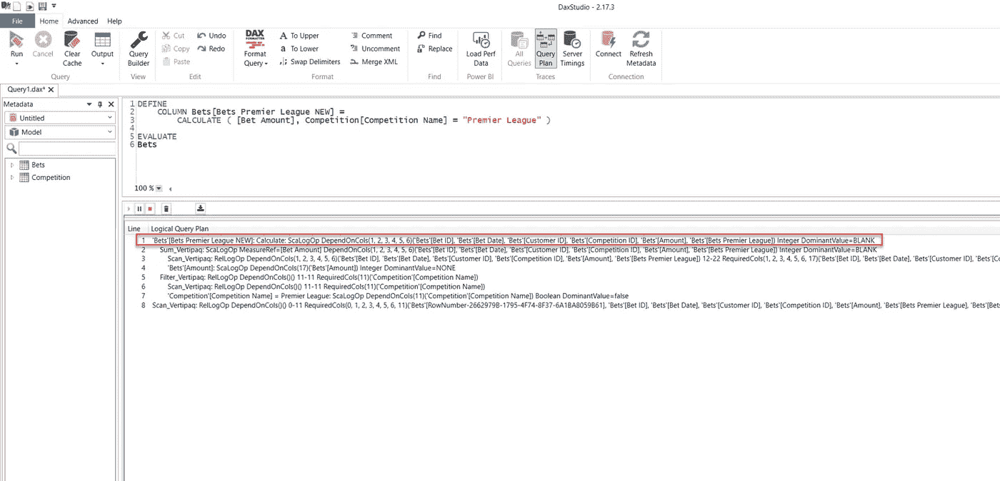
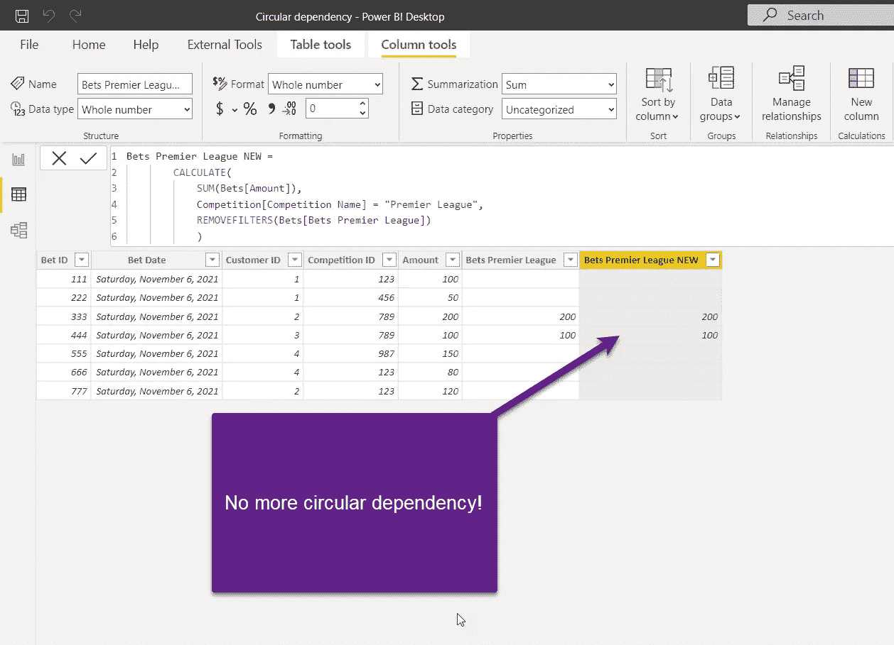
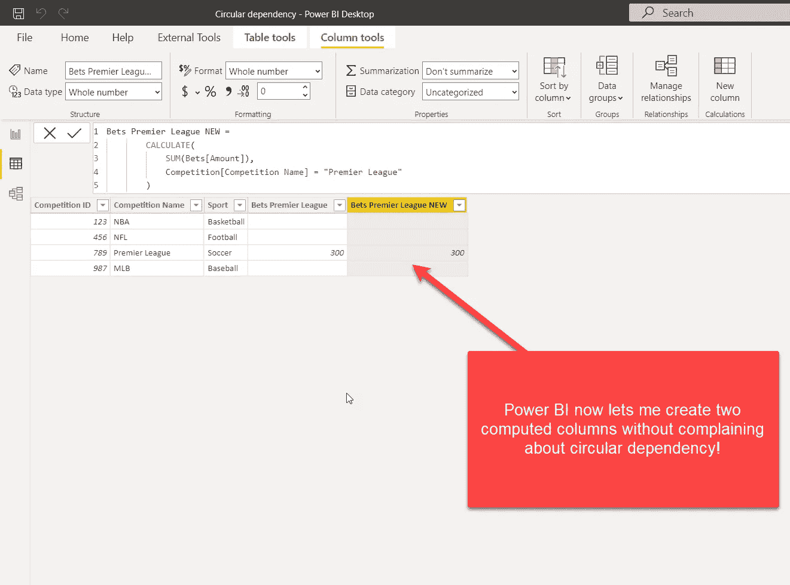

# 在 Power BI 漩涡中——理解循环依赖

> 原文：<https://towardsdatascience.com/in-the-power-bi-whirlpool-understanding-circular-dependencies-316d7f664d94>

## 循环依赖错误是 Power BI 数据建模中最讨厌的事情之一！了解为什么会发生这种情况以及如何避免



作者图片

通过阅读我以前的文章，您可能已经理解了，创建星型模式并不一定意味着您的数据建模任务已经完成。还有很多方面需要注意——虽然你可以偷偷摸摸地不去微调每一个细节——但其中一些“细节”当然更重要，需要更好地理解。

其中一个很容易把你拉入“漩涡”的“细节”，叫做——循环依赖！我很确定我们所有人至少有一次(希望只有一次)对这个消息感到恼火:“检测到一个循环依赖…”

但是，在我们继续解释什么是循环依赖以及为什么您应该关注它之前，让我们首先了解…

# 依赖到底是什么…

***依存性顾名思义就是一个事实，一个事物(或事件)依赖于另一个事物的行为。***

我给你举个简单的例子:比如说，除了其他因素外，公共汽车票价取决于燃料价格。这意味着，如果燃油价格发生变化，公共汽车票价也将发生变化。

```
Bus Ticket Price = [Fuel Price] + [Factor A] + [Factor B] + ... [Factor N]
```

这就是所谓的规则依赖，它存在于每一种编程语言中(也存在于日常生活中)。但是，如果公交车票价格发生变化会怎么样呢？这是否一定意味着燃料价格也会改变？不要！公交票价取决于燃油价格，而不是相反！

我为什么问这个？因为在某些情况下，两个事实或事件之间可能存在相互依存关系。

假设您想要降低燃料桶的运输成本。实现这一目标的一个潜在步骤是降低燃料成本(因为燃料成本会影响整体运输成本)。因此，为了降低运输成本，我们需要降低燃料成本。同时，为了降低燃料成本，我们需要降低燃料的运输成本。这就是循环依赖…

# 如果事实 A 依赖于事实 B，而同时事实 B 也依赖于事实 A，我们说的就是循环依赖！

好了，现在我们知道了什么是循环依赖，让我们研究一下为什么它会出现在 Power BI 中，以及我们如何消除它。正如您可能会想到的，Marco 和 Alberto 已经写了一篇关于 DAX 中循环依赖内部的[优秀文章](https://www.sqlbi.com/articles/understanding-circular-dependencies/)，所以我鼓励您去阅读它，以便更好地理解这个“特性”。

让我们运行一个非常基本的用例，在 CALCULATE()函数的帮助下，在我们的数据模型中创建一个计算列。



作者图片

正如您可能在上面的插图中看到的，我有一个简单的数据模型，由两个表组成:事实表 Bets，它存储关于我们的客户所下赌注的数据；以及保存竞争属性的竞争维度表。

假设我想用额外的 computed 列来丰富我的数据模型，它将只计算比赛英超联赛的下注额。简单的工作！

```
Bets Premier League = 
        CALCULATE(
            SUM(Bets[Amount]),
            Competition[Competition Name] = "Premier League"
        )
```

应用后，我的下注表看起来是这样的:



作者图片

很酷，对吧？我们确信这是可行的，所以让我们尝试创建另一个相同的列:



作者图片

等等，什么？！这不是一分钟前完美运行的公式吗？

让我们从数据模型中删除这两个新列，切换到 DAX Studio，并尝试理解[公式引擎](/how-to-reduce-your-power-bi-model-size-by-90-76d7c4377f2d)生成的查询计划:



作者图片

请注意逻辑查询计划的第 1 行，它告诉我们新列依赖于 Bets 表中所有现有的列！我们期望新的列 Bets Premier League 依赖于 CompetitionID，这是我们的竞争表的外键，我们在这里应用我们的过滤。但是，事实并非如此。为什么会这样？！

当我们创建一个计算列时，我们的表达式被逐行计算(行上下文)。当我们在行上下文中使用 CALCULATE 时，该函数应用一个上下文转换，因此我们在范围内的所有列上都有一个过滤器！

简单来说，这是我们计算的伪代码:

```
Calculation: Bet Amount
--Filters
Bets[Bet ID] = 333
Bets[Bet Date] = 2021-11-06
Bets[Customer ID] = 2
Bets[Competition ID] = 789
Bets[Amount] = 200
```

正如你可能已经看到的那样，这很好。但是，当我们想用相同的公式创建另一列时，会发生什么呢:



作者图片

和前面的例子一样，新列依赖于 Bets 表中的所有原始列，但是，它还依赖于我们之前创建的 Bets Premier League 列！由于该列是在刷新时计算的，Power BI 无法解决这种依赖性，并抱怨循环依赖性。

简单地说，如果您能够在数据模型中创建这两列，那么一旦您刷新数据集，就会发生以下情况:

*栏目投注英超将依赖于所有来源栏目+投注英超新栏目。另一方面，Bets 英超联赛新列将依赖于所有源列+Bets 英超联赛列。这就是 Power BI 拒绝创建这样一个模型的原因，它在两个计算列之间有循环依赖。*

通过扩展原始列表达式并使用 REMOVEFILTERS 函数删除所有由于上下文转换而应用的过滤器，可以很容易地解决这个问题:

```
Bets Premier League NEW = 
        CALCULATE(
            SUM(Bets[Amount]),
            Competition[Competition Name] = "Premier League",
            REMOVEFILTERS(Bets[Bets Premier League])
            )
```

一旦应用，Power BI 不再抱怨循环依赖，新列成为数据模型的一部分:



作者图片

好的，我们解决了这个难题，但是让我向您展示如果我尝试在维度表中而不是在事实表中用相同的公式创建一个计算列会发生什么。

我将转到“竞赛”表，并粘贴“下注英超联赛”计算列的代码:



作者形象

这里到底发生了什么？！以前导致“循环依赖”错误的相同代码，现在工作起来像一个符咒！

问题在于，当表中有一列具有唯一值时(在我们的例子中，竞争 ID 是竞争表的主键)，上下文转换被优化以避免过滤除具有唯一值的列之外的所有其他列。在竞争表(位于关系的一侧)和下注表之间建立 1:M 关系时，引擎确认了该列的唯一性。

然而，正如在 SQL BI 的本文中所解释的，这种在维度表中创建计算列以避免循环依赖问题的“技术”不是推荐的做法，因此应该尽可能避免。

# 结论

循环依赖是 Power BI 数据建模过程中最恼人的事情之一！每当您创建两个相互依赖的对象时，您都有遇到此问题的风险。有时，确定根本原因可能是一项简单的任务，但在某些情况下，有必要了解 DAX 做事方式的细微差别。

谢谢你的阅读！

[不要错过媒体上的任何故事！](https://datamozart.medium.com/membership)