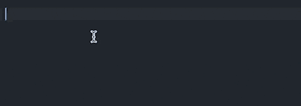
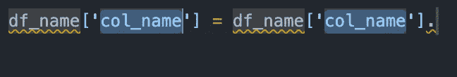
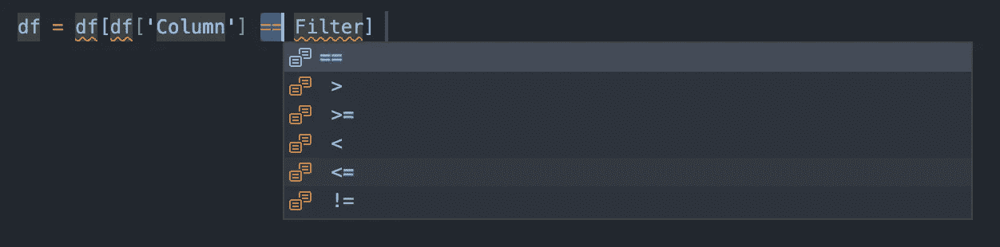

# 使用 vs 代码片段提高您的工作效率

> 原文：<https://towardsdatascience.com/increase-your-productivity-with-vscode-snippets-6055c6fa7b4f>

## 和三个有用的 Python 数据科学片段

穆罕默德·拉赫马尼在 [Unsplash](https://unsplash.com?utm_source=medium&utm_medium=referral) 上拍摄的照片

Visual Studio 代码(VSCode)是当今最具可定制性和生产力的代码编辑器之一。使用代码片段是提高工作效率的好方法— **但是你知道你可以创建自己的代码片段吗？**本教程将探讨如何创建您自己的代码片段来提高您的数据科学生产力！

# VS 代码中的片段是什么？

代码片段是可重用编码模式的模板。它们让你自动化键盘命令，甚至让你在不同的参数间循环。

这个更好直观的解释，我们来看看:

VSCode 中的代码片段非常有趣！(来源:作者)

片段可以是简单的文本扩展。但是正如上面的例子所示，你甚至可以通过不同的扩展参数循环！

深信不疑？让我们看看如何创建我们自己的片段！

# 创建您自己的片段

VS 代码不仅让你创建自己的代码片段，甚至让你定义它们适用于哪种语言。要开始制作自己的代码片段，您可以按照以下步骤操作:

1.  打开命令面板，搜索`Snippets: Configure User Snippets`。
2.  选择`python.json`为 Python 创建代码片段。

这将打开以下编辑器，它为您提供了一个创建代码片段的模板:

我们可以看到，每个片段都有一个名称，然后放在一个字典中，有以下几个 kets:

*   `prefix`:使用键盘命令
*   `body`:片段的内容
*   `description`:描述代码片段本身的字符串

通过使用`$1`值，您可以插入占位符，以显示光标指向的位置。这些占位符可以从 1 开始重复出现。`$0`指占位符的结束位置。

让我们从创建更多的代码片段开始！

# Python 和 Pandas 的示例片段

下面是三个片段，可以激发你的创造力，创造你自己的创意:

## 修改熊猫专栏

我们可以通过将熊猫列重新分配给它自己来修改它。就我个人而言，我觉得写出来有点乏味，尤其是对于较长的列名。下面的代码片段简化了这个过程:

该代码片段允许您只编写一次数据帧名称和列名称，然后跳转到行尾。

修改熊猫专栏片段(来源:作者)

## 过滤熊猫数据帧

我们可以通过使用不同的修饰符来过滤熊猫数据帧，例如`==`或`>=`。VSCode 允许您通过用`||`字符将它们包装起来，将它们定义为下拉菜单。

让我们看看这个是什么样子的:

轻松过滤熊猫专栏(来源:作者)

## if __name__ == "__main__ "

考虑到这种情况的普遍性，编写这个保护命令会让您想知道为什么以前从来没有使用过代码片段！

这看起来像下面这样:

简化 if __name__ …语句(来源:作者)

# 结论

VSCode 片段允许您简化重复的代码。然而，它们也远远超出了文本扩展器，让您可以选择使用占位符，您可以轻松地通过 tab 键。如果你发现自己一遍又一遍地写同样的代码，我鼓励你自己做！