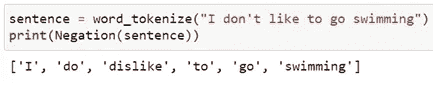
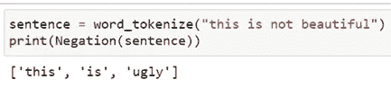
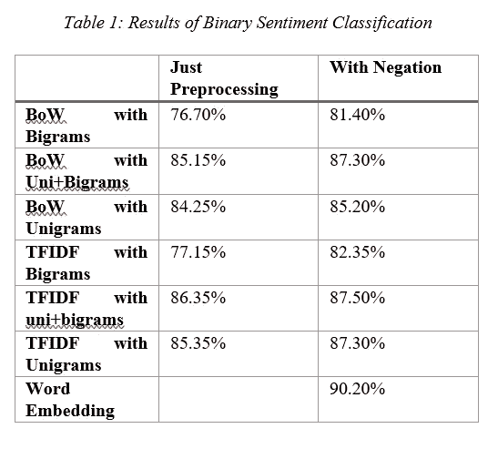

# 使用否定处理提高情感分类的准确性

> 原文：<https://towardsdatascience.com/increasing-accuracy-of-sentiment-classification-using-negation-handling-9ed6dca91f53>

## 一种快速有效提高情感分类准确率的新方法

[腾雅特](https://unsplash.com/@tengyart?utm_source=medium&utm_medium=referral)在 [Unsplash](https://unsplash.com?utm_source=medium&utm_medium=referral) 上拍摄的照片

# 介绍

外行人的想法是，情感分类模型的准确性主要取决于 ML/DL 模型本身的质量和功能。然而，这并不完全正确。数据质量及其对模型的可用性是任何预测驱动任务的主要定义特征。全世界的数据科学家至少有 80%的时间花在数据角力上(如蓝鼎 AI CEO 吴恩达所说)。探索性数据分析、特征提取、去除噪声、为数据选择正确的模型，然后将数据准备好作为模型的输入，是任何旨在从数据中获得洞察力的过程中最耗时的步骤。此外，这些甚至发生在选择任何机器学习或深度学习算法之前，这在本质上可能变得极其复杂。

这里所做的研究表明，在采用否定处理(这提高了数据的质量)之后，使用简单算法如逻辑回归和朴素贝叶斯分类器的情感分类的准确性显示出与复杂的单词嵌入模型相当的结果。

# 方法学

我的 [Github](https://github.com/UtkarshRedd/Negation_handling.git) repo 中提供了求反处理程序的功能。下面显示了一个函数输出的示例。“否定”是对标记化句子调用的主要函数，如图所示。

作者图片

在该函数中，每当遇到否定词(如“not”、“n't”、“non-”、“un-”等)，就会为否定词旁边的词生成一组认知同义词，称为同义词集。这些同义词集在一个名为 WordNet 的词汇数据库中通过概念语义和词汇关系相互连接。WordNet 是 NLTK python 库的一部分。创建完同义词集后，该方法检查 WordNet 中是否存在该单词的反义词。

如果一个反义词不存在，这意味着这个词要么是一个动词，要么是一个实体，在 WordNet 中没有对应的词。所以，它被保留了，句子的上下文也被保留了。但是如果一个反义词存在于词汇数据库中，那么就会创建一个反义词列表。然后使用函数 *wup_similarity 找到这些反义词中的每一个的相异系数。*两个单词的相异系数是:-

*相异度=(1—word 1 . wup _ similarity(word 2))*

在所有的反义词中，具有最高相异度的一个被考虑，并且否定之后的第一个词被替换为该反义词。然后否定词被去掉，结果我们得到一个极性相反的句子。用最不相似的反义词替换确保了极性最大程度的反转。这样就防止了“漂亮”这样的词被“不好”这样的东西代替，这是一个间接的反义词。考虑如下所示的另一个示例:

作者图片

## 现在，什么是同集？

它是一种特殊的接口，驻留在 NLTK 库中，帮助在 WordNet 词汇数据库中查找单词。同义词集实例是表达相同概念的同义词的组合。与训练复杂的模型或使用大量的单词嵌入相比，使用同义词集进行否定处理提供了一种更简单的方法来找到不同单词之间的关系，这需要更高的处理能力和其他资源。

# 结果和分析

使用朴素贝叶斯分类器、随机森林分类器和 GloVe 进行了大量实验。然而，这里的目标是强调数据质量对情感分析的影响，即使是在使用最简单的机器学习模型时。因此，在下面的观察中，我们将主要关注逻辑回归和朴素贝叶斯分类器。

作者图片

从上表可以看出，使用否定处理函数后，精确度提高了。这里要注意的要点是，只有通过提高数据的质量，我们才能够提高情感分类的准确性，而不需要对 ML/DL 管道进行任何改变。

所使用的数据集是 IMDB 电影评论数据集，它具有 50000 个带有二元情感的带标签的电影评论。数据集可在 [Kaggle](https://www.kaggle.com/lakshmi25npathi/imdb-dataset-of-50k-movie-reviews) 上获得【来源:[此处](http://www.aclweb.org/anthology/P11-1015)。表 1 显示了使用逻辑回归计算的观察值。

*不包含否定处理的模型的二元分类(逻辑回归)结果的可视化(*图片由作者提供)

*结合否定处理的模型的二元分类(逻辑回归)结果的可视化(*图片由作者提供)

正如在上面的条形图中观察到的，当使用否定处理函数时，包含矢量器和简单算法(如逻辑回归)的模型显示出与单词嵌入模型几乎相等的性能。

# 结论

作者图片

数据质量是情感分类中最重要的因素之一。当与适当的模型结合时，好的数据可以给出好的结果。对于情感分析的工业应用，需要以最小的成本和最大的资源利用率获得快速的周转时间，使用繁重而复杂的算法通常会导致大量的开销和资源。我们不应将时间和资源花费在复杂的 ML 和 DL 算法上，这些算法象征性地位于数据管道的最后一段，而应专注于数据管道的第一段，即准备数据和提高数据质量。这里实现的函数做的完全相同，并且将数据质量提高到一定程度，结果几乎可以与复杂的算法相比，但是使用更少的资源和更简单的机器学习模型。

参考文献—

1.  单位 Lal 和 P. Kamath，“使用 WordNet 词汇数据库中的同义词集进行情感分类的有效否定处理方法”，2022 年第一届电气、电子、信息和通信技术国际会议(ICEEICT)，2022 年，第 01–07 页，doi:10.1109/icee ICT . 536767676
2.  数据来源(许可证:CC BY 4.0):安德鲁·l·马斯、雷蒙德·e·戴利、彼得·t·范、黄丹、安德鲁·y·Ng、克里斯托弗·波茨。2011.[学习用于情感分析的词向量](https://aclanthology.org/P11-1015)。在*第 49 届计算语言学协会年会会议录:人类语言技术*，142-150 页，美国俄勒冈州波特兰市。计算语言学协会