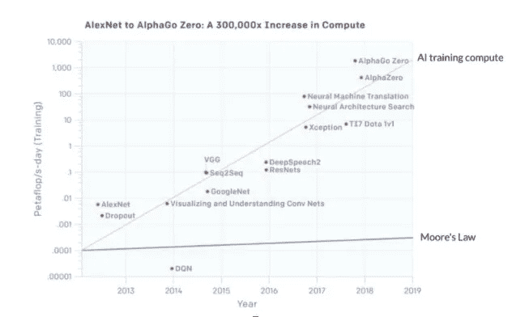

# 通过利用混合管道、并行化和 GPU 加速来提高复杂模型的速度

> 原文：<https://towardsdatascience.com/increasing-model-velocity-for-complex-models-by-leveraging-hybrid-pipelines-parallelization-and-3a0ca5e05049>

## [理解大数据](https://towardsdatascience.com/tagged/making-sense-of-big-data)

# 通过利用混合管道、并行化和 GPU 加速来提高复杂模型的速度

## 如何选择正确的工具来处理复杂的模型

数据科学正面临着对 CPU 周期的巨大需求，因为科学家们试图处理复杂性增长速度超过摩尔定律的数据集。考虑到快速迭代和重新训练的需要，几年来，模型复杂性已经超过了可用的计算资源和 CPU，并且这个问题正在快速增长。数据科学行业将需要采用并行化和 GPU 处理来高效利用日益复杂的数据集。

鉴于最新模型越来越复杂，任何在大数据集上进行机器学习(ML)的企业最终都将面临这一挑战。像 AlexNet 这样的模型有 61M 的参数和超过 600M 的连接。尝试将其与 ImageNet 中的 120 万幅图像进行对比，你会遇到一个巨大的计算挑战。AlexNet 是下图中最简单的模型之一——想想今天的 SOTA 模型需要什么。

问题是计算需求——这是减缓模型训练的原因。计算需求是基于模型复杂性和数据集大小的函数，用于训练复杂模型的 CPU 需求的增长速度超过了摩尔定律。如果我们看看从 AlexNet 到 AlphaGo Zero 的计算需求，我们会看到一个指数级的增长，三至四个月翻一番。相比之下，摩尔定律有两年的倍增期。自 2012 年以来，最新模型的计算需求增长了 300，000 倍以上——摩尔定律只会产生 7 倍的增长。

从 2013 年的 AlexNet 到今天的 AlphaGo Zero，计算需求不断增长的图示；数据点的指数拟合给出了 3.43 个月的倍增时间，如 Kozma，Robert & Noack，Raymond & Siegelmann，Hava。(2019).受大脑能量管理启发的情境智能模型。567–572.10.1109/SMC。18969.868686868617

**为任务找到合适的框架**

当您训练一个预测模型时，您会经历从预处理到模型训练、模型验证和操作化的阶段。传统的方法是端到端地使用 Spark，投入更多的计算资源来解决问题，然后等待结果。但是，如果您为管道的不同部分使用不同的框架，您可以划分工作，并为每个工作使用最好的工具来处理每个阶段。

**混合管道应对现代挑战**

如果您试图围绕一个单一的工具来编排您的整个模型生命周期，您将会受到“这个工具能做什么？”心态。切换到混合管道可以让您自由地为每个阶段选择最佳和最有效的工具。维护集群也非常昂贵。如果您有一个包含 50 个工作节点的本地 Spark 集群，您的管理员会希望将尽可能多的工作负载放在该集群上，因为企业需要支付其计算和维护费用。这反过来意味着群集可能会被大量利用并且资源有限。

另一方面，如果您每周或每月都在重新培训您的模型，而不是维护那些在您需要之前会耗尽资金的资产，您可以寻找一些方法来启动集群，然后根据需要取消配置。例如，如果您每天收集数据，每周重新训练模型，您可以设置一个 GPU 加速的 Spark 集群，该集群在周日自动供应，执行管道，并在完成后取消供应。这不仅可以节省资金，因为您只需在需要时为集群付费，更重要的是，使用 GPU 加速可以保证集群在更短的时间内完成流水线，从而节省更多资金。以下是如何设置这一切的方法:[带有 GPU 加速的按需 Spark 集群](https://blog.dominodatalab.com/on-demand-spark-clusters-with-gpu-acceleration)

Spark 是加州大学伯克利分校创建的通用计算引擎，是并行大数据处理领域的公认领导者。SparkSQL 引擎是其他任何引擎都无法比拟的。但是 Spark 的 ML 库不像其他框架那样先进，而且由于其特定的数据处理范例和 API，Spark 的学习曲线有些陡峭。从这个意义上说，Spark 生活在自己的世界里，而像 Dask 和 Ray 这样的挑战者一直在稳步增长。

与 Spark 相反，Dask 最初的设计原则是“不要发明任何东西”。这个决定背后的想法是，一直使用 Python 进行数据分析的开发人员应该对使用 Dask 感到熟悉，并且加速时间应该是最短的。Ray 是加州大学伯克利分校的另一个项目，由两个主要组件组成——Ray Core，这是一个分布式计算框架，以及 Ray 生态系统，广义而言，这是许多与 Ray 打包在一起的特定于任务的库(例如，Ray Tune——一个超参数优化框架，用于分布式深度学习的 RaySGD，用于强化学习的 RayRLib 等。)

Spark 仍然非常适合 ETL 工作负载，但 Ray 更适合强化学习等特定任务，Dask 在对 Pandas DataFrames 和 NumPy 数组的开箱即用支持方面处于领先地位。你需要能够挑选最好的。

关于框架之间的差异，请参见: [Spark、Dask 和 Ray:选择正确的框架](https://blog.dominodatalab.com/spark-dask-ray-choosing-the-right-framework)

**加速速度**

由于大多数公司使用的是遗留的基础设施，使用多种工具和框架还不是一种常见的做法。如果您有一个 Spark 集群需要它来管理，那么您可能不得不使用 Spark——获取其他任何资源都是一个 IT 难题。但是在数据科学中，你需要敏捷，如果到了紧要关头，要有快速失败的自由。

数据科学是一个非常动态的领域。如果您想尝试一种新的并行处理框架，您不希望等待 6–7 周的时间来调配和配置集群。最坏的情况是，如果您的想法在使用 IT 资源并等待数周后仍未成功，您将失去所有时间，并且您在公司的信誉可能会受到影响。你想让尝试新方法变得容易。

此外，要解决计算量大的问题，不能只依靠快速 CPU 和混合流水线。对于像网格搜索和超参数调整这样的任务，您需要成百上千次地重新训练您的模型。你可以并行计算，或者使用 GPU 加速，或者两者兼而有之。如果不使用并行，您将需要越来越大的计算实例。不是一天重新训练你的模型，而是一个月。这对模型速度不好。

**转向并行和 GPU 处理**

对于 ML 项目，许多问题是基于矩阵的代数计算，有大量简单的数学计算。GPU 的一个优势是，它不是有十几个或二十几个核心来计算值，而是有数百个核心，可以非常快速地进行非常基本的计算。这是一个非常适合 ML 工作负载的解决方案——您可以将矩阵数学卸载到 GPU，同时使用 CPU 进行更多的顺序计算。麻省理工学院的 Neil C. Thompson 和 Kristjan Greenewald 在[深度学习的计算极限](https://arxiv.org/pdf/2007.05558.pdf)中写了 CPU 的挑战和 GPU 的优势。

人们使用 GPU 进行模型训练已经有一段时间了。但是，试图建立一个可以协调多台机器和 GPU 加速的基础设施是非常复杂的——编写代码来分布和管理多台机器上的 GPU 执行真的很难。这里的创新在于，我们创建了特定的加速器来管理分布式并行化框架。NVIDIA 为 Apache Spark 推出了 RAPIDS 加速器，为 Spark 增加了 GPU 加速。Dask 和 Ray 等框架现在可以处理并行化，并与 Tensorflow 和 PyTorch 等 GPU 框架集成，以提供并行化的 GPU 执行。我们能够以前所未有的方式将并行化和 GPU 加速结合起来。驾驭 GPU 加速的分布式处理的能力对于在合理的时间内打破训练复杂模型的限制变得至关重要。

**结论**

展望未来，模型的规模和复杂性只会增加。整个行业中的公司并不是因为新的和新奇的东西而试图得到模型驱动，他们这样做是因为竞争压力让他们别无选择。

如果您想成为一家领先的公司，您应该采取一种方法，通过对您的数据进行分区，使用 GPU 设置多台机器以闪电般的速度处理代数，并部署一种支持您轻松供应和管理不同框架和工具的能力的基础架构，来充分利用当前和新兴的工具。

当您准备好采取下一步措施来加速您的数据科学计划时，请考虑您将如何实现一个由 GPU 加速支持的分布式处理混合管道。当您着手下一个项目时，您可以考虑每种方法的不同功能，并考虑在没有太多管理或 IT 难题的情况下合并多个框架的方法。通过考虑我上面讨论的要点，您将能够使用越来越复杂的模型交付及时的结果。