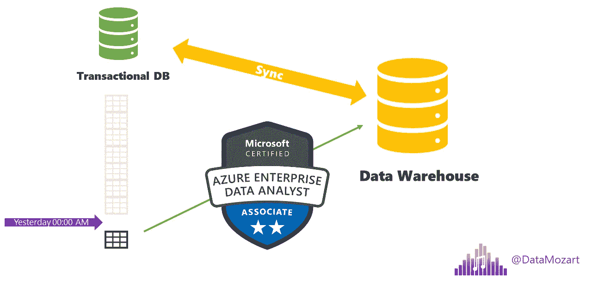
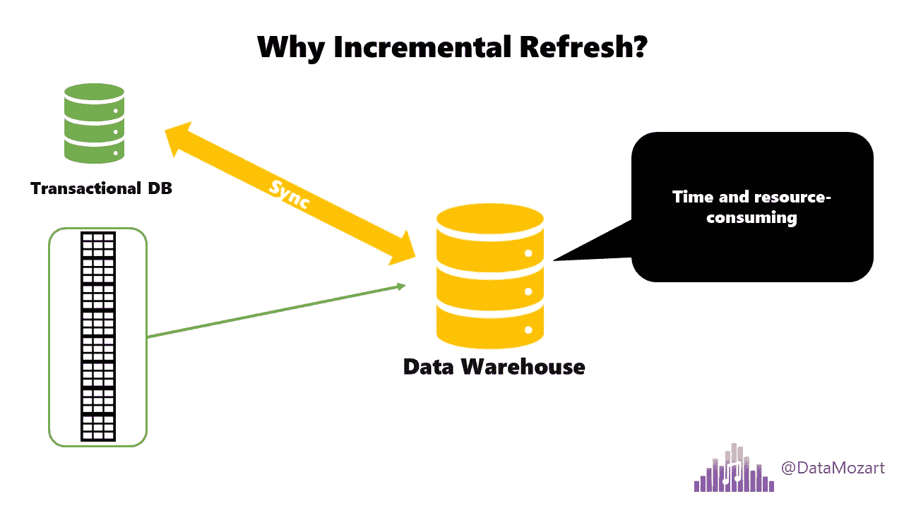
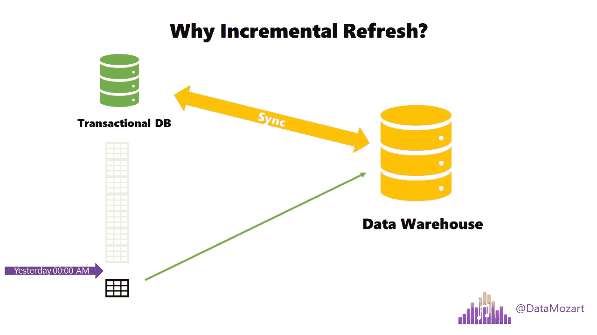
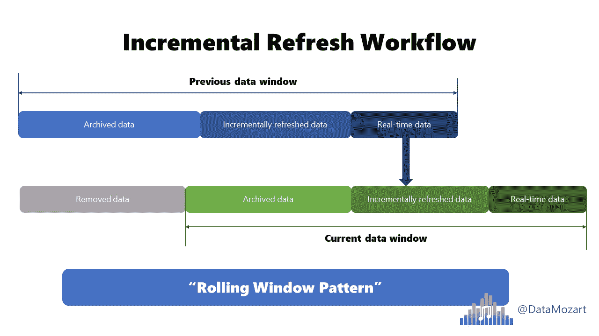
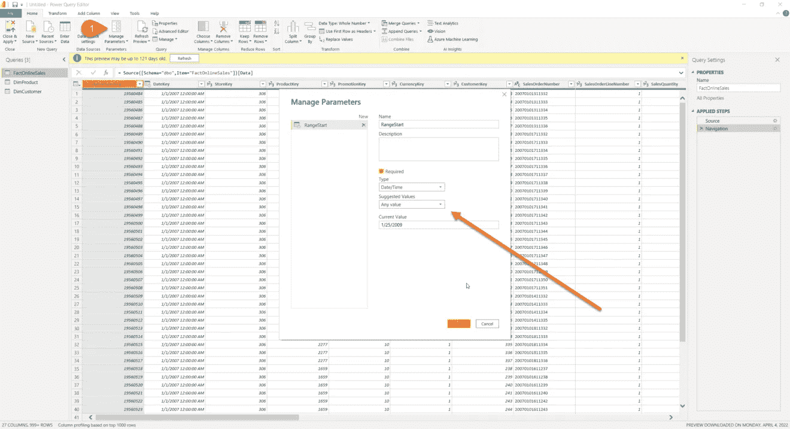
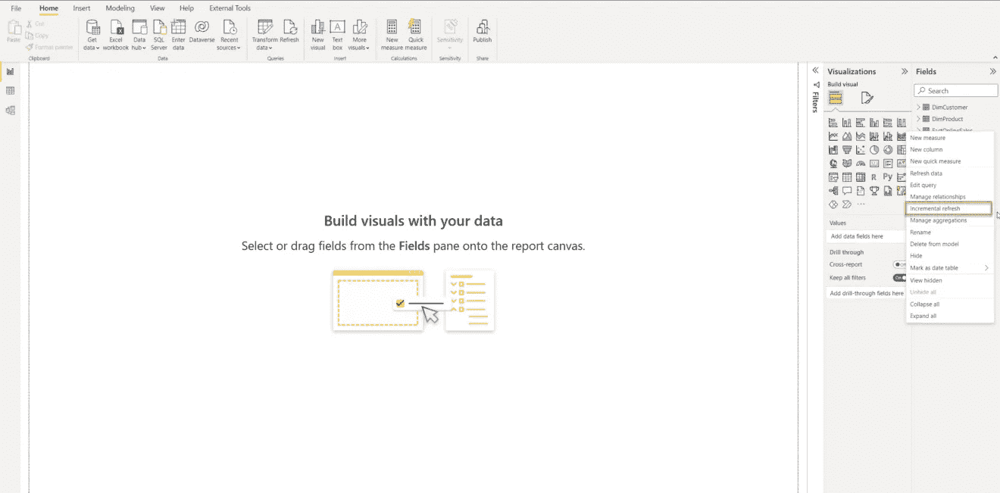
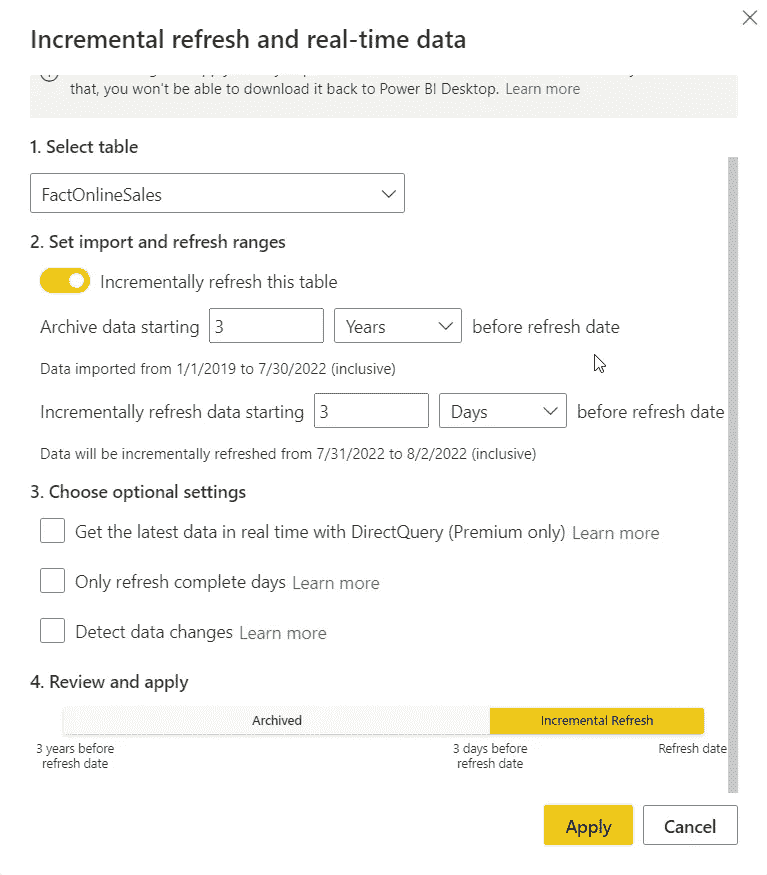
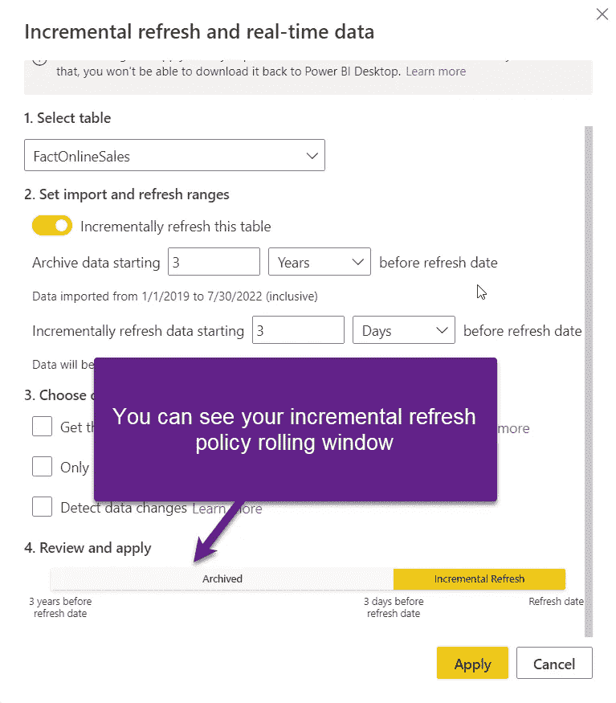

# Power BI 中的增量更新—您需要知道的一切

> 原文：<https://towardsdatascience.com/incremental-refresh-in-power-bi-everything-you-need-to-know-857183895464>

## 厌倦了缓慢而低效的数据刷新过程？了解如何利用增量刷新功能来加速和优化数据刷新

作者图片

你有多少次吹嘘过这样的事情:哦，不，我需要刷新我的事实表，但是花的时间太长了…可能是因为你没有使用数据刷新过程中的一个关键性能特性。

让我们试着简单解释一下增量刷新的概念。如果你认为增量刷新是 Power BI 独有的东西，那你就大错特错了！这种方法已经存在了几十年，基本上在每个传统的数据仓库解决方案中都有实现。

# 增量刷新是在上一个数据加载周期之后加载新数据或更新数据的过程！

在这个定义的背后，有各种重要的方面需要理解。首先，为什么增量刷新如此重要？假设您有一个巨大的事务数据库，其中主表包含数百万行。为了使您的分析工作负载保持同步，您需要将数据从事务数据库加载到数据仓库中。所以，想象一下，如果每次都加载整个巨大的表，会发生什么？！确切地说，它将消耗大量资源，还可能对事务数据库产生影响:

作者图片

因此，您应该只检查和消耗那些在最后一次刷新过程之后到达或更改**的记录！这大大减轻了事务数据库的压力，因为只需要处理一小部分数据。**

假设您在昨天午夜同步了数据。我们将只检查同时更新或插入的记录(可能有几千行),然后只同步这一小部分，而不是再次提取整个数百万的表:

作者图片

# 增量更新的优势

在您的 Power BI 解决方案中实施增量更新有多种优势:

*   刷新速度更快——显然，随着数据量的减少，数据加载过程会运行得更快
*   降低资源消耗—同样，处理较小的数据块将有助于您降低内存消耗，并更高效地使用其他电源 BI 和数据源系统资源
*   可靠的更新流程—如果您决定“全包”并反对增量更新，长时间运行的连接可能会变得脆弱和不可靠。增量刷新消除了这一挑战
*   设置简单—只需点击几下鼠标，您就可以为数据集定义增量刷新策略

# 电源 BI 中的增量刷新

一旦您将数据模型发布到 Power BI Service，每个表都包含一个分区。该分区包含所有的行，正如我们已经解释过的那样，对于大型表来说，数据刷新可能会非常困难。

当您配置增量刷新时，Power BI 将自动对您的表进行分区—一个分区将包含必须频繁刷新的数据，而另一个分区将保存不变的行。

用最简单的方式来说，这就是增量刷新后工作流的样子:

作者图片

您可能会注意到，比较前一个和当前数据窗口，窗口是滚动的，在前一个窗口中被视为实时的数据现在成为增量刷新分区的一部分。这是一个持续的过程，被称为“滚动窗口模式”。

# 增量刷新的先决条件

为了能够在您的 Power BI 解决方案中实施增量更新功能，需要具备一些先决条件:

*   **日期列** —要应用增量刷新的表必须包含日期列，可以是日期/时间或整数数据类型。这是因为您需要设置用于在分区之间分离数据的参数
*   **查询折叠** —现在，您可能会问自己:什么是查询折叠？所以，我们先来解释一下这一条。我已经在[这篇文章](https://data-mozart.com/what-is-a-query-folding-in-power-bi-and-why-should-i-care/)中更详细地描述了它，但是，简单地说，查询折叠是 Power Query 生成单个 SQL 查询的能力，该查询将在 SQL 数据源端执行。为什么查询折叠对增量刷新很重要？嗯，您的日期范围参数需要转换成 SQL 中的 WHERE 子句，以便在相关分区中分隔数据。因此，如果没有查询折叠，就没有 WHERE 子句，不可能进行分区，因此也不可能进行增量刷新
*   **单一数据源** —意味着所有分区都必须从单一数据源查询数据

# 等等……还有呢！

通过利用[混合表特性](https://data-mozart.com/hybrid-tables-in-power-bi-the-ultimate-guide/)，您可以进一步增强数据刷新过程。本质上，这种想法是为表设置增量刷新，但在 DirectQuery 模式下设置具有最新数据的分区，同时将较旧的数据保留在使用导入模式的分区中。

通过这种方式，您可以两全其美:针对旧数据的分析查询的超快的性能，以及与来自原始数据源的最新数据的实时同步。但是，目前，混合表功能仅适用于 Power BI Premium 许可证。

# 在 Power BI 中设置增量刷新

配置过程的第一步是定义参数，并设置在过滤应加载到 Power BI Desktop 中的数据时应用的默认值。您应该保持这个范围较短，并且只包括最近的数据(在我的例子中是 3 天)，因为一旦您配置了增量刷新策略，这些值无论如何都会被覆盖。

作者图片

请记住，您应该为参数使用预定义的 RangeStart 和 RangeEnd 名称。这样，Power BI“知道”这些参数将用于设置增量刷新。

下一步是根据我们新创建的参数过滤数据:

作者图片

设置过滤条件时要小心，您应该避免在两个参数上使用等式(即，是在之后或等于/是在之前或等于)，因为这可能会提取重复的数据，并在您的报告中产生不正确的结果！

我现在可以在 Power Query Editor 中点击 Close&Apply，您可能会注意到 Power BI 将只加载一小部分数据——在我的例子中，不是最初的 1260 万行，而是这次只加载 36000 行。

现在到了工作流的关键部分—我们将为我们庞大的事实表定义增量刷新策略:

单击表名旁边的三个点，然后选择增量刷新

弹出增量刷新对话框后，有各种选项可供选择:

作者图片

在我打开增量刷新该表属性后，我将定义归档周期(在我的示例中为 3 年)和应用增量刷新策略的周期(3 天)。最酷的是，您可以立即看到哪些日期将包含在哪个分区中。

在可选设置下，如果您勾选了*使用 DirectQuery 实时获取最新数据旁边的框，*您可以利用我们在上一篇文章中已经描述过的[混合表特性](https://data-mozart.com/hybrid-tables-in-power-bi-the-ultimate-guide/)。

*如果您将数据刷新过程安排在比如说凌晨 3 点(假设此时底层数据源的压力较小)，但是您不希望仅将午夜和凌晨 3 点之间插入源系统的这些记录导入 Power BI，那么仅刷新完整天数*选项非常方便。启用此选项后，将只加载已完成天数的记录。

*检测数据更改可能会为数据刷新过程带来*更大的性能提升，因为它仅支持处理自上次运行以来发生更改的记录。要使该选项起作用，您需要在数据源中有一个包含特定记录上次更新时间信息的特定列(例如，LastUpdated、LoadDate 等)。该列必须是日期/时间数据类型，并且*不应该是用于对事实表*进行分区的同一列(在我们的例子中，它不应该是 DateKey 列)。

最后，如果向下滚动，您可以看到可视化的增量刷新滚动窗口:

作者图片

点击“应用”,现在我已经准备好发布报表和数据集了。一旦数据集位于 Power BI 工作区中，您必须刷新它。第一次刷新将加载所选存储期间的历史数据，以及增量刷新策略中定义的新数据和更新数据。

第一次数据加载可能需要一段时间，具体取决于数据量，但所有后续刷新的运行速度应该会快得多，因为只会加载增量刷新策略中指定时间段内的数据。

# 结论

当您处理相对较小的数据模型时，您可能会偷偷摸摸地不实现数据的增量刷新。但是，一旦数据量开始扩大，增量刷新将很快成为您优化数据刷新流程的最佳选择。

而且，这不仅仅是将新数据引入 Power BI 数据集所需的时间，还包括重新处理整个巨大的表所需的资源。

感谢阅读！

[成为会员，阅读媒体上的每一个故事！](https://datamozart.medium.com/membership)