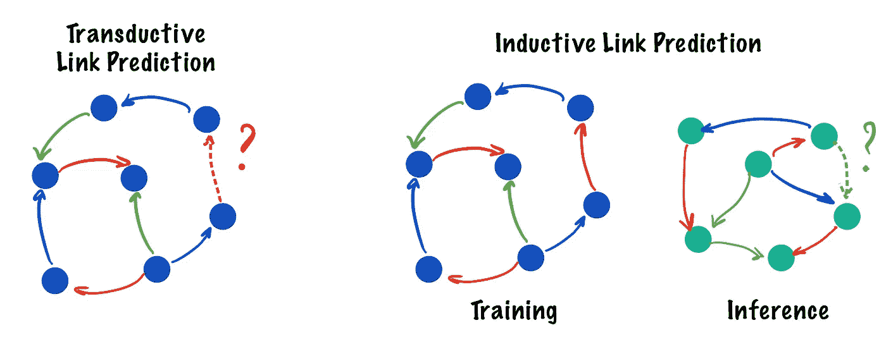
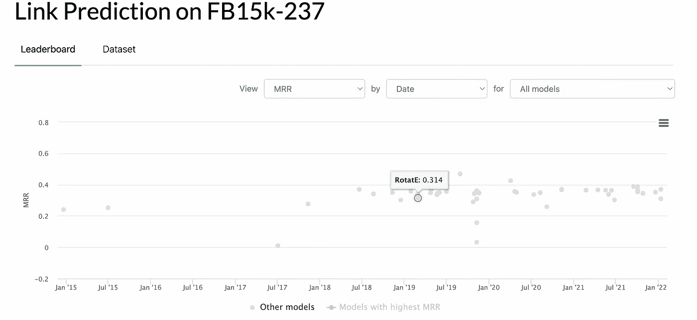
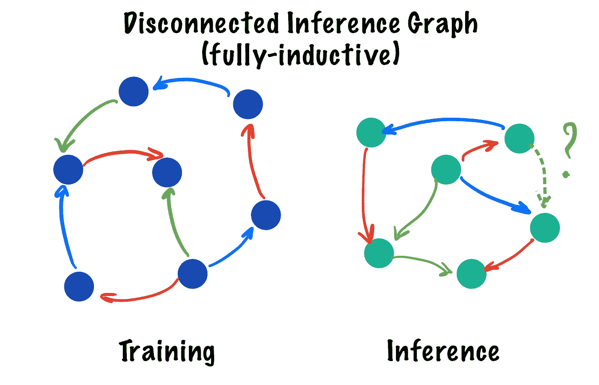
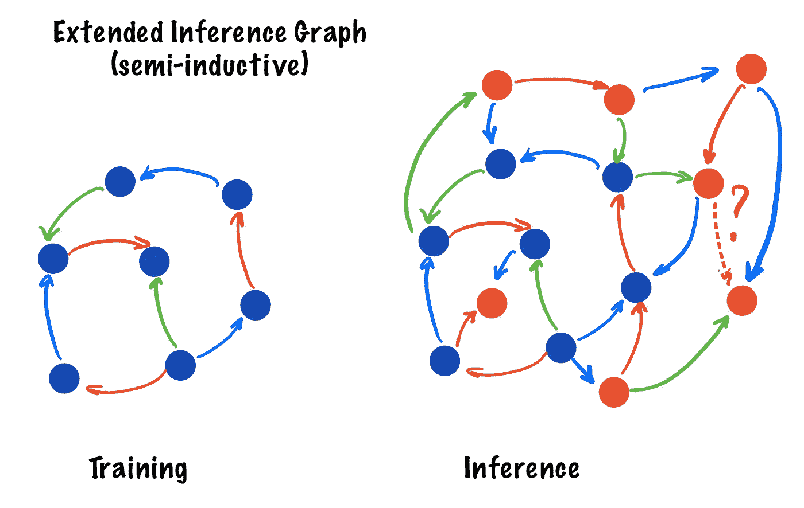
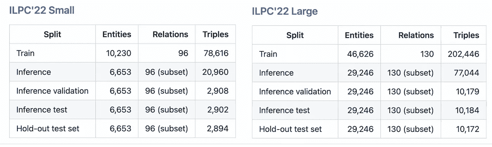
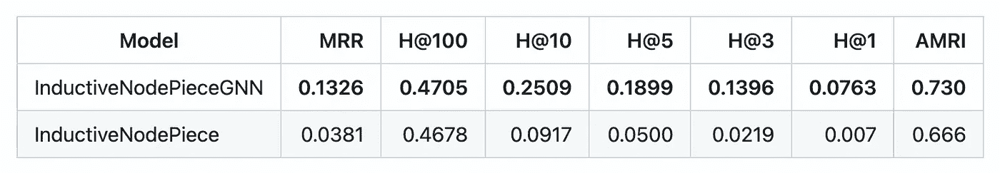
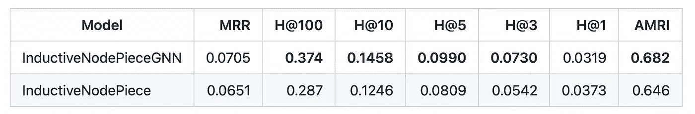

# 知识图中的归纳链接预测

> 原文：<https://towardsdatascience.com/inductive-link-prediction-in-knowledge-graphs-23f249c31961>

## 开始新的感应链路预测挑战 2022

自从 2011 年以来，知识图上的表征学习领域一直由一项任务主导:直推式链接预测。2022 年还相关吗？🤔不太可能。

直推式设置:训练和推理在同一个图上进行。归纳:推论在新图上。彩色箭头代表不同的边类型(关系)。问号表示要预测的边。作者图片

在**直推式**设置(🖼 ☝️)中，我们在训练时看到的**相同的**图上执行推理(我们的链接预测)。我们还假设我们**没有**任何预先计算的节点特征。这个事实:

*   🔐在训练和推理时将实体集锁定为相同
*   🥚允许*浅*嵌入模型学习图形中每个节点的唯一向量
*   🙅不支持使用预先训练的模型对新图表进行推理

> **是时候给基于三重 kg 的直推式链路预测最后一击，让它退役了**

随着图在工业中的增长(100M 到 10B+节点)以及每次图改变时重新训练的巨大计算成本，KG 表示学习的焦点正转向不受上述限制的**归纳**模型。

# 实际影响:我为什么要关心？

嗯，对普通三基 KG 的直推式链接预测停止了跟踪 KG 表示学习的大部分进展:这里是代码为的[论文的摘录，可视化了标准](https://paperswithcode.com/)[**FB15k-237**](https://www.aclweb.org/anthology/W15-4007/)**基准中的进展。**

****

**自 2019 年以来，直推式 LP 没有实质性进展。作者图片**

**🤨自 2019 年以来，你看到任何重大进展吗？(是的，我也没有)**

**几年来，普通的转导链路预测已经相当陈旧了。相反，2021 年至 2022 年表征学习的大部分进展(如 [**神经贝尔曼-福特网络**](https://arxiv.org/pdf/2106.06935.pdf) 或 [**节点块**](https://openreview.net/forum?id=xMJWUKJnFSw) )要么是在新的 KG 模态(如[超关系 KG](/representation-learning-on-rdf-and-lpg-knowledge-graphs-6a92f2660241))上实现的，要么是记住了**归纳**属性👉查看[我们最近的文章](/graph-ml-in-2022-where-are-we-now-f7f8242599e0#93ee)了解更多详情。**

# **什么是“感应式”设置？**

**在**归纳**设置中，我们取消了在训练和推理时具有相同图形的要求。在我们的 [**ISWC 2021**](https://arxiv.org/pdf/2107.04894.pdf) 论文中(谦虚地提一下它获得了最佳研究论文奖😊)我们定义了两种类型的感应设置:**

1.  ****全归纳**:完全脱离训练图的新图。因此，仅在*不可见的*实体上执行链接预测(从*不可见到不可见的*模式)。**

****

**完全归纳设置—推理图与训练图断开。问号表示要预测的边缘。作者图片**

**2.**半归纳**:一个更大的更新图，包括并扩展了训练图。链接预测可以涉及可见和不可见的实体，因此模式*可见到不可见*和*不可见到不可见*。**

****

**半归纳设置:推理图用新节点(橙色)扩展了训练图。问号表示要预测的边缘。图片作者。**

**✅归纳模型的一些直接好处:**

*   ****没有浅节点嵌入**！在存在新的看不见的节点时，它们是无用的，我们需要新的方法来学习实体表示。**
*   **预训练模型**不需要重新训练**，可以立即用于新的或更新的图表。**

**归纳模型带来了额外的**表示学习**挑战，即，我们不能再对每个节点使用浅层向量分配，我们需要更有效的方法来构建能够推广到新的看不见的节点的节点特征。GNNs 和消息传递在这个探索中似乎很有前途。**

**关于完全归纳设置中的归纳 LP 的第一项工作可追溯到由 [**Teru、Denis 和 Hamilton(ICML 2020)**](https://arxiv.org/pdf/1911.06962.pdf)**提出的论文，他们引入了基于局部节点邻域的归纳特征化方法。由于这种方法的可扩展性不强，因此采样的归纳数据集也相对较小，大多为 2000–5000 个节点。是时候扩大规模了！🚀****

# ****感应链路预测挑战 2022****

****🐍在[团队 PyKEEN](https://github.com/pykeen) 中，我们设计了一个新的[归纳链接预测挑战](https://github.com/pykeen/ilpc2022) (ILPC)，旨在巩固社区在创建归纳推理模型方面的努力。对于 2022 年，我们提出了在**全归纳**模式下的归纳链接预测挑战，即当训练图和推理图不相交时。****

****随着 [**新论文**](https://arxiv.org/abs/2203.01520) 描述基准，ILPC 2022 特性:****

*   ****新的数据集[ilpc 22-小型](https://github.com/pykeen/ilpc2022#ilpc22-small)和[ilpc 22-大型](https://github.com/pykeen/ilpc2022#ilpc22-large)从 [**维基数据**](https://www.wikidata.org/wiki/Wikidata:Main_Page) 中取样，最大的公开公斤数。较小的版本(s)非常适合假设检验🧪和有限的计算资源，而较大的版本(l)甚至对现代 gnn 构成了重大挑战，特别是在推理图大小方面——据我们所知，这是模型第一次必须推广到如此大小的看不见的图👀。****

********

****ILPC 2022 数据集。作者图片****

*   ****公共分割包含训练、验证和测试集，但我们还保留了一个**隐藏测试** **集**，用于对每个数据集大小提交的模型进行最终评估(例如，就像他们在 Kaggle 上做的那样)。此外，我们在 Zenodo 上公开了数据集****
*   ****一个[代码库](https://github.com/pykeen/ilpc2022),包含一组不同的指标和一个标准化的评估程序。顺便说一下，我们最近发表了一份👉 [**新作**](https://arxiv.org/abs/2203.07544) **👈**设计与数据集大小无关的排名指标，我们计划在最终评估中也使用这些指标！****
*   ****两个强基线采用归纳版本的[节点件](https://openreview.net/forum?id=xMJWUKJnFSw)作为组合特征:1️⃣普通节点件+非参数解码器；具有 2 层 [CompGCN](https://github.com/malllabiisc/CompGCN) 消息传递编码器+非参数解码器的 2️⃣节点。数据集非常具有挑战性，而且远未解决:****

********

****ILPC22-Small 上的基准性能。****

********

****ILPC22-Large 上的基准性能。****

*   ****[提交材料](https://github.com/pykeen/ilpc2022#-challenge)非常容易制作，并将在♻️公开复制****
*   ****最后，ILPC 发布了新的 [PyKEEN 1.8.0](https://github.com/pykeen/pykeen) 版本，具有归纳链接预测管道、构建归纳模型的新接口以及许多新的评估指标📏****

# ****摘要****

****一个新的和开放的感应链路预测挑战 2022 已经开始，尽你所能 GNNs 和其他架构！****

*   ****📜论文:[arxiv](https://arxiv.org/abs/2203.01520)****
*   ****💾数据集: [GitHub](https://github.com/pykeen/ilpc2022) 和[芝诺多](https://zenodo.org/badge/latestdoi/460713416)，开放 CC0 许可****
*   ****🛠 [Github 知识库，包含排行榜和说明](https://github.com/pykeen/ilpc2022#-challenge)****
*   ****♻️ [芝诺多条目](https://zenodo.org/badge/latestdoi/460713416)****

********

****我们将关注您提交的内容！资料来源:gfycat.com****

****没有查尔斯·塔普利·霍伊特 *(哈佛大学)和马克斯·贝伦多夫* *(LMU)* 这部作品就不可能完成🙌****