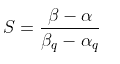
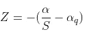
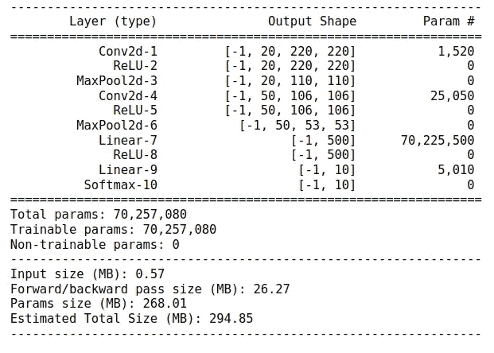
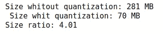
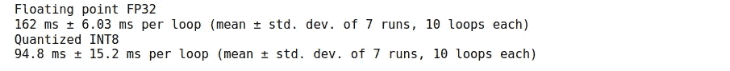
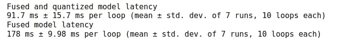

# 卷积神经网络的推理优化

> 原文：<https://towardsdatascience.com/inference-optimization-for-convolutional-neural-networks-e63b51b0b519>

## **量化和融合以实现更快的推理**


照片由[布拉登·科拉姆](https://unsplash.com/es/@bradencollum?utm_source=medium&utm_medium=referral)在 [Unsplash](https://unsplash.com?utm_source=medium&utm_medium=referral) 上拍摄

现代深度学习研究主要集中在为各种问题(如对象检测、分割、自我监督学习等)创建和改进新的、更好的和优化的解决方案。这正在帮助许多企业和初创公司开始为他们的产品使用更容易获得的人工智能解决方案。然而，当涉及到现实世界的应用时，尤其是当模型是为边缘设备开发时，我们面临着许多限制，如模型大小大和低延迟。

有许多方法可以让移动设备和其他边缘设备访问 AI 模型。一种选择是使用为移动设备设计的小型号(比如为移动设备设计的 [MobileNet](https://arxiv.org/abs/1704.04861) 和 [Yolo)。其他方法包括推理级别的优化。后者包括模型剪枝、量化、模块融合等方法。在这篇博文中，我们将探讨卷积神经网络的量化和融合方法。我们将使用 PyTorch 的量化模块，并比较有量化和没有量化的模型的大小和延迟。](https://github.com/pytorch/ios-demo-app/tree/master/ObjectDetection)

博客概述:

1.  什么是量子化？
2.  量化技术
3.  什么是模块融合？
4.  PyTorch 中的应用与比较

## **什么是量化？**

量化是一种在推理阶段加速深度学习模型的简单技术。这是一种压缩信息的方法。模型参数存储在浮点数中，模型操作使用这些浮点数进行计算。浮点运算具有很高的精度，但是，它们非常占用内存，计算量也很大。量化将 32 位浮点数转换为 8 位整数。它对 8 位整数执行部分或全部操作，这可以将模型大小和内存需求减少 4 倍。

然而，这是有代价的。为了减小模型的规模，提高执行时间，我们会牺牲一些精度。因此，在模型准确性和大小/延迟之间会有一个折衷。

为了进行量化，我们需要一个将浮点数映射为整数的映射函数。最常见和最简单的方法是线性变换。

Q(r) = round(1/S + Z)，其中

*   r 是输入，
*   s 是比例因子，即输入范围与量化输出范围之比。
    找到比例因子最简单的方法是使用输入和输出范围的最小值和最大值。但是 PyTorch 还有 MSE 最小化、熵最小化等其他方法。寻找比例因子的过程称为校准。



*   z 是零点，此参数有助于将零点从输入空间正确映射到输出空间。



PyTorch 有一个观察器模块，可以用来校准模型。它收集输入值的统计数据，并计算 S 和 Z 参数。量化参数也可以通过张量或通道来计算。在第一种情况下，观察者将获取整个张量并从中提取统计数据，在第二种情况下，分别为每个通道计算 S 和 Z 参数。

## **量化技术**

在 PyTorch 中，有 3 种不同的方法来实现量化:

1.  **动态量化**
    模型权重被量化，推理时激活被动态量化。这可以提高精度，因为对每个输入都进行了校准。这项技术在 LSTM、GRU、RNN 都有效
2.  **训练后静态量化**
    在这种情况下，模型权重和激活是预先量化的。对验证数据进行校准。这比动态量化更快，但是，它可能需要不时地重新校准以保持稳健。
3.  **量化感知训练(QAT)**
    这些技术旨在改善训练后的量化。它在训练损失中增加了量化误差。s 和 Z 参数可以在训练期间学习。

在本帖的续篇中，我们将对卷积神经网络使用训练后量化。

## **什么是模块融合？**

在继续讨论 PyTorch 代码之前，让我们先了解另一种技术，这就是 fusion。融合旨在将多个层合并为一层，这可以节省推理时间并减少内存访问。它将合并后的操作序列发送到一个低级别的库，该库可以一次性计算出来，而无需将中间表示返回给 PyTorch。然而，这种技术也是有代价的。现在，当各层合并时，模型很难调试。融合只对以下图层组有效:[Conv，雷鲁]，[Conv，巴奇诺姆]，[Conv，巴奇诺姆，雷鲁]，[线性，雷鲁]。

## **py torch 中的应用和比较**

```
# Import packages 
from torch import nn
from torchsummary import summary
import torch
import os
```

首先，让我们创建一个简单的卷积神经网络。

从上面的代码片段可以看出，我们已经创建了一个小型卷积网络，它有两个卷积层，后面是 relu 和 maxpooling。最后，我们有两个完全连接的层和一个 Softmax 输出。

```
n = Net().cuda()
summary(n, (3, 224, 224))
```



模型摘要显示，我们有大约 7000 万个参数，估计模型大小为 294MB。

为了创建同一模型的量化版本，我们将创建 2 个新属性来量化和反量化模型。接下来，在正向传递期间，我们将在 softmax 之前对网络输入进行量化和去量化。

为了运行 eval()设置的量化模型，我们需要定义配置。Torch 有两个用于量化的后端:用于支持 AVX2 或更高版本的 x86 CPUs 的“fbgemm”和用于 ARM CPUs(移动/嵌入式设备)的“qnnpack”。

接下来，我们需要使用*torch . quantization . prepare*来准备模型。这将运行一个观察器方法来收集输入的统计数据。并且*torch . quantization . convert*从观察者状态转换到量子化状态。

```
# Define original and quantized models and prepae for evaluation 
net = Net()
net.eval()
net_quant = NetQuant()
net_quant.eval()# Prepare model quantization and convert to quantized version
net_quant.qconfig = torch.quantization.get_default_qconfig("fbgemm")
torch.backends.quantized.engine = "fbgemm"
net_quant = torch.quantization.prepare(net_quant.cpu(), inplace=False)
net_quant = torch.quantization.convert(net_quant, inplace=False)
```

**检查模型尺寸**

```
# Check model size
def print_model_size(mdl):
    torch.save(mdl.state_dict(), "tmp.pt")
    size = round(os.path.getsize("tmp.pt")/1e6)
    os.remove('tmp.pt')
    return sizenet_size = print_model_size(net)
quant_size = print_model_size(net_quant)print(f'Size whitout quantization: {net_size} MB \n Size whit quantization: {quant_size} MB')
print(f'Size ratio: {round(net_size/quant_size, 2)}')
```



现在，我们得到了比原来尺寸小 4 倍的模型。

**检查模型延迟**

```
# input for the model
inpp = torch.rand(32, 3, 224, 224)
# compare the performance
print("Floating point FP32")
%timeit net(inpp)print("Quantized INT8")
%timeit net_quant(inpp)
```



CPU 上的原始模型运行速度为 162 ms，而量化后的模型大约快 1.7 倍。

**融合**

接下来，让我们实现融合以实现更多优化。正如我们在模型结构中看到的，只有 3 种方法来融合层:

```
# Perpare blocks for the fusionmoduls_to_fuse =  [['conv1', 'relu1'], 
                   ['conv2', 'relu2'], 
                   ['fc1', 'relu3']]net_quant_fused = torch.quantization.fuse_modules(net_quant, moduls_to_fuse)net_fused = torch.quantization.fuse_modules(net, moduls_to_fuse)
```

现在让我们再次检查延迟:

```
print("Fused and quantized model latency")
%timeit net_quant_fused(inpp)print("Fused model latency")
%timeit net_fused(inpp)
```



正如我们所看到的，通过使用带量化或不带量化的融合，我们节省了一些运行时间。然而，这并不像量化那样影响准确性。

## 结论

优化推理模型不是一件容易的事情。PyTorch 使得使用这些优化技术变得更加容易。但是，一定要记得在量化前后仔细检查模型的精度，确保你的模型不仅快而且准。

**在 GitHub 上找到所有代码:**[https://github.com/LilitYolyan/inference_optimization_cnn](https://github.com/LilitYolyan/inference_optimization_cnn)

**检查参考资料:**

[](https://pytorch.org/blog/quantization-in-practice/) [## PyTorch 中的实用量子化

### 量化是一种既便宜又简单的方法，可以让您的 DNN 运行得更快，并且对内存的要求更低。PyTorch 提供了…

pytorch.org](https://pytorch.org/blog/quantization-in-practice/)  [## 量化- PyTorch 1.11.0 文档

### 警告量化处于测试阶段，可能会有变化。量化指的是执行计算的技术…

pytorch.org](https://pytorch.org/docs/stable/quantization.html)