# 信息论和集成模型

> 原文：<https://towardsdatascience.com/information-theory-and-ensemble-models-ded31db10d8>

图片由 Pexels 提供

## 我们应该如何更好地集成时间序列预测？

从疫情出来后，统计学家们遇到了一系列地缘政治难题，进一步加大了准确预测商业变量的能力。乌克兰在 2022 年推动零售价格上涨，还是 2021 年的量化宽松是罪魁祸首？一些模型说一套，一些说另一套，这使得准确预测通货膨胀变得困难。

在计量经济学的基础上，我们依赖于在同一个域(时间，频率)中最小化两点(预测，实际)之间的距离(MSE，RMSE 等)。所有这些都极大地提高了预测的准确性。这些指标受欢迎有几个原因:

1.  他们是**非参数**。这意味着使用不同假设和结构开发的模型都可以进行比较，因为最终输出是相同的，即准确性。
2.  从历史上看，这些指标**提供了足够的残差分布变化**，让我们可以对不同的模型进行分类，并对它们的性能进行聚类。例如，它们帮助我们回答一类 ARMA 模型更适合数据还是一类状态空间模型。更一般地说，它有助于对最适合的算法进行分类。
3.  通常，它们位于欧几里德几何中，并具有良好的属性，使得在它们之上构建更新更复杂的方法变得更加容易。测量的拓扑结构不会改变。这释放了对数据、模型或两者进行转换和表示的潜力，以提取更深层次的关系。现代 ML 模型就是利用这一关键特性构建的。WLOG，为了本文的目的，我们将集中讨论简单的经济计量模型。

自 40 年代后期以来，这些好处极大地帮助改进了统计软件包，以至于今天我们有了更通用的软件包，能够选择最佳拟合模型，而用户甚至不必假设结构。

然而，任何情况下都是如此，继续优化相同的度量标准，每次迭代带来的改进越来越少。衡量距离的指标不再能够在优化的模型之间提供足够的分离，从而很难对性能进行排名。

那我们该怎么办？

潜在的解决方案有两种不同的途径:

1.  **在相同的拓扑结构中提出新的指标**可以改进最佳位分类——社区已经提出并广泛使用新的指标，如 AIC、AICc、BIC、BICc 等，但这些指标通常是特定于模型的，因为它们可能允许我们在彼此内部对 ARMA 模型进行排序，但无法比较 ARMA 与 ETS 模型。
2.  **提出新的几何和拓扑**改进方法——我通过格兰杰因果网络探索了这一想法的一个版本，这是一项正在进行的工作，但仍显示出巨大的潜力(鉴于我对该主题的兴趣，可能我有偏见)。感兴趣的读者可以在这里找到关于我的方法的[入门。](/granger-causal-networks-and-indirect-feedback-676549ba99e)

让我们首先从实际数据中的论点开始。我将分析通胀趋势和变量，以及我们使用现有模型预测 CPI 的准确度。几乎每个计量经济学家在考虑通货膨胀模型时都会用到以下变量:

1.  **消费者价格指数同比增长**——消费者通货膨胀的衡量标准；需要面
2.  **生产者价格指数同比增长** —生产者通货膨胀的衡量标准；供应侧
3.  **储蓄率**——储蓄占工作收入的百分比；衡量需求方的摩擦
4.  **企业库存 MoM Growth** —企业每个月拥有的商品过剩库存；测量供应方的摩擦

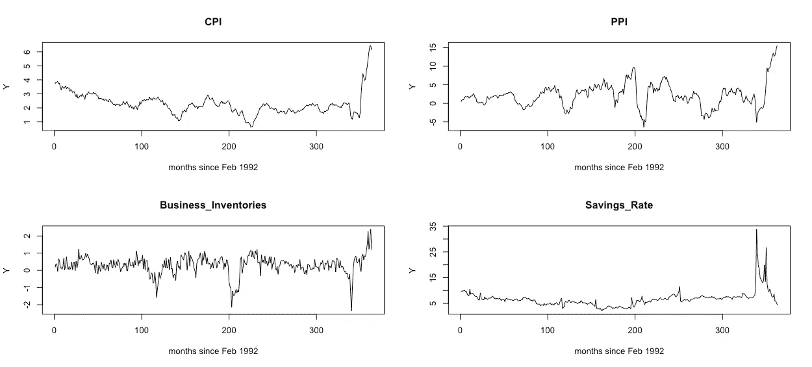

下面是 4 个变量的双变量格兰杰因果图:

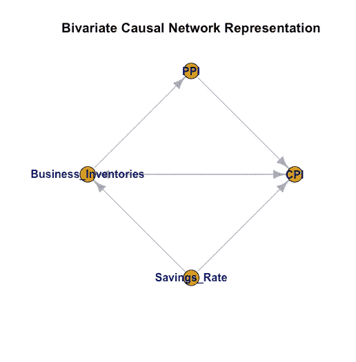

因果网络已经帮助解释了一些关于数据的关键细节。首先，储蓄率可以影响经济的需求方和供给方。其次，对生产者来说，通胀意味着对消费者的一些反馈。这些都是很好的健全检查，以确保我们正在考虑正确的变量。

更深入一点，让我们拟合一个通用的非参数风险值模型，并考虑一些对非因果和随机诱发冲击的敏感性:

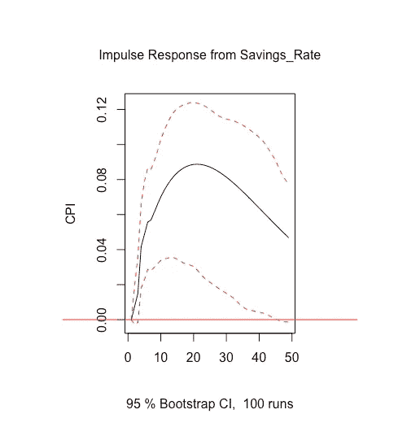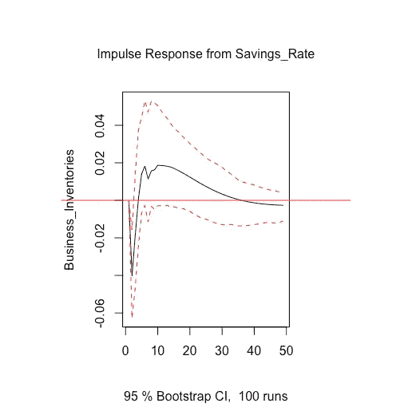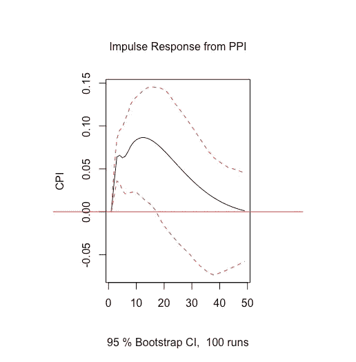

曲线图显示了对拟合风险值模型的脉冲响应。

顺便说一下，第一个情节证实了臭名昭著的永久收入假说，该假说由米尔顿·弗里德曼于 1957 年概念化:今天人们储蓄的意外增加，比如说因为政府决定发放刺激支票，导致那些过剩的储蓄在随后的时期被注入经济，导致需求拉动型通货膨胀。它还会导致企业库存压缩，直到它们再次恢复到正常水平。

如果没有明确的理由迫使人们这样做，即使我们增加他们的可支配收入，我们也无法说服他们明天存更多的钱。*消费者的未来预期在政策判断中起着至关重要的作用。*

类似地，由于生产者经历了更高的生产成本，通过 PPI 的增加很明显，他们将其传递给消费者，导致供应驱动的通货膨胀，如最后一个图所示。

至少在方向上，VAR 模型证实了一些经济理论。不幸的是，21 世纪需要的是准确性，而不是方向。即使我们对定性数据有信心，计量经济学家也有微调决策和政策的任务。为什么美联储每个季度加息 75 个基点，而不是 65 个基点？

我们如何使用应用于相同数据的多个模型进行精确的测量？将 3 种不同的预测模型拟合到我们的通胀数据中，下面是一些衡量样本外预测准确性的指标。很明显，我们无法有效区分三种型号中的两种型号的性能。

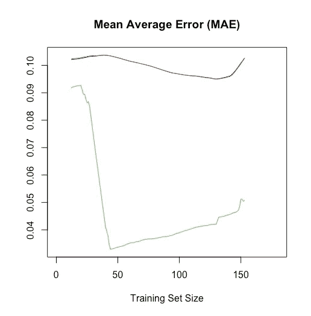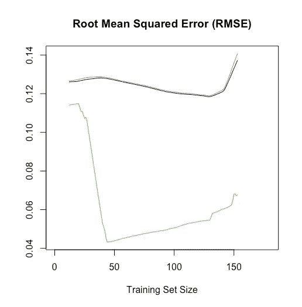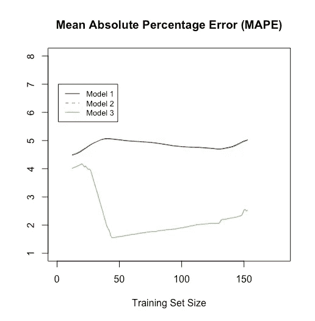

# 模型组装

对预测集合的需求源于这样一个事实，即由于我们传统的准确性度量标准没有提供足够的性能分离，我们永远不能有把握地说一种类型的模型可以捕捉一组时间序列之间的真实和因果动态。所以，如果没有一个模型看起来是最好的，我们能不能以某种方式衡量所有模型的输出，作为一个组合的整体呢？

接下来的任务就是想出衡量预测的最佳方法，这又需要以某种形式衡量绩效差异。

回到起点。

这里我们回到概念化新指标的想法。

集合建模的问题在最近的文献中激发了许多解决方案，所有的解决方案都有一个特别的特点——它们从一个简单的想法中获得灵感，即当从不同的角度看待一个问题时，我们可以更多地了解这个问题，并调整我们的方式以适应增加的复杂性。

本着同样的精神，我想提出一个基于信息论的集合建模的框架，尽管这个框架还处于萌芽状态，还需要进一步修正。我将省去读者的数学框架，并试图完全出于实用的直觉来形成解释。

*令人生畏的希腊符号已经吓走了许多学习新学科的人，我不打算造成这种损失。我宁愿让* ***的观点*** *传遍读者，而不是* ***的行话*** *。对于那些想要框架的工程布局的读者来说，法兹罗拉·m·礼萨的《信息论》是一个很好的入门资料，可以直观地类比计量经济学中的问题。*

# 信息论

传统的预测方法包括 ARIMAX、指数平滑、多项式回归、调和回归、状态空间模型，其中每一种都需要对时间序列本身的结构进行假设。在*信息论*术语中—

A.这些方法中的每一种都观察一个发送*信息的*源*。*

B *。理解了信息的本质后，他们试图预测来自信息源的未来信号。*

C.如果这些方法能够很好地理解声源的动态，他们将能够在未来更好地预测，除了传输中的一些随机*噪声*之外，不会浪费任何信息。

如果我们可以量化这种信息的测量，或者它的缺乏，也许我们可以开始建立量化的集合方案来优化。

让我们首先定义这种信息度量:

Shanon 熵的定义

其中𝑓̂(𝜆)是数据的*谱密度*的估计。这一指标看起来可能很复杂，但却是法兹罗拉·m·礼萨(Fazlollah M. Reza)专业强调的组合逻辑的自然产物。

频谱密度是在频域中定义的一种度量，它描述了承载信息的信号在不同频率上的分布密度:

就像度量两点之间距离的度量一样，熵也具有使其成为一个有用度量的属性。例如:

1.  它是非参数化的。熵以[0，1]为界。数据越接近白噪声，也就是没有可辨别的信息，熵值就越接近 1。如果我们擅长预测信息，残差应该看起来更接近白噪声。
2.  **它不会改变拓扑**。只需要一个傅立叶变换，它是一个内射变换(即，它只是重塑数据中的信息，而不是弯曲或扭曲它)。

这就只剩下*的关键属性提供了待测试模型之间的性能分离*。

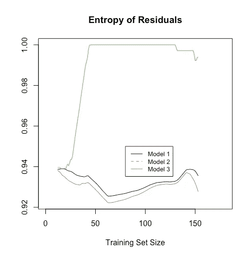

瞧啊。所有三种型号的性能差异。下面是一个粗略的方案，介绍了基于熵的推断，以估计 3 个模型之间的集成权重。

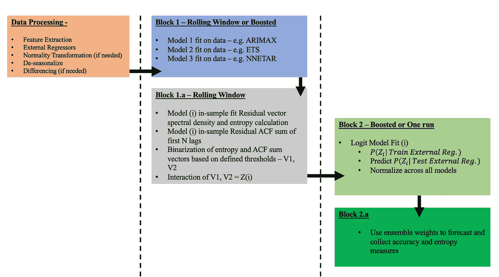

需要注意的是，以上是一个*推理*方案，而不是一个*优化*方案。用户指定模型权重应该满足什么熵阈值，而优化集成将找到最大化残差熵的权重；这将需要一个带有适当约束的目标函数来确保解决方案。

*熵优化是自然的下一步，但超出了本文的范围。*

这个方案的直觉如下:我们正在估计我们可以说模型 X 是我们发出信息的来源的一个很好的代表的概率。那个*信息*度量是*熵*。将我们的方案付诸实施，以下是一些来自通货膨胀数据的结果:

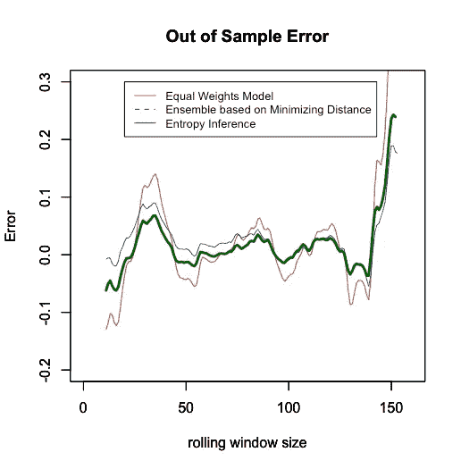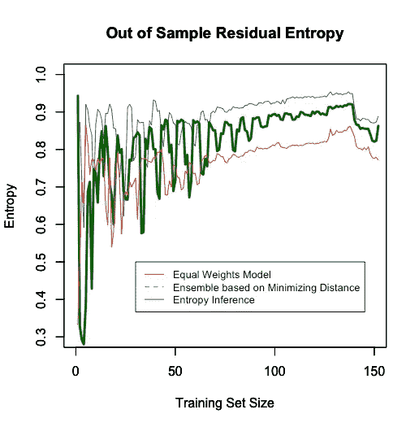

对于熵推理集成，我将最小熵阈值设置为 0.75，有趣的是，预测残差的样本外熵要高得多，精度性能与基于距离的集成相当。然而，它的熵仍然低于基于距离的集合，这意味着在残差中仍然有我们的集合没有解析出来的信息。我们的新组合不如人意有几个原因:

1.  **降低训练的熵阈值**。由于这是一个基于推理的模型，所以不同的训练阈值组合会产生更高的样本外残差熵也就不足为奇了。
2.  **基于距离的集成是无界的** **而熵集成是有界的。**对于这个项目，距离模型分配的集合权重可能变成负值或放大，并可能导致过度拟合。
3.  **没有足够的独特型号用于组合**。这个练习只看了三个模型来一起合奏；这些模型的系统熵相关的劣性也将为集合增加劣性。幸运的是，集合方案可以扩展到 N 个模型。

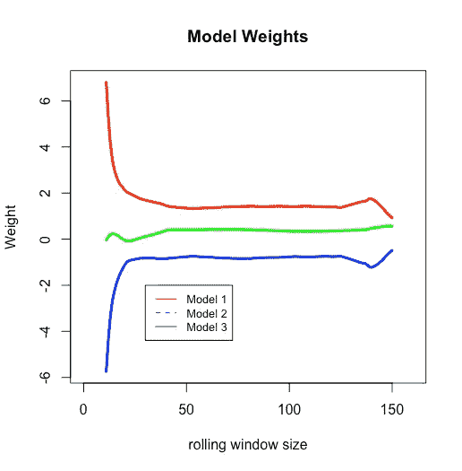

基于距离的集成

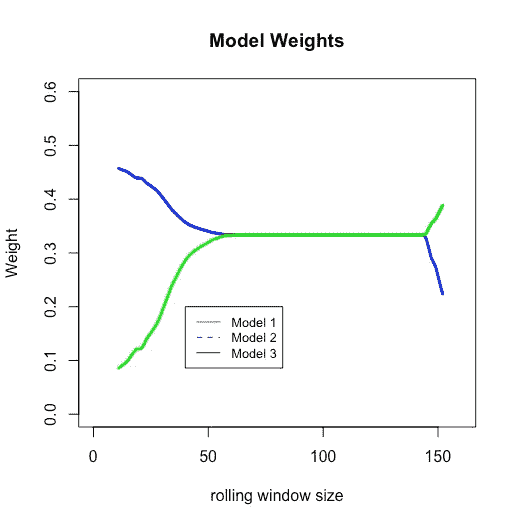

基于熵的集合-模型 1 与模型 2 共享相同的权重，之后与模型 3 共享相同的权重。因此它的重量在图中被掩盖了

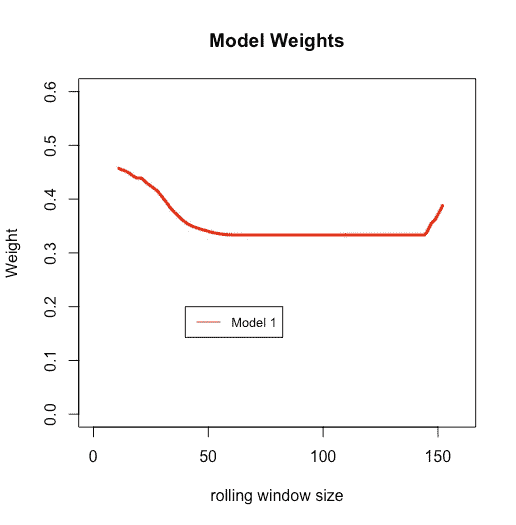

基于熵的集成中模型 1 的权重

以下是两个群体使用他们自己的数据做出的与圣路易斯美联储有关的通货膨胀预测。

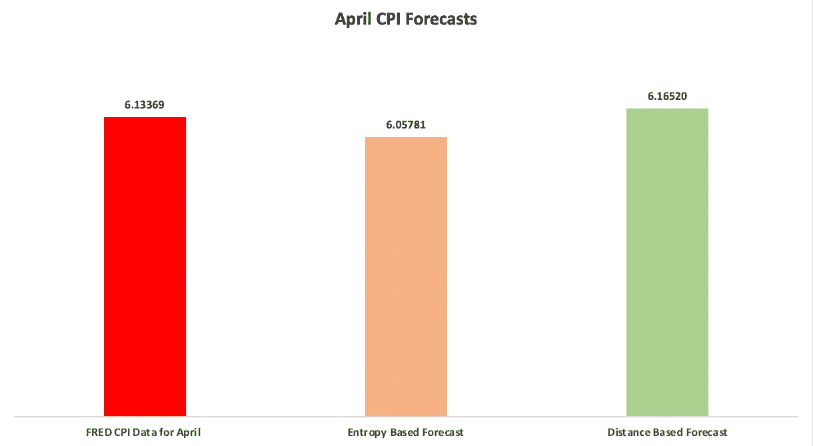

总的来说，社区需要退后一步，用新的视角来看待预测问题，这可以为我们如何建模解决方案以及我们当前的解决方案的效率提供许多进步。熵就是这样一种方法，而且还有很长的路要走。

我希望读者能够在他们正在解决的问题中找到相似之处，并评估拓扑结构的变化或像熵这样的新指标是否能帮助他们更接近解决方案。

*除非另有说明，所有图片均由作者提供。*

*韦丹特·贝迪是万事达卡的分析师，在不结盟运动投资组合开发团队工作。他拥有 NYU 大学的数学和经济学学士学位，对数据科学、计量经济学及其在金融领域的许多应用有着浓厚的兴趣。*

*Vedant 还是美国历史最悠久的学术荣誉协会 Phi Beta Kappa(纽约分会)的成员。*