# 信息论在世界上的应用

> 原文：<https://towardsdatascience.com/information-theory-applied-to-wordle-b63b34a6538e>

## 应用人工智能

## 玩流行游戏 Wordle 的简单算法

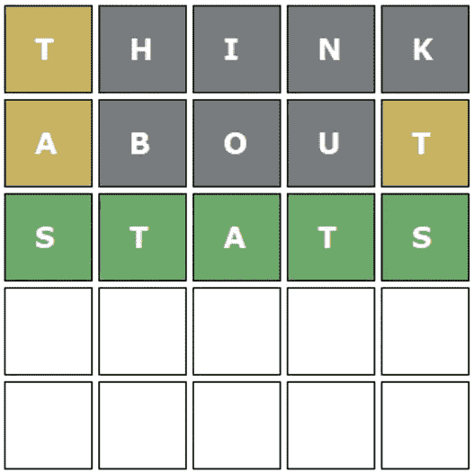

除非特别说明，所有图片均由作者提供

沃尔多在 2022 年已经火了。你可能在社交媒体上看到过这些绿色琥珀和灰色瓷砖。Wordle 是一个简单而有趣的游戏，你有 6 次机会猜对 5 个字母的单词。每次你做一个猜测，你都会收到关于最终答案的信息。在这篇文章中，我将向你展示我如何制作一个机器人，它几乎每次都能在 4 到 5 次猜测中解决所有可能的单词。

# 介绍

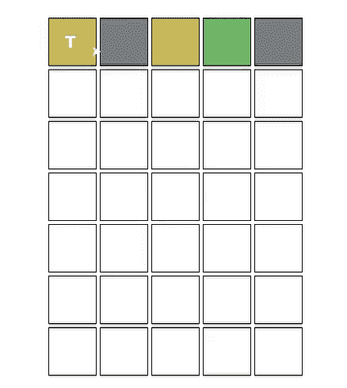

GIF 1:演 Wordle 的算法

就像 Mark Rober 会说的，我在 Wordle 上很烂，但我擅长数据科学，这意味着我实际上非常擅长 Wordle！

如果你读过我最近的文章，你可能会认为我已经用强化学习解决了这个问题。然而，这可能有些矫枉过正。对于所有数据科学问题，您希望首先尝试最简单的方法。你能得到的最简单的解决方案通常是最划算的。这可能是由于更少的培训时间、更短的交付时间、更简单的代码等。希望这种说法会阻止你们中的一些人尽可能多地应用深度学习。

该算法的灵感来源于 3blue1brown 的视频关于这个话题，请查看他的频道，他制作了令人惊叹的视频。

# 信息论

信息论广泛应用于数据挖掘和机器学习领域。在它的许多应用中，例如数据挖掘问题中的特征选择、数据压缩和合成数据的评估。

## 什么是信息？

信息是用比特来衡量的。当测量信息时，我们测量的是比特的数量，或者是为了得到相同的结论我们必须问的“是或否”的问题的数量。让我们看一个例子:

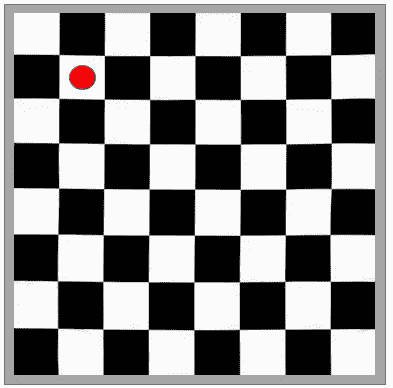

图 1 棋盘信息示例

如果你拿一个棋盘，我让你选一个方块，你的答案包含了多少信息？我们要问你多少是或否的问题才能知道你在董事会的位置？

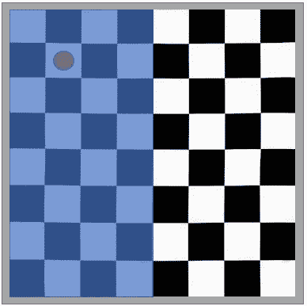

图 2:棋盘 1 位信息

我们可以先问你是否在棋盘的左边。然后我们可以问你是在那一半的上面还是在下面，等等。

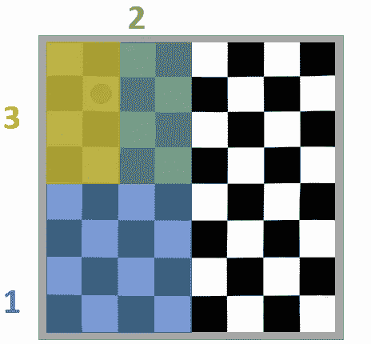

图 3 棋盘 3 位信息

要知道这个位置，我们必须问 6 个问题，这意味着这个位置包含 6 位信息。

既然有 64 个方块，那么在任何一个方块中的概率是 1/64。我们可以得出一个作为事件概率函数的位数公式:

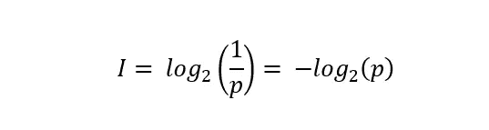

等式 1:信息是概率的函数

在棋盘的例子中，由于有 64 个方格，信息= -log₂ 1/64 = 6 位，得出与前面相同的结论。

## 熵

我们看了国际象棋的例子，你可能会说落在每个方格的概率是相同的。但是如果每个方块有不同的概率，概率分布为 p(x)。对于每个位置 x，我们可以有不同的概率，这意味着每个方块上的信息会不同。我们可以给每个 x 分配一个信息值。

回到国际象棋的例子，如果方块有相同的概率(1/64)，那么信息的期望值显然是 6 位。然而，如果它们具有不同的概率，则可以这样计算期望信息:

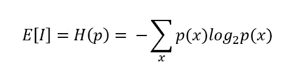

等式 2:香农熵，信息的期望值

这种期望是有用的，因为它告诉我们，通过知道棋盘上的位置，我们将平均接收到多少信息。概率分布 p(x)上信息的期望值称为香农熵。

# 沃尔多

好了，够了，让我们解决沃尔多！

## 规则

Wordle 的目标是猜测 5 个字母的单词。你有 6 次猜测的机会，每次你猜的时候，你都会收到关于隐藏单词的信息，这取决于你猜的是什么。

回答后，每个字母将是绿色，琥珀色或灰色。绿色表示字母在正确的位置，琥珀色表示字母在单词中但不在那个位置，灰色表示字母不在隐藏单词中。

## 解决单词

在 Wordle 中，我们试图确定隐藏的 5 个字母的单词。我下载了一个由 5757 个五个字母组成的英语单词列表，我想这就是全部了。

在游戏的开始，有(log₂(5757))12.49 位的隐藏信息/不确定性。当你玩游戏时，你获得了关于隐藏单词的信息。目标是创建一种算法，在每次猜测中选择增加最多信息的单词(最大程度地减少不确定性)。

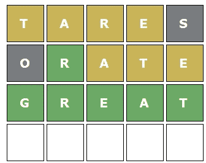

图 4:答案很棒的单词

看上面的 wordle 游戏。最初的猜测是“稗子”。猜测之后，我们得到了隐藏单词的信息。我们知道隐藏的单词包含字母“T”，“A”，“R”，“E”，而且这些字母的位置不对。有了这些信息，我们可以缩小可能的单词的搜索范围。事实上，英语中只有 12 个单词符合这些标准。其中有“心”，“额外”，“警觉”，“反应”，“光栅”，“硼酸”和“伟大”。如果你好奇的话，这里有一个完整的列表:

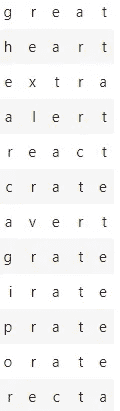

图 5:猜“稗子”后的单词

通过我们最初的猜测，我们已经将不确定性从 12.5 位(5757 个可能的单词)降低到 3.6 位(12 个单词)，这意味着我们的猜测使我们获得了 8.9 位的信息。在第二个猜测“orate”之后，唯一可能的词是 great。

所以我们的目标是选择尽可能减少我们可能的单词列表的单词。这是一个通过猜测获得最大信息量的词。在不知道答案的情况下，我们无法知道获得的信息，因此，我们猜测获得的信息的期望值最大的单词！

# 最大化熵

所以我们在寻找具有最大熵的单词，也就是猜测后获得的最大预期信息。

每次你在 Wordle 中猜测都有⁵可能的结果。你可以得到所有灰色，4 灰色 1 琥珀色，4 灰色 1 绿色等。这些可能的结果中的每一个都将产生一个新的可能单词列表。

就拿“模糊”这个词来说，如果我们看不含字母“F”、“U”、“Z”、“Y”的词，总共有 3543/5757 个(占全部 5 个字母词的 62%)。这意味着，如果我们猜测单词“fuzzy ”, 62%的情况下我们会得到这样一个单词:

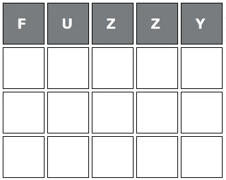

图 6:作为初始猜测的“模糊”

我们可以计算所有可能结果的概率，将它们从最高概率到最低概率排序，并绘制分布图:

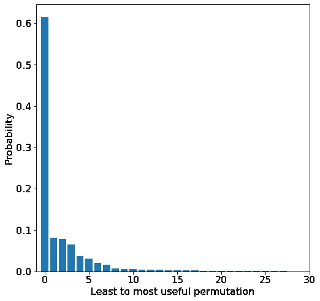

图 7:单词“模糊”的分布

上面是单词“Fuzzy”的分布，其中每个条形代表一种可能的结果(最左边代表所有字母为灰色的概率)。在这种情况下，所有灰色是获得的信息量最少的结果，理想情况下，我们希望猜测尽可能多地减少可能的单词数。“模糊”显然不是在 Wordle 中用作初始猜测的最佳词汇。

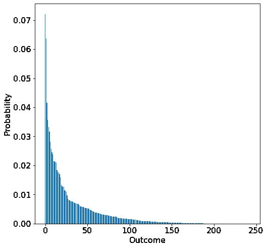

图 8:单词“tares”的分布

现在看看“tares”作为初步猜测。全灰的概率只有 7%左右。因此，93%的情况下，我们至少对其中一个字母有所了解。

有了这些概率，我们就可以计算出每个结果所获得的信息。然后，我们可以使用我之前展示的公式，获得每个单词所获得信息的期望值。

单词“fuzzy”具有 2.28 比特的预期信息增益，而单词“tares”具有 6.21 比特的预期信息增益。这意味着平均来说，单词“fuzzy”会将我们的可能单词列表从 5757 减少到 1185，而“tares”会将其减少到 78。

# 该算法

所以我们知道如何计算每个单词的期望信息。现在，我们需要做的就是迭代计算所有单词的期望信息，然后猜测熵最高的单词，直到我们得到正确的答案。算法是这样的:

1.  计算所有可能单词的熵
2.  选择熵值最高的单词
3.  向 Wordle 提交 guess 并获取输出
4.  更新剩余可能单词的列表
5.  重复步骤 1-4，直到猜测与答案相同

让我们来看看模型的性能:

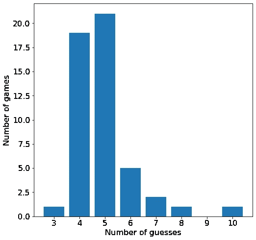

图 9:算法的性能

我让这个算法用英语中最流行的 5 个字母的单词玩 50 个单词的游戏。该模型在大约 4 或 5 次猜测中完成大部分游戏。在一些游戏中，要猜中正确的单词需要猜很多次。总的来说，我对它的表现很满意，尽管肯定还有改进的空间。

这是它播放的最后一张 GIF，因为看起来非常令人满意:

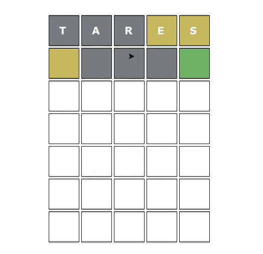

GIF 2:演 wordle 的算法

# 结论

这篇文章是对信息论以及我如何应用它来解决 Wordle 的一个小介绍。我解释信息论和熵的基础。通过选择具有最高预期信息(最高熵)的单词，我的算法解决了大多数单词游戏，平均不到 5 次猜测。显然还有改进的空间，例如，可以根据单词在英语中的受欢迎程度来给它们增加权重。

信息论中还有许多其他概念，我可以在未来探索，比如交叉熵、条件熵、互信息等等，但我会把这些留到下次。

格兰特·桑德森关于这个话题的视频给了我很大的灵感。看看他的频道，他制作的视频很棒。

# 支持我

希望这对你有帮助，如果你喜欢它，你可以 [**跟我来！**](https://medium.com/@diegounzuetaruedas)

您也可以成为 [**中级会员**](https://diegounzuetaruedas.medium.com/membership) 使用我的推荐链接，访问我的所有文章和更多:[https://diegounzuetaruedas.medium.com/membership](https://diegounzuetaruedas.medium.com/membership)

# 你可能喜欢的其他文章

[强化学习应用于小型电子游戏](/reinforcement-learning-applied-to-the-mountain-car-problem-1c4fb16729ba)

[强化学习:简介](/reinforcement-learning-an-introduction-a8783f9ea993)