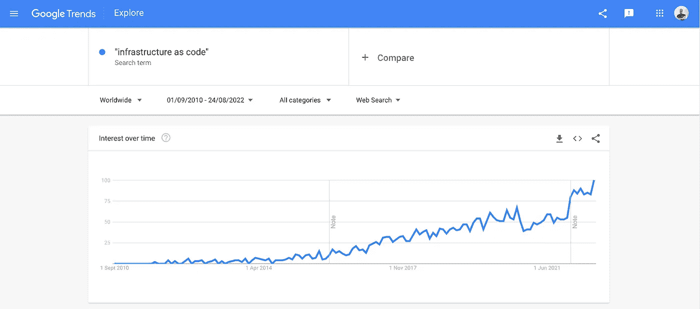

# 基础设施作为代码

> 原文：<https://towardsdatascience.com/infrastructure-as-code-f153d810428b>

## 用代码管理基础设施资源

照片由[法比奥](https://unsplash.com/@fabioha?utm_source=unsplash&utm_medium=referral&utm_content=creditCopyText)在 [Unsplash](https://unsplash.com/s/photos/server?utm_source=unsplash&utm_medium=referral&utm_content=creditCopyText) 上拍摄

在我的工程之旅中，我意识到我们使用的工具总是会改变，这是技术不断进步的结果。我认为我们都需要接受这一现实，以便能够跟上能够真正影响我们构建系统和应用程序的技术。

在过去十年中，全球大多数公司都不得不经历一次技术提升(也称为数字化转型)，从内部基础架构迁移到云。我相信在这样的项目中，最大的困难是让人们相信一项新技术(比如云)应该以一种不同于你所习惯的方式来管理。可以帮助您管理云(甚至本地)资源的最佳工具之一是基础设施即代码。

## 什么是基础设施即代码(IaC)

基础设施即代码是 DevOps 采用的一种方法，它让团队能够以编程方式管理基础设施资源(如计算、存储和网络资源)。换句话说，IaC 可以帮助您将基础设施定义和部署为连续交付机制的一部分。

像技术中的几乎所有东西一样，IaC 工具发展得相当快，现在大多数现代工具都使用人类和机器可读的代码。这是一个非常重要的特性，因为它支持各种基础设施组件的可重用性。

谷歌趋势上的基础设施代码——来源:作者

## IaC 的优势

基础设施作为代码范例的最大优势是**一致性**。如果没有 IaC，组织需要以手动方式维护基础架构资源部署或修改。

这意味着，在某些时候，要重现这种配置是极其困难的，因为需要一些特别的步骤，而其他一些步骤是以不同的顺序执行的。基础设施即代码通过允许用户使用代码来表示基础设施环境来加强一致性。因此，资源的部署和修改将总是**一致**和**幂等**(即每次执行一个特定的操作，都会产生相同的结果)。

此外，IaC 工具将节省您的时间和精力，否则这些时间和精力将花费在变更的手动部署上。现代 IaC 工具利用声明性代码文件，用户可以在其中描述组织内基础设施的最终状态。这意味着您不必太担心底层的逻辑，因为达到最终状态所需的操作将由 IaC 工具自动执行。

此外，IaC 工具通常提供增强可重用性的机制。这个特性使您的代码库不那么冗长，可读性更好，同时鼓励团队成员应用最佳实践。

IaC 的另一大优势是协作。由于基础设施资源是在配置文件中定义的，这意味着这些文件可以进行版本控制。在任何给定的时间，团队都能够协作来修改环境，甚至能够查看基础架构资源的历史(来自提交)。这使得调试更加容易和准确。

## 使用 Terraform 将基础设施作为代码

DevOps 世界中最流行的 IaC 工具之一是 [HashiCorp Terraform](https://www.hashicorp.com/products/terraform) ，这是一个开源工具，您可以使用它在**声明性配置文件**中定义和更新您的基础设施资源。

该工具可用于定义内部和云资源，并管理您组织的基础架构的生命周期。从本质上讲，Terraform 工作流程由三个不同的步骤组成，即**编写**、**计划**和**应用**。

*   **写**:这个步骤涉及资源定义(本地或云)。这些资源可以是存储和计算等低级组件，也可以是 SaaS 和 DNS 条目等更高级别的组件。
*   **计划**:在这一步，Terraform 将准备一份执行计划，其中将描述所有涉及的步骤。这些步骤可能与基于上一步中所做的更改的资源的创建、更新或删除相关。
*   **应用**:在最后一步中，Terraform 将执行(在用户确认/批准后)计划步骤中描述的操作。例如，如果您更新虚拟专用云网络，那么 Terraform 会根据新配置重新创建资源。

事实上，Terraform 社区已经编写了 1700 多个不同的提供者，可以用来管理大量不同类型的资源。此外，该工具允许用户定义他们自己的定制模块，这也可以增强代码库中的可重用性。

除了 IaC 功能，Terraform 还可用于多云部署、Kubernetes 和网络基础设施管理、策略即代码(PoC)和虚拟机映像管理。

## 其他 IaC 工具

Ansible 是另一个提供 IT 自动化的流行工具。

> 它处理配置管理、应用部署、云供应、临时任务执行、网络自动化和多节点协调。Ansible 使复杂的变化变得简单，如使用负载平衡器的零停机滚动更新

[Chef](https://www.chef.io/products/chef-infrastructure-management#implementing-and-using) 还提供基础设施管理自动化工具:

> Chef Infrastructure Management 使 [DevOps](https://www.chef.io/solutions/devops) 团队能够跨任何云、虚拟机和/或物理基础架构建模和部署安全且可扩展的基础架构自动化。

除了第三方工具，一些云提供商还提供本地 IaC 工具。

[Deployment Manager](https://cloud.google.com/deployment-manager/docs) 是 Google 云平台上的原生 IaC 管理工具，可以帮助您自动管理云上的基础设施资源。

微软 Azure 提供了对基础设施作为代码的原生支持，Azure Resource Manager (ARM)允许开发人员将基础设施资源定义为 ARM 模板。

## 最后的想法

作为代码的基础设施是能够真正影响团队构建、测试和维护系统和应用程序的方法之一。有各种工具可以帮助您定义基础架构，并持续一致地部署资源。

IaC 可以帮助您摆脱基础架构资源的手动配置和部署，并提供一种自动化(最重要的是一致性)的方式来实现这一点。

此外，使用 IaC，您能够对定义基础设施资源的文件进行版本控制，并实施最佳实践，如模块化和代码可重用性。

最后，我们浏览了一些最受欢迎和最常用的基础设施，如代码工具，包括 Terraform、Ansible、Chef，甚至是一些由云提供商(如亚马逊、谷歌和微软)原生提供的工具。

[**成为会员**](https://gmyrianthous.medium.com/membership) **阅读介质上的每一个故事。你的会员费直接支持我和你看的其他作家。你也可以在媒体上看到所有的故事。**

  

**相关文章你可能也喜欢**

     