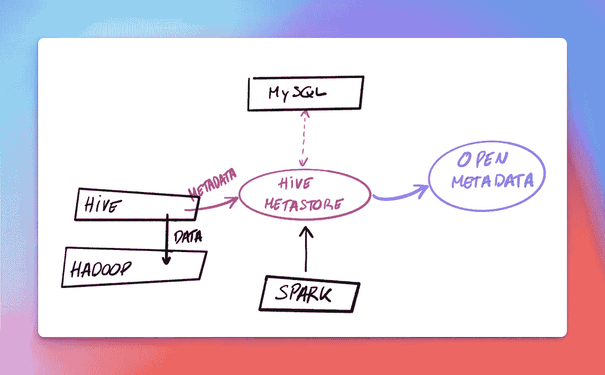
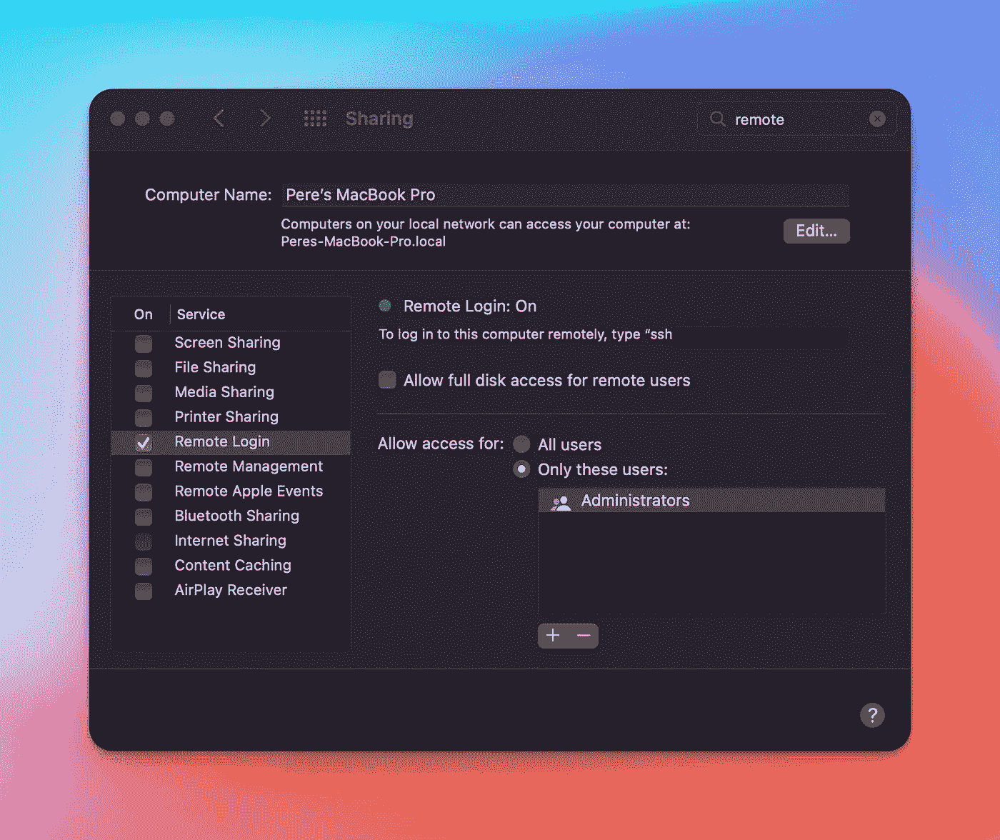
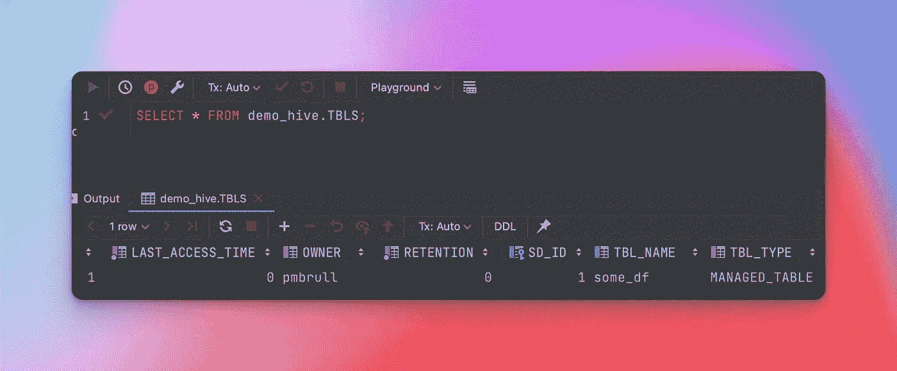
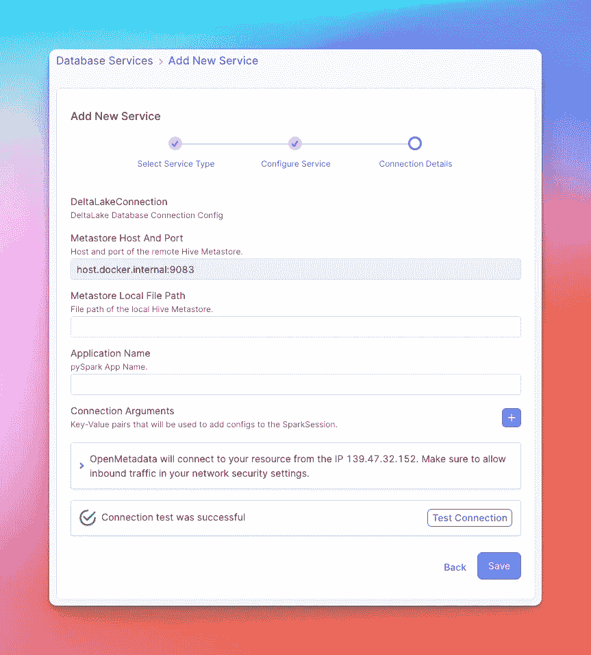
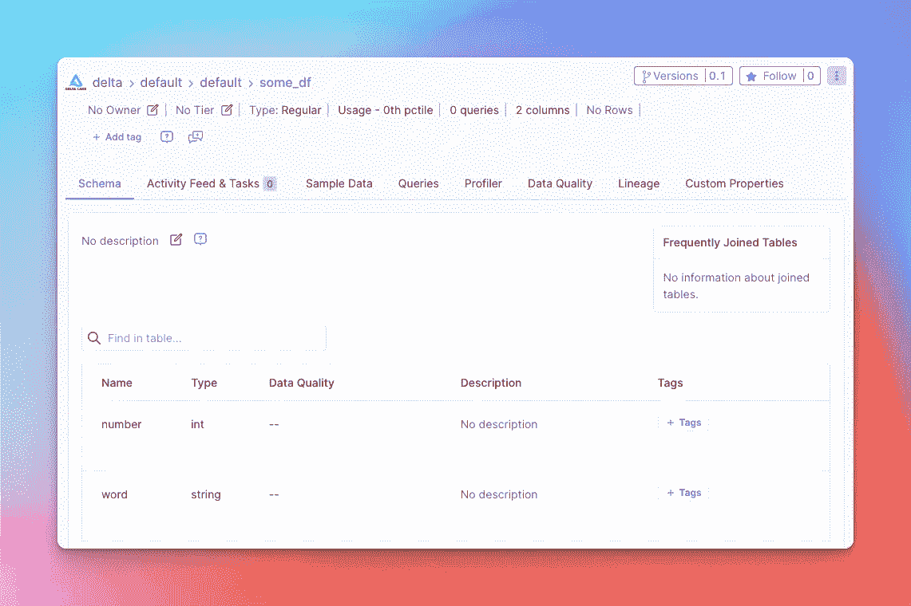

# 在云之前摄取元数据

> 原文：<https://towardsdatascience.com/ingesting-metadata-before-the-cloud-3a8c4b063d8b>

## 使用 Spark、Hive 和 OpenMetadata

这可能感觉像是那些以“*从前”*开始的故事之一，但并不是每个人都(还)在云上。然而，元数据已经并将永远存在。我们只需要学会如何充分利用它。

虽然数据旨在让组织深入了解其业务，但元数据有助于团队确保他们的数据可靠且有意义。此外，元数据允许我们缩小数据和人之间的差距，深入到数据**所有权**、**使用、**和**治理**等主题。

元数据摄取是解开这个巨大价值链的第一步。在本文中，我们将回顾过去，准备一个本地 Spark 应用程序，将其数据存储到外部 **Hive metastore** 中。然后，我们将使用 [OpenMetadata](https://open-metadata.org/) 将生成的元数据提取到一个集中的平台中。



解决方案图。图片由作者提供。

# 本地设置

我们将按照[这里](https://jaceklaskowski.gitbooks.io/mastering-spark-sql/content/demo/demo-connecting-spark-sql-to-hive-metastore.html)列出的步骤，使用更新版本:

*   Java 11(使用 [sdkman](https://sdkman.io/) 安装)
*   [Hadoop 3.3.4](https://hadoop.apache.org/release/3.3.4.html)
*   [蜂巢 2.3.9](https://dlcdn.apache.org/hive/stable-2/) (稳定发布)

目标是提升 **Hive** ，它在底层使用 Hadoop。

下载完软件包后，你可以用下面的`exports`更新你的`.zshrc`或`.bashrc`文件，我在这里找到了`~/dev/`下的文件:

```
export HIVE_HOME=~/dev/apache-hive-2.3.9-bin
export HADOOP_HOME=~/dev/hadoop-3.3.4export PATH=$HIVE_HOME/bin:$PATH
export PATH=$HADOOP_HOME/bin/hadoop:$PATH
```

## Hadoop 配置

对于 Hadoop，我们将遵循[官方指南](https://hadoop.apache.org/docs/r3.3.4/hadoop-project-dist/hadoop-common/SingleCluster.html)中的**伪分布式操作**:

*   编辑`$HADOOP_HOME/etc/hadoop/core-site.xml`

```
<configuration>
    <property>
        <name>fs.defaultFS</name>
        <value>hdfs://localhost:9000</value>
    </property>
</configuration>
```

*   编辑`$HADOOP_HOME/etc/hadoop/hdfs-site.xml`

```
<configuration>
    <property>
        <name>dfs.replication</name>
        <value>1</value>
    </property>
</configuration>
```

*   运行`$HADOOP_HOME/sbin/start-all.sh`在本地启动 datanodes 和 namenodes。

```
~/dev/hadoop-3.3.4 ❯ $HADOOP_HOME/sbin/start-all.sh                                        
WARNING: Attempting to start all Apache Hadoop daemons as pmbrull in 10 seconds.
Starting namenodes on [localhost]
Starting datanodes
Starting secondary namenodes [Peres-MBP.lan]
Starting resourcemanager
Starting nodemanagers
```

注意，这最后一步需要您的用户在没有密码的情况下 SSH 到`localhost`。如果你不能`ssh localhost`，那么你需要跑:

```
ssh-keygen -t rsa -P '' -f ~/.ssh/id_rsa
cat ~/.ssh/id_rsa.pub >> ~/.ssh/authorized_keys
chmod 0600 ~/.ssh/authorized_keys
```

如果您是 macOS 用户，您可能需要在“系统偏好设置”中启用远程登录:



在 OSX 系统偏好设置中设置远程登录。图片由作者提供。

## 蜂巢配置

按照[设置指南](https://cwiki.apache.org/confluence/display/Hive/GettingStarted#GettingStarted-RunningHive)，我们将在 HDFS 创建`tmp`和 metastore 仓库目录，并具有在其中写入数据的必要权限:

```
$HADOOP_HOME/bin/hadoop fs -mkdir     /tmp 
$HADOOP_HOME/bin/hadoop fs -chmod g+w /tmp 
$HADOOP_HOME/bin/hadoop fs -mkdir -p  /user/hive/warehouse $HADOOP_HOME/bin/hadoop fs -chmod g+w /user/hive/warehouse
```

下一步将是设置 Hive 存储关于表的元数据**的位置。最后，我们将使用一个本地 MySQL 实例，在这里我们将执行一个模式迁移来准备所需的数据库结构。**

*   在 MySQL 实例中，创建一个数据库并向用户提供:

```
mysql> create database demo_hive; 
Query OK, 1 row affected (0.01 sec) mysql> create user APP identified by 'password'; 
Query OK, 0 rows affected (0.01 sec) mysql> GRANT ALL PRIVILEGES ON demo_hive.* TO 'APP'@'%' WITH GRANT OPTION; 
Query OK, 0 rows affected (0.00 sec)
```

*   根据提供的模板准备您的`hive-site.xml`文件:

```
cp $HIVE_HOME/conf/hive-default.xml.template $HIVE_HOME/conf/hive-site.xml
```

*   并编辑具有以下属性的`$HIVE_HOME/conf/hive-site.xml`:

```
<property>     
    <name>javax.jdo.option.ConnectionURL</name>
    <value>jdbc:mysql://127.0.0.1:3306/demo_hive</value>   
</property> 
<property>
    <name>javax.jdo.option.ConnectionUserName</name>
    <value>APP</value>
</property>
<property>
    <name>javax.jdo.option.ConnectionPassword</name>
    <value>password</value>
</property>
<property>
    <name>javax.jdo.option.ConnectionDriverName</name>   
    <value>com.mysql.cj.jdbc.Driver</value>
</property>
<property>
    <name>hive.metastore.warehouse.dir</name>  
    <value>hdfs://localhost:9000/user/hive/warehouse</value>   </property>
```

注意，我们在这里选择的是 MySQL JDBC 驱动程序。你可以从[这里](https://dev.mysql.com/downloads/file/?id=513220)下载，放在`$HIVE_HOME/lib`下。

*   我们现在可以运行`schematool`来用上面的配置填充数据库:

```
$HIVE_HOME/bin/schematool -dbType mysql -initSchema
```

*   最后，让我们从以下内容开始 metastore:

```
$HIVE_HOME/bin/hive --service metastore
```

该命令将在`localhost:9083`启动本地运行的配置单元 metastore。

# 创建数据(和元数据)

我们现在将使用 [Spark 3.3.0](https://spark.apache.org/downloads.html) (为 Hadoop 3.3+预构建)来创建和保存一些数据，并探索不同的成分是如何涉及的。

请注意，您也可以准备此导出:

```
export SPARK_HOME=~/dev/spark-3.3.0-bin-hadoop3/
```

这里唯一的要求是将 Spark 指向外部 Hive metastore。我们可以通过编辑`$SPARK_HOME/conf/hive-site.xml`来做到这一点，如下所示:

```
<?xml version="1.0" encoding="UTF-8" standalone="no"?>
<?xml-stylesheet type="text/xsl" href="configuration.xsl"?>
<configuration>
    <property>
        <name>hive.metastore.uris</name>
        <value>thrift://localhost:9083</value>
    </property>
</configuration>
```

然后，创建一个指向正确的 metastore jars 和在设置 Hadoop 时配置的仓库目录的 Spark shell:

```
$SPARK_HOME/bin/spark-shell \
  --jars \
    $HIVE_HOME/lib/hive-metastore-2.3.9.jar,\
    $HIVE_HOME/lib/hive-exec-2.3.9.jar,\
    $HIVE_HOME/lib/hive-common-2.3.9.jar,\
    $HIVE_HOME/lib/hive-serde-2.3.9.jar,\
    $HIVE_HOME/lib/guava-14.0.1.jar \
  --conf spark.sql.hive.metastore.version=2.3 \
  --conf spark.sql.hive.metastore.jars=$HIVE_HOME"/lib/*" \
  --conf spark.sql.warehouse.dir=hdfs://localhost:9000/user/hive/warehouse
```

一旦进入外壳，让我们具体化一个样本数据帧:

```
import spark.implicits._val someDF = Seq(
  (8, "bat"),
  (64, "mouse"),
  (-27, "horse")
).toDF("number", "word")// Convert the DataFrame into a table we can reach
// from within Spark SQL
someDF.createOrReplaceTempView("mytempTable")// Materialize the table
spark.sql("create table some_df as select * from mytempTable");
```

一旦这些操作成功运行，我们就可以放大体系结构来验证发生了什么:

*   当我们定义指向 HDFS 路径`/user/hive/warehouse`的`spark.sql.warehouse.dir`时，我们可以看到数据文件确实出现在我们的新表`some_df`中:

```
❯ $HADOOP_HOME/bin/hadoop fs -ls /user/hive/warehouse/some_df
Found 3 items
-rwxr-xr-x   3 pmbrull supergroup          6 2022-08-27 22:11 /user/hive/warehouse/some_df/part-00000-e99ca76a-477c-47d3-829a-c4aa4e03c3a3-c000
-rwxr-xr-x   3 pmbrull supergroup          9 2022-08-27 22:11 /user/hive/warehouse/some_df/part-00001-e99ca76a-477c-47d3-829a-c4aa4e03c3a3-c000
-rwxr-xr-x   3 pmbrull supergroup         10 2022-08-27 22:11 /user/hive/warehouse/some_df/part-00002-e99ca76a-477c-47d3-829a-c4aa4e03c3a3-c000
```

*   当 Hive metastore 插入 MySQL 实例时，关于新表的元数据也在那里创建:



保存 metastore 数据的 MySQL 实例。图片由作者提供。

# 元数据摄取

在最后一步中，我们将使用 [OpenMetadata](https://open-metadata.org/) 将我们刚刚生成的元数据接收到这个开源元数据管理解决方案中。

> 数据和元数据在公司中最受欢迎。

目标是打破元数据孤岛，将组织聚集在一起，在单一位置进行协作。最简单的开始方式是使用[本地 Docker 部署](https://docs.open-metadata.org/quick-start/local-deployment)。

设置完成后，我们可以继续配置一个 [DeltaLake](https://docs.open-metadata.org/openmetadata/connectors/database/deltalake) 服务。



三角洲湖服务配置。图片由作者提供。

> 注意，当 OpenMetadata 在 Docker 内部运行时，Hive Metastore 存在于我们的本地。为了到达主机的网络，我们需要将 url 写成`host.docker.internal`

按照准备摄取管道的步骤，我们可以定期将 metastore 上的任何更改带到 OpenMetadata。第一次摄取后，可以浏览和共享新创建的:



OpenMetadata 中摄取的元数据。图片由作者提供。

让我们的数据可被发现是转向数据产品的第一步。共享的数据可以讨论和改进。

# 摘要

在本帖中，我们有:

*   配置 HDFS 存储数据，
*   创建了一个插入 MySQL 实例的外部 Hive Metastore，
*   用 Spark 生成了一些数据，
*   使用 OpenMetadata 摄取了元数据。

管理数据架构的整个生命周期使我们能够更好地理解这个世界中涉及的所有成分，在这个世界中，云提供商抽象了大部分内容，解决方案看起来几乎像魔术一样。

# 参考

*   非常感谢亚采克·拉斯科斯基的优秀书籍。你可以在[Spark SQL](https://jaceklaskowski.gitbooks.io/mastering-spark-sql/content/demo/demo-connecting-spark-sql-to-hive-metastore.html)内部找到最初的设置指南。
*   配置单元[文档](https://cwiki.apache.org/confluence/display/Hive/GettingStarted#GettingStarted-RunningHive)
*   Hadoop [文档](https://hadoop.apache.org/docs/r3.3.4/hadoop-project-dist/hadoop-common/SingleCluster.html)