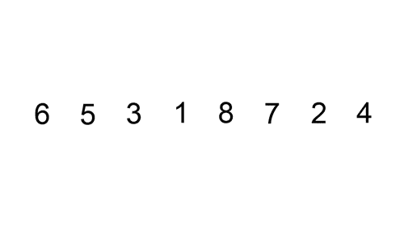

# 插入排序解释——数据科学家算法指南

> 原文：<https://towardsdatascience.com/insertion-sort-explained-6ff0fa1cb15c>

# 插入排序解释——数据科学家算法指南


特雷弗·瓦诺伊在 [Unsplash](https://unsplash.com/s/photos/computation?utm_source=unsplash&utm_medium=referral&utm_content=creditCopyText) 上的照片

# 介绍

算法在数据科学和机器学习领域很常见。算法驱动着社交媒体应用、谷歌搜索结果、银行系统等等。因此，数据科学家和[机器学习](https://www.nvidia.com/en-us/glossary/data-science/machine-learning/)从业者拥有分析、设计和实现算法的直觉是至关重要的。

当应用于大规模计算任务时，高效的算法为公司节省了数百万美元，并减少了内存和能耗。本文介绍了一个简单的算法，插入排序。

尽管知道如何实现算法是必不可少的，但本文还包括数据科学家在选择使用时应该考虑的插入算法的细节。因此，本文提到了算法复杂性、性能、分析、解释和利用等因素。

# 为什么？

重要的是要记住为什么数据科学家应该在解释和实现之前研究数据结构和算法。

数据科学和 ML 库和包抽象了常用算法的复杂性。此外，由于抽象，需要数百行代码和一些逻辑推理的算法被简化为简单的方法调用。这并没有放弃数据科学家研究算法开发和数据结构的要求。

当给定一组要使用的预构建算法时，要确定哪种算法最适合这种情况，需要了解基本算法的参数、性能、限制和鲁棒性。数据科学家可以在分析后了解所有这些信息，在某些情况下，还可以重新实现算法。

选择正确的特定问题算法和排除算法故障的能力是理解算法的两个最重要的优势。

[K-Means](https://www.nvidia.com/en-us/glossary/data-science/k-means/) ，BIRCH 和 Mean Shift 都是常用的[聚类](https://www.nvidia.com/en-us/glossary/data-science/clustering/)算法，绝不是数据科学家拥有从头实现这些算法的知识。不过，数据科学家有必要了解每种算法的属性及其对特定数据集的适用性。

例如，基于质心的算法适用于高密度数据集，其中聚类可以被清楚地定义。相比之下，在处理有噪声的数据集时，基于密度的算法，如 DBSCAN(含噪声的应用程序的基于密度的空间聚类)是首选。

在排序算法的环境中，数据科学家会遇到数据湖，如果包含的数据经过排序，数据库遍历元素以确定关系会更有效。

确定适用于数据集的库子程序需要理解各种排序算法和首选数据结构类型。快速排序算法在处理数组时是有利的，但是如果数据以链表的形式出现，那么合并排序会更有效，尤其是在大型数据集的情况下。不过，两者都使用分而治之的策略来排序数据。

# 背景

## *什么是排序算法？*

排序问题是数据科学家和其他软件工程师面临的一个众所周知的编程问题。排序问题的主要目的是按升序或降序排列一组对象。排序算法是执行的顺序指令，用于有效地对列表中的元素进行重新排序，或者按照期望的顺序排列。

## *排序的目的是什么？*

在数据领域，数据集中元素的结构化组织支持高效遍历和快速查找特定元素或组。在宏观层面上，用高效算法构建的应用转化为引入我们生活的简单性，例如导航系统和搜索引擎。

## *什么是插入排序？*

插入排序算法包括基于列表中每个元素与其相邻元素的迭代比较而创建的排序列表。

指向当前元素的索引指示排序的位置。在排序开始时(index=0)，将当前值与左边的相邻值进行比较。如果该值大于当前值，则不修改列表；如果相邻值和当前值是相同的数，情况也是如此。

但是，如果当前值左侧的相邻值较小，则相邻值位置将向左移动，并且只有在其左侧的值较小时才停止向左移动。

该图示出了在未排序列表上的插入算法中采用的过程。下图中的列表按升序排序(从最低到最高)。



[插入排序 GIF](https://upload.wikimedia.org/wikipedia/commons/9/9c/Insertion-sort-example.gif) 。(该文件在[知识共享](https://en.wikipedia.org/wiki/en:Creative_Commons)下获得许可)

# 算法步骤和实现(Python 和 JavaScript)

## 步伐

若要按升序对元素列表进行排序，插入排序算法需要以下操作:

1.  从一个未排序的元素列表开始。
2.  遍历未排序元素的列表，从第一项到最后一项。
3.  在每一步中，将当前元素与左侧所有先前位置的元素进行比较。
4.  如果当前元素小于前面列出的任何元素，它将向左移动一个位置。

## 用 Python 实现

```
# Initialise the unsorted list
A = [3, 6, 2, 7, 2, 7, 1, 6, 3]# Iterate for the entire length of the list
for i in range(0, len(A)):

    # Initialise the key variable to hold the current value
    key = A[i]
    # Initialise a variable that references the position to the left
    j = i - 1

    # Execute instructions within while loop if conditions are met
    # Condition1: Index of element to the left is greater than 0 (ensure we don't have negative indexes)
    # Condition2: The value of the element to the left of the current value is greater than the current value
    while j >=0 and A[j] > key:
        A[j + 1] = A[j]
        j = j - 1
    A[j + 1] = key

print(A)
```

## 用 JavaScript 实现

```
// Initialize the unsorted list
var A = [3, 6, 2, 7, 2, 7, 1, 6, 3];

// Iterate for the entire length of the list
for (let i = 0; i < A.length; i++) {

  // Initialize the key variable to hold the current value
  var key = A[i];
  //Initialise a variable that references the position to the left
  var j = i - 1;

  // Execute instructions within while loop if conditions are met
  // Condition1: Index of element to the left is greater than 0 (ensure we don't have negative indexes)
  // Condition2: The value of the element to the left of the current value is greater than the current value
  while (j >= 0 && A[j] > key) {
    A[j + 1] = A[j]
    j = j - 1
  }

  A[j + 1] = key

}
console.log(A)
```

# 性能和复杂性

在计算机科学领域，“大 O 符号”是一种衡量算法复杂性的策略。在这里，我们不会对大 O 符号过于专业。尽管如此，值得注意的是，计算机科学家根据他们的时间和空间要求，使用这个数学符号来量化算法。

大 O 符号是根据输入定义的函数。字母“n”通常表示函数输入的大小。简单来说，n 代表列表中元素的数量。在不同的场景中，从业者关心函数的最坏情况、最好情况或平均复杂度。

插入排序算法的最坏情况(和平均情况)复杂度是 O(n)。这意味着，在最坏的情况下，对列表进行排序所需的时间与列表中元素数量的平方成正比。

插入排序算法的最佳时间复杂度是 O(n)时间复杂度。这意味着对列表进行排序所需的时间与列表中元素的数量成正比；当列表已经处于正确的顺序时就是这种情况。在这种情况下只有一次迭代，因为当列表已经按顺序排列时，内循环操作是微不足道的。

插入排序常用于排列小列表。另一方面，插入排序并不是处理包含大量元素的大型列表的最有效方法。值得注意的是，在处理链表时，插入排序算法是首选。尽管该算法可以应用于以数组形式构造的数据，但是其他排序算法，例如快速排序。

# 摘要

最简单的排序方法之一是插入排序，它涉及一次一个元素地构建一个排序列表。通过将每个未检查的元素插入到排序列表中小于它和大于它的元素之间。正如本文所展示的，这是一个很容易掌握的算法，可以在许多语言中应用。

通过清楚地描述插入排序算法，并伴随着所涉及的算法过程的逐步分解，数据科学家能够实现插入排序算法并探索其他类似的排序算法。

对于许多数据科学家来说，算法可能是一个敏感的话题。可能是由于题目的复杂性。“算法”这个词有时与复杂性联系在一起。有了适当的工具、训练和时间，即使最复杂的算法也很容易理解。算法是数据科学中使用的基本工具，不可忽视。

*感谢阅读。*

[**本文首发于 NvidiaAI 博客**](https://developer.nvidia.com/blog/insertion-sort-explained-a-data-scientists-algorithm-guide/)

# 我希望这篇文章对你有所帮助。

要联系我或找到更多类似本文的内容，请执行以下操作:

1.  [**成为推荐媒介会员，支持我的写作**](https://richmondalake.medium.com/membership)
2.  订阅我的 [**邮件列表**](https://richmond-alake.ck.page/c8e63294ee) 获取我的简讯
3.  通过 [**LinkedIn**](https://www.linkedin.com/in/richmondalake/) 联系我
4.  在 [**Twitter**](https://twitter.com/richmondalake) 上获取我的实时更新