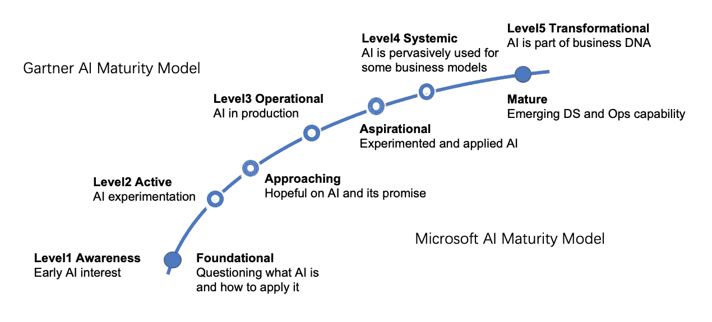
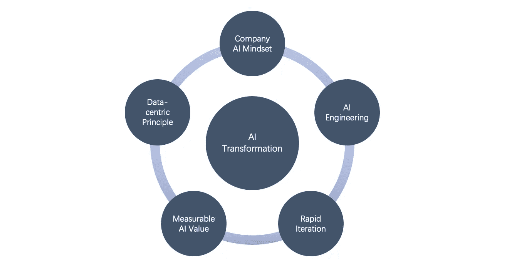
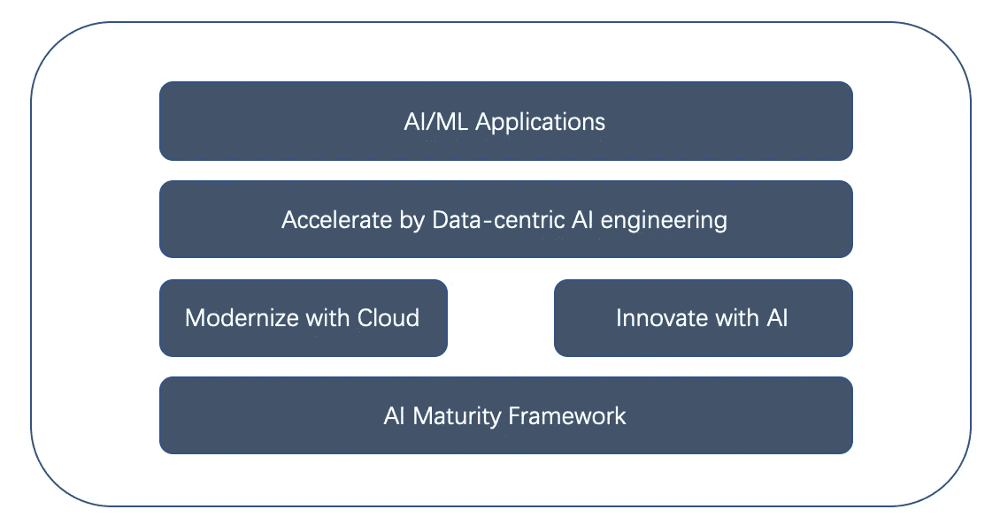

# 内部人工智能成熟度模型

> 原文：<https://towardsdatascience.com/inside-ai-maturity-model-3ff645a484b3>

## 以数据为中心的人工智能工程转型的五个步骤

人工智能/人工智能研究和发展的过去十年具有历史意义。从认知学习到智能分析，深度学习(DL)的演进开启了前所未有的人工智能新时代。最新的人工通用智能(AGI)和自我监督学习(SSL)也很有吸引力和前景。Gartner 估计，2022 年全球人工智能软件市场将达到 620 亿美元，比 2021 年增长 21.3%。IDC 预测，到 2024 年，人工智能研究和应用的投资将达到[5000 亿美元。普华永道预测，到 2030 年，人工智能将为全球经济贡献](https://www.forbes.com/lists/ai50)[15.7 万亿美元](https://www.forbes.com/lists/ai50/)。

瑞尼尔山框架(作者)

AI 已经成为企业[数字化转型](https://medium.com/@luhuihu/digital-transformation-2-0-bbc97cc8b285)和技术创新的必备技术。它可以显著提高组织和个人的性能和可伸缩性。在新冠肺炎危机中，人工智能的采用变成了一场疯狂的争夺。然而，驾驭和应用人工智能面临着多重挑战。当务之急是采用人工智能成熟度模型来指导和加速人工智能在商业和其他领域的采用。

## 什么是 AI 成熟度模型？

软件吞噬了世界。软件成熟度模型(又名能力成熟度模型， [CMM](https://en.wikipedia.org/wiki/Capability_Maturity_Model) )成为企业标准化和改进软件开发过程的必要框架。现在， [AI 正在吃天下](https://www.forbes.com/sites/cognitiveworld/2019/08/29/software-ate-the-world-now-ai-is-eating-software/)。人工智能成熟度模型对于人工智能的采用和改进也至关重要。

随着 AlphaGo 在 2016 年取得惊人的胜利，Gartner、Element AI、微软、IBM 和其他公司开始建立人工智能成熟度模型和框架。根据他们的观点，他们定义了不同的成熟度模型和框架，但是他们都是从低基础到高转换水平的曲线。有些人将这些层次分成多个维度，形成了 2D 模型网格。例如，[元素 AI](https://s3.amazonaws.com/element-ai-website-bucket/AI-Maturity-Framework_White-Paper_EN.pdf) 为每个阶段(即级别)定义了五个维度(战略、数据、技术、人员和治理)，从探索到试验、形式化、优化，再到转型。

Gartner 和微软人工智能成熟度模型解释(作者)

Gartner 根据人工智能成熟度模型在五个层面上衡量一个组织，从意识到活跃，运营，系统和转型。微软已经定义了四个成熟度等级，从基础到接近、理想和成熟。请参见上图中的详细描述。处于转型阶段的公司已经在使用人工智能来实现重大的商业价值。例如，Google 和 Meta 广泛使用 ML 来对页面/帖子和广告进行排名。ML 推荐的相关产品或电影已经成为亚马逊和网飞上客户的首选，这已经是旧闻了。

这似乎是一个有效的过程。如果我们执行它，我们就能逐步实现它。然而，在利用人工智能成熟度模型时，有两类挑战:人工智能转型的独特特征和企业人工智能采用的挑战。

## 人工智能转型的特点

软件和人工智能在成熟度模型和影响方面有一些相似之处。例如 DevOps vs. MLOps。但是 AI/ML 更复杂，更难扩展和操作。MLOps 可以解释为 ML 加 DevOps。AI 技术和变革呈现出**五个**独有的特点。

1.  虽然人工智能在历史上并不新鲜，并且在过去十年里取得了巨大的飞跃，但人工智能本身仍处于早期阶段。目前的人工智能应用仍然局限于特定的问题，尽管将有充分的潜力在深度和广度上扩展人工智能应用。
2.  AI 和 ML 是基于学习的模型，依赖于数据、特征、超参数，甚至标签(用于监督学习)。因此，数据量和质量会显著影响人工智能的有效性。大数据是作为数据驱动的决策(BI 相关)和数据密集型深度学习(AI)的十年流行语创造的。
3.  人工智能在算法、建模、基础设施和框架方面发展迅速。例如[生成型 AI](https://pub.towardsai.net/generative-ai-and-future-c3b1695876f2) 几乎每半年就在从 BERT 升级到 RoBERTa，GPT-2，T5，TuringNLG，GPT-3，到 DALL E 和 DALL E 2。ML 计算需求的增长速度是摩尔定律的近 17.5 倍。需求的增加发生在处理和内存两个方面。
4.  人工智能发展和变革的过程是复杂的。它经常涉及多个人一起工作:企业主、产品经理、数据工程师、数据科学家、ML 科学家、ML 工程师等。除了他们的密切合作，它可能需要 ML 专家来建模和解释。
5.  可操作的人工智能远远落后于其快速多样的创新和应用。除了缺少工具，还需要推广。例如 MLflow 和 Kubeflow 都是开源的 ML 平台，需要托管和运营。而亚马逊 SageMaker 是专门做 AWS 云的。

## 企业人工智能采用的挑战

另一方面，越来越多的企业对人工智能感到兴奋，但在采用人工智能和利用人工智能进行转型方面面临多重挑战。我们可以把它分成五个部分。

1.  组织共识:人工智能对许多组织来说是新的，理解和使用起来很复杂。这可能导致不一致的观点，并且在采用和开发上达成一致可能并不容易。有些人可能过于乐观，认为 AI 现在是一种全方位使用的技术，但另一些人可能过于悲观，认为 AI 不切实际或风险太大。自上而下的协议方式可能是高效的，但通常缺乏创新。
2.  用例不明确:AI 在特定用例或领域问题上工作得很好，比如需求预测和人脸识别。对于复杂的企业流程和运营来说，确定合适的场景是首要任务。
3.  数字强度不足:AI/ML 是基于学习的机制。数字化和数据收集应该是决定用例后的第一步。此外，曾经用于 BI 分析的数据可能对 AI 来说不够用。
4.  团队准备度:根据不同的用例，它需要多样化的团队来实现 AI 转型，从业务到产品到工程和运营。
5.  繁琐的流程:在今天，任何好的技术，如果动作不快，都会打折扣。对制造业和其他工业部门有效的过程可能不适合人工智能应用。

## 做好准备的五个有效步骤

那么如何解决这些问题呢？AI 成熟度模型还实用吗？好消息是，一些公司已经广泛使用人工智能来转变他们的业务。例如，谷歌和 Meta 已经用人工智能改变了广告游戏，因为广告是他们的主要收入来源。通过向谷歌、Meta、亚马逊、微软和苹果等人工智能先进公司学习，有五个实际步骤可以加快步伐。

准备好的五个步骤(作者)

1.  组织人工智能思维:全公司范围的人工智能优先思维可以激励团队，加速实验和采用。这是一种以人工智能转型为目标的文化转变，包括数据驱动和人工智能支持的产品和服务。例如，自 2015 年以来，微软一直在全公司范围内教育和激励员工有关人工智能/人工智能的知识。人工智能/人工智能不再是 MSR(微软研究院)和一些专门团队的特权。
2.  **可衡量的人工智能价值**:如果人工智能价值可以为一个企业(或未来的商业价值或/和对非营利组织的有意义的影响)进行衡量，这将是令人信服的和可持续的。不要太宽泛。这些是开始的好领域:预测(例如，需求预测和销售预测)、分类(例如，销售团队绩效分类)、异常检测(例如，用户交易异常值)、CV(例如，员工面部 ID)和 ASR/TTS(例如，自动语音客户服务)。此外，如果分析或统计可以更好或更有效地工作，则可能没有必要应用 AI/ML。例如，许多商业决策可以通过 BI 分析做出，而不需要基于 ML 的分类或预测。
3.  **以数据为中心的原则**:数据是 AI/ML 的核心。以数据为中心的原则可以提高数据质量、可用性和可观察性。此外，它还可以提高模型质量和服务精度。面对以模型为中心的挑战，这是一个转折点。
4.  **人工智能工程:**它是一个开发和实践领域，旨在推进、运营和规模化生产人工智能/人工智能。它可以简化操作并自动化从数字化和数据收集到特征工程再到建模、培训和服务的流程。MLOps 对于运营 AI 来说是一个很好的开始，但是 AI 工程对于运营自动化之外的数据工程和建模来说更系统化。
5.  **双速迭代**:如上所述，AI/ML 是快速进化的，基于学习的，过程复杂的。这些需要双速迭代，以进行快速迭代实验、开发和操作。例如，亚马逊已经改造了很多，从 AWS 服务到履行网络到设备(Kindle、Echo 等)。).但是每一次成功都依赖于它的快速迭代发明和开发。

这五个步骤与人员、文化、技术和流程相关。他们一起为一个组织工作，为人工智能转型做准备。以数据为中心的原则和人工智能工程与技术紧密相关。

## 借助以数据为中心的人工智能工程加速发展

Gartner 已经将人工智能工程确定为 2022 年的顶级战略技术趋势之一。AI 工程是人工智能研究和应用之间的桥梁。从数据收集和特征工程到建模、培训、验证、服务和监控，它超越了 ML 操作自动化的 [MLOps](https://en.wikipedia.org/wiki/MLOps) 。它可以系统地解决数据质量、模型优化、用户有效性，以及工程学科的数据和模型治理。

以数据为中心的 AI 工程是以数据为核心，以工程为学科的集成框架。在 AI 成熟度模型的组织中开发和操作以数据为中心的 AI 是一个很好的实践。

实现人工智能成熟度模型(由作者解释)

## 简单地

AI 成熟度模型是一个采用 AI 和用 AI 转型的框架。AI 转型是其最高阶段，也是 AI 成熟度模型的目标。面对这些挑战和特征，作为五个转型步骤之一的以数据为中心的人工智能工程是实现这些努力的关键。它可以加速人工智能与应用程序的集成，并在发布后继续为人工智能解决方案增加价值。

云和人工智能都已成为数字化转型的基础技术。现在云是现代化的解决方案，AI 是创新的策略。以数据为中心的人工智能工程是重塑人工智能应用和重塑未来的加速器。

## 参考

1.  什么是以数据为中心的 AI 工程？:[https://towards data science . com/what-is-data-centric-ai-engineering-d29b 3468062 e](/what-is-data-centric-ai-engineering-d29b3468062e)
2.  数字化转型 2.0:[https://medium . com/@ luhuihu/digital-Transformation-2-0-BBC 97 cc 8 b 285](https://medium.com/@luhuihu/digital-transformation-2-0-bbc97cc8b285)
3.  Gartner 人工智能成熟度模型:[https://www . Gartner . com/smarterwithgartner/the-CIOs-guide-to-artificial-intelligence](https://www.gartner.com/smarterwithgartner/the-cios-guide-to-artificial-intelligence)
4.  AI 成熟度和微软组织:[https://query . prod . CMS . rt . Microsoft . com/CMS/API/am/binary/re 4d ivg](https://query.prod.cms.rt.microsoft.com/cms/api/am/binary/RE4DIvg)
5.  IBM 的企业应用 AI 成熟度框架:[https://www.ibm.com/downloads/cas/OB8M18WR](https://www.ibm.com/downloads/cas/OB8M18WR)
6.  AI 成熟度框架 by Element AI:[https://S3 . Amazon AWS . com/Element-AI-website-bucket/AI-Maturity-Framework _ White-Paper _ en . pdf](https://s3.amazonaws.com/element-ai-website-bucket/AI-Maturity-Framework_White-Paper_EN.pdf)